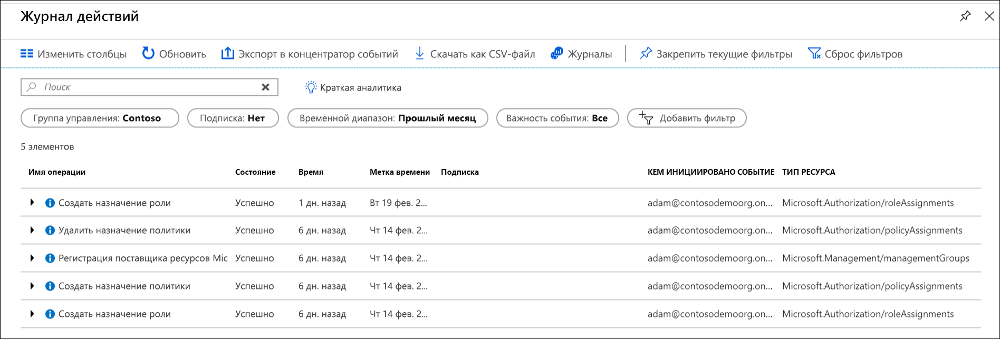

# <a name="manage-your-resources-with-management-groups"></a>Управление ресурсами с помощью групп управления

Если в вашей организации оформлено много подписок, возможно, потребуется повысить эффективность управления доступом, политиками и соответствием требованиям для этих подписок. Группы управления Azure обеспечивают высокий уровень охвата подписок. Подписки упорядочиваются в контейнеры, которые называются группами управления. К ним применяются условия системы управления. Все подписки в группе управления автоматически наследуют условия, применяемые к группе управления.

Группы управления обеспечивают корпоративное управление в больших масштабах независимо от типа подписки.  Дополнительные сведения о группах управления см. в статье [Упорядочение ресурсов с помощью групп управления Azure](overview.md).

[!INCLUDE [GDPR-related guidance](../../../includes/gdpr-intro-sentence.md)]

[!INCLUDE [az-powershell-update](../../../includes/updated-for-az.md)]

## <a name="change-the-name-of-a-management-group"></a>Изменение имени группы управления

Имя группы управления можно изменить с помощью портала, PowerShell или Azure CLI.

### <a name="change-the-name-in-the-portal"></a>Изменение имени на портале

1. Войдите на [портал Azure](https://portal.azure.com).

1. Выберите **Все службы** > **Группы управления**.

1. Выберите группу управления, которую требуется переименовать.

1. Выберите **сведения**.

1. Выберите параметр **Переименовать группу** в верхней части страницы.

   

1. Когда откроется меню, введите новое имя.

   

1. Щелкните **Сохранить**.

### <a name="change-the-name-in-powershell"></a>Изменение имени в PowerShell

Чтобы обновить отображаемое имя, воспользуйтесь **AzManagementGroup обновления**. Например для изменения управления группы отображаются имя с «ИТ-отдел Contoso» на «Группа Contoso», выполните следующую команду:

```azurepowershell-interactive
Update-AzManagementGroup -GroupName 'ContosoIt' -DisplayName 'Contoso Group'
```

### <a name="change-the-name-in-azure-cli"></a>Изменение имени в Azure CLI

Для Azure CLI используется команда обновления.

```azurecli-interactive
az account management-group update --name 'Contoso' --display-name 'Contoso Group'
```

## <a name="delete-a-management-group"></a>Удаление группы управления

Чтобы удалить группу управления, необходимо выполнить следующие требования:

1. В группе управления нет дочерних групп управления или подписок.

   - Сведения о том, как переместить подписку из группы управления, см. в [этом разделе](#move-subscriptions-in-the-hierarchy).

   - Сведения о перемещении группы управления в другую группу управления см. в [этом разделе](#move-management-groups-in-the-hierarchy).

1. Иметь разрешения на запись в группе управления («Владелец», «Участник» или «Участник группы управления»). Чтобы получить сведения об имеющихся разрешениях, выберите группу управления, а затем выберите **IAM**. Дополнительные сведения о ролях RBAC см. в статье [Начало работы с управлением доступом на основе ролей на портале Azure](../../role-based-access-control/overview.md).  

### <a name="delete-in-the-portal"></a>Удаление на портале

1. Войдите на [портал Azure](https://portal.azure.com).

1. Выберите **Все службы** > **Группы управления**.

1. Выберите группу управления, которую требуется удалить.

1. Выберите **сведения**.

1. Выберите **Удалить**.

    > [!TIP]
    > Если значок неактивен, наведите указатель мыши на значок, чтобы узнать причину.

   

1. Откроется окно, в котором нужно подтвердить удаление группы управления.

   

1. Выберите **Да**.

### <a name="delete-in-powershell"></a>Удаление в PowerShell

Используйте **Remove-AzManagementGroup** команду в PowerShell для удаления группы управления.

```azurepowershell-interactive
Remove-AzManagementGroup -GroupName 'Contoso'
```

### <a name="delete-in-azure-cli"></a>Удаление в Azure CLI

В Azure CLI используется команда az account management-group delete.

```azurecli-interactive
az account management-group delete --name 'Contoso'
```

## <a name="view-management-groups"></a>Просмотр групп управления

Вы можете просматривать все группы управления, в которых у вас есть прямые или наследуемые роли RBAC.  

### <a name="view-in-the-portal"></a>Просмотр на портале

1. Войдите на [портал Azure](https://portal.azure.com).

1. Выберите **Все службы** > **Группы управления**.

1. Загрузится страница иерархии группы управления. Эта страница является, где вы можете изучить все группы управления и подписки у вас есть доступ к. При выборе имени группы открывается нижний уровень в иерархии. Навигация работает так же, как и в обозревателе файлов.

1. Чтобы просмотреть сведения о группе управления, перейдите по ссылке **(подробности)** рядом с заголовком группы управления. Если ссылка недоступна, у вас нет разрешения на просмотр этой группы управления.

   

### <a name="view-in-powershell"></a>Просмотр в PowerShell

Команда Get-AzManagementGroup для получения всех групп.  См. в разделе [Az.Resources](/powershell/module/az.resources/Get-AzManagementGroup) модули для полный список управления сгруппировать команды GET Powershell.  

```azurepowershell-interactive
Get-AzManagementGroup
```

Для получения сведений об одной группе управления используйте параметр -GroupName.

```azurepowershell-interactive
Get-AzManagementGroup -GroupName 'Contoso'
```

Для возвращения определенной группе управления и всех уровней иерархии в нем используется **-разверните** и **-Recurse** параметров.  

```azurepowershell-interactive
PS C:\> $response = Get-AzManagementGroup -GroupName TestGroupParent -Expand -Recurse
PS C:\> $response

Id                : /providers/Microsoft.Management/managementGroups/TestGroupParent
Type              : /providers/Microsoft.Management/managementGroups
Name              : TestGroupParent
TenantId          : 00000000-0000-0000-0000-000000000000
DisplayName       : TestGroupParent
UpdatedTime       : 2/1/2018 11:15:46 AM
UpdatedBy         : 00000000-0000-0000-0000-000000000000
ParentId          : /providers/Microsoft.Management/managementGroups/00000000-0000-0000-0000-000000000000
ParentName        : 00000000-0000-0000-0000-000000000000
ParentDisplayName : 00000000-0000-0000-0000-000000000000
Children          : {TestGroup1DisplayName, TestGroup2DisplayName}

PS C:\> $response.Children[0]

Type        : /managementGroup
Id          : /providers/Microsoft.Management/managementGroups/TestGroup1
Name        : TestGroup1
DisplayName : TestGroup1DisplayName
Children    : {TestRecurseChild}

PS C:\> $response.Children[0].Children[0]

Type        : /managementGroup
Id          : /providers/Microsoft.Management/managementGroups/TestRecurseChild
Name        : TestRecurseChild
DisplayName : TestRecurseChild
Children    :
```

### <a name="view-in-azure-cli"></a>Просмотр в Azure CLI

Для извлечения всех групп используется команда вывода списка.  

```azurecli-interactive
az account management-group list
```

Для получения сведений об одной группе управления используется команда отображения.

```azurecli-interactive
az account management-group show --name 'Contoso'
```

Для возвращения определенной группе управления и всех уровней иерархии в нем используется **-разверните** и **-Recurse** параметров.

```azurecli-interactive
az account management-group show --name 'Contoso' -e -r
```

## <a name="move-subscriptions-in-the-hierarchy"></a>Перемещение подписок в иерархии

Одна из причин для создания группы управления — объединение подписок. Дочерним элементом группы управления могут быть только подписки и группы управления. При перемещении в группу управления подписка наследует все права доступа и политики пользователя из родительской группы управления.

Чтобы переместить подписку, все из следующих разрешений RBAC должны иметь значение true:

- Роль "Владелец" в дочерней подписке.
- Роль «Владелец», «Участник» или «Участник группы управления» в родительской группе управления целевой объект.
- Роль «Владелец», «Участник» или «Участник группы управления» в существующей родительской группе управления.

Если целевой объект или родительской группе управления, существующие в корневую группу управления, не применяются требования к правам. Так как в корневую группу управления по умолчанию, целевая spot для всех новых групп управления и подписок, не требуется разрешения на его, чтобы переместить элемент.

Если роль владельца в подписке наследуется из текущей группы управления, для которых предназначено перемещения ограничены. Подписки можно только переместить в другую группу управления при наличии роли "Владелец". Его нельзя переместить в группу управления которой вы являетесь участником, потому что бы потеряют право собственности на подписки. Если вы напрямую назначена роль владельца подписки (не наследуется из группы управления), его можно переместить в любую группу управления которой вы являетесь участником.

Какие разрешения есть на портале Azure, выберите управления группы и затем выбрать **IAM**. Дополнительные сведения о ролях RBAC см. в статье [Начало работы с управлением доступом на основе ролей на портале Azure](../../role-based-access-control/overview.md).

### <a name="move-subscriptions-in-the-portal"></a>Перемещение подписок на портале

#### <a name="add-an-existing-subscription-to-a-management-group"></a>Добавление имеющейся подписки в группу управления

1. Войдите на [портал Azure](https://portal.azure.com).

1. Выберите **Все службы** > **Группы управления**.

1. Выберите группу управления, которую вы планируете сделать родительской.

1. В верхней части страницы выберите пункт **Добавить подписку**.

1. Выберите подписку в списке с правильным идентификатором.

   

1. Щелкните "Сохранить".

#### <a name="remove-a-subscription-from-a-management-group"></a>Удаление подписки из группы управления

1. Войдите на [портал Azure](https://portal.azure.com).

1. Выберите **Все службы** > **Группы управления**.

1. Выберите группу управления, которая является родительской.  

1. Выберите многоточие в конце строки подписки в списке, которую требуется переместить.

   

1. Выберите **Переместить**.

1. В открывшемся меню выберите **родительскую группу управления**.

   

1. Щелкните **Сохранить**.

### <a name="move-subscriptions-in-powershell"></a>Перемещение подписок в PowerShell

Чтобы переместить подписку в PowerShell, используйте команду New-AzManagementGroupSubscription.  

```azurepowershell-interactive
New-AzManagementGroupSubscription -GroupName 'Contoso' -SubscriptionId '12345678-1234-1234-1234-123456789012'
```

Чтобы удалить связь между подпиской и группой управления, используйте команду Remove-AzManagementGroupSubscription.

```azurepowershell-interactive
Remove-AzManagementGroupSubscription -GroupName 'Contoso' -SubscriptionId '12345678-1234-1234-1234-123456789012'
```

### <a name="move-subscriptions-in-azure-cli"></a>Перемещение подписок в Azure CLI

Чтобы переместить подписку в CLI, используйте команду добавления.

```azurecli-interactive
az account management-group subscription add --name 'Contoso' --subscription '12345678-1234-1234-1234-123456789012'
```

Чтобы удалить подписку из группы управления, используйте команду удаления.  

```azurecli-interactive
az account management-group subscription remove --name 'Contoso' --subscription '12345678-1234-1234-1234-123456789012'
```

## <a name="move-management-groups-in-the-hierarchy"></a>Перемещение групп управления в иерархии  

При перемещении родительской группы управления, иерархии, в этой группе перемещается вместе с ней. Для доступа к вам необходимо выполнить перемещение групп управления, см. в разделе [доступ к группе управления](index.md#management-group-access).

### <a name="move-management-groups-in-the-portal"></a>Перемещение групп управления на портале

1. Войдите на [портал Azure](https://portal.azure.com).

1. Выберите **Все службы** > **Группы управления**.

1. Выберите группу управления, которую вы планируете сделать родительской.

1. В верхней части страницы выберите пункт **Добавить группу управления**.

1. В открывшемся меню выберите создать новую или использовать существующую группу управления.

   - Если вы выберете новую, то создадите новую группу управления.
   - Если вы выберете существующую, вы сможете выбрать доступную группу управления из раскрывающегося списка.  

   

1. Щелкните **Сохранить**.

### <a name="move-management-groups-in-powershell"></a>Перемещение групп управления в PowerShell

Выполните команду обновления AzManagementGroup в PowerShell, чтобы переместить группу управления в другой группе.

```azurepowershell-interactive
$parentGroup = Get-AzManagementGroup -GroupName ContosoIT
Update-AzManagementGroup -GroupName 'Contoso' -ParentId $parentGroup.id
```  

### <a name="move-management-groups-in-azure-cli"></a>Перемещение групп управления в Azure CLI

Чтобы переместить группу управления с помощью Azure CLI, используйте команду обновления.

```azurecli-interactive
az account management-group update --name 'Contoso' --parent ContosoIT
```

## <a name="audit-management-groups-using-activity-logs"></a>Аудит групп управления с помощью журналов действий

[Журнал действий Azure](../../azure-monitor/platform/activity-logs-overview.md) поддерживает группы управления. Вы можете запрашивать все события, которые происходят в группу управления, там же центра и другие ресурсы Azure.  Например, вы можете просмотреть сведения обо всех изменениях в назначениях ролей или назначении политик, внесенные в пределах определенной группы управления.



Если нужно создать запрос к группам управления вне портала Azure, целевая область для групп управления будет такой: **"/providers/Microsoft.Management/managementGroups/{идентификатор_вашей_группы_управления}"** .

## <a name="referencing-management-groups-from-other-resource-providers"></a>Ссылка на группы управления из других поставщиков ресурсов

При указании ссылки на группы управления из другого поставщика ресурсов действия, используйте следующий путь в качестве области. Этот путь используется в том случае, когда с помощью PowerShell, Azure CLI и REST API.  

>"/providers/Microsoft.Management/managementGroups/{yourMgID}"

Пример использования этого пути является при назначении новое назначение роли для группы управления в PowerShell

```azurepowershell-interactive
New-AzRoleAssignment -Scope "/providers/Microsoft.Management/managementGroups/Contoso"
```

При извлечении определения политики в группе управления, используется один и тот же путь области.

```http
GET https://management.azure.com/providers/Microsoft.Management/managementgroups/MyManagementGroup/providers/Microsoft.Authorization/policyDefinitions/ResourceNaming?api-version=2018-05-01
```

## <a name="next-steps"></a>Дальнейшие действия

Дополнительные сведения о группах управления:

- [Создание групп управления для организации ресурсов Azure](create.md)
- [Изменение, удаление групп управления и управление ими](manage.md)
- [Просмотр групп управления в модуле ресурсов Azure PowerShell](/powershell/module/az.resources#resources)
- [Просмотр групп управления в REST API](/rest/api/resources/managementgroups)
- [Просмотр групп управления в Azure CLI](/cli/azure/account/management-group)