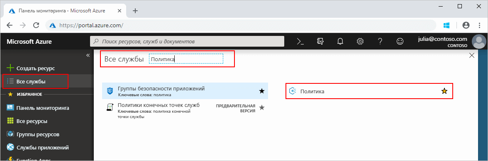
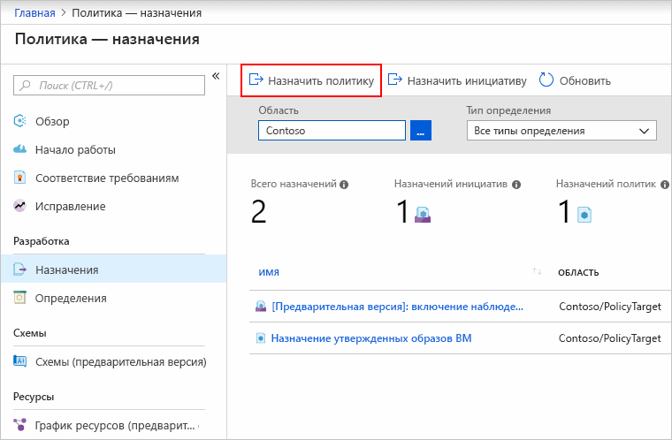
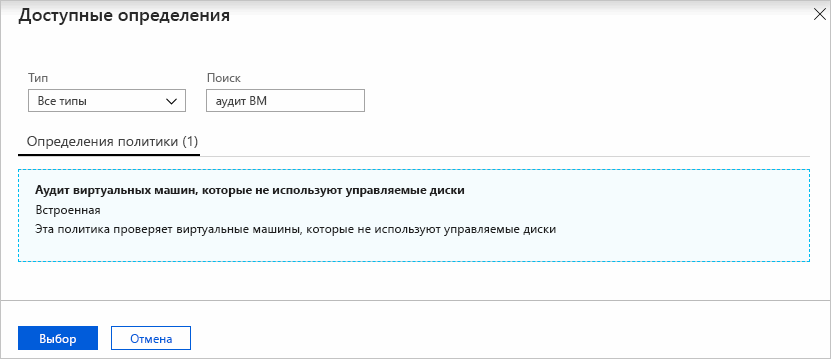
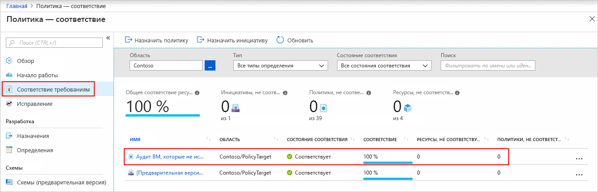
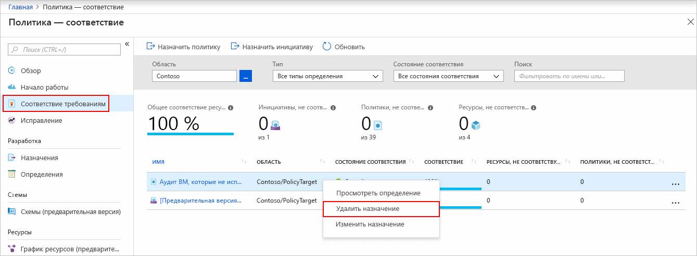

# Краткое руководство. Создание назначения политики для идентификации ресурсов, не соответствующих требованиям

Чтобы понять, соответствуют ли ресурсы требованиям в Azure, прежде всего нужно определить их состояние.
В этом кратком руководстве описано, как создать назначение политики для определения виртуальных машин, которые не используют управляемые диски.

Завершив работу, вы узнаете, какие виртуальные машины не используют управляемые диски, так как *не соответствуют* назначению политики.

Если у вас еще нет подписки Azure, создайте [бесплатную](https://azure.microsoft.com/free/) учетную запись Azure, прежде чем начинать работу.

## Создание назначения политики

С помощью этого краткого руководства вы создадите назначение политики и назначите определение политики *Аудит виртуальных машин, которые не используют управляемые диски*.

1. Запустите службу "Политика Azure" на портале Azure, щелкнув **Все службы**, а затем выполнив поиск и выбрав **Политика**.

   

1. Выберите **Назначения** на странице службы "Политики Azure" слева. Назначение — это политика, которая назначена в рамках определенной области.

   

1. Выберите **Назначить политику** в верхней части страницы **Policy — Assignments** (Политика — назначения).

   

1. На странице **Назначить политику** выберите **Область**, нажав кнопку с многоточием и выбрав либо группу управления, либо подписку. Либо выберите группу ресурсов. Она определяет, к каким ресурсам или группе ресурсов принудительно применяется назначение политики. Теперь щелкните **Выбрать** в нижней части страницы **Область**.

   В этом примере используется подписка **Contoso**. Ваша подписка будет отличаться.

1. Ресурсы можно исключить на основе параметра **Область**. **Исключения** начинаются на один уровень ниже уровня параметра **Область**. **Исключения** являются необязательными, поэтому пока оставьте это поле пустым.

1. Выберите многоточие рядом с пунктом **Определение политики**, чтобы открыть список доступных определений. Служба "Политика Azure" поставляется со встроенными определениями политик, которые можно использовать. Доступны многие политики, такие как:

   - Принудительное применение тега и его значения
   - применять тег и его значение;
   - Требование наличия SQL Server версии 12.0

   См. [полный список всех доступных встроенных политик Azure](./samples/index.md).

1. Найдите определение политики в списке по строке *Аудит виртуальных машин, которые не используют управляемые диски*. Щелкните эту политику, а затем выберите действие **Выбрать**.

   

1. **Имя назначения** автоматически заполняется выбранным именем политики, но его можно изменить. Для нашего примера сохраните значение *Аудит виртуальных машин, которые не используют управляемые диски*. При желании вы можете добавить необязательное **описание**. Описание содержит сведения о назначении этой политики.
   Поле **Назначено** будет заполнено автоматически, в зависимости от текущего пользователя. Это поле не является обязательным, поэтому можно ввести произвольные значения.

1. Оставьте флажок **Создать управляемое удостоверение** неустановленным. Его _необходимо_ устанавливать, когда политика или инициатива содержит политику с действием [deployIfNotExists](./concepts/effects.md#deployifnotexists). Так как политика, используемая в этом кратком руководстве, не такая, оставьте соответствующее поле пустым. Дополнительные сведения см. в статье [Что такое управляемые удостоверения для ресурсов Azure?](../../active-directory/managed-identities-azure-resources/overview.md) и разделе [How remediation security works](./how-to/remediate-resources.md#how-remediation-security-works) (Как работает безопасность исправлений).

1. Щелкните **Назначить**.

Теперь все готово к обнаружению ресурсов, которые не соответствуют требованиям, что позволит оценить состояние соответствия в среде.

## Выявление несоответствующих ресурсов

Выберите **Соответствие** в левой части страницы и найдите ранее созданное назначение политики **Аудит виртуальных машин, которые не используют управляемые диски**.

Существующие ресурсы, которые не соответствуют новому назначению, отображаются в разделе **Несоответствующие ресурсы**.

Если условие применяется к существующим ресурсам и оказывается верным, такие ресурсы помечаются как несовместимые с настроенной политикой. В следующей таблице показано, как действуют разные политики в сочетании с оценкой условий для определения итогового состояния соответствия. Хотя логика оценки не отображается на портале Azure, там доступны результаты, полученные при оценке состояния соответствия. Они могут быть такими: "Соответствует" либо "Не соответствует".

| **Состояние ресурса** | **Эффект** | **Оценка политики** | **Состояние соответствия** |
| --- | --- | --- | --- |
| Exists | Deny, Audit, Append\*, DeployIfNotExist\*, AuditIfNotExist\* | Истина | Не соответствует |
| Exists | Deny, Audit, Append\*, DeployIfNotExist\*, AuditIfNotExist\* | Ложь | Соответствует |
| Создать | Audit, AuditIfNotExist\* | Истина | Не соответствует |
| Создать | Audit, AuditIfNotExist\* | Ложь | Соответствует |

\*Для эффектов Append, DeployIfNotExist и AuditIfNotExist требуется, чтобы оператор IF имел значение TRUE.
Эффекты также требуют, чтобы условие существования FALSE было несоответствующим. Когда установлено значение TRUE, условие IF запускает оценку условия существования для связанных ресурсов.

## Очистка ресурсов

Чтобы удалить созданное назначение, выполните следующие действия:

1. Выберите элемент **Соответствие** (или **Назначения**) в левой части страницы службы "Политика Azure" и найдите ранее созданное назначение политики **Аудит виртуальных машин, которые не используют управляемые диски**.

1. Щелкните правой кнопкой мыши назначение политики **Аудит виртуальных машин, которые не используют управляемые диски** и выберите **Удалить назначение**.

   

## Дополнительная информация

С помощью этого краткого руководства вы назначили определение политики для области и изучили отчет о соответствии.
Определение политики проверяет, все ли ресурсы в области соответствуют требованиям, и определяет, какие из них не соответствуют.

В следующем руководстве описано, как назначать политики для проверки новых ресурсов на соответствие требованиям:

> [!div class="nextstepaction"]
> [Создание политик и управление ими](./tutorials/create-and-manage.md)