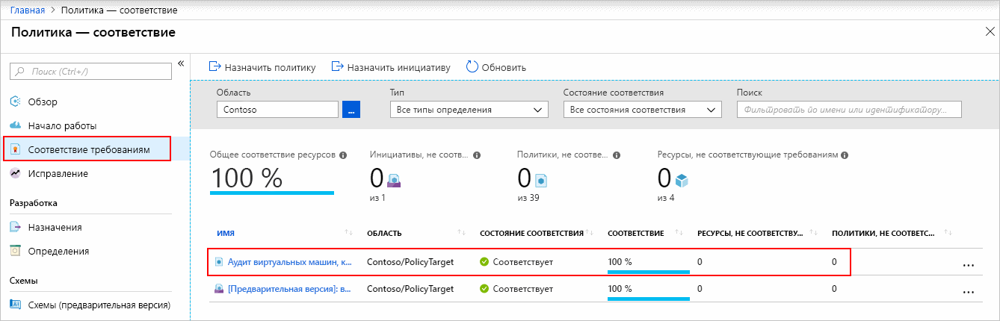

# Краткое руководство. Создание назначения политики для идентификации несоответствующих требованиям ресурсов с помощью шаблона Resource Manager

Чтобы понять, соответствуют ли ресурсы требованиям в Azure, прежде всего нужно определить их состояние.
В этом кратком руководстве описано, как создать назначение политики для определения виртуальных машин, которые не используют управляемые диски.

Завершив работу, вы узнаете, какие виртуальные машины не используют управляемые диски, так как *не соответствуют* назначению политики.

Если у вас еще нет подписки Azure, создайте [бесплатную](https://azure.microsoft.com/free/) учетную запись Azure, прежде чем начинать работу.

## Создание назначения политики

С помощью этого краткого руководства вы создадите назначение политики и назначите встроенное определение политики *Аудит виртуальных машин, которые не используют управляемые диски*. См. [полный список всех доступных встроенных политик Azure](./samples/index.md).

Существует несколько способов создания назначений политики. В этом кратком руководстве используется [шаблон быстрого запуска](https://azure.microsoft.com/resources/templates/101-azurepolicy-assign-builtinpolicy-resourcegroup/).
Ниже приведена копия шаблона:

[!code-json[policy-assignment](~/quickstart-templates/101-azurepolicy-assign-builtinpolicy-resourcegroup/azuredeploy.json)]

> [!NOTE]
> Служба "Политика Azure" предоставляется бесплатно.  Дополнительные сведения см. в статье [Что такое служба "Политика Azure"?](./overview.md).

1. Выберите следующее изображение, чтобы войти на портал Azure и открыть шаблон:

   

1. Введите или выберите следующие значения.

   | ИМЯ | Значение |
   |------|-------|
   | Подписка | Выберите подписку Azure. |
   | Группа ресурсов | Выберите **Создать**, укажите имя, а затем выберите **OK**. На снимке экрана ниже группа ресурсов называется *mypolicyquickstart\<дата в формате ММДД>rg*. |
   | Расположение | Выберите регион. Например, **центральная часть США**. |
   | Имя назначения политики | Укажите имя назначения политики. При необходимости можно использовать отображаемое имя определения политики. Например, **Аудит виртуальных машин, которые не используют управляемые диски**. |
   | Имя группы ресурсов | Укажите имя группы ресурсов, для которой вы хотите назначить политику. В этом кратком руководстве используйте значение по умолчанию **[resourceGroup().name]** . **[resourceGroup()](../../azure-resource-manager/resource-group-template-functions-resource.md#resourcegroup)**  — это функция шаблона, которая извлекает группу ресурсов. |
   | Идентификатор определения политики | Укажите **/providers/Microsoft.Authorization/policyDefinitions/0a914e76-4921-4c19-b460-a2d36003525a**. |
   | Я принимаю указанные выше условия | Установите этот флажок. |

1. Щелкните **Приобрести**.

Ниже приведены некоторые дополнительные ресурсы.

- Дополнительные примеры шаблонов см. в статье о [шаблонах быстрого запуска Azure](https://azure.microsoft.com/resources/templates/?resourceType=Microsoft.Authorization&pageNumber=1&sort=Popular).
- Справочник по шаблонам Azure можно просмотреть [здесь](/azure/templates/microsoft.authorization/allversions).
- Чтобы узнать, как создавать шаблоны Resource Manager, ознакомьтесь с [документацией по Azure Resource Manager](/azure/azure-resource-manager/).
- Чтобы узнать о развертывании на уровне подписки, ознакомьтесь со статьей [Создание групп ресурсов и ресурсов на уровне подписки](../../azure-resource-manager/deploy-to-subscription.md).

## Выявление несоответствующих ресурсов

Выберите **Соответствие** в левой части страницы и найдите ранее созданное назначение политики **Аудит виртуальных машин, которые не используют управляемые диски**.

Существующие ресурсы, которые не соответствуют новому назначению, отображаются в разделе **Несоответствующие ресурсы**.

Дополнительные сведения см. в разделе [Как работает соответствие](./how-to/get-compliance-data.md#how-compliance-works).

## Очистка ресурсов

Чтобы удалить созданное назначение, выполните следующие действия:

1. Выберите элемент **Соответствие** (или **Назначения**) в левой части страницы службы "Политика Azure" и найдите ранее созданное назначение политики **Аудит виртуальных машин, которые не используют управляемые диски**.

1. Щелкните правой кнопкой мыши назначение политики **Аудит виртуальных машин, которые не используют управляемые диски** и выберите **Удалить назначение**.

   

## Дополнительная информация

С помощью этого краткого руководства вы назначили встроенное определение политики для области и изучили отчет о соответствии. Определение политики проверяет, все ли ресурсы в области соответствуют требованиям, и определяет, какие из них не соответствуют.

В следующем руководстве описано, как назначать политики для проверки новых ресурсов на соответствие требованиям:

> [!div class="nextstepaction"]
> [Создание политик и управление ими](./tutorials/create-and-manage.md)