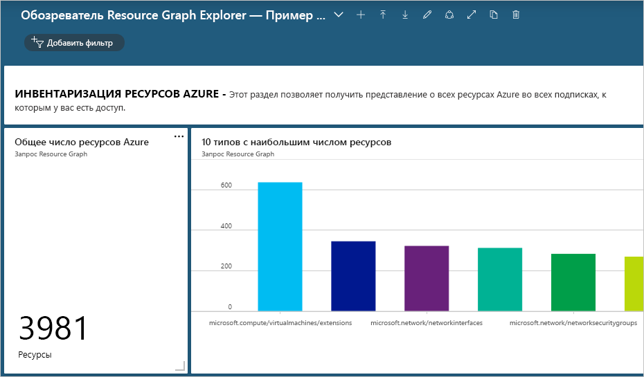
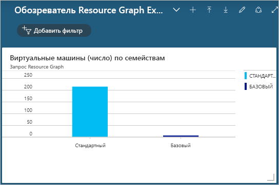

# <a name="quickstart-run-your-first-resource-graph-query-using-azure-resource-graph-explorer"></a>Краткое руководство. Выполнение запроса Resource Graph с помощью обозревателя Azure Resource Graph

Использовать возможности Azure Resource Graph можно непосредственно на портале Azure с помощью обозревателя Azure Resource Graph. Обозреватель Resource Graph предоставляет доступные для просмотра сведения о типах и свойствах ресурсов Azure Resource Manager, к которым можно выполнять запросы. Обозреватель Resource Graph также предоставляет удобный интерфейс для параллельной работы с запросами, оценки результатов и даже преобразования результатов некоторых запросов в диаграмму, которую можно закрепить на панели мониторинга Azure.

Завершив работу с этим кратким руководством, вы выполните с помощью портала Azure и обозревателя Resource Graph простой запрос к Resource Graph и закрепите его результаты на панели мониторинга.

Если у вас еще нет подписки Azure, создайте [бесплатную](https://azure.microsoft.com/free/) учетную запись Azure, прежде чем начинать работу.

## <a name="run-your-first-resource-graph-query"></a>Выполните первый запрос график ресурсов

Откройте [портал Azure](https://portal.azure.com), чтобы найти открыть обозреватель Resource Graph. Следуйте инструкциям ниже, чтобы выполнить ваш первый запрос Resource Graph.

1. Выберите **Все службы** в левой области. Найдите и выберите **обозреватель Resource Graph**.

1. В окне в разделе **Запрос 1** введите запрос `project name, type | limit 5` и щелкните **Выполнить запрос**.

   > [!NOTE]
   > Так как этот пример запроса не содержит модификатор сортировки, такой как `order by`, повторное выполнение запроса может каждый раз возвращать разные наборы ресурсов.

1. Просмотрите результаты запроса на вкладке **Результаты**. Перейдите на вкладку **Сообщения**, чтобы просмотреть сведения о запросе, включая число результатов и длительность выполнения. На этой же вкладке отображаются возникшие ошибки.

1. Обновите запрос, используя `order by` для свойства **Имя**: `project name, type | limit 5 | order by name asc`. Теперь щелкните **Выполнить запрос**.

   > [!NOTE]
   > Как и с первым запросом, выполнение этого запроса несколько раз может получить различные наборы ресурсов для каждого запроса. Важен порядок команд запроса. В этом примере `order by` следует после `limit`. Это сначала ограничивает результаты запроса, а затем располагает их в нужном порядке.

1. Обновите запрос, чтобы сначала выполнить сортировку (`order by`) по свойству **Имя**, а затем ограничить (`limit`) вывод пятью первыми результатами (`project name, type | order by name asc | limit 5`). Теперь щелкните **Выполнить запрос**.

Повторное выполнение последней версии запроса, если ничего не изменяется в самой среде, возвращают предсказуемые и стабильные результаты, отсортированные по свойству **Имя** и ограниченные пятью первыми результатами.

### <a name="schema-browser"></a>Обозреватель схемы

Обозреватель схемы находится на панели обозревателя ресурсов Resource Graph слева. В этом списке ресурсов показаны все _типы ресурсов_ для ресурсов Azure, которые поддерживаются в Azure Resource Graph и существуют в клиенте, к которому у вас есть доступ. Развернув тип ресурса или вложенные свойства, вы увидите их дочерние свойства, которые можно использовать для создания запроса к Resource Graph. При выборе типа ресурса в поле запроса помещается `where type =="<resource type>"`. При выборе дочерних свойств в поле запроса добавляется `where <propertyName> == "INSERT_VALUE_HERE"`. Обозреватель схем — это отличный способ изучить и найти подходящие свойства для использования в запросах. Не забудьте заменить заполнитель _INSERT\_VALUE\_HERE_ реальным значением и добавить в запрос все нужные условия, операторы и функции для достижения ожидаемых результатов.

## <a name="create-a-chart-from-the-resource-graph-query"></a>Создание диаграммы на основе запроса Resource Graph

Выбрав вкладку **Диаграммы** после выполнения последнего из предложенных выше запросов, вы получите сообщение о том, что результирующий набор несовместим с визуализацией круговой диаграммы. Запросы, в которых перечисляются результаты, не могут быть преобразованы в диаграмму. Это возможно только для запросов, которые возвращают число ресурсов. Давайте создадим визуализацию на основе запроса Resource Graph, используя [пример запроса для подсчета числа виртуальных машин по типу ОС](./samples/starter.md#count-virtual-machines-by-os-type).

1. В окне в разделе **Запрос 1** введите следующий запрос и щелкните **Выполнить запрос**.

   ```kusto
   where type =~ 'Microsoft.Compute/virtualMachines'
   | summarize count() by tostring(properties.storageProfile.osDisk.osType)
   ```

1. Перейдите на вкладку **Результаты**. Здесь вы увидите, что ответ на этот запрос содержит счетчики.

1. Выберите вкладку **Диаграммы**. Результаты запроса будут представлены в виде визуализации. В селекторе _Выберите тип диаграммы_ укажите _Линейчатая диаграмма_ или _Кольцевая диаграмма_, чтобы изучить доступные параметры визуализации.

## <a name="pin-the-query-visualization-to-a-dashboard"></a>Закрепление визуализации запроса на панели мониторинга

Получив результаты запроса, которые можно визуализировать, вы сможете закрепить эту визуализацию данных на любой из панелей мониторинга. Выполнив представленный выше запрос, сделайте следующее:

1. Щелкните **Сохранить** и введите имя "Виртуальные машины по типам ОС". Внизу справа щелкните **Сохранить**.

1. Щелкните **Выполнить запрос**, чтобы повторно выполнить сохраненный запрос.

1. На вкладке **Диаграммы** выберите визуализацию данных. Щелкните **Закрепить на панели мониторинга**.

1. Теперь выберите уведомление, которое появится на портале, либо щелкните **Панель мониторинга** в области слева.

Выбранный запрос отобразится на панели мониторинга в виде плитки, заголовок которой совпадает с именем запроса. Если запрос на момент закрепления еще не был сохранен, там будет указан заголовок "Запрос 1".

Запрос и визуализация данных повторно выполняются и обновляются при каждой загрузке панели мониторинга. Это позволяет в реальном времени оперативно отслеживать аналитические сведения о среде Azure, не прерывая рабочий процесс.

> [!NOTE]
> Запросы, которые возвращают результаты в виде списка, можно также закрепить на панели мониторинга. Эта возможность не ограничивается визуализацией данных на основе запросов.

## <a name="import-example-resource-graph-explorer-dashboards"></a>Импорт примера панелей мониторинга в обозревателе Resource Graph

Приведенные примеры панелей мониторинга позволят вам ознакомиться с запросами Resource Graph и использованием обозревателя Resource Graph для оптимизации рабочего процесса на портале Azure.

- [Обозреватель Resource Graph — пример панели мониторинга 1](https://github.com/Azure-Samples/Governance/blob/master/src/resource-graph/portal-dashboards/sample-1/resourcegraphexplorer-sample-1.json)

  [](./media/arge-sample1-large.png#lightbox)

- [Обозреватель Resource Graph — пример панели мониторинга 2](https://github.com/Azure-Samples/Governance/blob/master/src/resource-graph/portal-dashboards/sample-2/resourcegraphexplorer-sample-2.json)

  [](./media/arge-sample2-large.png#lightbox)

> [!NOTE]
> Счетчики и диаграммы на приведенных выше снимках экрана с примерами панелей мониторинга будут возвращать результаты с учетом среды Azure.

1. Выберите и скачайте пример панели мониторинга, которую вы хотите изучить.

1. На портале Azure щелкните **Панель мониторинга** в области слева.

1. Щелкните **Отправить**, а затем найдите и выберите скачанный файл с примером панели мониторинга. Щелкните **Открыть**.

Импортированная панель мониторинга отображается автоматически. Теперь она существует на портале Azure, а значит вы можете изучать ее и вносить любые изменения по мере необходимости, а также создавать на основе этого примера новые панели мониторинга и предоставлять их вашим командам. Дополнительные сведения о том, как работать с панелями мониторинга, см. в статье [Создание панелей мониторинга и предоставление общего доступа к ним на портале Azure](../../azure-portal/azure-portal-dashboards.md).

## <a name="clean-up-resources"></a>Очистка ресурсов

Если вы хотите удалить пример панели мониторинга Resource Graph из среды портала Azure, сделайте следующее:

1. Щелкните **Панель мониторинга** слева.

1. В раскрывающемся списке "Панель мониторинга" выберите пример панели мониторинга Resource Graph, который нужно удалить.

1. Щелкните **Удалить** в меню в верхней части панели мониторинга, а затем щелкните **ОК** для подтверждения.

## <a name="next-steps"></a>Дополнительная информация

- Получите более подробную информацию о [языке запросов](./concepts/query-language.md)
- Подробнее о [просмотре ресурсов](./concepts/explore-resources.md)
- Выполните первый запрос с помощью [Azure CLI](first-query-azurecli.md)
- См. примеры в разделе [начальных запросов](./samples/starter.md)
- Изучите примеры в разделе [Усложненные запросы](./samples/advanced.md).
- Оставьте отзыв о [UserVoice](https://feedback.azure.com/forums/915958-azure-governance)