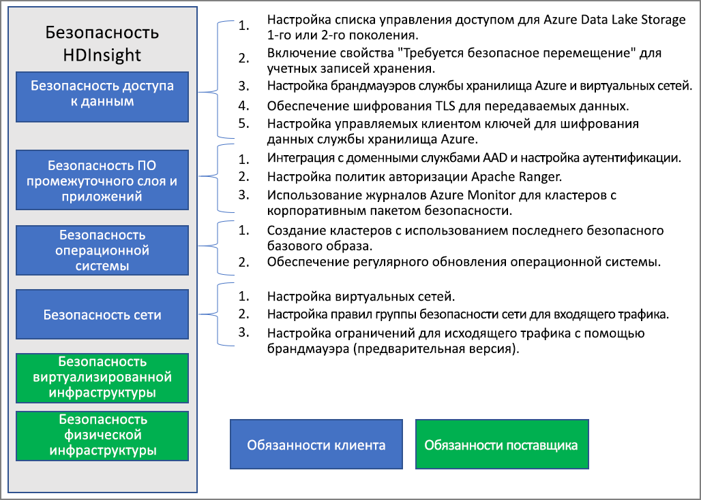

# Общие сведения о корпоративной безопасности в Azure HDInsight

Azure HDInsight предлагает ряд методов для соответствия требованиям корпоративной безопасности. По умолчанию большинство этих решений не активированы. Такая гибкость позволяет выбирать самые важные для вас функции безопасности и помогает не платить за функции, которые вам не нужны. Это также означает, что вы обязаны убедиться, что для вашей установки и среды включены правильные решения.

В этой статье рассматриваются решения по обеспечению безопасности путем разделения этих решений по четырем традиционным аспектам безопасности: безопасность периметра, проверка подлинности, авторизация и шифрование.

В этой статье также представлен **корпоративный пакет безопасности Azure HDInsight (ESP)** , который обеспечивает проверку подлинности на основе Active Directory, многопользовательскую поддержку и управление доступом на основе ролей для кластеров HDInsight.

## Основные аспекты корпоративной безопасности

Один из способов ознакомиться с корпоративной безопасностью — разделение решений по обеспечению безопасности на четыре основные группы, основанные на типе элемента управления. Эти группы также называются основами безопасности и включают следующее: безопасность периметра, проверку подлинности, авторизацию и шифрование.

### Безопасность периметра

Безопасность периметра в HDInsight обеспечивается за счет [виртуальных сетей](../hdinsight-plan-virtual-network-deployment.md). Корпоративный администратор может создать кластер в виртуальной сети и ограничить к ней доступ с помощью групп безопасности сети (NSG). Для обмена данными с кластером HDInsight будут использоваться только IP-адреса в правилах входящего трафика NSG. Эта конфигурация обеспечивает безопасность периметра.

Все кластеры, развернутые в виртуальной сети, также будут иметь частную конечную точку, которая преобразуется в частный IP-адрес внутри виртуальной сети для частного доступа по протоколу HTTP к шлюзам кластера.

### Аутентификация

[Корпоративный пакет безопасности](apache-domain-joined-architecture.md) от HDInsight предоставляет проверку подлинности на основе Active Directory, поддержку многопользовательского режима и управления доступом на основе ролей. Для интеграции Active Directory используются [доменные службы Azure Active Directory](../../active-directory-domain-services/overview.md). Благодаря таким возможностям можно создать кластер HDInsight, присоединенный к управляемому домену Active Directory. Затем вы можете настроить список сотрудников организации, которые могут пройти проверку подлинности и выполнить вход в этот кластер.

При такой конфигурации сотрудники организации могут войти в узлы кластера с использованием своих учетных данных домена. Кроме того, с помощью этих учетных данных можно проверять подлинность в других утвержденных конечных точках, например представлениях Apache Ambari, ODBC, JDBC, PowerShell и интерфейсах REST API, а также обеспечить взаимодействие с кластером. 

### Авторизация

В большинстве организаций следуют такой рекомендации: доступ ко всем корпоративным ресурсам предоставляется не всем сотрудникам. Аналогичным образом администратор может определить политики управления доступом на основе ролей для ресурсов кластера. Эта возможность доступна только в кластерах ESP.

Администратор Hadoop может настроить управление доступом на основе ролей (RBAC) для защиты Apache [Hive](apache-domain-joined-run-hive.md), [HBase](apache-domain-joined-run-hbase.md) и [Kafka](apache-domain-joined-run-kafka.md) с помощью этих подключаемых модулей в Apache Ranger. Настройка политик RBAC позволяет связывать разрешения с ролью в организации. Этот уровень абстракции позволяет гарантировать, что у людей есть только разрешения, необходимые для выполнения их рабочих обязанностей. Ranger позволяет проводить аудит доступа сотрудников к данным, а также аудит любых изменений, внесенных в политики управления доступом.

Например, администратор может настроить [Apache Ranger](https://ranger.apache.org/), чтобы настроить политики контроля доступа для Hive. Эта функция обеспечивает фильтрацию на уровне строк и столбцов (маскирование данных) и выполняет фильтрацию конфиденциальных данных от неавторизованных пользователей.

### Аудит

Аудит доступа к ресурсам кластера и данным необходим для отслеживания неавторизованного или случайного доступа к ресурсам. Это так же важно, как защита ресурсов кластера HDInsight от неавторизованных пользователей и обеспечение безопасности данных.

Администратор может просмотреть все случаи получения доступа к ресурсам и данным кластера HDInsight и сообщить о них. Кроме того, администратор может просмотреть все изменения в политиках контроля доступа, созданных в поддерживаемых конечных точках Apache Ranger, и сообщить о них. 

Чтобы получить доступ к журналам аудита Apache Ranger и Ambari, а также к журналам доступа по протоколу SSH, [включите Azure Monitor](../hdinsight-hadoop-oms-log-analytics-tutorial.md) и просмотрите соответствующие записи аудита.

### Шифрование

Защита данных важна для соблюдения требований безопасности и соответствия, установленных в организации. Помимо ограничения доступа неавторизованных сотрудников к данным, их следует зашифровать.

Оба хранилища данных для кластеров HDInsight (хранилище BLOB-объектов Azure и Azure Data Lake Storage 1-го и 2-го поколений) поддерживают [шифрование неактивных данных](../../storage/common/storage-service-encryption.md) на стороне сервера. Защищенные кластеры HDInsight полностью поддерживают шифрование неактивных данных на стороне сервера.

## Модель общей ответственности

На следующем рисунке представлены основные области безопасности системы и решения по обеспечению безопасности, доступные вам в каждой из них. На нем также показано, за какие области безопасности вы отвечаете как клиент, а за какие — HDInsight как поставщик услуг.

В следующей таблице приведены ссылки на ресурсы для каждого типа решения по обеспечению безопасности.

| Область безопасности | Доступные решения | Ответственное лицо |
|---|---|---|
| Безопасность доступа к данным | Настройка [списков управления доступом (ACL)](../../storage/blobs/data-lake-storage-access-control.md) для Azure Data Lake Storage 1-го поколения и 2-го поколения  | Клиент |
|  | Включите свойство [Требуется безопасное перемещение](../../storage/common/storage-require-secure-transfer.md) в учетной записи хранения. | Клиент |
|  | Настройка [брандмауэров службы хранилища Azure](../../storage/common/storage-network-security.md) и виртуальных сетей | Клиент |
|  | Убедитесь, что [шифрование TLS](../../storage/common/storage-security-tls.md) включено для передаваемых данных. | Клиент |
|  | Настройка [управляемых пользователем ключей](../../storage/common/storage-encryption-keys-portal.md) для шифрования службы хранилища Azure | Клиент |
| Безопасность приложений и ПО промежуточного слоя | Интеграция с AAD-DS и [настройка проверки подлинности](apache-domain-joined-configure-using-azure-adds.md) | Клиент |
|  | Настройка политик [авторизации Apache Ranger](apache-domain-joined-run-hive.md) | Клиент |
|  | Использование [журналов Azure Monitor](../hdinsight-hadoop-oms-log-analytics-tutorial.md) | Клиент |
| Безопасность операционной системы | Создание кластеров с помощью последних безопасных базовых образов | Клиент |
|  | Обеспечение [установки исправлений для ОС](../hdinsight-os-patching.md) через регулярные интервалы | Клиент |
| Безопасность сети | Настройка [виртуальной сети](../hdinsight-plan-virtual-network-deployment.md) |
|  | Настройка [правил для входящего трафика группы безопасности сети (NSG)](../hdinsight-plan-virtual-network-deployment.md#networktraffic) | Клиент |
|  | Настройка [ограничения исходящего трафика](../hdinsight-restrict-outbound-traffic.md) с помощью брандмауэра (предварительная версия) | Клиент |
| Виртуализированная инфраструктура | Недоступно | HDInsight (поставщик облачных служб) |
| Безопасность физической инфраструктуры | Недоступно | HDInsight (поставщик облачных служб) |

## Дополнительная информация

* [Корпоративный пакет безопасности для HDInsight](apache-domain-joined-architecture.md)
* [Настройка кластера HDInsight с корпоративным пакетом безопасности с помощью доменных служб Azure Active Directory](apache-domain-joined-configure.md)
* [Управление кластерами HDInsight с помощью корпоративного пакета безопасности](apache-domain-joined-manage.md)
