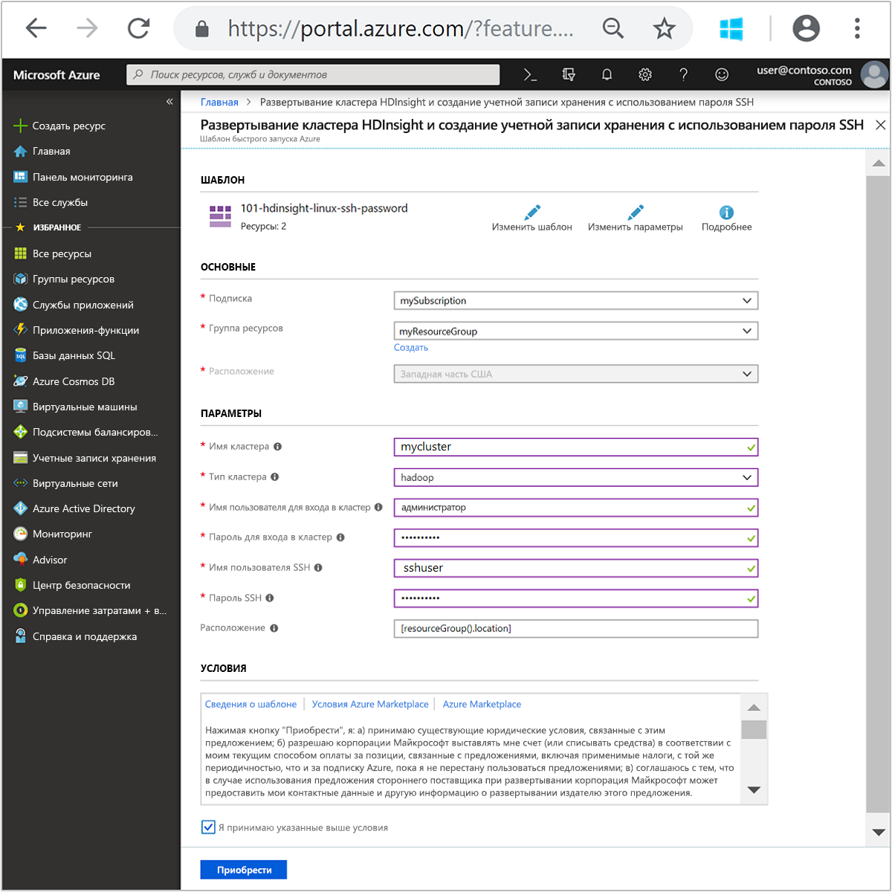

# Краткое руководство. Создание кластеров Apache Hadoop в Azure HDInsight с помощью шаблонов Resource Manager

Из этого краткого руководства вы узнаете, как создать в Azure HDInsight кластер Apache Hadoop с помощью шаблона Resource Manager.

Похожие шаблоны можно просмотреть на странице [Шаблоны быстрого запуска Azure](https://azure.microsoft.com/resources/templates/?resourceType=Microsoft.Hdinsight&pageNumber=1&sort=Popular). Ссылку на шаблон можно найти [здесь](https://docs.microsoft.com/azure/templates/microsoft.hdinsight/allversions).  Кластер можно также создать с помощью [портала Azure](apache-hadoop-linux-create-cluster-get-started-portal.md).  

В настоящее время в HDInsight доступно [семь типов кластеров](./apache-hadoop-introduction.md#cluster-types-in-hdinsight). Каждый тип кластера поддерживает свой набор компонентов. Все типы кластеров поддерживают инфраструктуру Hive. Дополнительные сведения о поддерживаемых компонентах в HDInsight см. в статье [Что представляют собой различные компоненты Hadoop, доступные в HDInsight?](../hdinsight-component-versioning.md)  

Если у вас еще нет подписки Azure, [создайте бесплатную учетную запись Azure](https://azure.microsoft.com/free/), прежде чем начинать работу.

## Создание кластера Hadoop

1. Нажмите кнопку **Развертывание в Azure** ниже, чтобы войти в Azure и открыть шаблон Resource Manager на портале Azure.
   
    

2. Введите или выберите следующие значения:

    |Свойство  |Описание  |
    |---------|---------|
    |**Подписка**     |  Выберите подписку Azure. |
    |**Группа ресурсов**     | Создайте новую группу ресурсов или выберите имеющуюся группу ресурсов.  Группа ресурсов — это контейнер компонентов Azure.  В данном случае группа ресурсов содержит кластер HDInsight и зависимую учетную запись хранения Azure. |
    |**Местоположение.**     | Выберите расположение Azure для создания кластера.  Выберите ближайшее к себе расположение для повышения производительности. |
    |**Имя кластера**     | Введите имя кластера Hadoop. Так как все кластеры в HDInsight используют одно пространство имен DNS, это имя должно быть уникальным. Имя может содержать только строчные буквы, цифры и дефисы и должно начинаться с буквы.  Перед каждым дефисом должен быть знак без дефиса.  Количество символов в имени должно быть от 3 до 59. |
    |**Тип кластера**     | Выберите **hadoop**. |
    |**Cluster login name and password** (Имя для входа и пароль для кластера)     | Имя для входа по умолчанию — **admin**. Длина пароля должна составлять не менее 10 символов. Пароль должен содержать по меньшей мере одну цифру, одну прописную и одну строчную буквы, а также один специальный символ (кроме ' " ` \)). Ни в коем случае **не вводите** распространенные пароли, например Pass@word1.|
    |**SSH username and password** (Имя пользователя SSH и пароль)     | Имя пользователя по умолчанию — **sshuser**.  Вы можете изменить имя пользователя SSH.  Для пароля пользователя SSH выдвигаются те же требования, что и для пароля для входа в кластер.|

    Некоторые свойства жестко заданы в шаблоне.  Эти значения можно настроить из шаблона. Дополнительные сведения об этих свойствах см. в инструкциях по [созданию кластеров Apache Hadoop в HDInsight](../hdinsight-hadoop-provision-linux-clusters.md).

    > [!NOTE]  
    > Необходимо указать уникальные значения, соответствующие правилам именования. Шаблон не выполняет проверки. Если введенные значения уже используются или не соответствуют правилам именования, после отправки шаблона произойдет ошибка.  

    

3. Установите флажок **Я принимаю указанные выше условия** и выберите **Приобрести**. Вы получите уведомление о выполнении развертывания.  Процесс создания кластера занимает около 20 минут.

4. После создания кластера вы получите уведомление **Развертывание прошло успешно** с ссылкой **Перейти к группе ресурсов**.  На странице **Группа ресурсов** будет указан новый кластер HDInsight и хранилище по умолчанию, связанное с кластером. У каждого кластера есть зависимость [учетной записи службы хранилища Azure](../hdinsight-hadoop-use-blob-storage.md) или [учетной записи Azure Data Lake Storage](../hdinsight-hadoop-use-data-lake-store.md). Она называется учетной записью хранения по умолчанию. Кластер HDInsight должен находиться в том же регионе Azure, что и его учетная запись хранения, используемая по умолчанию. Удаление кластеров не приведет к удалению учетной записи хранения.

> [!NOTE]  
> Сведения о других способах создания кластеров, а также о свойствах, используемых в этом кратком руководстве, см. в статье о [создании кластеров HDInsight](../hdinsight-hadoop-provision-linux-clusters.md).

## Устранение неполадок

Если при создании кластеров HDInsight возникли проблемы, см. раздел [Создание кластеров](../hdinsight-hadoop-customize-cluster-linux.md#access-control).

## Очистка ресурсов
После завершения работы с этим кратким руководством кластер можно удалить. В случае с HDInsight ваши данные хранятся в службе хранилища Azure, что позволяет безопасно удалить неиспользуемый кластер. Плата за кластеры HDInsight взимается, даже когда они не используются. Поскольку стоимость кластера во много раз превышает стоимость хранилища, экономически целесообразно удалять неиспользуемые кластеры.

> [!NOTE]  
> Если вы *сразу же* перейдете к следующему руководству, чтобы узнать, как выполнять операции извлечения, преобразования и загрузки, то можете не прерывать работу кластера. Дело в том, что в этом руководстве вам придется повторно создать кластер. Но если вы не собираетесь немедленно приступать к изучению следующего руководства, то нужно удалить кластер.

**Удаление кластера и (или) учетной записи хранения по умолчанию**

1. Вернитесь на вкладку браузера, на которой открыт портал Azure. Откройте страницу обзора кластера. Если требуется удалить кластер и сохранить учетную запись хранения по умолчанию, щелкните **Удалить**.

    

2. Если вам нужно удалить кластер и учетную запись хранения по умолчанию, выберите имя группы ресурсов (выделено на предыдущем снимке экрана), чтобы открыть страницу группы ресурсов.

3. Выберите **Удалить группу ресурсов**, чтобы удалить группу ресурсов, которая содержит кластер и учетную запись хранения по умолчанию. Обратите внимание, что удаление группы ресурсов приводит к удалению учетной записи хранения. Если вы хотите сохранить учетную запись хранения, удалите только кластер.

## Дополнительная информация

Из этого краткого руководства вы узнаете, как создать в HDInsight кластер Apache Hadoop с помощью шаблона Resource Manager. В следующей статье вы узнаете, как выполнять операции извлечения, преобразования и загрузки с помощью Hadoop в HDInsight.

> [!div class="nextstepaction"]
>[Извлечение, преобразование и загрузка данных с помощью Apache Hive в HDInsight](../hdinsight-analyze-flight-delay-data-linux.md)

Если вы готовы приступить к работе с собственными данными и хотите узнать больше о том, как HDInsight сохраняет данные или как получать данные в HDInsight, обратитесь к следующим статьям:

* Сведения о том, как HDInsight использует службу хранилища Azure, см. в статье [Использование службы хранилища Azure в HDInsight](../hdinsight-hadoop-use-blob-storage.md).
* Сведения о том, как создать кластер HDInsight с Data Lake Storage, см. в руководстве по [ настройке кластеров в HDInsight](../../storage/data-lake-storage/quickstart-create-connect-hdi-cluster.md).
* Сведения об отправке данных в HDInsight см. в статье [Отправка данных в HDInsight](../hdinsight-upload-data.md).
* [Использование Azure Data Lake Storage Gen2 с кластерами Azure HDInsight](../hdinsight-hadoop-use-data-lake-storage-gen2.md)

Дополнительные сведения об анализе данных с помощью HDInsight см. в следующих статьях:

* Дополнительные сведения об использовании Hive с HDInsight, включая выполнение запросов Hive из Visual Studio, см. в статье [Обзор Apache Hive и HiveQL в Azure HDInsight](hdinsight-use-hive.md).
* Дополнительные сведения о языке Pig, который используется для преобразования данных, см. в статье [Использование Apache Pig с Apache Hadoop в HDInsight](hdinsight-use-pig.md).
* Дополнительные сведения о MapReduce — способе написания программ, которые обрабатывают данные в Hadoop, — см. в статье [Использование MapReduce в Hadoop в HDInsight](hdinsight-use-mapreduce.md).
* Дополнительные сведения об анализе данных в HDInsight с помощью средств HDInsight для Visual Studio см. в статье [Приступая к работе с инструментами Hadoop в Visual Studio для HDInsight](apache-hadoop-visual-studio-tools-get-started.md).
* Дополнительные сведения о HDInsight для VS Code, который используется для анализа данных HDInsight, см. в статье [Использование средств Azure HDInsight для Visual Studio Code](../hdinsight-for-vscode.md).

Дополнительные сведения о создании кластера HDInsight и управлении этим кластером см. в следующих статьях:

* Сведения об управлении кластером HDInsight под управлением Linux см. в руководстве по [управлению кластерами HDInsight с помощью Apache Ambari](../hdinsight-hadoop-manage-ambari.md).
* Дополнительные сведения о параметрах, которые можно выбрать при создании кластера HDInsight, см. в статье [Создание кластеров HDInsight в Linux с пользовательскими параметрами](../hdinsight-hadoop-provision-linux-clusters.md).

Дополнительные сведения о создании кластера HDInsight с помощью шаблонов Azure Resource Manager см. в статье:

* [Шаблоны быстрого запуска Azure](https://azure.microsoft.com/resources/templates/?resourceType=Microsoft.Hdinsight&pageNumber=1&sort=Popular).
* [Справочник по шаблонам Azure](https://docs.microsoft.com/azure/templates/microsoft.hdinsight/allversions).

[1]: ../HDInsight/apache-hadoop-visual-studio-tools-get-started.md

[hdinsight-provision]: hdinsight-provision-linux-clusters.md
[hdinsight-upload-data]: hdinsight-upload-data.md
[hdinsight-use-hive]: hdinsight-use-hive.md
[hdinsight-use-pig]: hdinsight-use-pig.md