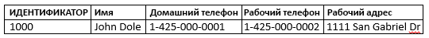
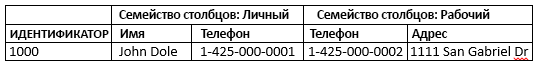

# <a name="quickstart-query-apache-hbase-in-azure-hdinsight-with-hbase-shell"></a>Краткое руководство. Выполнение запросов Apache HBase в Azure HDInsight с помощью HBase Shell

В этом кратком руководстве описано, как с помощью Apache HBase Shell создать таблицу HBase, вставить данные и затем выполнить к ней запрос.

Если у вас еще нет подписки Azure, [создайте бесплатную учетную запись Azure](https://azure.microsoft.com/free/?WT.mc_id=A261C142F), прежде чем начинать работу.

## <a name="prerequisites"></a>Предварительные требования

* Кластер Apache HBase. Чтобы создать кластер HDInsight, обратитесь к разделу [Создание кластера Hadoop](../hadoop/apache-hadoop-linux-tutorial-get-started.md#create-cluster).  Убедитесь, что выбран тип кластера **HBase**.

* Клиент SSH. Дополнительные сведения см. в руководстве по [подключению к HDInsight (Apache Hadoop) с помощью SSH](../hdinsight-hadoop-linux-use-ssh-unix.md).

## <a name="create-a-table-and-manipulate-data"></a>Создание таблицы и обработка данных

Для большинства пользователей данные отображаются в табличном формате:



В HBase (реализация [Cloud BigTable](https://cloud.google.com/bigtable/)) те же данные выглядят следующим образом:



Для подключения к кластерам HBase можно использовать протокол SSH, а для создания таблиц HBase, вставки данных и создания запросов к данным — Apache HBase Shell.

1. С помощью команды `ssh` подключитесь к кластеру HBase. Измените приведенную ниже команду, заменив `CLUSTERNAME` именем своего кластера, а затем введите команду:

    ```cmd
    ssh sshuser@CLUSTERNAME-ssh.azurehdinsight.net
    ```

2. С помощью команды `hbase shell` запустите интерактивную оболочку HBase. В строку SSH-подключения введите следующую команду:

    ```bash
    hbase shell
    ```

3. С помощью команды `create` создайте таблицу HBase с двумя семействами столбцов. Введите следующую команду:

    ```hbase
    create 'Contacts', 'Personal', 'Office'
    ```

4. С помощью команды `list` выведите список всех таблиц HBase. Введите следующую команду:

    ```hbase
    list
    ```

5. С помощью команды `put` вставьте значения в указанный столбец строки в определенной таблице. Введите следующую команду:

    ```hbase
    put 'Contacts', '1000', 'Personal:Name', 'John Dole'
    put 'Contacts', '1000', 'Personal:Phone', '1-425-000-0001'
    put 'Contacts', '1000', 'Office:Phone', '1-425-000-0002'
    put 'Contacts', '1000', 'Office:Address', '1111 San Gabriel Dr.'
    ```

6. С помощью команды `scan` выполните сканирование данных таблицы `Contacts` и верните их. Введите следующую команду:

    ```hbase
    scan 'Contacts'
    ```

7. С помощью команды `get` получите содержимое строки. Введите следующую команду:

    ```hbase
    get 'Contacts', '1000'
    ```

    Вы увидите те же результаты, что и при использовании команды `scan`, так как в таблице есть только одна строка.

8. С помощью команды `delete` удалите значение ячейки в таблице. Введите следующую команду:

    ```hbase
    delete 'Contacts', '1000', 'Office:Address'
    ```

9. С помощью команды `disable` отключите таблицу. Введите следующую команду:

    ```hbase
    disable 'Contacts'
    ```

10. С помощью команды `drop` удалите таблицу из HBase. Введите следующую команду:

    ```hbase
    drop 'Contacts'
    ```

11. С помощью команды `exit` остановите интерактивную оболочку HBase. Введите следующую команду:

    ```hbase
    exit
    ```

Дополнительные сведения о схеме таблицы HBase см. в [этой статье](http://0b4af6cdc2f0c5998459-c0245c5c937c5dedcca3f1764ecc9b2f.r43.cf2.rackcdn.com/9353-login1210_khurana.pdf). Дополнительные команды HBase см. в [справочнике по Apache HBase](https://hbase.apache.org/book.html#quickstart).

## <a name="clean-up-resources"></a>Очистка ресурсов

После завершения работы с этим кратким руководством кластер можно удалить. В случае с HDInsight ваши данные хранятся в службе хранилища Azure, что позволяет безопасно удалить неиспользуемый кластер. Плата за кластеры HDInsight взимается, даже когда они не используются. Поскольку стоимость кластера во много раз превышает стоимость хранилища, экономически целесообразно удалять неиспользуемые кластеры.

Инструкции по удалению кластера см. в статье [Delete an HDInsight cluster using your browser, PowerShell, or the Azure CLI](../hdinsight-delete-cluster.md) (Удаление кластера HDInsight с помощью браузера, PowerShell или Azure CLI).

## <a name="next-steps"></a>Дополнительная информация

Из этого краткого руководства вы узнали, как с помощью Apache HBase Shell создать таблицу HBase, вставить данные и затем выполнить к ней запрос. Дополнительные сведения о хранящихся в Hive данных см. в следующей статье, в которой показано, как выполнять запросы с помощью Apache Spark.

> [!div class="nextstepaction"]
> [Чтение и запись данных Apache HBase с помощью Apache Spark](../hdinsight-using-spark-query-hbase.md)