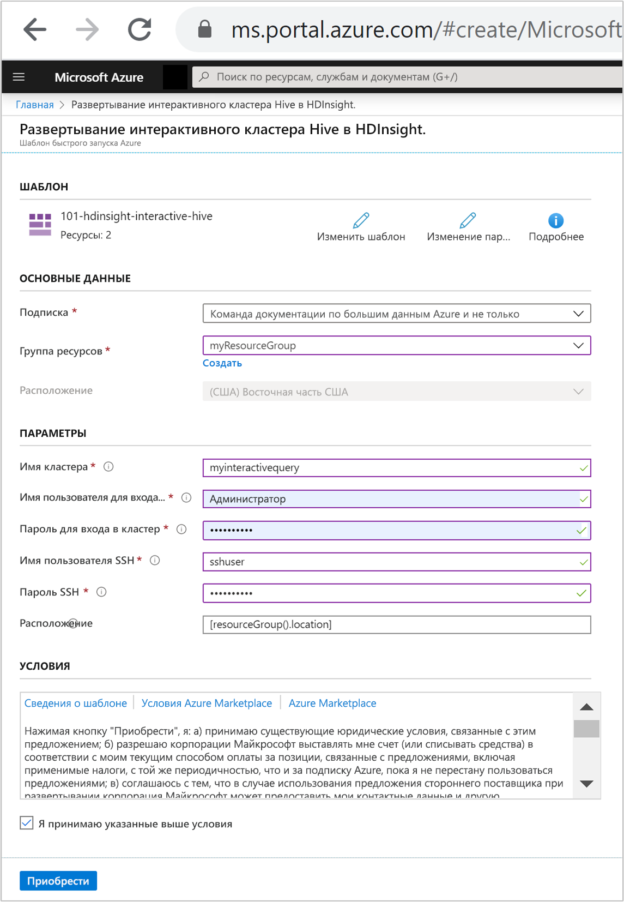
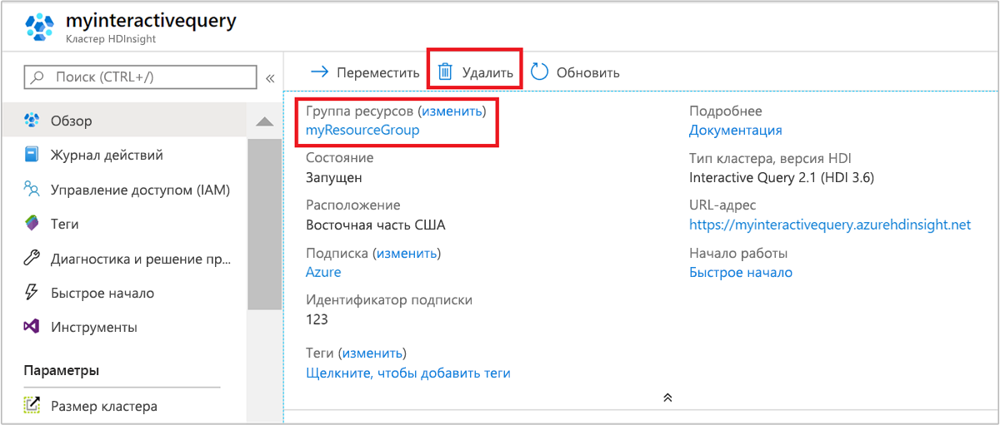

# Краткое руководство. Создание кластера Interactive Query в Azure HDInsight с помощью шаблона ARM

В рамках этого краткого руководства вы используете шаблон Azure Resource Manager (ARM), чтобы создать кластер [Interactive Query](./apache-interactive-query-get-started.md) в Azure HDInsight. Interactive Query (также называется Apache Hive LLAP или [Low Latency Analytical Processing](https://cwiki.apache.org/confluence/display/Hive/LLAP)) — это [тип кластера](../hdinsight-hadoop-provision-linux-clusters.md#cluster-type) Azure HDInsight.

[!INCLUDE [About Azure Resource Manager](../../../includes/resource-manager-quickstart-introduction.md)]

Если среда соответствует предварительным требованиям и вы знакомы с использованием шаблонов ARM, нажмите кнопку **Развертывание в Azure**. Шаблон откроется на портале Azure.

## Предварительные требования

Если у вас еще нет подписки Azure, [создайте бесплатную учетную запись](https://azure.microsoft.com/free/?WT.mc_id=A261C142F), прежде чем начинать работу.

## Изучение шаблона

Шаблон, используемый в этом кратком руководстве, взят из [шаблонов быстрого запуска Azure](https://azure.microsoft.com/resources/templates/101-hdinsight-interactive-hive/).

:::code language="json" source="~/quickstart-templates/101-hdinsight-interactive-hive/azuredeploy.json":::

В шаблоне определено два ресурса Azure:

* С помощью [Microsoft.Storage/storageAccounts](/azure/templates/microsoft.storage/storageaccounts) создается учетная запись хранения Azure.
* С помощью [Microsoft.HDInsight/cluster](/azure/templates/microsoft.hdinsight/clusters) создается кластер HDInsight.

### Развертывание шаблона

1. Нажмите кнопку **Развертывание в Azure** ниже, чтобы войти в Azure и открыть шаблон ARM.

    

1. Введите или выберите следующие значения:

    |Свойство |Описание |
    |---|---|
    |Подписка|В раскрывающемся списке выберите подписку Azure, которая используется для кластера.|
    |Группа ресурсов|В раскрывающемся списке выберите существующую группу ресурсов, а затем **Создать новую**.|
    |Расположение|В качестве значения будет автоматически указано расположение, используемое для группы ресурсов.|
    |Имя кластера,|Введите глобально уникальное имя Для этого шаблона вы можете использовать только строчные буквы и цифры.|
    |Имя пользователя для входа в кластер|Укажите имя пользователя, по умолчанию — **admin**.|
    |Пароль для входа в кластер|Введите пароль. Длина пароля должна составлять не менее 10 символов. Пароль должен содержать по меньшей мере одну цифру, одну прописную и одну строчную буквы, а также один специальный символ (кроме ' " ` ). |
    |Имя пользователя SSH|Укажите имя пользователя, по умолчанию — sshuser.|
    |Пароль SSH|Укажите пароль.|

    

1. Ознакомьтесь с **УСЛОВИЯМИ ИСПОЛЬЗОВАНИЯ**. Затем установите флажок **Я принимаю указанные выше условия** и нажмите кнопку **Приобрести**. Вы получите уведомление о выполнении развертывания. Процесс создания кластера занимает около 20 минут.

## Просмотр развернутых ресурсов

После создания кластера вы получите уведомление **Развертывание прошло успешно** со ссылкой **Перейти к ресурсу**. На странице группы ресурсов будет указан новый кластер HDInsight и хранилище по умолчанию, связанное с кластером. У каждого кластера есть зависимость учетной записи [службы хранилища Azure](../hdinsight-hadoop-use-blob-storage.md) или [учетной записи Azure Data Lake Storage](../hdinsight-hadoop-use-data-lake-store.md). Она называется учетной записью хранения по умолчанию. Кластер HDInsight должен находиться в том же регионе Azure, что и его учетная запись хранения, используемая по умолчанию. Удаление кластеров не приведет к удалению учетной записи хранения.

## Очистка ресурсов

После завершения работы с этим кратким руководством кластер можно удалить. В случае с HDInsight ваши данные хранятся в службе хранилища Azure, что позволяет безопасно удалить неиспользуемый кластер. Плата за кластеры HDInsight взимается, даже когда они не используются. Так как затраты на кластер во много раз превышают затраты на хранилище, экономически целесообразно удалять неиспользуемые кластеры.

На портале Azure перейдите в свой кластер и выберите **Удалить**.

Кроме того, можно выбрать имя группы ресурсов, чтобы открыть страницу группы ресурсов, а затем щелкнуть **Удалить группу ресурсов**. Вместе с группой ресурсов вы также удалите кластер HDInsight и учетную запись хранения по умолчанию.

## Дальнейшие действия

Из этого краткого руководства вы узнали, как создать в HDInsight кластер Interactive Query с помощью шаблона ARM. В следующей статье вы узнаете, как использовать Apache Zeppelin для выполнения запросов Apache Hive.

> [!div class="nextstepaction"]
> [Выполнение запросов Apache Hive в Azure HDInsight с помощью Apache Zeppelin](./hdinsight-connect-hive-zeppelin.md)
