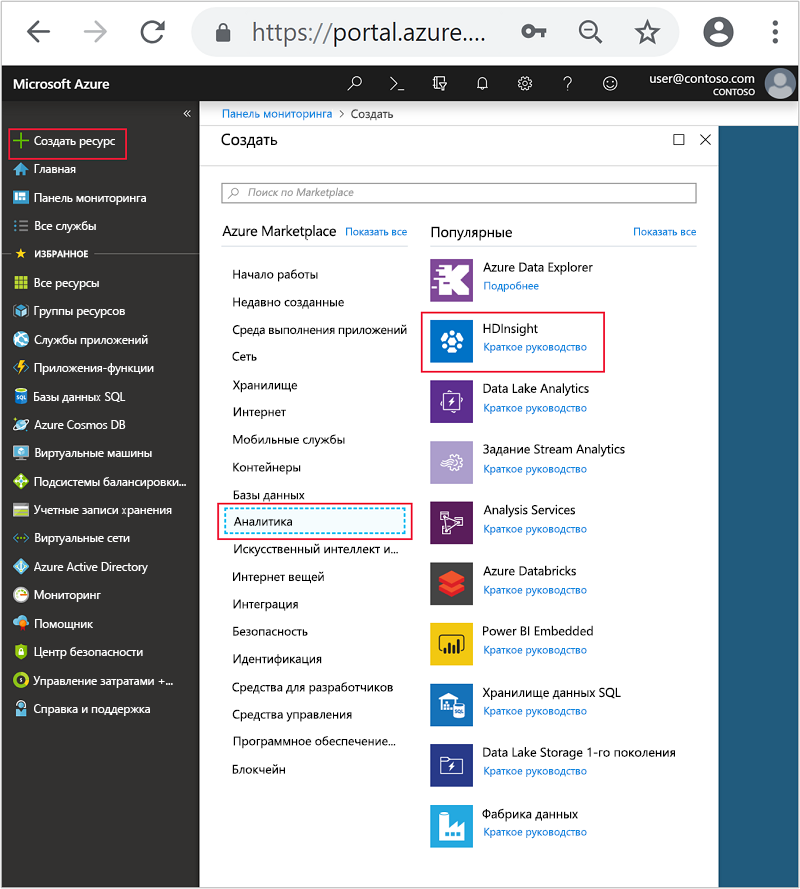
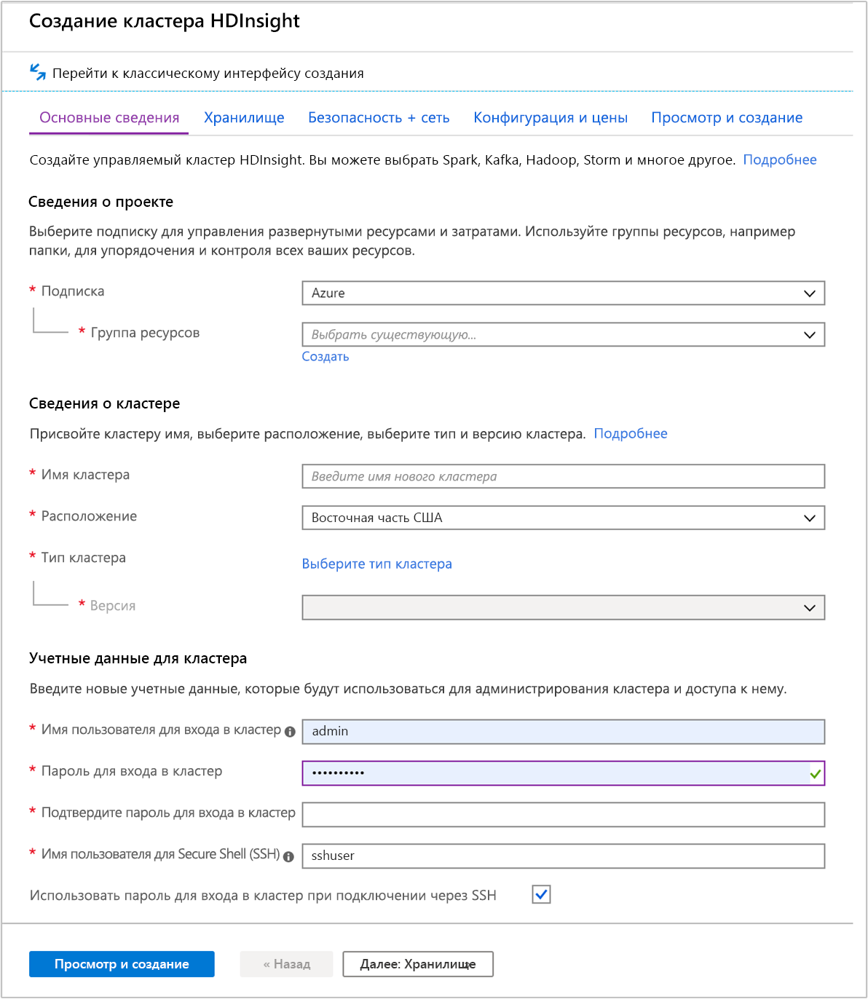
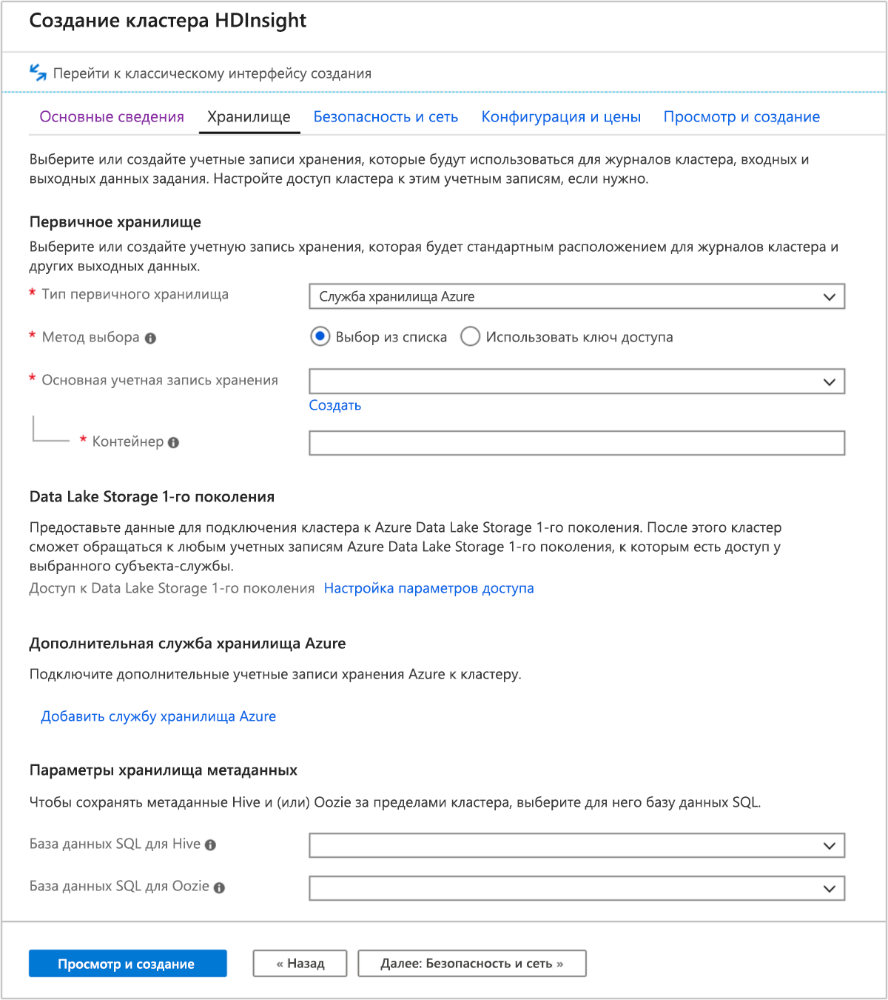
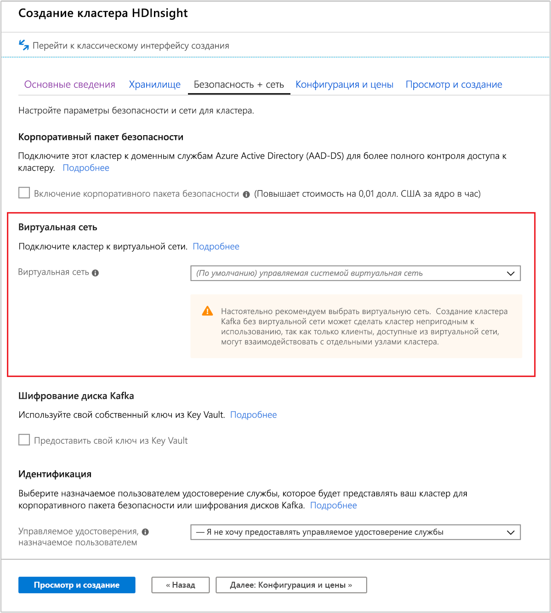
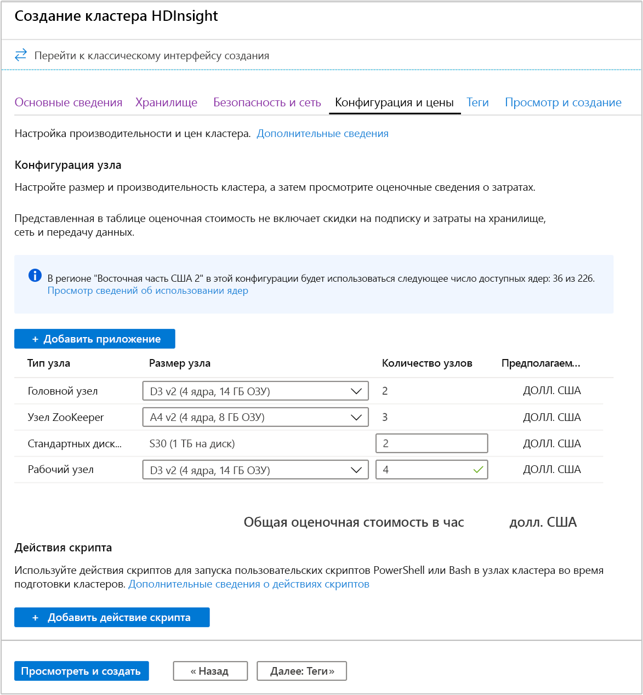
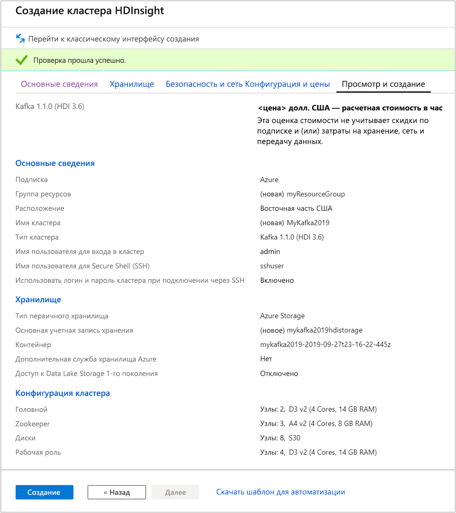

# <a name="quickstart-create-apache-kafka-cluster-in-azure-hdinsight-using-azure-portal"></a>Краткое руководство. Создание кластера Apache Kafka в Azure HDInsight с помощью портала Azure

Apache Kafka — это распределенная платформа потоковой передачи с открытым кодом. Она часто используется как брокер сообщений, предоставляя такие же функциональные возможности, как и очередь сообщений типа "публикация-подписка".

В этом кратком руководстве вы узнаете, как создать кластер [Apache Kafka](https://kafka.apache.org) с помощью портала Azure. Вы также узнаете, как с помощью предоставленных служебных программ отправлять и получать сообщения, используя Apache Kafka.

[!INCLUDE [delete-cluster-warning](../../../includes/hdinsight-delete-cluster-warning.md)]

API Apache Kafka доступен только ресурсам, размещенным в той же виртуальной сети. В этом кратком руководстве вы напрямую обращаетесь к кластеру по протоколу SSH. Чтобы подключить к Apache Kafka другие службы, сети или виртуальные машины, необходимо сначала создать виртуальную сеть, а затем создать в ней эти ресурсы. Дополнительные сведения см. в документе [Подключение к Kafka в HDInsight с помощью виртуальной сети Azure](apache-kafka-connect-vpn-gateway.md).

Если у вас еще нет подписки Azure, [создайте бесплатную учетную запись Azure](https://azure.microsoft.com/free/?WT.mc_id=A261C142F), прежде чем начинать работу.

## <a name="prerequisites"></a>Предварительные требования

Клиент SSH. Дополнительные сведения см. в руководстве по [подключению к HDInsight (Apache Hadoop) с помощью SSH](../hdinsight-hadoop-linux-use-ssh-unix.md).

## <a name="create-an-apache-kafka-cluster"></a>Создание кластера Apache Kafka

Чтобы создать Apache Kafka в кластере HDInsight, сделайте следующее:

1. Войдите на [портале Azure](https://portal.azure.com).

1. В меню слева последовательно выберите **+ Создать ресурс** > **Аналитика** > **HDInsight**.

    

1. В колонке **Основные сведения** введите или выберите следующие значения:

    |Свойство  |ОПИСАНИЕ  |
    |---------|---------|
    |Subscription    |  Выберите подписку Azure. |
    |группа ресурсов.     | Создайте новую группу ресурсов или выберите имеющуюся группу ресурсов.  Группа ресурсов — это контейнер компонентов Azure.  В данном случае группа ресурсов содержит кластер HDInsight и зависимую учетную запись хранения Azure. |
    |Имя кластера   | Введите имя кластера Hadoop. Так как все кластеры в HDInsight используют одно пространство имен DNS, это имя должно быть уникальным. Имя может содержать до 59 знаков, включая буквы, цифры и дефисы. Первый и последний знаки в имени не могут быть дефисами. |
    |Location    | Выберите расположение Azure для создания кластера.  Выберите ближайшее к себе расположение для повышения производительности. |
    |Тип кластера| Щелкните **Выберите тип кластера**. Затем выберите **Kafka** в качестве типа кластера.|
    |Version (версия)|Для типа кластера будет указана версия по умолчанию. Если хотите указать другую версию, выберите ее из раскрывающегося списка.|
    |Имя для входа и пароль для кластера    | Имя для входа по умолчанию — **admin**. Длина пароля должна составлять не менее 10 символов. Пароль должен содержать по меньшей мере одну цифру, одну прописную и одну строчную буквы, а также один специальный символ (кроме ' " ` \)). Ни в коем случае **не вводите** распространенные пароли, например Pass@word1.|
    |Имя пользователя для Secure Shell (SSH) | Имя пользователя по умолчанию — **sshuser**.  Можно указать другое имя пользователя SSH. |
    |Использование пароля для входа в кластер для SSH| Установите этот флажок, чтобы использовать одинаковый пароль для пользователя SSH и имени для входа для кластера.|

   

    В каждом регионе Azure (расположении) предоставляются _домены сбоя_. Домен сбоя — это логическое объединение базового оборудования в центре обработки данных Azure. Все домены сбоя используют общий источник питания и сетевой коммутатор. Виртуальные машины и управляемые диски, на которых реализуются узлы в кластере HDInsight, распределяются по этим доменам сбоя. Такая архитектура ограничивает потенциальное влияние сбоев физического оборудования.

    Для обеспечения высокой доступности данных выберите регион (расположение), содержащий __три домена сбоя__. Дополнительные сведения о количестве доменов сбоя в регионе см. в разделе [Использование управляемых дисков для виртуальных машин в группе доступности](../../virtual-machines/windows/manage-availability.md#use-managed-disks-for-vms-in-an-availability-set).

    Нажмите кнопку **Далее: Вкладка "Хранилище" >>** для перехода к настройкам хранилища.

1. На вкладке **Хранилище** укажите следующие значения:

    |Свойство  |ОПИСАНИЕ  |
    |---------|---------|
    |Тип первичного хранилища|Используйте значение **службы хранилища Azure** по умолчанию.|
    |Метод выбора|Используйте значение **Выбрать в списке** по умолчанию.|
    |Основную учетную запись хранения|Используйте раскрывающийся список, чтобы выбрать имеющуюся учетную запись хранения, или создайте новую, щелкнув **Создать**. При создании учетной записи имя должно содержать от 3 до 24 символов, включая цифры и строчные буквы|
    |Контейнер|Используйте значение, предоставленное автоматически.|

    

    Выберите вкладку **Безопасность и сетевые подключения**.

1. Для этого краткого руководства значения параметров безопасности оставьте по умолчанию. Чтобы получить дополнительную информацию о Корпоративном пакете безопасности, ознакомьтесь со статьей [Настройка кластера HDInsight с корпоративным пакетом безопасности с помощью доменных служб Azure Active Directory](../domain-joined/apache-domain-joined-configure-using-azure-adds.md). Чтобы узнать, как использовать свой ключ для шифрования дисков Apache Kafka, ознакомьтесь со статьей [Создание собственных ключей для Apache Kafka в Azure HDInsight (предварительная версия)](apache-kafka-byok.md).

   Если вы хотите подключить к виртуальной сети кластер, выберите виртуальную сеть из раскрывающегося списка **Виртуальная сеть**.

   

    Перейдите на вкладку **Конфигурация и цены**.

1. Для обеспечения доступности кластера Apache Kafka в HDInsight __число узлов__ для **рабочего узла** должно быть не меньше 3. Значение по умолчанию — 4.

    **Число стандартных дисков для каждой записи рабочего узла** определяет степень масштабируемости Apache Kafka в HDInsight. Кластер Apache Kafka в HDInsight использует локальный диск виртуальных машин в кластере для хранения данных. Apache Kafka обрабатывает большое количество операций ввода-вывода, поэтому используются [Управляемые диски Azure](../../virtual-machines/windows/managed-disks-overview.md), чтобы обеспечить высокую пропускную способность и предоставить дополнительное хранилище для каждого узла. Управляемый диск может быть двух типов: __Стандартный__ (HDD) или __Премиум__ (SSD). Тип диска зависит от размера виртуальной машины, используемой рабочими узлами (брокерами Apache Kafka). Диски категории "Премиум" автоматически используются для виртуальных машин серий DS и GS. Для всех остальных виртуальных машин используются стандартные управляемые диски.

   

    Перейдите на вкладку **Review + create** (Просмотр и создание).

1. Проверьте конфигурацию кластера. Измените неправильные параметры. Наконец, выберите **Создать**, чтобы создать кластер.

    

    Операция создания кластера может занять до 20 минут.

## <a name="connect-to-the-cluster"></a>Подключение к кластеру

1. Чтобы подключиться к первичному головному узлу кластера Apache Kafka, выполните приведенную ниже команду. Замените `sshuser` именем пользователя SSH. Замените `mykafka` именем кластера Apache Kafka.

    ```bash
    ssh sshuser@mykafka-ssh.azurehdinsight.net
    ```

2. При первом подключении к кластеру клиент SSH может отобразить предупреждение о том, что не удается установить подлинность узла. При появлении запроса введите __yes__ (Да) и нажмите клавишу __ВВОД__, чтобы добавить узел в список доверенных серверов клиента SSH.

3. При появлении запроса введите пароль пользователя SSH.

    После подключения отобразятся сведения, аналогичные приведенному ниже тексту.
    
    ```output
    Authorized uses only. All activity may be monitored and reported.
    Welcome to Ubuntu 16.04.4 LTS (GNU/Linux 4.13.0-1011-azure x86_64)
    
     * Documentation:  https://help.ubuntu.com
     * Management:     https://landscape.canonical.com
     * Support:        https://ubuntu.com/advantage
    
      Get cloud support with Ubuntu Advantage Cloud Guest:
        https://www.ubuntu.com/business/services/cloud
    
    83 packages can be updated.
    37 updates are security updates.


    Welcome to Apache Kafka on HDInsight.
    
    Last login: Thu Mar 29 13:25:27 2018 from 108.252.109.241
    ```

## <a id="getkafkainfo"></a>Получение сведений об узлах Apache Zookeeper и брокера

Для работы с Kafka необходимы сведения об узле *Apache Zookeeper* и узле *брокера*. Эти узлы используются API Apache Kafka и многими другими служебными программами, поставляемыми с платформой Kafka.

В этом разделе для получения сведений об узле используется REST API Apache Ambari в кластере.

1. Установите [jq](https://stedolan.github.io/jq/) — обработчик командной строки JSON. Эта служебная программа используется для анализа документов JSON. С ее помощью также удобно анализировать сведения об узлах. В открытом сеансе SSH-подключения введите следующую команду для установки `jq`:

    ```bash
    sudo apt -y install jq
    ```

2. Настройте переменные среды. Замените `PASSWORD` и `CLUSTERNAME` на пароль для входа в кластер и имя кластера соответственно, затем введите команду:

    ```bash
    export password='PASSWORD'
    export clusterNameA='CLUSTERNAME'
    ```

3. Извлеките имя кластера с правильным регистром. Фактический регистр имени кластера может отличаться от ожидаемого, в зависимости от способа создания кластера. Эта команда получит фактический регистр, сохранит его в переменной, а затем отобразит имя с правильным регистром и имя, которое вы указали ранее. Введите следующую команду:

    ```bash
    export clusterName=$(curl -u admin:$password -sS -G "https://$clusterNameA.azurehdinsight.net/api/v1/clusters" | jq -r '.items[].Clusters.cluster_name')
    echo $clusterName, $clusterNameA
    ```

4. Чтобы задать переменную среды со сведениями об узле Zookeeper, выполните следующую команду. Эта команда извлекает все узлы Zookeeper, а затем возвращает только первые две записи. Причина этого состоит в том, что требуется обеспечить избыточность на случай, если узел станет недоступным.

    ```bash
    export KAFKAZKHOSTS=`curl -sS -u admin:$password -G http://headnodehost:8080/api/v1/clusters/$clusterName/services/ZOOKEEPER/components/ZOOKEEPER_SERVER | jq -r '["\(.host_components[].HostRoles.host_name):2181"] | join(",")' | cut -d',' -f1,2`
    ```

    Эта команда предназначена для прямых запросов службы Ambari в головном узле кластера. Кроме того, доступ к Ambari можно получить с помощью общедоступного адреса `https://$CLUSTERNAME.azurehdinsight.net:80/`. Некоторые конфигурации сети могут запрещать доступ к общедоступным адресам. Например, если для ограничения доступа к HDInsight в виртуальной сети используются группы безопасности сети (NSG).

5. Чтобы убедиться, что переменную среды задано верно, выполните следующую команду.

    ```bash
    echo $KAFKAZKHOSTS
    ```

    Эта команда возвращает сведения аналогичные следующим:

    `zk0-kafka.eahjefxxp1netdbyklgqj5y1ud.ex.internal.cloudapp.net:2181,zk2-kafka.eahjefxxp1netdbyklgqj5y1ud.ex.internal.cloudapp.net:2181`

6. Чтобы задать переменную среды со сведениями об узле брокера Apache Kafka, выполните следующую команду.

    ```bash
    export KAFKABROKERS=`curl -sS -u admin:$password -G http://headnodehost:8080/api/v1/clusters/$clusterName/services/KAFKA/components/KAFKA_BROKER | jq -r '["\(.host_components[].HostRoles.host_name):9092"] | join(",")' | cut -d',' -f1,2`
    ```

7. Чтобы убедиться, что переменную среды задано верно, выполните следующую команду.

    ```bash   
    echo $KAFKABROKERS
    ```

    Эта команда возвращает сведения аналогичные следующим:

    `wn1-kafka.eahjefxxp1netdbyklgqj5y1ud.cx.internal.cloudapp.net:9092,wn0-kafka.eahjefxxp1netdbyklgqj5y1ud.cx.internal.cloudapp.net:9092`

## <a name="manage-apache-kafka-topics"></a>Управление разделами Apache Kafka

Kafka хранит потоки данных в *разделах*. Для управления разделами можно использовать служебную программу `kafka-topics.sh`.

* **Чтобы создать раздел**, в сеансе SSH-подключения выполните следующую команду.

    ```bash
    /usr/hdp/current/kafka-broker/bin/kafka-topics.sh --create --replication-factor 3 --partitions 8 --topic test --zookeeper $KAFKAZKHOSTS
    ```

    Эта команда создает подключение к Zookeeper, используя хранящиеся в `$KAFKAZKHOSTS` сведения об узле. Затем она создает раздел Apache Kafka с именем **test**.

    * Данные, хранящиеся в этом разделе, разделены на восемь секций.

    * Каждая секция реплицируются на три рабочих узла в кластере.

        Если кластер был создан в регионе Azure, который предоставляет три домена сбоя, то следует использовать коэффициент репликации, равный 3. В противном случае следует использовать коэффициент репликации, равный 4.
        
        В регионах с тремя доменами сбоя коэффициент репликации, равный 3, обеспечивает распределение реплик по доменам сбоя. В регионах с двумя доменами сбоя коэффициент репликации, равный 4, обеспечивает равномерное распределение реплик по доменам сбоя.
        
        Дополнительные сведения о количестве доменов сбоя в регионе см. в разделе [Использование управляемых дисков для виртуальных машин в группе доступности](../../virtual-machines/windows/manage-availability.md#use-managed-disks-for-vms-in-an-availability-set).

        В Apache Kafka нет сведений о доменах сбоя Azure. При создании реплик секций для разделов реплики могут быть неправильно распределены с точки зрения высокой доступности.

        Для обеспечения высокого уровня доступности используйте [средство перераспределения секций Apache Kafka](https://github.com/hdinsight/hdinsight-kafka-tools). Этот инструмент следует запускать из сеанса SSH-подключения на головном узле кластера Apache Kafka.

        Чтобы обеспечить максимально высокий уровень доступности данных Apache Kafka, следует перераспределять реплики секций для раздела в следующих случаях:

        * при создании раздела или секции;

        * при масштабировании кластера.

* **Чтобы вывести список разделов**, введите следующую команду.

    ```bash
    /usr/hdp/current/kafka-broker/bin/kafka-topics.sh --list --zookeeper $KAFKAZKHOSTS
    ```

    Она выводит список разделов на кластере Apache Kafka.

* **Чтобы удалить раздел**, используйте следующую команду.

    ```bash
    /usr/hdp/current/kafka-broker/bin/kafka-topics.sh --delete --topic topicname --zookeeper $KAFKAZKHOSTS
    ```

    Она удаляет раздел `topicname`.

    > [!WARNING]  
    > Если вы уже удалили раздел `test`, то необходимо создать его заново. Он используется в последующих действиях в этом документе.

Чтобы получить дополнительные сведения о командах, доступных в служебной программе `kafka-topics.sh`, используйте следующую команду.

```bash
/usr/hdp/current/kafka-broker/bin/kafka-topics.sh
```

## <a name="produce-and-consume-records"></a>Создание и использование записей

Kafka хранит *записи* в разделах. Записи создаются *производителями*, а используются *потребителями*. Производители и потребители взаимодействуют со службой *брокера Kafka*. Каждый узел рабочей роли в кластере HDInsight — это узел брокера Apache Kafka.

Чтобы сохранить записи в созданный ранее раздел test, а затем считать их с помощью потребителя, сделайте следующее:

1. Чтобы записать записи в раздел, используйте служебную программу `kafka-console-producer.sh` из сеанса SSH-подключения.

    ```bash
    /usr/hdp/current/kafka-broker/bin/kafka-console-producer.sh --broker-list $KAFKABROKERS --topic test
    ```

    После выполнения этой команды вы перейдете к пустой строке.

2. Введите текстовое сообщение в эту строку и нажмите клавишу ВВОД. Введите несколько таких сообщений, а затем нажмите клавиши **CTRL+C**, чтобы вернуться к обычной командной строке. Каждая строка отправляется в раздел Apache Kafka как отдельная запись.

3. Чтобы считать записи из раздела, используйте служебную программу `kafka-console-consumer.sh` из сеанса SSH-подключения.

    ```bash
    /usr/hdp/current/kafka-broker/bin/kafka-console-consumer.sh --bootstrap-server $KAFKABROKERS --topic test --from-beginning
    ```

    Эта команда извлекает записи из раздела, а затем отображает их. Параметр `--from-beginning` указывает потребителю считывать данные с самого начала потока, поэтому будут извлечены все записи.

    Если вы используете более раннюю версию Kafka, замените `--bootstrap-server $KAFKABROKERS` на `--zookeeper $KAFKAZKHOSTS`.

4. Нажмите клавиши __Ctrl+C__, чтобы остановить потребитель.

Вы также можете создать отправители и получатели программными средствами. Пример использования этого API см. в руководстве [Использование API производителя и потребителя Apache Kafka](apache-kafka-producer-consumer-api.md).

## <a name="clean-up-resources"></a>Очистка ресурсов

Чтобы очистить ресурсы, созданные при работе с этим кратким руководством, можно удалить группу ресурсов. При этом будет удален связанный кластер HDInsight и другие ресурсы, связанные с этой группой ресурсов.

Чтобы удалить группу ресурсов с помощью портала Azure, сделайте следующее:

1. На портале Azure разверните меню слева, чтобы открыть меню служб, а затем выберите __Группы ресурсов__, чтобы просмотреть список групп ресурсов.
2. Найдите группу ресурсов, которую нужно удалить, и щелкните правой кнопкой мыши кнопку __Дополнительно__ (…) справа от списка.
3. Выберите __Удалить группу ресурсов__ и подтвердите выбор.

> [!WARNING]  
> Начисление оплаты начинается после создания кластера HDInsight и прекращается только после его удаления. Кластеры оплачиваются поминутно, поэтому всегда следует удалять кластер, когда он больше не нужен.
>
> При удалении кластера Apache Kafka в HDInsight удаляются все хранимые данные в Kafka.

## <a name="next-steps"></a>Дополнительная информация

> [!div class="nextstepaction"]
> [Совместное использование Apache Spark и Apache Kafka](../hdinsight-apache-kafka-spark-structured-streaming.md)
