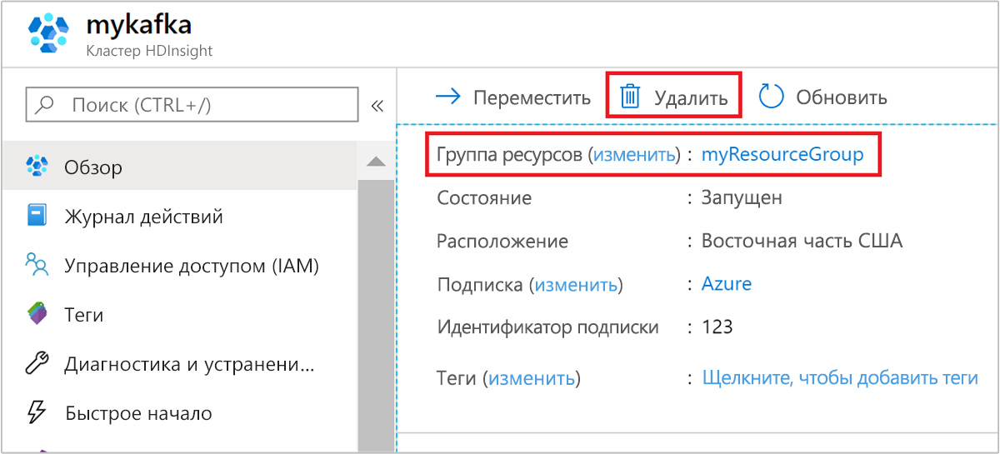

# <a name="quickstart-create-apache-kafka-cluster-in-azure-hdinsight-using-arm-template"></a>Краткое руководство. Создание кластера Apache Kafka в Azure HDInsight с помощью шаблона ARM

Из этого краткого руководства вы узнаете, как с помощью шаблона Azure Resource Manager (ARM) создать кластер [Apache Kafka](./apache-kafka-introduction.md) в Azure HDInsight. Kafka — это распределенная платформа потоковой передачи с открытым кодом. Она часто используется как брокер сообщений, предоставляя такие же функциональные возможности, как и очередь сообщений типа "публикация-подписка".

[!INCLUDE [About Azure Resource Manager](../../../includes/resource-manager-quickstart-introduction.md)]

API Kafka доступен только ресурсам, размещенным в той же виртуальной сети. В этом кратком руководстве вы напрямую обращаетесь к кластеру по протоколу SSH. Чтобы подключить к Kafka другие службы, сети или виртуальные машины, необходимо сначала создать виртуальную сеть, а затем создать в ней эти ресурсы. Дополнительные сведения см. в документе [Подключение к Kafka в HDInsight с помощью виртуальной сети Azure](apache-kafka-connect-vpn-gateway.md).

Если среда соответствует предварительным требованиям и вы знакомы с использованием шаблонов ARM, нажмите кнопку **Развертывание в Azure**. Шаблон откроется на портале Azure.

[](https://portal.azure.com/#create/Microsoft.Template/uri/https%3A%2F%2Fraw.githubusercontent.com%2FAzure%2Fazure-quickstart-templates%2Fmaster%2F101-hdinsight-kafka%2Fazuredeploy.json)

## <a name="prerequisites"></a>Предварительные требования

Если у вас еще нет подписки Azure, [создайте бесплатную учетную запись](https://azure.microsoft.com/free/?WT.mc_id=A261C142F), прежде чем начинать работу.

## <a name="review-the-template"></a>Изучение шаблона

Шаблон, используемый в этом кратком руководстве, взят из [шаблонов быстрого запуска Azure](https://azure.microsoft.com/resources/templates/101-hdinsight-kafka/).

:::code language="json" source="~/quickstart-templates/101-hdinsight-kafka/azuredeploy.json":::

В шаблоне определено два ресурса Azure:

* С помощью [Microsoft.Storage/storageAccounts](/azure/templates/microsoft.storage/storageaccounts) создается учетная запись хранения Azure.
* С помощью [Microsoft.HDInsight/cluster](/azure/templates/microsoft.hdinsight/clusters) создается кластер HDInsight.

## <a name="deploy-the-template"></a>Развертывание шаблона

1. Нажмите кнопку **Развертывание в Azure** ниже, чтобы войти в Azure и открыть шаблон ARM.

   [](https://portal.azure.com/#create/Microsoft.Template/uri/https%3A%2F%2Fraw.githubusercontent.com%2FAzure%2Fazure-quickstart-templates%2Fmaster%2F101-hdinsight-kafka%2Fazuredeploy.json)

1. Введите или выберите следующие значения:

    |Свойство |Описание |
    |---|---|
    |Подписка|В раскрывающемся списке выберите подписку Azure, которая используется для кластера.|
    |Группа ресурсов|В раскрывающемся списке выберите существующую группу ресурсов, а затем **Создать новую**.|
    |Расположение|В качестве значения будет автоматически указано расположение, используемое для группы ресурсов.|
    |Имя кластера,|Введите глобально уникальное имя Для этого шаблона вы можете использовать только строчные буквы и цифры.|
    |Имя пользователя для входа в кластер|Укажите имя пользователя, по умолчанию — **admin**.|
    |Пароль для входа в кластер|Введите пароль. Длина пароля должна составлять не менее 10 символов. Пароль должен содержать по меньшей мере одну цифру, одну прописную и одну строчную буквы, а также один специальный символ (кроме ' " ` ). |
    |Имя пользователя SSH|Укажите имя пользователя, по умолчанию — **sshuser**.|
    |Пароль SSH|Укажите пароль.|

    

1. Ознакомьтесь с **УСЛОВИЯМИ ИСПОЛЬЗОВАНИЯ**. Затем установите флажок **Я принимаю указанные выше условия** и нажмите кнопку **Приобрести**. Вы получите уведомление о выполнении развертывания. Процесс создания кластера занимает около 20 минут.

## <a name="review-deployed-resources"></a>Просмотр развернутых ресурсов

После создания кластера вы получите уведомление **Развертывание прошло успешно** со ссылкой **Перейти к ресурсу**. На странице группы ресурсов будет указан новый кластер HDInsight и хранилище по умолчанию, связанное с кластером. У каждого кластера есть зависимость учетной записи [службы хранилища Azure](../hdinsight-hadoop-use-blob-storage.md) или [учетной записи Azure Data Lake Storage](../hdinsight-hadoop-use-data-lake-store.md). Она называется учетной записью хранения по умолчанию. Кластер HDInsight должен находиться в том же регионе Azure, что и его учетная запись хранения, используемая по умолчанию. Удаление кластеров не приведет к удалению учетной записи хранения.

## <a name="get-the-apache-zookeeper-and-broker-host-information"></a>Получение сведений об узлах Apache Zookeeper и брокера

Для работы с Kafka необходимы сведения об узле *Apache Zookeeper* и узле *брокера*. Эти узлы используются Kafka API и многими другими служебными программами, поставляемыми с платформой Kafka.

В этом разделе для получения сведений об узле используется REST API Ambari в кластере.

1. С помощью команды [ssh command](../hdinsight-hadoop-linux-use-ssh-unix.md) подключитесь к кластеру. Измените приведенную ниже команду, заменив CLUSTERNAME именем своего кластера, а затем введите команду:

    ```cmd
    ssh sshuser@CLUSTERNAME-ssh.azurehdinsight.net
    ```

1. Используя SSH-подключение, выполните следующую команду, чтобы установить служебную программу `jq`. Эта служебная программа используется для анализа документов JSON. С ее помощью также удобно получать сведения об узлах.

    ```bash
    sudo apt -y install jq
    ```

1. Чтобы задать переменную среды с именем кластера, выполните следующую команду.

    ```bash
    read -p "Enter the Kafka on HDInsight cluster name: " CLUSTERNAME
    ```

    При появлении запроса введите имя кластера Kafka.

1. Чтобы задать переменную среды со сведениями об узле Zookeeper, выполните следующую команду. Эта команда извлекает все узлы Zookeeper, а затем возвращает только первые две записи. Причина этого состоит в том, что требуется обеспечить избыточность на случай, если узел станет недоступным.

    ```bash
    export KAFKAZKHOSTS=`curl -sS -u admin -G https://$CLUSTERNAME.azurehdinsight.net/api/v1/clusters/$CLUSTERNAME/services/ZOOKEEPER/components/ZOOKEEPER_SERVER | jq -r '["\(.host_components[].HostRoles.host_name):2181"] | join(",")' | cut -d',' -f1,2`
    ```

    При появлении запроса введите пароль учетной записи для входа в кластер (но не учетной записи SSH).

1. Чтобы убедиться, что переменную среды задано верно, выполните следующую команду.

    ```bash
     echo '$KAFKAZKHOSTS='$KAFKAZKHOSTS
    ```

    Эта команда возвращает сведения аналогичные следующим:

    `zk0-kafka.eahjefxxp1netdbyklgqj5y1ud.ex.internal.cloudapp.net:2181,zk2-kafka.eahjefxxp1netdbyklgqj5y1ud.ex.internal.cloudapp.net:2181`

1. Чтобы задать переменную среды со сведениями об узле брокера Kafka, выполните следующую команду.

    ```bash
    export KAFKABROKERS=`curl -sS -u admin -G https://$CLUSTERNAME.azurehdinsight.net/api/v1/clusters/$CLUSTERNAME/services/KAFKA/components/KAFKA_BROKER | jq -r '["\(.host_components[].HostRoles.host_name):9092"] | join(",")' | cut -d',' -f1,2`
    ```

    При появлении запроса введите пароль учетной записи для входа в кластер (но не учетной записи SSH).

1. Чтобы убедиться, что переменную среды задано верно, выполните следующую команду.

    ```bash
    echo '$KAFKABROKERS='$KAFKABROKERS
    ```

    Эта команда возвращает сведения аналогичные следующим:

    `wn1-kafka.eahjefxxp1netdbyklgqj5y1ud.cx.internal.cloudapp.net:9092,wn0-kafka.eahjefxxp1netdbyklgqj5y1ud.cx.internal.cloudapp.net:9092`

## <a name="manage-apache-kafka-topics"></a>Управление разделами Apache Kafka

Kafka хранит потоки данных в *разделах*. Для управления разделами можно использовать служебную программу `kafka-topics.sh`.

* **Чтобы создать раздел**, в сеансе SSH-подключения выполните следующую команду.

    ```bash
    /usr/hdp/current/kafka-broker/bin/kafka-topics.sh --create --replication-factor 3 --partitions 8 --topic test --zookeeper $KAFKAZKHOSTS
    ```

    Эта команда создает подключение к Zookeeper, используя хранящиеся в `$KAFKAZKHOSTS` сведения об узле. Затем она создает раздел Kafka с именем **test**.

    * Данные, хранящиеся в этом разделе, разделены на восемь секций.

    * Каждая секция реплицируются на три рабочих узла в кластере.

        Если кластер был создан в регионе Azure, который предоставляет три домена сбоя, то следует использовать коэффициент репликации, равный 3. В противном случае следует использовать коэффициент репликации, равный 4.
        
        В регионах с тремя доменами сбоя коэффициент репликации, равный 3, обеспечивает распределение реплик по доменам сбоя. В регионах с двумя доменами сбоя коэффициент репликации, равный 4, обеспечивает равномерное распределение реплик по доменам сбоя.
        
        Дополнительные сведения о количестве доменов сбоя в регионе см. в разделе [Использование управляемых дисков для виртуальных машин в группе доступности](../../virtual-machines/windows/manage-availability.md#use-managed-disks-for-vms-in-an-availability-set).

        В Kafka нет сведений о доменах сбоя Azure. При создании реплик секций для разделов реплики могут быть неправильно распределены с точки зрения высокой доступности.

        Для обеспечения высокого уровня доступности используйте [средство перераспределения секций Apache Kafka](https://github.com/hdinsight/hdinsight-kafka-tools). Этот инструмент следует запускать из сеанса SSH-подключения на головном узле кластера Kafka.

        Чтобы обеспечить максимально высокий уровень доступности данных Kafka, следует перераспределять реплики секций для раздела в следующих случаях:

        * при создании раздела или секции;

        * при масштабировании кластера.

* **Чтобы вывести список разделов**, введите следующую команду.

    ```bash
    /usr/hdp/current/kafka-broker/bin/kafka-topics.sh --list --zookeeper $KAFKAZKHOSTS
    ```

    Она выводит список разделов на кластере Kafka.

* **Чтобы удалить раздел**, используйте следующую команду.

    ```bash
    /usr/hdp/current/kafka-broker/bin/kafka-topics.sh --delete --topic topicname --zookeeper $KAFKAZKHOSTS
    ```

    Она удаляет раздел `topicname`.

    > [!WARNING]  
    > Если вы уже удалили раздел `test`, то необходимо создать его заново. Он используется в последующих действиях в этом документе.

Чтобы получить дополнительные сведения о командах, доступных в служебной программе `kafka-topics.sh`, используйте следующую команду.

```bash
/usr/hdp/current/kafka-broker/bin/kafka-topics.sh
```

## <a name="produce-and-consume-records"></a>Создание и использование записей

Kafka хранит *записи* в разделах. Записи создаются *производителями*, а используются *потребителями*. Производители и потребители взаимодействуют со службой *брокера Kafka*. Каждый рабочий узел в кластере HDInsight — это узел брокера Kafka.

Чтобы сохранить записи в созданный ранее раздел test, а затем считать их с помощью потребителя, сделайте следующее:

1. Чтобы записать записи в раздел, используйте служебную программу `kafka-console-producer.sh` из сеанса SSH-подключения.

    ```bash
    /usr/hdp/current/kafka-broker/bin/kafka-console-producer.sh --broker-list $KAFKABROKERS --topic test
    ```

    После выполнения этой команды вы перейдете к пустой строке.

1. Введите текстовое сообщение в эту строку и нажмите клавишу ВВОД. Введите несколько таких сообщений, а затем нажмите клавиши **CTRL+C**, чтобы вернуться к обычной командной строке. Каждая строка отправляется в раздел Kafka как отдельная запись.

1. Чтобы считать записи из раздела, используйте служебную программу `kafka-console-consumer.sh` из сеанса SSH-подключения.

    ```bash
    /usr/hdp/current/kafka-broker/bin/kafka-console-consumer.sh --bootstrap-server $KAFKABROKERS --topic test --from-beginning
    ```

    Эта команда извлекает записи из раздела, а затем отображает их. Параметр `--from-beginning` указывает потребителю считывать данные с самого начала потока, поэтому будут извлечены все записи.

    Если вы используете более раннюю версию Kafka, замените `--bootstrap-server $KAFKABROKERS` на `--zookeeper $KAFKAZKHOSTS`.

1. Нажмите клавиши __Ctrl+C__, чтобы остановить потребитель.

Вы также можете создать отправители и получатели программными средствами. Пример использования этого API см. в руководстве [Использование API производителя и потребителя Apache Kafka](apache-kafka-producer-consumer-api.md).

## <a name="clean-up-resources"></a>Очистка ресурсов

После завершения работы с этим кратким руководством кластер можно удалить. В случае с HDInsight ваши данные хранятся в службе хранилища Azure, что позволяет безопасно удалить неиспользуемый кластер. Плата за кластеры HDInsight взимается, даже когда они не используются. Так как затраты на кластер во много раз превышают затраты на хранилище, экономически целесообразно удалять неиспользуемые кластеры.

На портале Azure перейдите в свой кластер и выберите **Удалить**.



Кроме того, можно выбрать имя группы ресурсов, чтобы открыть страницу группы ресурсов, а затем щелкнуть **Удалить группу ресурсов**. Вместе с группой ресурсов вы также удалите кластер HDInsight и учетную запись хранения по умолчанию.

## <a name="next-steps"></a>Дальнейшие действия

В этом кратком руководстве показано, как создать в HDInsight кластер Apache Kafka с помощью шаблона ARM. В этой статье вы узнали, как создать приложение, использующее API для Apache Kafka Streams, и запустить его с помощью Kafka в HDInsight.

> [!div class="nextstepaction"]
> [Руководство по использованию API потоков Apache Kafka в Azure HDInsight](./apache-kafka-streams-api.md)
