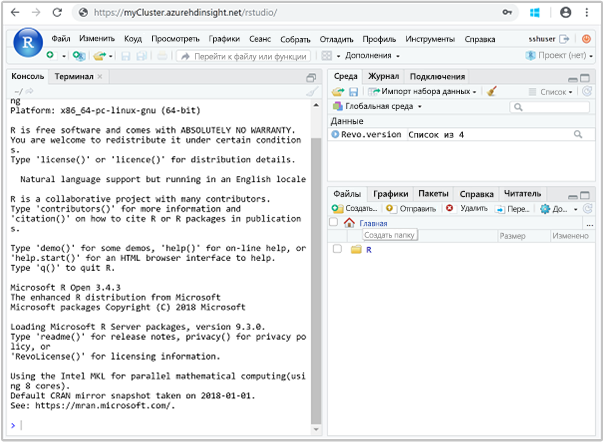

# <a name="quickstart-execute-an-r-script-on-an-ml-services-cluster-in-azure-hdinsight-using-rstudio-server"></a>Краткое руководство. Выполнение сценария R в кластере служб машинного обучения в Azure HDInsight с помощью сервера RStudio

Службы машинного обучения в Azure HDInsight позволяют сценариям R использовать Apache Spark и Apache Hadoop MapReduce для выполнения распределенных вычислений. Службы машинного обучения управляют выполнением вызовов, задавая контекст вычисления. Для подключения к кластеру и выполнения скриптов на языке R удобно использовать граничный узел кластеров. На граничном узле вы можете выполнять распараллеленные распределенные функции RevoScaleR на ядрах сервера граничного узла. Кроме того, вы можете выполнять эти функции на узлах кластера с помощью контекста вычислений Hadoop Map Reduce или Apache Spark RevoScaleR.

В этом кратком руководстве вы узнаете, как запустить сценарий R с помощью сервера RStudio, демонстрирующий использование Apache Spark для распределенных вычислений сценария R. Вы определите контекст вычислений для локального выполнения вычислений на граничном узле, распределенных по узлам в кластере HDInsight.

## <a name="prerequisite"></a>Предварительные требования

Кластер служб машинного обучения в HDInsight. Ознакомьтесь со статьей [Create Linux-based clusters in HDInsight by using the Azure portal](../hdinsight-hadoop-create-linux-clusters-portal.md) (Создание кластеров под управлением Linux в HDInsight с помощью портала Azure) и выберите **Службы машинного обучения ML Services** для параметра **Тип кластера**.

## <a name="connect-to-rstudio-server"></a>Подключение к RStudio Server

RStudio Server запускается на граничном узле кластера. Перейдите по следующему URL-адресу, где `CLUSTERNAME` является именем созданного кластера службы машинного обучения:

```
https://CLUSTERNAME.azurehdinsight.net/rstudio/
```

При первом входе понадобится пройти аутентификацию дважды. При первом запросе на аутентификацию укажите имя пользователя и пароль администратора кластера. Значением по умолчанию является `admin`. При втором запросе на аутентификацию укажите имя пользователя и пароль SSH. Значением по умолчанию является `sshuser`. При последующих операциях входа вам будет необходимо указывать лишь данные для входа SSH.

После подключения ваш экран будет похож на этот снимок экрана:



## <a name="use-a-compute-context"></a>Использование контекста вычислений

1. На сервере RStudio используйте следующий код для загрузки образца данных в хранилище HDInsight, установленное по умолчанию.

    ```RStudio
    # Set the HDFS (WASB) location of example data
     bigDataDirRoot <- "/example/data"
    
     # create a local folder for storing data temporarily
     source <- "/tmp/AirOnTimeCSV2012"
     dir.create(source)
    
     # Download data to the tmp folder
     remoteDir <- "https://packages.revolutionanalytics.com/datasets/AirOnTimeCSV2012"
     download.file(file.path(remoteDir, "airOT201201.csv"), file.path(source, "airOT201201.csv"))
     download.file(file.path(remoteDir, "airOT201202.csv"), file.path(source, "airOT201202.csv"))
     download.file(file.path(remoteDir, "airOT201203.csv"), file.path(source, "airOT201203.csv"))
     download.file(file.path(remoteDir, "airOT201204.csv"), file.path(source, "airOT201204.csv"))
     download.file(file.path(remoteDir, "airOT201205.csv"), file.path(source, "airOT201205.csv"))
     download.file(file.path(remoteDir, "airOT201206.csv"), file.path(source, "airOT201206.csv"))
     download.file(file.path(remoteDir, "airOT201207.csv"), file.path(source, "airOT201207.csv"))
     download.file(file.path(remoteDir, "airOT201208.csv"), file.path(source, "airOT201208.csv"))
     download.file(file.path(remoteDir, "airOT201209.csv"), file.path(source, "airOT201209.csv"))
     download.file(file.path(remoteDir, "airOT201210.csv"), file.path(source, "airOT201210.csv"))
     download.file(file.path(remoteDir, "airOT201211.csv"), file.path(source, "airOT201211.csv"))
     download.file(file.path(remoteDir, "airOT201212.csv"), file.path(source, "airOT201212.csv"))
    
     # Set directory in bigDataDirRoot to load the data into
     inputDir <- file.path(bigDataDirRoot,"AirOnTimeCSV2012")
    
     # Make the directory
     rxHadoopMakeDir(inputDir)
    
     # Copy the data from source to input
     rxHadoopCopyFromLocal(source, bigDataDirRoot)
    ```

    Выполнение этого шага займет около 8 минут.

1. Создайте сведения о данных и определите два источника данных. Введите приведенный ниже код в RStudio:

    ```RStudio
    # Define the HDFS (WASB) file system
     hdfsFS <- RxHdfsFileSystem()
    
     # Create info list for the airline data
     airlineColInfo <- list(
          DAY_OF_WEEK = list(type = "factor"),
          ORIGIN = list(type = "factor"),
          DEST = list(type = "factor"),
          DEP_TIME = list(type = "integer"),
          ARR_DEL15 = list(type = "logical"))
    
     # get all the column names
     varNames <- names(airlineColInfo)
    
     # Define the text data source in hdfs
     airOnTimeData <- RxTextData(inputDir, colInfo = airlineColInfo, varsToKeep = varNames, fileSystem = hdfsFS)
    
     # Define the text data source in local system
     airOnTimeDataLocal <- RxTextData(source, colInfo = airlineColInfo, varsToKeep = varNames)
    
     # formula to use
     formula = "ARR_DEL15 ~ ORIGIN + DAY_OF_WEEK + DEP_TIME + DEST"
    ```

1. Выполните логистическую регрессию данных с помощью **локального** контекста вычислений. Введите приведенный ниже код в RStudio:

    ```RStudio
    # Set a local compute context
     rxSetComputeContext("local")
    
     # Run a logistic regression
     system.time(
        modelLocal <- rxLogit(formula, data = airOnTimeDataLocal)
     )
    
     # Display a summary
     summary(modelLocal)
    ```

    Выполнение этих вычислений должно занять около 7 минут. В результате вы должны получить строки, аналогичные приведенному ниже фрагменту кода:

    ```output
    Data: airOnTimeDataLocal (RxTextData Data Source)
     File name: /tmp/AirOnTimeCSV2012
     Dependent variable(s): ARR_DEL15
     Total independent variables: 634 (Including number dropped: 3)
     Number of valid observations: 6005381
     Number of missing observations: 91381
     -2*LogLikelihood: 5143814.1504 (Residual deviance on 6004750 degrees of freedom)
    
     Coefficients:
                      Estimate Std. Error z value Pr(>|z|)
      (Intercept)   -3.370e+00  1.051e+00  -3.208  0.00134 **
      ORIGIN=JFK     4.549e-01  7.915e-01   0.575  0.56548
      ORIGIN=LAX     5.265e-01  7.915e-01   0.665  0.50590
      ......
      DEST=SHD       5.975e-01  9.371e-01   0.638  0.52377
      DEST=TTN       4.563e-01  9.520e-01   0.479  0.63172
      DEST=LAR      -1.270e+00  7.575e-01  -1.676  0.09364 .
      DEST=BPT         Dropped    Dropped Dropped  Dropped
    
      ---
    
      Signif. codes:  0 ‘***’ 0.001 ‘**’ 0.01 ‘*’ 0.05 ‘.’ 0.1 ‘ ’ 1
    
      Condition number of final variance-covariance matrix: 11904202
      Number of iterations: 7
    ```

1. Теперь примените ту же логистическую регрессию в контексте **Spark**. Контекст Spark распределит обработку между всеми рабочими узлами в кластере HDInsight. Введите приведенный ниже код в RStudio:

    ```RStudio
    # Define the Spark compute context
     mySparkCluster <- RxSpark()
    
     # Set the compute context
     rxSetComputeContext(mySparkCluster)
    
     # Run a logistic regression
     system.time(  
        modelSpark <- rxLogit(formula, data = airOnTimeData)
     )
    
     # Display a summary
     summary(modelSpark)
    ```

    Выполнение этих вычислений должно занять около 5 минут.

## <a name="clean-up-resources"></a>Очистка ресурсов

После завершения работы с этим кратким руководством кластер можно удалить. В случае с HDInsight ваши данные хранятся в службе хранилища Azure, что позволяет безопасно удалить неиспользуемый кластер. Плата за кластеры HDInsight взимается, даже когда они не используются. Поскольку стоимость кластера во много раз превышает стоимость хранилища, экономически целесообразно удалять неиспользуемые кластеры.

Инструкции по удалению кластера см. в статье [Delete an HDInsight cluster using your browser, PowerShell, or the Azure CLI](../hdinsight-delete-cluster.md) (Удаление кластера HDInsight с помощью браузера, PowerShell или Azure CLI).

## <a name="next-steps"></a>Дополнительная информация

В этом кратком руководстве вы узнали, как запустить сценарий R с помощью сервера RStudio, демонстрирующий использование Apache Spark для распределенных вычислений сценария R.  Ознакомьтесь со следующей статьей, содержащей сведения о параметрах, которые доступны для указания необходимости и способа выполнения параллелизации между ядрами граничного узла или кластера HDInsight.

> [!div class="nextstepaction"]
>[Варианты контекста вычислений для Служб машинного обучения в HDInsight](./r-server-compute-contexts.md)

> [!NOTE]
> На этой странице описаны функции программы RStudio. Служба Microsoft Azure HDInsight никак не связана с RStudio, Inc.
