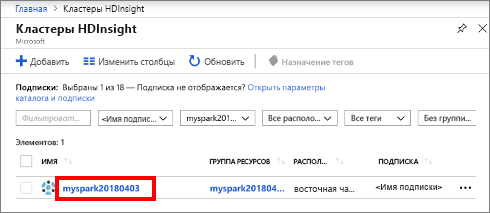
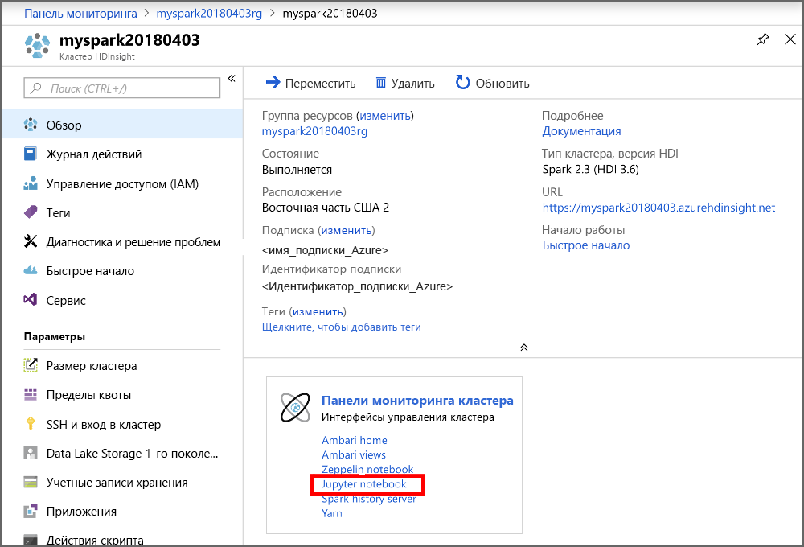
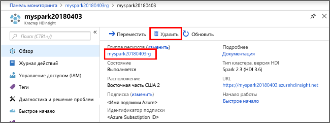

# <a name="quickstart-create-apache-spark-cluster-in-azure-hdinsight-using-powershell"></a>Краткое руководство. Создание кластера Apache Spark в Azure HDInsight с помощью PowerShell

Узнайте, как создать кластер [Apache Spark](https://spark.apache.org/) в Azure HDInsight и как выполнять SQL-запросы Spark к таблицам [Apache Hive](https://hive.apache.org/). Apache Spark обеспечивает быстрый анализ данных и кластерные вычисления, используя обработку в памяти. Сведения о Spark в HDInsight см. в статье [ Apache Spark в Azure HDInsight](apache-spark-overview.md).

В этом кратком руководстве для создания кластера Spark в HDInsight используется Azure PowerShell. Этот кластер использует Azure Storage Blob в качестве системы хранения данных кластера. Дополнительные сведения об использовании Data Lake Storage 2-го поколения см. в [кратком руководстве по настройке кластеров в HDInsight](../../storage/data-lake-storage/quickstart-create-connect-hdi-cluster.md).

> [!IMPORTANT]  
> Счета за кластеры HDInsight выставляются пропорционально за минуту независимо от их использования. Обязательно удалите кластер, когда завершите его использование. Дополнительные сведения см. в разделе [Очистка ресурсов](#clean-up-resources) этой статьи.

Если у вас еще нет подписки Azure, [создайте бесплатную учетную запись Azure](https://azure.microsoft.com/free/?WT.mc_id=A261C142F), прежде чем начинать работу.

## <a name="prerequisite"></a>Предварительные требования

[!INCLUDE [updated-for-az](../../../includes/updated-for-az.md)]

Установите [модуль Az](https://docs.microsoft.com/powershell/azure/overview) для PowerShell.

## <a name="create-an-hdinsight-spark-cluster"></a>Создание кластера HDInsight Spark

Создание кластера HDInsight включает в себя создание следующих объектов и ресурсов Azure.

- Группа ресурсов Azure. Группа ресурсов Azure — это контейнер для ресурсов Azure.
- Учетная запись хранения Azure или Azure Data Lake Storage.  Каждому кластеру HDInsight требуется зависимое хранилище данных. В этом кратком руководстве вы создадите учетную запись хранения.
- Кластер HDInsight другого типа.  В этом кратком руководстве вы создадите кластер Spark 2.3.

Для создания ресурсов используется сценарий PowerShell.  При запуске этого сценария вам будет предложено ввести следующие значения.

|Параметр|Значение|
|------|------|
|Имя группы ресурсов Azure | Укажите уникальное имя группы ресурсов.|
|Location| Укажите регион Azure, например "Центральная часть США". |
|Имя учетной записи хранения по умолчанию | Предоставьте уникальное имя учетной записи хранения. |
|Имя кластера | Укажите уникальное имя кластера Spark в HDInsight.|
|Учетные данные для входа в кластер | Используйте эту учетную запись для подключения к панели мониторинга кластера позже в данном кратком руководстве.|
|Учетные данные пользователя SSH | Можно использовать клиенты SSH для создания удаленного сеанса командной строки с кластерами HDInsight.|

1. Выберите **Попробовать** в правом верхнем углу следующего блока кода, чтобы открыть [Azure Cloud Shell](../../cloud-shell/overview.md), и следуйте отображающимся инструкциям, чтобы подключиться к Azure.

2. Скопируйте приведенный ниже сценарий PowerShell и вставьте его в Cloud Shell.

    ```azurepowershell-interactive
    ### Create a Spark 2.3 cluster in Azure HDInsight

    # Default cluster size (# of worker nodes), version, and type
    $clusterSizeInNodes = "1"
    $clusterVersion = "3.6"
    $clusterType = "Spark"

    # Create the resource group
    $resourceGroupName = Read-Host -Prompt "Enter the resource group name"
    $location = Read-Host -Prompt "Enter the Azure region to create resources in, such as 'Central US'"
    $defaultStorageAccountName = Read-Host -Prompt "Enter the default storage account name"

    New-AzResourceGroup -Name $resourceGroupName -Location $location

    # Create an Azure storage account and container
    # Note: Storage account kind BlobStorage can only be used as secondary storage for HDInsight clusters.
    New-AzStorageAccount `
        -ResourceGroupName $resourceGroupName `
        -Name $defaultStorageAccountName `
        -Location $location `
        -SkuName Standard_LRS `
        -Kind StorageV2 `
        -EnableHttpsTrafficOnly 1

    $defaultStorageAccountKey = (Get-AzStorageAccountKey `
                                    -ResourceGroupName $resourceGroupName `
                                    -Name $defaultStorageAccountName)[0].Value

    $defaultStorageContext = New-AzStorageContext `
                                    -StorageAccountName $defaultStorageAccountName `
                                    -StorageAccountKey $defaultStorageAccountKey

    # Create a Spark 2.3 cluster
    $clusterName = Read-Host -Prompt "Enter the name of the HDInsight cluster"

    # Cluster login is used to secure HTTPS services hosted on the cluster
    $httpCredential = Get-Credential -Message "Enter Cluster login credentials" -UserName "admin"

    # SSH user is used to remotely connect to the cluster using SSH clients
    $sshCredentials = Get-Credential -Message "Enter SSH user credentials" -UserName "sshuser"

    # Set the storage container name to the cluster name
    $defaultBlobContainerName = $clusterName

    # Create a blob container. This holds the default data store for the cluster.
    New-AzStorageContainer `
        -Name $clusterName `
        -Context $defaultStorageContext

    $sparkConfig = New-Object "System.Collections.Generic.Dictionary``2[System.String,System.String]"
    $sparkConfig.Add("spark", "2.3")

    # Create the HDInsight cluster
    New-AzHDInsightCluster `
        -ResourceGroupName $resourceGroupName `
        -ClusterName $clusterName `
        -Location $location `
        -ClusterSizeInNodes $clusterSizeInNodes `
        -ClusterType $clusterType `
        -OSType "Linux" `
        -Version $clusterVersion `
        -ComponentVersion $sparkConfig `
        -HttpCredential $httpCredential `
        -DefaultStorageAccountName "$defaultStorageAccountName.blob.core.windows.net" `
        -DefaultStorageAccountKey $defaultStorageAccountKey `
        -DefaultStorageContainer $clusterName `
        -SshCredential $sshCredentials

    Get-AzHDInsightCluster `
        -ResourceGroupName $resourceGroupName `
        -ClusterName $clusterName
    ```

   Процесс создания кластеров занимает около 20 минут. Прежде чем перейти к следующему сеансу, вы должны создать кластер.

Если при создании кластера HDInsight возникают проблемы, возможно, у вас нет необходимых разрешений. Дополнительные сведения см. в разделе [Требования к контролю доступа](../hdinsight-hadoop-customize-cluster-linux.md#access-control).

## <a name="create-a-jupyter-notebook"></a>Создание записной книжки Jupyter

[Jupyter Notebook](https://jupyter.org/) — это интерактивная среда записных книжек, которая поддерживает различные языки программирования. Notebook позволяет работать с данными, объединять код с текстом Markdown и выполнять простые визуализации.

1. Откройте [портал Azure](https://portal.azure.com).

1. Выберите **Кластеры HDInsight**, а затем выберите созданный кластер.

    

1. На портале щелкните **Панели мониторинга кластера**, а затем — **Записная книжка Jupyter**. При появлении запроса введите учетные данные для входа в кластер.

   

1. Щелкните **Создать** > **PySpark**, чтобы создать элемент Notebook.

   

   Будет создана и открыта записная книжка с именем Untitled (Untitled.pynb).

## <a name="run-spark-sql-statements"></a>Выполнение инструкций SQL Spark

SQL — это наиболее распространенный и широко используемый язык для создания запросов и определения данных. Spark SQL работает как расширение Apache Spark для обработки структурированных данных с использованием знакомого синтаксиса SQL.

1. Убедитесь, что ядро готово. Ядро будет готово, когда в записной книжке появится пустой круг рядом с именем ядра. Заполненный круг означает, что ядро занято.

    

    При первом запуске записной книжки некоторые задачи ядро выполняет в фоновом режиме. Дождитесь готовности ядра. 
1. Вставьте указанный ниже код в пустую ячейку и нажмите сочетание клавиш **SHIFT + ВВОД**, чтобы выполнить код. Эта команда выводит список таблиц Hive в кластере:

    ```PySpark
    %%sql
    SHOW TABLES
    ```

    При использовании записной книжки Jupyter с кластером HDInsight Spark вы получаете предустановку `sqlContext`, которую можно применять для выполнения запросов Hive с помощью Spark SQL. `%%sql` указывает записной книжке Jupyter использовать предустановку `sqlContext` для выполнения запроса Hive. Запрос извлекает первые 10 строк из таблицы Hive (**hivesampletable**), которая по умолчанию входит в состав всех кластеров HDInsight. Для получения результатов может понадобиться около 30 секунд. Он возвращает примерно такие выходные данные:

    

    При каждом выполнении запроса в Jupyter в заголовке окна веб-браузера будет отображаться состояние **(Занято)** , а также название записной книжки. Кроме того, рядом с надписью **PySpark** в верхнем правом углу окна будет показан закрашенный кружок.

1. Выполните другой запрос, чтобы вывести данные из таблицы `hivesampletable`.

    ```PySpark
    %%sql
    SELECT * FROM hivesampletable LIMIT 10
    ```

    Экран обновится, и отобразятся выходные данные запроса.

    

1. Для этого в меню **File** (Файл) элемента Notebook выберите **Close and Halt** (Закрыть и остановить). При завершении работы записной книжки освобождаются кластерные ресурсы.

## <a name="clean-up-resources"></a>Очистка ресурсов

HDInsight сохраняет ваши данные в службе хранилища Azure или Azure Data Lake Storage, что позволяет безопасно удалить неиспользуемый кластер. Плата за кластеры HDInsight взимается, даже когда они не используются. Поскольку стоимость кластера во много раз превышает стоимость хранилища, экономически целесообразно удалять неиспользуемые кластеры. Если вы планируете сразу приступить руководству, указанному в разделе [Дальнейшие действия](#next-steps), то можете оставить кластер.

Вернитесь на портал Azure и выберите **Удалить**.



Кроме того, можно выбрать имя группы ресурсов, чтобы открыть страницу группы ресурсов, а затем щелкнуть **Удалить группу ресурсов**. Вместе с группой ресурсов вы также удалите кластер Spark в HDInsight и учетную запись хранения по умолчанию.

### <a name="piecemeal-clean-up-with-powershell-az-module"></a>Поэтапная очистка с помощью модуля Az для PowerShell

```powershell
# Removes the specified HDInsight cluster from the current subscription.
Remove-AzHDInsightCluster `
    -ResourceGroupName $resourceGroupName `
    -ClusterName $clusterName

# Removes the specified storage container.
Remove-AzStorageContainer `
    -Name $clusterName `
    -Context $defaultStorageContext

# Removes a Storage account from Azure.
Remove-AzStorageAccount `
    -ResourceGroupName $resourceGroupName `
    -Name $defaultStorageAccountName

# Removes a resource group.
Remove-AzResourceGroup `
    -Name $resourceGroupName
```

## <a name="next-steps"></a>Дополнительная информация

В этом кратком руководстве вы узнали, как создать кластер Spark в HDInsight и выполнить базовый SQL-запрос Spark. Из следующего руководства вы узнаете, как с помощью кластера Spark в HDInsight выполнять интерактивные запросы, используя пример данных.

> [!div class="nextstepaction"]
> [Выполнение интерактивных запросов в Apache Spark](./apache-spark-load-data-run-query.md)
