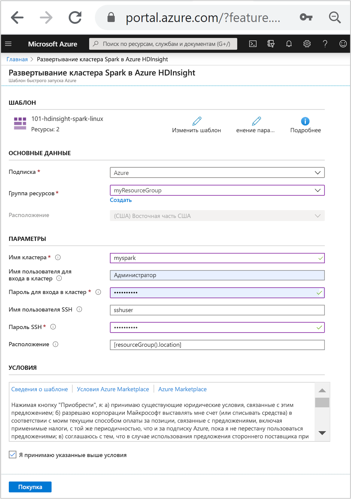

# <a name="quickstart-create-apache-spark-cluster-in-azure-hdinsight-using-arm-template"></a>Краткое руководство. Создание кластера Apache Spark в Azure HDInsight с помощью шаблона ARM

Из этого краткого руководства вы узнаете, как с помощью шаблона Azure Resource Manager (шаблон ARM) создать кластер [Apache Spark](./apache-spark-overview.md) в Azure HDInsight. Затем вы создадите файл Jupyter Notebook и с его помощью выполним SQL-запрос Spark к таблицам Apache Hive. Azure HDInsight — это управляемая комплексная служба аналитики с открытым кодом, предназначенная для предприятий. Платформа Apache Spark для HDInsight обеспечивает быструю аналитику данных и кластерные вычисления, используя обработку в памяти. Jupyter Notebook позволяет работать с данными, объединять код с текстом Markdown и выполнять простые визуализации.

Если вы используете несколько кластеров вместе, вам нужно создать виртуальную сеть. Если же вы используете кластер Spark, вы также можете использовать Hive Warehouse Connector. См. сведения о [планировании виртуальной сети для Azure HDInsight](../hdinsight-plan-virtual-network-deployment.md) и [интеграции Apache Spark и Apache Hive с Hive Warehouse Connector](../interactive-query/apache-hive-warehouse-connector.md).

[!INCLUDE [About Azure Resource Manager](../../../includes/resource-manager-quickstart-introduction.md)]

Если среда соответствует предварительным требованиям и вы знакомы с использованием шаблонов ARM, нажмите кнопку **Развертывание в Azure**. Шаблон откроется на портале Azure.

[](https://portal.azure.com/#create/Microsoft.Template/uri/https%3A%2F%2Fraw.githubusercontent.com%2FAzure%2Fazure-quickstart-templates%2Fmaster%2F101-hdinsight-spark-linux%2Fazuredeploy.json)

## <a name="prerequisites"></a>Предварительные требования

Если у вас еще нет подписки Azure, [создайте бесплатную учетную запись](https://azure.microsoft.com/free/?WT.mc_id=A261C142F), прежде чем начинать работу.

## <a name="review-the-template"></a>Изучение шаблона

Шаблон, используемый в этом кратком руководстве, взят из [шаблонов быстрого запуска Azure](https://azure.microsoft.com/resources/templates/101-hdinsight-spark-linux).

:::code language="json" source="~/quickstart-templates/101-hdinsight-spark-linux/azuredeploy.json":::

В шаблоне определено два ресурса Azure:

* С помощью [Microsoft.Storage/storageAccounts](/azure/templates/microsoft.storage/storageaccounts) создается учетная запись хранения Azure.
* С помощью [Microsoft.HDInsight/cluster](/azure/templates/microsoft.hdinsight/clusters) создается кластер HDInsight.

## <a name="deploy-the-template"></a>Развертывание шаблона

1. Нажмите кнопку **Развертывание в Azure** ниже, чтобы войти в Azure и открыть шаблон ARM.

    [](https://portal.azure.com/#create/Microsoft.Template/uri/https%3A%2F%2Fraw.githubusercontent.com%2FAzure%2Fazure-quickstart-templates%2Fmaster%2F101-hdinsight-spark-linux%2Fazuredeploy.json)

1. Введите или выберите следующие значения:

    |Свойство |Описание |
    |---|---|
    |Подписка|В раскрывающемся списке выберите подписку Azure, которая используется для кластера.|
    |Группа ресурсов|В раскрывающемся списке выберите существующую группу ресурсов, а затем **Создать новую**.|
    |Расположение|В качестве значения будет автоматически указано расположение, используемое для группы ресурсов.|
    |Имя кластера,|Введите глобально уникальное имя Для этого шаблона вы можете использовать только строчные буквы и цифры.|
    |Имя пользователя для входа в кластер|Укажите имя пользователя, по умолчанию — **admin**.|
    |Пароль для входа в кластер|Введите пароль. Длина пароля должна составлять не менее 10 символов. Пароль должен содержать по меньшей мере одну цифру, одну прописную и одну строчную буквы, а также один специальный символ (кроме ' " ` ). |
    |Имя пользователя SSH|Укажите имя пользователя, по умолчанию — **sshuser**.|
    |Пароль SSH|Укажите пароль.|

    

1. Ознакомьтесь с **условиями использования**. Затем установите флажок **Я принимаю указанные выше условия** и нажмите кнопку **Приобрести**. Вы получите уведомление о выполнении развертывания. Процесс создания кластера занимает около 20 минут.

Если при создании кластера HDInsight возникают проблемы, возможно, у вас нет необходимых разрешений. Дополнительные сведения см. в разделе [Требования к контролю доступа](../hdinsight-hadoop-customize-cluster-linux.md#access-control).

## <a name="review-deployed-resources"></a>Просмотр развернутых ресурсов

После создания кластера вы получите уведомление **Развертывание прошло успешно** со ссылкой **Перейти к ресурсу**. На странице группы ресурсов будет указан новый кластер HDInsight и хранилище по умолчанию, связанное с кластером. У каждого кластера есть зависимость учетной записи [службы хранилища Azure](../hdinsight-hadoop-use-blob-storage.md), [Azure Data Lake Storage 1-го поколения](../hdinsight-hadoop-use-data-lake-storage-gen1.md) или [`Azure Data Lake Storage Gen2`](../hdinsight-hadoop-use-data-lake-storage-gen2.md). Она называется учетной записью хранения по умолчанию. Кластер HDInsight должен находиться в том же регионе Azure, что и его учетная запись хранения, используемая по умолчанию. Удаление кластеров не приведет к удалению зависимости учетной записи хранения. Она называется учетной записью хранения по умолчанию. Кластер HDInsight должен находиться в том же регионе Azure, что и его учетная запись хранения, используемая по умолчанию. Удаление кластеров не приведет к удалению учетной записи хранения.

## <a name="create-a-jupyter-notebook-file"></a>Создание файла Jupyter Notebook

[Jupyter Notebook](https://jupyter.org/) — это интерактивная среда записных книжек, которая поддерживает различные языки программирования. Вы можете использовать Jupyter Notebook, чтобы работать с данными, объединять код с текстом Markdown и выполнять простые визуализации.

1. Откройте [портал Azure](https://portal.azure.com).

2. Выберите **Кластеры HDInsight**, а затем выберите созданный кластер.

    

3. На портале в разделе **Панели мониторинга кластера** выберите **Jupyter Notebook**. При появлении запроса введите учетные данные для входа в кластер.

   

4. Щелкните **Создать** > **PySpark**, чтобы создать элемент Notebook.

   

   Будет создана и открыта записная книжка с именем Untitled (Untitled.pynb).

## <a name="run-apache-spark-sql-statements"></a>Выполнение инструкций SQL в Apache Spark

SQL (Structured Query Language) — наиболее распространенный и широко используемый язык для создания запросов и преобразования данных. Spark SQL работает как расширение Apache Spark для обработки структурированных данных с использованием знакомого синтаксиса SQL.

1. Убедитесь, что ядро готово. Ядро будет готово, когда в записной книжке появится пустой круг рядом с именем ядра. Заполненный круг означает, что ядро занято.

    

    При первом запуске записной книжки некоторые задачи ядро выполняет в фоновом режиме. Дождитесь готовности ядра.

1. Вставьте указанный ниже код в пустую ячейку и нажмите сочетание клавиш **SHIFT + ВВОД**, чтобы выполнить код. Эта команда выводит список таблиц Hive в кластере:

    ```sql
    %%sql
    SHOW TABLES
    ```

    При использовании файла Jupyter Notebook с кластером HDInsight вы получаете предварительно настроенный сеанс `spark`, в котором можно выполнять запросы Hive с помощью Spark SQL. По `%%sql` Jupyter Notebook понимает, что для выполнения запроса Hive нужно использовать сеанс `spark`. Запрос извлекает первые 10 строк из таблицы Hive (**hivesampletable**), которая по умолчанию входит в состав всех кластеров HDInsight. Когда вы отправите первый запрос, Jupyter создаст для записной книжки приложение Spark. Это займет около 30 секунд. После создания приложения Spark запрос выполняется в течение секунды и возвращает результаты. Он возвращает примерно такие выходные данные:

    

    При каждом выполнении запроса в Jupyter в заголовке окна веб-браузера будет отображаться состояние **(Занято)** , а также название записной книжки. Кроме того, рядом с надписью **PySpark** в верхнем правом углу окна будет показан закрашенный кружок.

1. Выполните другой запрос, чтобы вывести данные из таблицы `hivesampletable`.

    ```sql
    %%sql
    SELECT * FROM hivesampletable LIMIT 10
    ```

    Экран обновится, и отобразятся выходные данные запроса.

    

1. Для этого в меню **File** (Файл) элемента Notebook выберите **Close and Halt** (Закрыть и остановить). При завершении работы записной книжки ресурсы кластера освобождаются (включая приложение Spark).

## <a name="clean-up-resources"></a>Очистка ресурсов

После завершения работы с этим кратким руководством кластер можно удалить. В случае с HDInsight ваши данные хранятся в службе хранилища Azure, что позволяет безопасно удалить неиспользуемый кластер. Плата за кластеры HDInsight взимается, даже когда они не используются. Так как затраты на кластер во много раз превышают затраты на хранилище, экономически целесообразно удалять неиспользуемые кластеры.

На портале Azure перейдите в свой кластер и выберите **Удалить**.


Кроме того, можно выбрать имя группы ресурсов, чтобы открыть страницу группы ресурсов, а затем щелкнуть **Удалить группу ресурсов**. Вместе с группой ресурсов вы также удалите кластер HDInsight и учетную запись хранения по умолчанию.

## <a name="next-steps"></a>Дальнейшие действия

Из этого краткого руководства вы узнали, как создать кластер Apache Spark в HDInsight и выполнить простой SQL-запрос Spark. Из следующего руководства вы узнаете, как с помощью кластера HDInsight выполнять интерактивные запросы, используя для этого пример данных.

> [!div class="nextstepaction"]
> [Выполнение интерактивных запросов в Apache Spark](./apache-spark-load-data-run-query.md)
