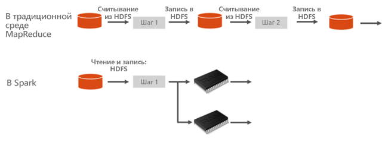
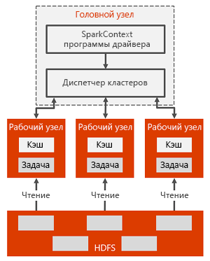

# Apache Spark в Azure HDInsight

Apache Spark — это платформа параллельной обработки, которая поддерживает обработку в памяти, чтобы повысить производительность приложений для анализа больших данных. Apache Spark в Azure HDInsight — это реализация Apache Spark в облаке, предоставляемая корпорацией Майкрософт. HDInsight упрощает создание и настройку кластера Spark в Azure. Кластеры Spark в HDInsight совместимы с [Хранилищем BLOB-объектов Azure](../../storage/common/storage-introduction.md), [Azure Data Lake Storage 1-го поколения](../../data-lake-store/data-lake-store-overview.md) или [Azure Data Lake Storage 2-го поколения](../../storage/blobs/data-lake-storage-introduction.md). Поэтому эти кластеры можно использовать для обработки данных, хранящихся в Azure. Дополнительные сведения о компонентах и версиях см. в статье [Что представляют собой компоненты и версии Apache Hadoop, доступные в HDInsight](../hdinsight-component-versioning.md).

## Что такое Apache Spark?

Spark предоставляет примитивы для кластерных вычислений в памяти. Задание Spark может загрузить данные, поместить их в кэш в памяти и запрашивать их неоднократно. Вычисления в памяти выполняются намного быстрее, чем в приложениях, использующих диски, таких как приложение Hadoop, которое предоставляет доступ к данным через распределенную файловую систему Hadoop (HDFS). Spark также интегрируется в язык программирования Scala, что дает возможность управлять распределенными наборами данных, такими как локальные коллекции. Нет необходимости структурировать обмен данными как операции сопоставления и редукции.

Кластеры Spark в HDInsight предлагают полностью управляемую службу Spark. Ниже приведены преимущества создания кластера Spark в HDInsight.

| Компонент | Описание |
| --- | --- |
| Простота создания |Создание кластера Spark в HDInsight с помощью портала Azure, Azure PowerShell или пакета SDK для HDInsight .NET занимает всего несколько минут. См. инструкции по [началу работы с кластером Apache Spark в HDInsight](apache-spark-jupyter-spark-sql-use-portal.md). |
| Простота использования |Кластер Spark в HDInsight включает записные книжки Jupyter Notebook и Apache Zeppelin Notebook. Их можно использовать для интерактивной обработки и визуализации данных. См. статью [Use Apache Zeppelin notebooks with Apache Spark cluster on Azure HDInsight](apache-spark-zeppelin-notebook.md) (Использование записных книжек Apache Zeppelin с кластером Apache Spark в Azure HDInsight) и [Руководство по загрузке данных и выполнению запросов в кластере Apache Spark в Azure HDInsight](apache-spark-load-data-run-query.md).|
| Интерфейсы REST API |Кластеры Spark в HDInsight включают [Apache Livy](https://github.com/cloudera/hue/tree/master/apps/spark/java#welcome-to-livy-the-rest-spark-server), сервер заданий Spark на основе REST API, который позволяет удаленно отправлять и отслеживать задания. См. руководство по [удаленной отправке заданий Spark в кластер Azure HDInsight с помощью Apache Spark REST API](apache-spark-livy-rest-interface.md).|
| Поддержка для службы хранилища Azure | Кластеры Spark в HDInsight могут использовать Azure Data Lake Storage 1-го или 2-го поколения как основное или дополнительное хранилище. Дополнительные сведения об Azure Data Lake Storage 1-го поколения см. в [этой статье](../../data-lake-store/data-lake-store-overview.md). Дополнительные сведения о Data Lake Storage 2-го поколения см. в [этой статье](../../storage/blobs/data-lake-storage-introduction.md).|
| Интеграция со службами Azure |Кластер Spark в HDInsight поставляется с соединителем для Центров событий Azure. Вы можете создавать приложения потоковой передачи с помощью Центров событий. Можно также использовать платформу Apache Kafka, которая уже доступна в составе Spark. |
| Поддержка ML Server | Поддержка ML Server в HDInsight предоставляется в рамках типа кластера **Служб машинного обучения**. В кластере Служб машинного обучения можно настроить выполнение распределенных вычислений в среде R со скоростью, заявленной для кластера Spark. Дополнительные сведения см. в статье [Общие сведения о службах машинного обучения в HDInsight](../r-server/r-server-overview.md). |
| Интеграция со сторонними IDE | HDInsight предоставляет несколько подключаемых модулей IDE, которые можно использовать для создания приложений и их отправки в кластер HDInsight Spark. См. дополнительные сведения об [использовании Azure Toolkit for IntelliJ (IDEA)](apache-spark-intellij-tool-plugin.md), [использовании средств Spark и Hive для VSCode](../hdinsight-for-vscode.md) и [использовании Azure Toolkit for Eclipse](apache-spark-eclipse-tool-plugin.md).|
| Параллельные запросы |Кластеры Spark в HDInsight поддерживают параллельные запросы. Благодаря этому несколько запросов от одного пользователя или несколько запросов от разных пользователей и из различных приложений могут использовать одни и те же ресурсы кластера. |
| Кэширование на накопители SSD |Можно выбрать кэширование данных в памяти или на накопители SSD, подключенные к узлам кластера. Кэширование в память обеспечивает наилучшую производительность запросов, однако может оказаться ресурсоемким. Кэширование на накопители SSD предоставляет возможность повысить производительность запросов без необходимости создания кластера такого размера, который необходим для размещения всего набора данных в памяти. См. [Improve performance of Apache Spark workloads using Azure HDInsight IO Cache](apache-spark-improve-performance-iocache.md) (Повышение производительности рабочих нагрузок Apache Spark с помощью службы IO Cache для Azure HDInsight) |
| Интеграция со средствами бизнес-аналитики |В состав кластеров Spark для HDInsight входят соединители для инструментов бизнес-аналитики, таких как Power BI для аналитики данных. |
| Предварительно загруженные библиотеки Anaconda |Кластеры Spark в HDInsight поставляются с предустановленными библиотеками Anaconda. [Anaconda](https://docs.continuum.io/anaconda/) содержит порядка 200 библиотек для машинного обучения, анализа данных, визуализации и т. д. |
| Адаптируемость | HDInsight позволяет динамически изменять число узлов кластера с помощью функции "Автомасштабирование". См. [Automatically scale Azure HDInsight clusters](../hdinsight-autoscale-clusters.md) (Автоматическое масштабирование кластеров Azure HDInsight). Кроме того, кластеры Spark можно удалить без потери данных, так как все данные хранятся в Хранилище BLOB-объектов Azure, [Azure Data Lake Storage 1-го поколения](../../data-lake-store/data-lake-store-overview.md) или [Azure Data Lake Storage 2-го поколения](../../storage/blobs/data-lake-storage-introduction.md). |
| Соглашение об уровне обслуживания |Для кластеров Spark в HDInsight предоставляется круглосуточная и ежедневная поддержка и соглашения об уровне обслуживания, гарантирующие время бесперебойной работы на уровне 99,9 %. |

Кластеры Apache Spark в HDInsight включают следующие компоненты, доступные в кластерах по умолчанию.

* [Ядро Spark](https://spark.apache.org/docs/latest/). Включает ядро Spark, Spark SQL, потоковые API-интерфейсы Spark, GraphX и MLlib.
* [Anaconda](https://docs.continuum.io/anaconda/)
* [Apache Livy](https://github.com/cloudera/hue/tree/master/apps/spark/java#welcome-to-livy-the-rest-spark-server)
* [Записная книжка Jupyter](https://jupyter.org)
* [Записная книжка Apache Zeppelin](http://zeppelin-project.org/)

Кластеры Spark в HDInsight включают [драйвер ODBC](/sql/connect/odbc/download-odbc-driver-for-sql-server?view=sql-server-ver15) для подключения из средств бизнес-аналитики, таких как Microsoft Power BI.

## Архитектура кластера Spark

Чтобы разобраться с компонентами Spark, нужно понять принцип работы Spark в кластерах HDInsight.

Приложения Spark выполняются как независимые наборы процессов в кластере. Они координируются объектом SparkContext в основной программе (называемой программой драйвера).

SparkContext может подключаться к нескольким типам диспетчеров кластеров, которые распределяют ресурсы между приложениями. К этим диспетчерам кластеров относятся Apache Mesos, Apache Hadoop YARN и Spark. В HDInsight Spark выполняется с использованием диспетчера кластеров YARN. После подключения Spark получает исполнителей на рабочих узлах кластера. Исполнители представляют собой процессы,которые выполняют вычисления и хранят данные для приложения. Затем Spark отправляет исполнителям код приложения (определенный в JAR- или Python-файлах, переданных в SparkContext). Наконец, SparkContext отправляет исполнителям задачи для выполнения.

SparkContext выполняет основную функцию пользователя и осуществляет различные параллельные операции на рабочих узлах. Затем SparkContext собирает результаты операций. Рабочие узлы считывают данные из распределенной файловой системы Hadoop и записывают их в нее. Кроме того, рабочие узлы помещают преобразованные данные в кэш в памяти как устойчивые распределенные наборы данных (RDD).

SparkContext подключается к главному узлу Spark и отвечает за преобразование приложения в ориентированный граф (направленный ациклический граф, DAG) для отдельных задач. Такие задачи выполняются в рамках процесса исполнителя на рабочих узлах. Каждое приложение получает отдельные процессы исполнителя, которые остаются активными во время выполнения приложения и обрабатывают задачи в нескольких потоках.

## Варианты использования Spark в HDInsight

Ниже представлены сценарии для использования кластеров Spark в HDInsight.

### Интерактивный анализ данных и бизнес-аналитика

Apache Spark в HDInsight хранит данные в Хранилище BLOB-объектов Azure, Azure Data Lake Storage 1-го поколения или Azure Data Lake Storage 2-го поколения. Бизнес-специалисты и ответственные за принятие решений лица могут анализировать такие данные и создавать отчеты на их основе. Им также доступны инструменты Microsoft Power BI для создания интерактивных отчетов на основе проанализированных данных. Аналитики могут использовать неструктурированные или полуструктурированные данные в хранилище кластеров, определить схему для данных с помощью записных книжек, а затем создать модели данных с помощью средств Microsoft Power BI. Кластеры Spark в HDInsight также поддерживают ряд сторонних инструментов бизнес-аналитики, например Tableau, что упрощает работу аналитиков данных, бизнес-специалистов и ответственных за принятие решений лиц.

* [Руководство. Визуализация данных Spark с помощью Power BI](apache-spark-use-bi-tools.md)

### Машинное обучение Spark

В состав Apache Spark входит [MLlib](https://spark.apache.org/mllib/), библиотека машинного обучения, созданная на основе Spark, которую вы можете использовать из кластера Spark в HDInsight. Кластер Spark в HDInsight также включает Anaconda, дистрибутив Python с различными пакетами для машинного обучения. А со встроенной поддержкой записных книжек Jupyter и Zeppelin вы получаете в свое распоряжение среду для создания приложений машинного обучения.

* [Руководство. Прогнозирование температуры в зданиях с помощью данных системы кондиционирования](apache-spark-ipython-notebook-machine-learning.md)  
* [Руководство. Прогнозирование результата проверки продуктов](apache-spark-machine-learning-mllib-ipython.md).

### Потоковая передача и анализ данных в режиме реального времени в Spark

Кластеры Spark в HDInsight обладают широкой поддержкой для создания решений для аналитики в режиме реального времени. Spark уже включает соединители для приема данных из множества источников, таких как Kafka, Flume, Twitter, ZeroMQ или TCP-сокеты. Spark в HDInsight позволяет реализовать первоклассную поддержку для приема данных из Центров событий Azure. Центры событий — это наиболее часто используемые службы очередей в Azure. Полная поддержка Центров событий делает кластеры Spark в HDInsight идеальной платформой для создания конвейеров аналитики в реальном времени.

* [Overview of Apache Spark Streaming](apache-spark-streaming-overview.md) (Общие сведения о потоковой передаче Apache Spark)
* [Overview of Apache Spark Structured Streaming](apache-spark-structured-streaming-overview.md) (Обзор структурированной потоковой передачи Apache Spark)

## Next Steps

В этой обзорной статье вы получили некоторые основные сведения об Apache Spark в Azure HDInsight.  Ознакомьтесь со следующими статьями, чтобы узнать больше об Apache Spark в HDInsight. Вы также можете создать кластер HDInsight Spark и запустить несколько примеров запросов Spark.

* [Краткое руководство. Создание кластера Apache Spark в HDInsight и выполнению интерактивных запросов с помощью Jupyter](./apache-spark-jupyter-spark-sql-use-portal.md)
* [Учебник. Загрузка данных и выполнение запросов в кластере Apache Spark в Azure HDInsight](./apache-spark-load-data-run-query.md)
* [Руководство. Визуализация данных Spark с помощью Power BI](apache-spark-use-bi-tools.md)
* [Руководство. Прогнозирование температуры в зданиях с помощью данных системы кондиционирования](apache-spark-ipython-notebook-machine-learning.md)
* [Оптимизация заданий Spark для повышения производительности](apache-spark-perf.md)