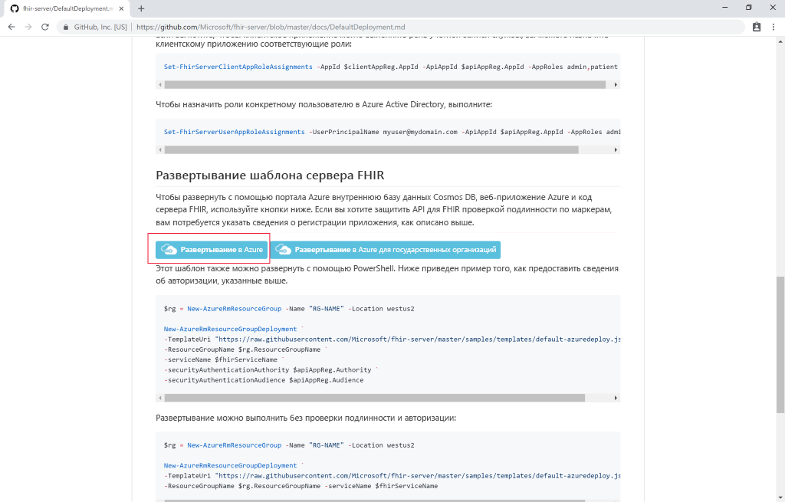
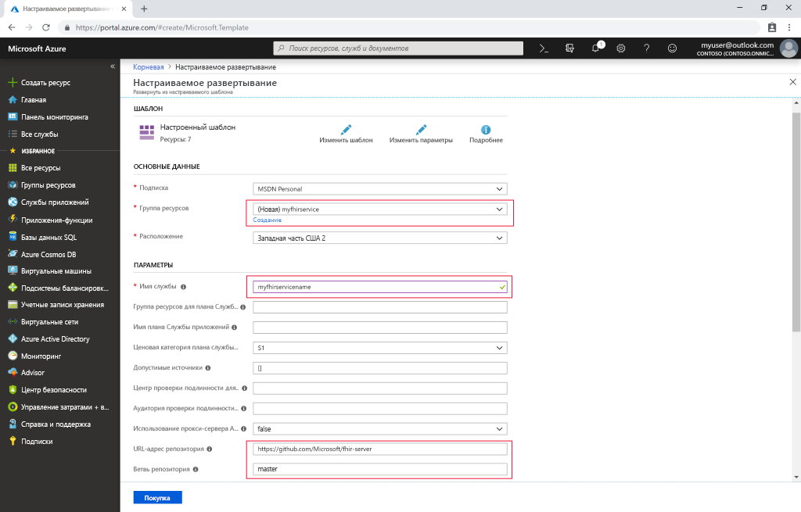

# Краткое руководство. Развертывание сервера FHIR с открытым кодом с помощью портала Azure

В этом кратком руководстве показано, как развернуть сервер FHIR с открытым кодом в Azure с помощью портала Azure. В [репозитории ПО с открытым кодом](https://github.com/Microsoft/fhir-server) будут использоваться простые ссылки для развертывания.

Если у вас еще нет подписки Azure, [создайте бесплатную учетную запись](https://azure.microsoft.com/free/?WT.mc_id=A261C142F), прежде чем начинать работу.

## Репозиторий ПО с открытым кодом на GitHub

Перейдите на [страницу развертывания GitHub](https://github.com/Microsoft/fhir-server/blob/master/docs/DefaultDeployment.md) и найдите кнопки Deploy to Azure (Развернуть в Azure).

>[!div class="mx-imgBorder"]
>

Нажмите кнопку развертывания, после чего откроется портал Azure.

## Укажите параметры развертывания

Создайте новую группу ресурсов и присвойте ей имя. Здесь присутствуют еще два обязательных параметра: имя службы и пароль администратора SQL.

>[!div class="mx-imgBorder"]
>

Введя сведения, можно начать развертывание.

## Проверка работы сервера FHIR

По завершении развертывания можно перейти в браузере по адресу `https://SERVICENAME.azurewebsites.net/metadata`, чтобы получить отчет о возможностях. Первый ответ сервера может поступить через минуту или около того.

## Очистка ресурсов

Если группа ресурсов и связанные с ней ресурсы вам больше не нужны, их можно удалить. Для этого выберите группу ресурсов с подготовленными ресурсами, щелкните **Удалить группу ресурсов**, а затем подтвердите имя удаляемой группы ресурсов.

## Дальнейшие действия

В этом руководстве показано, как развернуть сервер FHIR Майкрософт для Azure с открытым кодом в своей подписке. Чтобы узнать, как получить доступ к API FHIR с помощью Postman, перейдите к руководству по Postman.
 
>[!div class="nextstepaction"]
>[Получение доступа к API FHIR с помощью Postman](access-fhir-postman-tutorial.md)