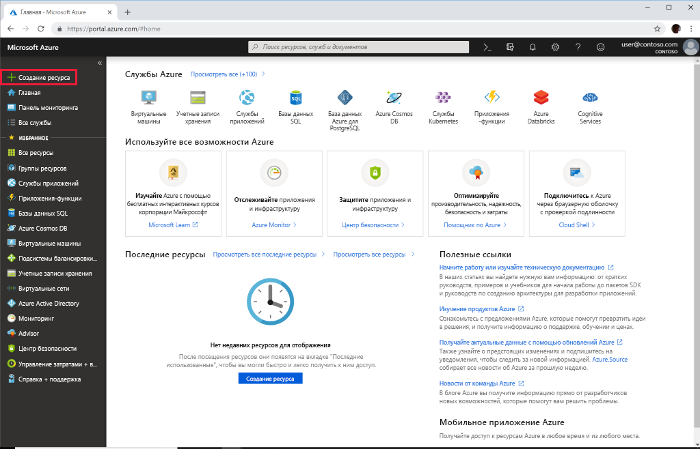

# Краткое руководство. Развертывание Azure API для FHIR с помощью портала Azure

В этом кратком руководстве показано, как развернуть Azure API для FHIR с помощью портала Azure.

Если у вас еще нет подписки Azure, [создайте бесплатную учетную запись](https://azure.microsoft.com/free/?WT.mc_id=A261C142F), прежде чем начинать работу.

## Создание ресурса

Откройте [портал Azure](https://portal.azure.com) и щелкните **Создать ресурс**.

## Поиск Azure API для FHIR

Чтобы найти Azure API для FHIR, введите FHIR в поле поиска:

:::image type="content" source="media/quickstart-paas-portal/portal-search-healthcare-apis.png" alt-text="Поиск интерфейсов API для здравоохранения":::

## Создание учетной записи Azure API для FHIR

Чтобы создать учетную запись Azure API для FHIR, выберите **Создать**.

:::image type="content" source="media/quickstart-paas-portal/portal-create-healthcare-apis.png" alt-text="Создание учетной записи Azure API для FHIR":::

## Ввод данных для учетной записи

Выберите существующую группу ресурсов или создайте новую, выберите имя учетной записи и щелкните **Просмотр и создание** :

:::image type="content" source="media/quickstart-paas-portal/portal-new-healthcareapi-details.png" alt-text="Сведения о новом API для здравоохранения":::

Подтвердите создание и дождитесь, пока завершится развертывание API для FHIR.

## Дополнительные параметры (необязательно)

Вы также можете щелкнуть **Далее: Дополнительные параметры** , чтобы просмотреть параметры аутентификации. Конфигурация по умолчанию для Azure API для FHIR включает [использование Azure RBAC для назначения ролей плоскости данных](configure-azure-rbac.md). При настройке в этом режиме параметру "Центр авторизации" для службы FHIR будет задано значение арендатора Azure Active Directory подписки:

:::image type="content" source="media/rbac/confirm-azure-rbac-mode-create.png" alt-text="Параметры аутентификации по умолчанию":::

Обратите внимание, что поле для ввода допустимых идентификаторов объектов неактивно, так как для настройки назначений ролей в этом случае используется Azure RBAC.

Если вы хотите настроить службу FHIR для использования внешнего или дополнительного арендатора Azure Active Directory, можно изменить центр авторизации и ввести идентификаторы объектов для пользователя и групп, которым должен быть разрешен доступ к серверу. Дополнительные сведения см. в руководстве о [локальной настройке RBAC](configure-local-rbac.md).

## Получение инструкции возможностей API для FHIR

Чтобы убедиться, что подготовлена новая учетная запись API для FHIR, извлеките инструкцию возможностей, открыв в браузере адрес `https://<ACCOUNT-NAME>.azurehealthcareapis.com/metadata`.

## Очистка ресурсов

Если группа ресурсов, Azure API для FHIR и все связанные с ними ресурсы вам больше не требуются, их можно удалить. Для этого выберите группу ресурсов с учетной записью Azure API для FHIR, выберите **Удалить группу ресурсов** , а затем подтвердите имя удаляемой группы ресурсов.

## Дальнейшие действия

В этом кратком руководстве показано, как развернуть Azure API для FHIR в своей подписке. Чтобы задать дополнительные параметры в Azure API для FHIR, см. соответствующее руководство. Если вы уже готовы к использованию Azure API для FHIR, ознакомьтесь с процессом регистрации приложений.

>[!div class="nextstepaction"]
>[Дополнительные параметры в Azure API для FHIR](azure-api-for-fhir-additional-settings.md)

>[!div class="nextstepaction"]
>[Общие сведения о регистрации приложений](fhir-app-registration.md)
