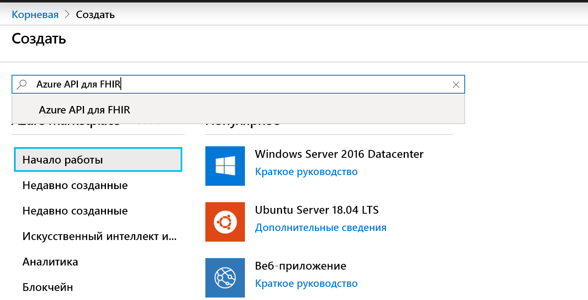
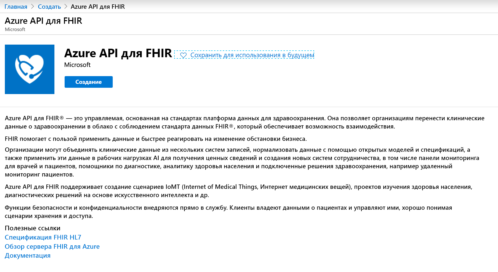
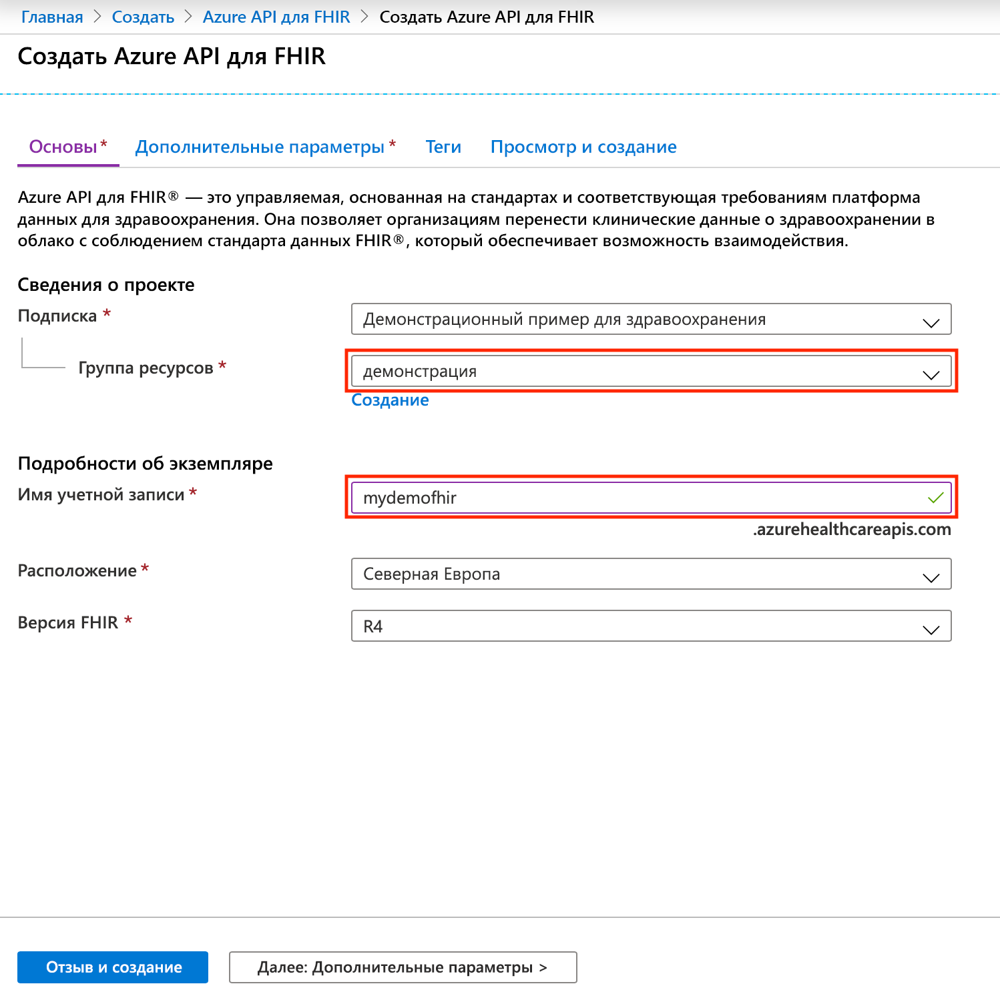

# Краткое руководство. Развертывание Azure API для FHIR с помощью портала Azure

В этом кратком руководстве показано, как развернуть Azure API для FHIR с помощью портала Azure.

Если у вас еще нет подписки Azure, [создайте бесплатную учетную запись](https://azure.microsoft.com/free/?WT.mc_id=A261C142F), прежде чем начинать работу.

## Создание ресурса

Откройте [портал Azure](https://portal.azure.com) и щелкните **Создать ресурс**.

## Поиск Azure API для FHIR

Чтобы найти Azure API для FHIR, введите FHIR в поле поиска:

## Создание учетной записи Azure API для FHIR

Чтобы создать учетную запись Azure API для FHIR, выберите **Создать**.

## Ввод данных для учетной записи

Выберите существующую группу ресурсов или создайте новую, выберите имя учетной записи и щелкните **Просмотр и создание**:

Подтвердите создание и дождитесь, пока завершится развертывание API для FHIR.

## Дополнительные параметры

Щелкните **Далее: дополнительные параметры**, чтобы указать центр, аудиторию, идентификаторы объектов удостоверений, которым будет разрешен доступ к этому Azure API для FHIR, включить SMART для FHIR, если потребуется, и настроить пропускную способность для базы данных:

- **Центр.** В качестве центра проверки подлинности для службы вы можете указать клиент Azure AD, который отличается от текущего, в который вы выполнили вход.
- **Аудитория.** Мы рекомендуем сохранить предлагаемый по умолчанию вариант для аудитории, а именно URL-адрес сервера FHIR. Но здесь вы можете изменить это значение. Аудитория обозначает получателя, для которого предназначен маркер. В этом контексте он должен иметь значение, представляющее сам интерфейс API для FHIR.
- **Allowed object IDs** (Допустимые идентификаторы объектов). Вы можете указать идентификаторы объектов удостоверений, которым нужно разрешить доступ к этому Azure API для FHIR. Дополнительные сведения о поиске идентификаторов объектов для пользователей и субъектов-служб см. в руководстве [Поиск идентификаторов объектов удостоверений](find-identity-object-ids.md).  
- **Прокси-сервер SMART on FHIR** Вы можете включить прокси SMART on FHIR. Дополнительные сведения о настройке прокси SMART on FHIR см. в учебнике [Прокси SMART on FHIR для Azure API для FHIR](https://docs.microsoft.com/azure/healthcare-apis/use-smart-on-fhir-proxy).  
- **Provisioned throughput (RU/s)** (Подготовленная пропускная способность, единиц запросов в секунду). Здесь можно указать параметры пропускной способности для базы данных, которую использует Azure API для FHIR. Этот параметр также можно изменить позже в колонке базы данных. Дополнительные сведения см. на странице [настройки параметров базы данных](configure-database.md).

## Получение инструкции возможностей API для FHIR

Чтобы убедиться, что подготовлена новая учетная запись API для FHIR, извлеките инструкцию возможностей, открыв в браузере адрес `https://<ACCOUNT-NAME>.azurehealthcareapis.com/metadata`.

## Очистка ресурсов

Если группа ресурсов, Azure API для FHIR и все связанные с ними ресурсы вам больше не требуются, их можно удалить. Для этого выберите группу ресурсов с учетной записью Azure API для FHIR, выберите **Удалить группу ресурсов**, а затем подтвердите имя удаляемой группы ресурсов.

## Дальнейшие действия

В этом кратком руководстве показано, как развернуть Azure API для FHIR в своей подписке. Чтобы задать дополнительные параметры в Azure API для FHIR, см. соответствующее руководство.

>[!div class="nextstepaction"]
>[Дополнительные параметры в Azure API для FHIR](azure-api-for-fhir-additional-settings.md)
