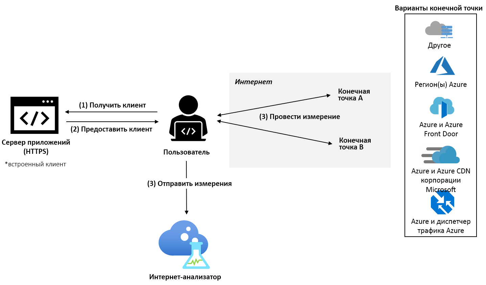

# Что собой представляет Анализатор Интернета Azure? (предварительная версия)

Анализатор Интернета — это платформа измерения на стороне клиента. Она позволяет проверять, как сетевые изменения инфраструктуры влияют на производительность клиентов. Что бы вы ни делали — переносили данные из локальных ресурсов в Azure или оценивали новую службу Azure, — Анализатор Интернета позволяет получать информацию на основе данных пользователей и подробной аналитики Майкрософт, чтобы составить более четкое представление о сетевой архитектуре и оптимизировать ее еще до переноса.

Анализатор Интернета использует небольшой клиент JavaScript, встроенный в веб-приложение, чтобы измерить задержку трафика, исходящего от пользователей, до выбранного набора сетевых назначений, которые называются _конечными точками_. С помощью Анализатора Интернета можно настроить несколько параллельных тестов, позволяющих оценивать разнообразные сценарии по мере развития требований инфраструктуры и потребностей клиентов. Анализатор Интернета предоставляет настраиваемые и предварительно настроенные конечные точки, обеспечивая удобство и гибкость принятия решений о производительности на уровне пользователей. 

> [!IMPORTANT]
> Эта общедоступная предварительная версия предоставляется без соглашения об уровне обслуживания и не должна использоваться для производственных рабочих нагрузок. Некоторые функции могут не поддерживаться, иметь ограничения и быть доступными не во всех расположениях Azure. См. [дополнительные условия использования для предварительных версий Microsoft Azure](https://azure.microsoft.com/support/legal/preview-supplemental-terms/).
>

## Быстрые и настраиваемые тесты

Анализатор Интернета позволяет устранить проблемы, связанные с производительностью, при миграции в облако, развертывании в новом или дополнительном регионе Azure или тестировании новых приложений и платформ доставки содержимого в Azure, таких как [Azure Front Door](https://azure.microsoft.com/services/frontdoor/) и [Microsoft Azure CDN](https://azure.microsoft.com/services/cdn/). 

Каждый тест, создаваемый в Анализаторе Интернета, состоит из двух конечных точек: конечная точка A и конечная точка B. Производительность конечной точки B анализируется относительно конечной точки A. 

Вы можете настроить собственную пользовательскую конечную точку или выбрать одну из множества предварительно настроенных конечных точек Azure. С помощью пользовательских конечных точек можно оценивать локальные рабочие нагрузки, экземпляры в других поставщиках облачных служб или пользовательские конфигурации Azure. Тесты могут состоять из двух пользовательских конечных точек. Однако хотя бы одна конечная точка должна размещаться в Azure. Предварительно настроенные конечные точки Azure — это быстрый и простой способ оценки производительности популярных платформ сети Azure, таких как Azure Front Door, диспетчер трафика Azure и Azure CDN. 

В предварительной версии доступны следующие предварительно настроенные конечные точки: 

* **Регионы Azure**
    * Южная часть Бразилии
    * Центральная Индия
    * Центральный регион США
    * Восточная Азия
    * Восточная часть США
    * Западная часть Японии
    * Северная Европа
    * Северная часть ЮАР;
    * Юго-Восточная Азия 
    * Северная часть ОАЭ;
    * Западная часть Великобритании  
    * Западная Европа
    * Запад США 
    * Западный регион США 2
* **Несколько комбинаций регионов Azure.** 
    * Восточная часть США, Южная Бразилия. 
    * Восточная часть США, Восточная Азия. 
    * Западная Европа, Южная Бразилия.
    * Западная Европа, Юго-Восточная Азия.
    * Западная Европа, Северная часть ОАЭ.
    * Западная часть США, восточная часть США. 
    * Западная часть США, Западная Европа.
    * Западная часть США, Северная часть ОАЭ.
    * Западная Европа, Северная часть ОАЭ, Юго-Восточная Азия.
    * Западная часть США, Западная Европа, Восточная Азия.
    * Западная часть США, Северная Европа, Юго-Восточная Азия, Северная часть ОАЭ, Северная часть ЮАР. 
* **Azure + Azure Front Door**, развернутые в одной или нескольких комбинациях регионов Azure, перечисленных выше.
* **Azure + Azure CDN от Майкрософт**, развернутые в одной комбинации регионов Azure, перечисленных выше.
* **Azure + диспетчер трафика Azure**, развернутые в нескольких комбинациях регионов Azure, перечисленных выше.

## Предлагаемые сценарии тестирования 

Анализатор Интернета позволяет оценить две конечные точки для конкретной группы пользователей, чтобы помочь вам принять оптимальные решения в контексте производительности для ваших клиентов. 

Анализатор Интернета может ответить на множество вопросов. Некоторые из наиболее распространенных приведены ниже. 
* Как миграция в облако сказывается на производительности? 
    * *Рекомендуемый тест: настраиваемый (текущая локальная инфраструктура) и Azure (любая предварительно настроенная конечная точка).*
* Каковы преимущества размещения данных на граничном устройстве и в центре обработки данных? 
    *  *Рекомендуемый тест: Сравнение Azure, Azure Front Door, Azure и Azure CDN от Майкрософт*.
* Каково преимущество Azure Front Door в контексте производительности?
    *  *Рекомендуемый тест: пользовательский/Azure/CDN и Azure Front Door*.
* Каково преимущество Azure CDN от Майкрософт в контексте производительности? 
    *  *Рекомендуемый тест: пользовательский/Azure/AFD и Azure CDN от Майкрософт*.
* Как работает Azure CDN от Майкрософт? 
    *  *Рекомендуемый тест: пользовательский (другая конечная точка CDN) и Azure CDN от Майкрософт*.
* Какое облако лучше подходит для пользователей в каждом регионе? 
    *  *Рекомендуемый тест: пользовательский (другая облачная служба) и Azure (любая предварительно настроенная конечная точка).*

## Принцип работы

Чтобы использовать Анализатор Интернета, настройте его ресурс на портале Microsoft Azure и установите небольшой клиент JavaScript в приложении. Клиент измеряет задержку от пользователей до выбранных конечных точек, загружая однопиксельное изображение по протоколу HTTPS. После получения измерений задержки клиент отправляет данные измерения в Анализатор Интернета.

Когда пользователь посещает веб-приложение, клиент JavaScript выбирает две конечные точки для измерения во всех настроенных тестах. Для каждой конечной точки клиент выполняет _холодное_ и _горячее_ измерение. _Холодное_ измерение вызывает дополнительную задержку, помимо чистой сетевой задержки между пользователем и конечной точкой, например, в связи с разрешением DNS, подтверждением TCP-подключения и согласованием SSL/TLS. _Теплое_ измерение следует сразу после завершения _холодного_ измерения и использует преимущества управления постоянными TCP-подключениями современных браузеров, чтобы обеспечить точное измерение совокупной задержки. При поддержке браузером пользователя для точного измерения времени используется API синхронизации ресурсов W3C. В настоящее время для анализа используются только измерения теплой задержки.

## Системы показателей 

После запуска теста данные телеметрии отображаются в ресурсе Анализатора Интернета на вкладке Scorecard (Система показателей). Эти данные всегда агрегируются. Чтобы изменить отображаемое представление данных, используйте следующие фильтры: 

* **Проверка**. Выберите тест, для которого требуется просмотреть результаты. Данные тестов отображаются, когда получено достаточно данных для завершения анализа (в большинстве случаев в течение 24 часов). 
* **Дата окончания и период времени**. Анализатор Интернета ежедневно создает три системы показателей — каждая система показателей отражает разный период времени агрегирования: за предыдущие 24 часа (день), за предыдущие семь дней (неделя) и за предыдущие 30 дней (месяц). Чтобы выбрать период времени, который требуется просмотреть, используйте фильтр "Дата окончания". 
* **Страна**. Используйте этот фильтр для просмотра данных пользователей, проживающих в стране. Глобальный фильтр отображает данные во всех географических регионах.  

Дополнительные сведения об анализе системы показателей см. в [этой статье](internet-analyzer-scorecard.md). 

## Дополнительная информация

* Узнайте, как [создать первый ресурс Анализатора Интернета](internet-analyzer-create-test-portal.md).
* [Вопросы и ответы об Анализаторе Интернета](internet-analyzer-faq.md). 
