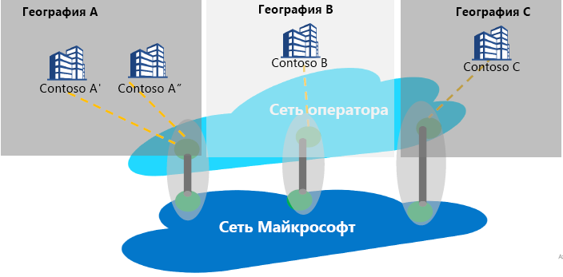

# Сравнение: интернет-пиринг и Служба пиринга

Интернет-пиринг — это любое соединение между глобальной сетью Майкрософт (AS8075) и сетью операторов или поставщиков услуг. Поставщик услуг может стать партнером Службы пиринга, выполнив описанные ниже партнерские требования Службы пиринга, чтобы обеспечить надежное и высокопроизводительное общедоступное соединение с оптимальной маршрутизацией от клиента к сети Майкрософт.

## Сведения о Службе пиринга
Служба пиринга — это партнерская программа с поставщиками службы ключей, которая обеспечивает лучшее в своем классе общедоступное подключение к Интернету для корпоративных пользователей. Партнеры, которые участвуют в программе, будут иметь прямые, высокодоступные географически избыточные соединения и оптимизированную маршрутизацию к Майкрософт. Служба пиринга — это дополнение к портфелю подключений Майкрософт.
*   ExpressRoute для частного подключения к ресурсам IaaS или PaaS (поддержка частного пространства протокола IP)
    *   Партнерская связь
    *   Прямая 100 Гбит/с связь с Майкрософт
*   IPSEC через Интернет для VPN-подключения с облаком
*   Подключение SD-WAN к Azure через виртуальную глобальную сеть

Целевой сегмент Службы пиринга — это подключение SaaS, клиенты SD-WAN, которые хотят сделать прорыв в Интернет в филиале, а также клиенты с двойной стратегией MPLS и корпоративным доступом к Интернету.

Основная цель при подключении к Microsoft Cloud состоит в том, чтобы минимизировать задержку за счет сокращения времени приема-передачи (RTT) с пользовательского сайта к глобальной сети Майкрософт, которая представляет собой общедоступную опорную сеть Майкрософт, которая соединяет все центры обработки данных Майкрософт и несколько точек входа облачных приложений. См. раздел [Getting the best connectivity and performance in Office 365](https://techcommunity.microsoft.com/t5/Office-365-Blog/Getting-the-best-connectivity-and-performance-in-Office-365/ba-p/124694) (Получение наилучшего качества подключения и производительности в Office 365).

> [!div class="mx-imgBorder"]
> 

На рисунке выше каждый филиал глобального предприятия подключается к ближайшему возможному пограничному местоположению Майкрософт через сеть партнера.

**Преимущества для клиентов Службы пиринга.**
* Лучшая общедоступная маршрутизация по Интернету к Облачным службам (Майкрософт) для оптимальной производительности и надежности.
* Возможность выбрать предпочитаемый SP для подключения к Microsoft Cloud.
* Аналитические сведения о трафике, например, отчеты о задержках и мониторинг префиксов.
* Оптимальные сетевые переходы (AS Hops) от Microsoft Cloud.
* Анализ и статистика маршрутов — События для аномалий маршрутов Протокола ([BGP](https://en.wikipedia.org/wiki/Border_Gateway_Protocol)) (обнаружение утечек/хищений) и неоптимальная маршрутизация.

## Требования к партнерству для Службы пиринга
* Подключение к Microsoft Cloud в ближайшем к клиенту расположению. Партнерский Поставщик услуг направит пользовательский трафик в пограничную зону Майкрософт, ближайшую к пользователю. Аналогично, в случае трафика, направленного к пользователю, корпорация Майкрософт будет маршрутизировать трафик (используя тег BGP) в пограничное местоположение, ближайшее к пользователю, а SP будет доставлять пользователю трафик.
* Партнер будет поддерживать высокодоступную и географически избыточную связь с высокой пропускной способностью с помощью Глобальной сети Майкрософт.
* Партнер может использовать свой пиринг для поддержки Службы пиринга, если он соответствует требованию

## ВОПРОСЫ И ОТВЕТЫ
Часто задаваемые вопросы, см. в разделе [Peering Service - FAQ](service-faqs.md) (Служба пиринга — вопросы и ответы).

## Дальнейшие действия

* Узнайте больше о преимуществах для клиентов с помощью [Службы пиринга](https://docs.microsoft.com/azure/peering-service/).
* Сведения о включении прямого пиринга для Службы пиринга см. [Peering Service partner walkthrough](walkthrough-peering-service-all.md) (Пошаговое руководство по Службе пиринга для партнеров).
