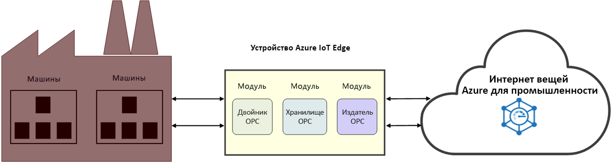

# Что собой представляет промышленный Интернет вещей (ПИВ)

ПИВ — это промышленный Интернет вещей. ПИВ повышает производительность производства путем использования Интернета вещей в промышленности. 

## Повышение промышленной эффективности

Повысьте производительность и рентабельность продуктов с помощью подключенного производственного акселератора решений. Подключайте и контролируйте свое промышленное оборудование и устройства в облаке, в том числе компьютеры, которые уже работают на производстве. Анализируйте данные Интернета вещей, чтобы получить аналитические сведения и повысить эффективность всего производства.

Упростите времязатратный процесс доступа к компьютерам на производственных площадках с помощью OPC Twin и сосредоточьтесь на создании решений ПИВ. Оптимизируйте управление сертификатами и интеграцию промышленных активов с помощью OPC Vault и будьте уверены в защите подключенных ресурсов. Большая часть этих микрослужб предоставляет REST-подобные API на основе [компонентов промышленного Интернета вещей Azure](https://github.com/Azure/azure-iiot-opc-ua). Интерфейсы API служб позволяют управлять функциональностью модуля edge. 

> [!NOTE]
> Дополнительные сведения о службах промышленного Интернета вещей Azure см. в разделе о [репозитории](https://github.com/Azure/azure-iiot-services) GitHub.
Если вы не знакомы с принципами работы модулей Edge Интернета вещей Azure, ознакомьтесь со следующими статьями:
- [Сведения об Azure IoT Edge](../iot-edge/about-iot-edge.md)
- [Модули Azure IoT Edge](../iot-edge/iot-edge-modules.md)

## подключенная фабрика.

[Подключенное производство](../iot-accelerators/iot-accelerators-connected-factory-features.md) — это реализация эталонной промышленной архитектуры Интернета вещей Microsoft Azure, которую можно настраивать в соответствии с определенными бизнес-требованиями. Весь код решения является открытым и доступен в репозитории акселератора решений "Подключенное производство" на сайте GitHub. Вы можете использовать его как отправную точку для коммерческого продукта и развернуть встроенное решение в подписке Azure за считаные минуты. 

## Возможности подключения на производственной площадке

OPC Twin — это компонент ПОВ, который автоматизирует обнаружение и регистрацию устройств, а также обеспечивает удаленное управление промышленными устройствами с помощью REST API. OPC Twin использует Azure IoT Edge и Центр Интернета вещей для подключения производственной сети к облаку. OPC Twin позволяет разработчикам промышленного Интернета вещей сосредоточиться на создании приложений промышленного Интернета вещей, не беспокоясь о безопасном доступе к локальным компьютерам.

## Безопасность

OPC Vault — это реализация OPC UA Global Discovery Server (GDS), которая может настраивать, регистрировать и контролировать жизненный цикл сертификатов для сервера OPC UA и клиентских приложений в облаке. OPC Vault упрощает реализацию и обслуживание защищенного подключения ресурса в производственной среде. Благодаря автоматизации управления сертификатами OPC Vault освобождает операторов на производстве от ручных и сложных процессов, связанных с подключением сертификатов и управлением ими.

## Дополнительная информация

Теперь, когда ознакомились с основами промышленного Интернета вещей и его компонентов, мы предлагаем:

> [!div class="nextstepaction"]
> [Что такое OPC Twin](overview-opc-twin.md)
