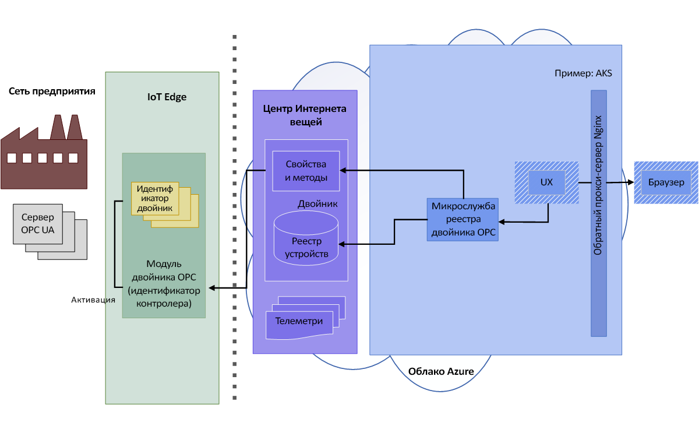
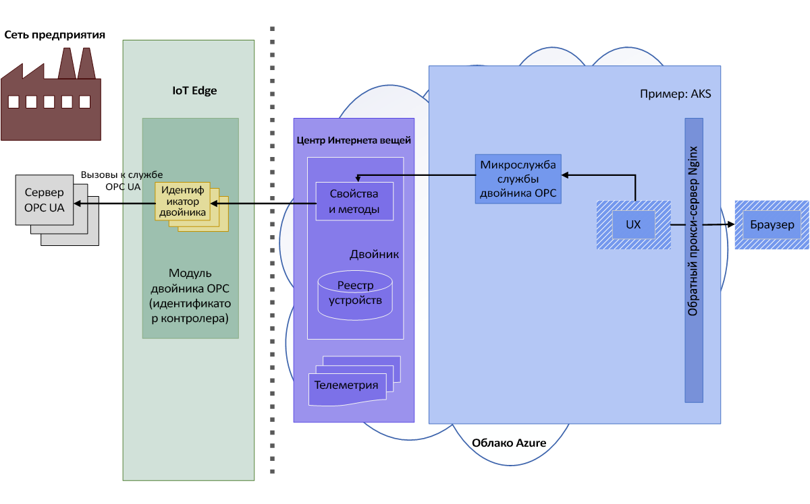
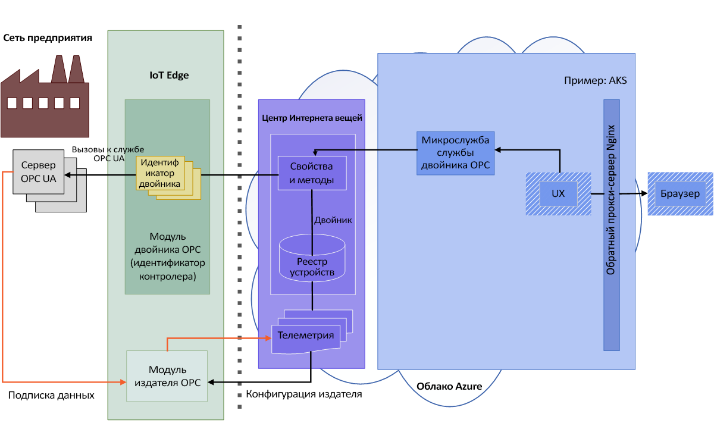

# Архитектура двойника OPC

На приведенных ниже схемах изображена архитектура двойника OPC.

## Обнаружение и активация

1. Оператор запускает сканирование сети в модуле или выполняет однократное обнаружение с помощью URL-адреса обнаружения. Сведения об обнаруженных конечных точках и приложении отправляются как данные телеметрии к агенту подключения для обработки.  Агент подключения устройства на основе унифицированной архитектуры OPC обрабатывает события обнаружения сервера на основе унифицированной архитектуры OPC, отправленные модулем IoT Edge двойника OPC в режиме обнаружения или сканирования. События обнаружения приводят к регистрации приложения и обновлению реестра устройства на основе унифицированной архитектуры OPC.

   

1. Оператор проверяет сертификат обнаруженной конечной точки и активирует зарегистрированный двойник конечной точки для доступа. 

   

## Обзор и мониторинг

1. После активации оператор с помощью REST API службы двойника может просматривать или проверять информационную модель сервера, читать и записывать переменные объекта или вызывать методы.  Пользователь использует упрощенный API-интерфейс на основе унифицированной архитектуры OPC, выраженный полностью в HTTP и JSON.

   

1. Интерфейс REST службы двойника позволяет также создавать отслеживаемые элементы и подписки в издателе OPC. Издатель OPC позволяет отправлять данные телеметрии из серверных систем на основе унифицированной архитектуры OPC в Центр Интернета вещей. Дополнительные сведения об издателе OPC см. в [этом репозитории GitHub](https://github.com/Azure/iot-edge-opc-publisher).

   