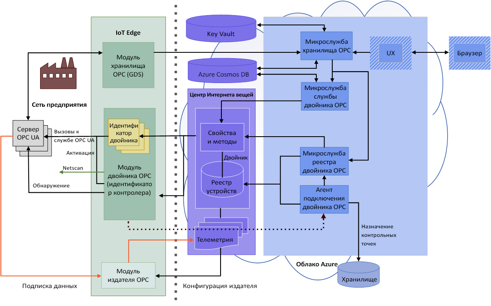

# Что собой представляет OPC Vault?

OPC Vault — это микрослужба, которая настраивает и регистрирует сертификаты клиентских приложений и сервера на основе унифицированной архитектуры OPC в облаке, а также управляет их жизненным циклом. В этой статье описаны простые примеры использования хранилища OPC.

## Управление сертификатами

Предположим, что производственной компании необходимо подключить свой сервер на основе унифицированной архитектуры OPC к созданному клиентскому приложению. Когда производитель выполняет начальный доступ к серверу, в серверном приложении мгновенно отображается сообщение об ошибке, которое указывает, что клиентское приложение небезопасно. Это встроенный механизм сервера на основе унифицированной архитектуры OPC, позволяющий предотвращать доступ несанкционированных приложений и намеренное нарушение безопасности производства.

## Управление безопасностью приложения
С помощью хранилища OPC специалисты по безопасности могут легко устанавливать связь между сервером на основе унифицированной архитектуры OPC и любым клиентским приложением, так как эта микрослужба имеет все функции управления и хранения сертификатов, а также управления их жизненным циклом. Это позволяет безопасно подключить сервер на основе унифицированной архитектуры OPC и обеспечить связь с созданным клиентским приложением.

## Полная архитектура хранилища OPC
На приведенной ниже схеме показана полная архитектура хранилища OPC.

## Дополнительная информация

Теперь, когда вы узнали о принципах работы хранилища OPC и вариантах его использования, предлагаем ознакомиться со статьей:

> [!div class="nextstepaction"]
> [Архитектура хранилища OPC](overview-opc-vault-architecture.md)
