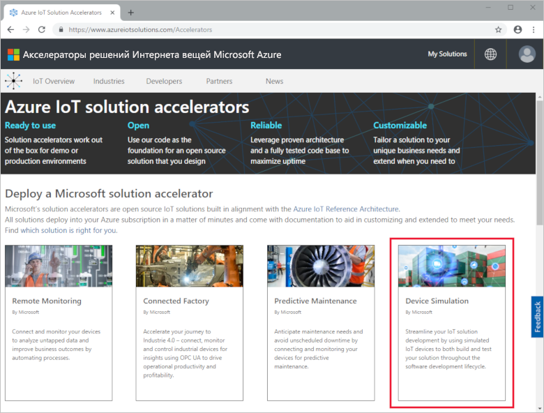
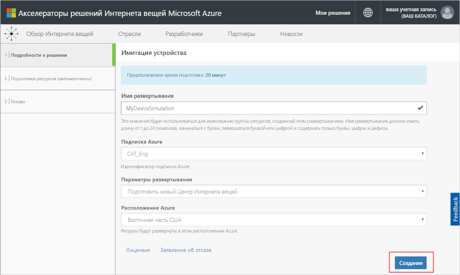
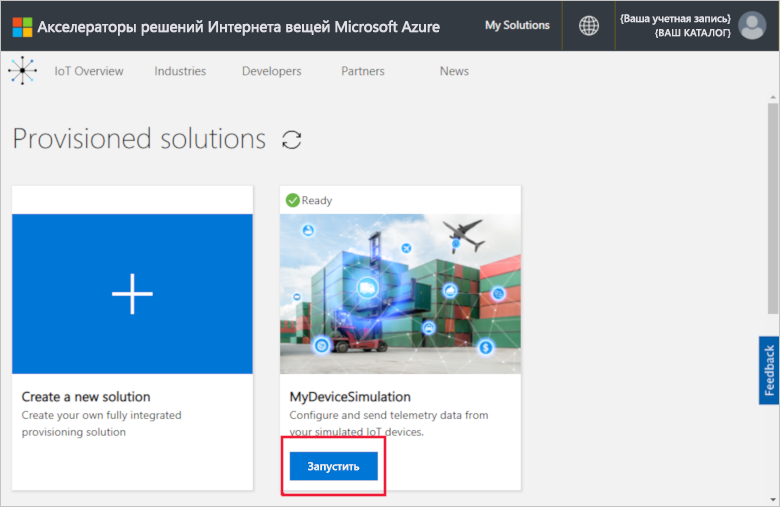
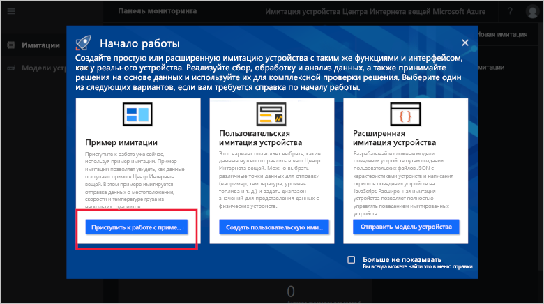
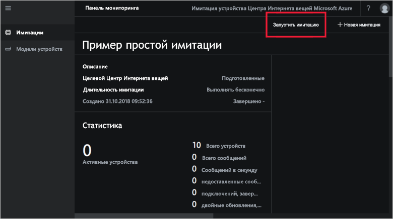
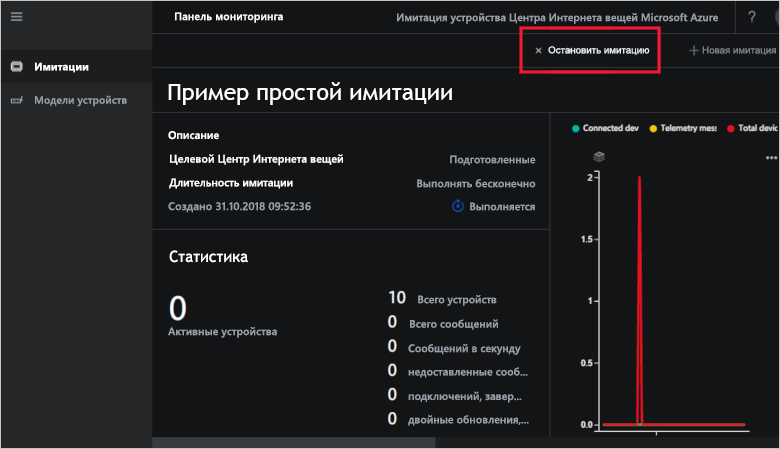
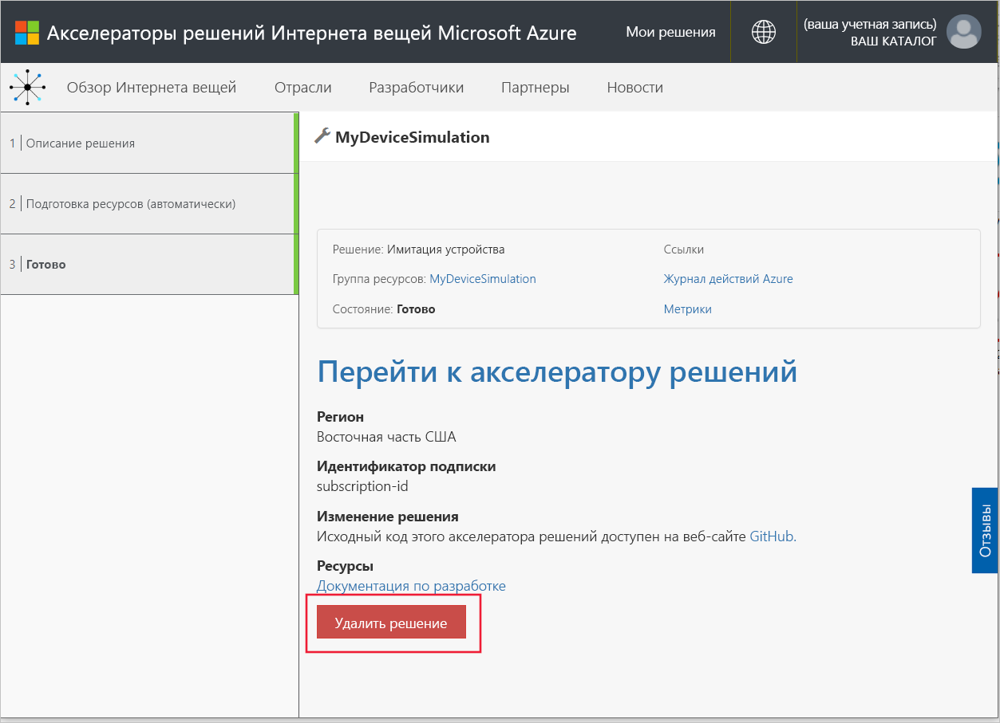

# Краткое руководство. Развертывание и запуск имитации устройств Интернета вещей в Azure

В этом кратком руководстве показано, как развернуть имитацию устройств Интернета вещей Azure для тестирования решения Интернета вещей. После развертывания акселератора решений запустите пример имитации, чтобы приступить к работе.

Для работы с этим кратким руководством вам потребуется действующая подписка Azure.

Если у вас еще нет подписки Azure, [создайте бесплатную учетную запись Azure](https://azure.microsoft.com/free/?WT.mc_id=A261C142F), прежде чем начинать работу.

## Развертывание имитации устройства

Когда вы будете развертывать имитацию устройств в подписке Azure, необходимо указать некоторые параметры конфигурации.

Войдите на сайт [azureiotsolutions.com](https://www.azureiotsolutions.com/Accelerators) с использованием данных учетной записи Azure.

Щелкните плитку **Имитация устройств**.

Щелкните **Попробовать** на странице с описанием имитации устройств.

На странице **Create Device Simulation solution** (Создание решения симулятора устройств) введите уникальное **имя решения**.

Выберите **подписку** и **регион**, которые необходимо использовать для развертывания акселератора решений. Вы можете выбрать ближайший к вам регион. Вы должны быть [глобальным администратором или пользователем](iot-accelerators-permissions.md) в подписке.

Установите флажок, чтобы развернуть Центр Интернета вещей и использовать его с решением "Симулятор устройств". Вы в любой момент можете выбрать другой Центр Интернета вещей для симулятора.

Щелкните **Создать**, чтобы начать подготовку решения. Этот процесс занимает по крайней мере пять минут:

## Вход в решение

После завершения процесса подготовки вы можете войти в экземпляр имитации устройств, нажав кнопку **Запустить**.

Щелкните **Accept** (Принять), чтобы принять запрос на разрешения. В браузере отобразится панель мониторинга решения "Симулятор устройств".

При первом открытии вы увидите панель мониторинга симулятора устройств и руководство по **началу работы**. Щелкните первый элемент, чтобы открыть пример имитации. Если закрыть руководство по **началу работы**, можно открыть **пример простого симулятора** на панели мониторинга, щелкнув его плитку.

## Пример симулятора

Так как это пример симулятора, его нельзя изменить. Имитацию можно настроить с помощью приведенных ниже параметров.

| Параметр             | Значение                       |
| ------------------- | --------------------------- |
| Целевой Центр Интернета вещей      | Use pre-provisioned IoT Hub (Использовать предварительно подготовленный Центр Интернета вещей) |
| Модель устройства        | Грузовик                       |
| Количество устройств   | 10                          |
| Частота получения телеметрии | 10 с                  |
| Длительность моделирования | Бессрочный запуск            |

## Запуск симулятора

Щелкните **Запустить имитацию**. Имитация будет выполняться бессрочно, согласно настройкам. Имитацию можно остановить в любой момент, щелкнув **Остановить имитацию**. Эта имитация содержит статистические данные текущего выполнения.

Вы можете выполнять только одну имитацию из экземпляра имитации устройств одновременно.

## Очистка ресурсов

Если вы планируете продолжить изучение, не удаляйте развернутый симулятор устройств.

Если симулятор устройств вам больше не нужен, удалите его со страницы [Подготовленные решения](https://www.azureiotsolutions.com/Accelerators#dashboard), щелкнув его элемент, а затем выбрав **Удалить решение**:

## Дополнительная информация

В этом кратком руководстве вы развернули симулятор устройств и запустили пример имитации устройства Интернета вещей.

> [!div class="nextstepaction"]
> [Руководство: создание и запуск имитации устройства Интернета вещей](iot-accelerators-device-simulation-create-simulation.md)