# Краткое руководство. Испытание облачного решения для удаленного мониторинга

В этом кратком руководстве показано, как развернуть акселератор решений для удаленного мониторинга Интернета вещей Azure. В этом облачном решении вы используете страницу **Панель мониторинга**, чтобы визуализировать имитированные устройства на карте, и увидите, как страница **обслуживания** реагирует на оповещение о давлении от имитированного холодильника. Это решение можно использовать в качестве отправной точки для собственной реализации или как средство обучения.

Начальное развертывание настраивает акселератор решений для компании Contoso. Как оператор Contoso вы управляете устройствами различных типов, например холодильниками, развернутыми в разных физических средах. Холодильник отправляет данные о температуре, влажности и давлении в акселератор решения для удаленного мониторинга.

В этом кратком руководстве показано, как развернуть акселератор решений версии **Базовый** для тестирования и демонстрации при минимальных финансовых затратах. Дополнительные сведения о различных версиях, которые можно развернуть, см. в разделе о [базовом и стандартном развертывании](iot-accelerators-remote-monitoring-deploy-cli.md#basic-and-standard-deployments).

Для работы с этим кратким руководством вам потребуется действующая подписка Azure.

Если у вас еще нет подписки Azure, [создайте бесплатную учетную запись Azure](https://azure.microsoft.com/free/?WT.mc_id=A261C142F), прежде чем начинать работу.

## Развертывание решения

Когда вы будете развертывать акселератор решения в подписке Azure, необходимо указать некоторые параметры конфигурации.

Войдите на сайт [azureiotsolutions.com](https://www.azureiotsolutions.com/Accelerators) с использованием данных учетной записи Azure.

Щелкните плитку **Удаленный мониторинг**. На странице **Удаленный мониторинг** щелкните **Попробовать**.

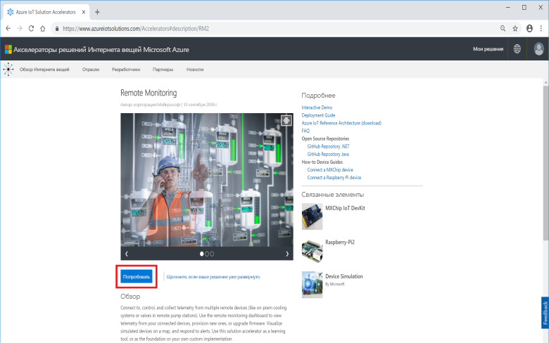

В качестве **варианта развертывания** выберите **C# Microservices** (Микрослужбы C#). Реализации Java и C# имеют идентичные функции.

Укажите уникальное **имя решения** для акселератора решения для удаленного мониторинга. В этом кратком руководстве мы используем имя решения **contoso-rm**.

Выберите **подписку** и **регион**, которые необходимо использовать для развертывания акселератора решений. Вы можете выбрать ближайший к вам регион. В этом кратком руководстве мы используем регион **Восточная часть США**.
Вы можете выбрать **Visual Studio Enterprise**, но для этого у вас должны быть права [глобального администратора или пользователя](iot-accelerators-permissions.md).

Чтобы начать развертывание, щелкните **Создать**. Этот процесс занимает по крайней мере пять минут:

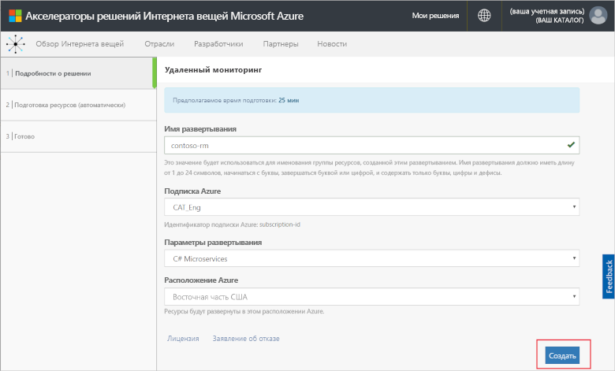

## Вход в решение

После развертывания в подписке Azure появится зеленая галочка и надпись **Готово** на плитке решения. Теперь вы можете войти на панель мониторинга акселератора решений для удаленного мониторинга.

На странице **Подготовленные решения** выберите созданный акселератор решения для удаленного мониторинга:

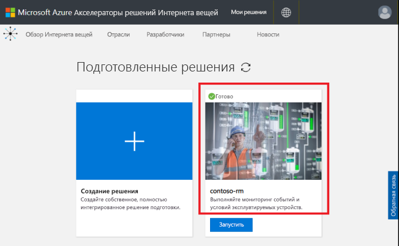

Вы можете просмотреть сведения об акселераторе решения для удаленного мониторинга на отобразившейся панели. Чтобы просмотреть акселератор решения для удаленного мониторинга, выберите **Go to your solution accelerator** (Перейти к акселератору решений).

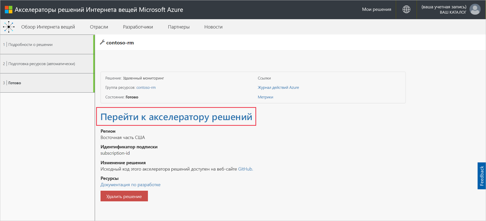

Нажмите кнопку **Принять**, чтобы принять запрос на разрешения, и в браузере отобразится панель мониторинга решения для удаленного мониторинга:

[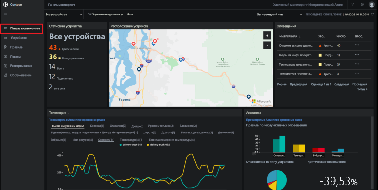](./media/quickstart-remote-monitoring-deploy/solutiondashboard-expanded.png#lightbox)

## Просмотр устройств

На панели мониторинга решения отображаются следующие сведения об имитированных устройствах компании Contoso:

* На панели **Статистика устройств** отображается сводная информация об оповещениях и об общем количестве устройств. В развертывании по умолчанию у компании Contoso есть 10 имитированных устройств различных типов.

* На панели **Расположение устройств** показаны физические расположения устройств. Цвет булавки указывает на оповещение от устройства.

* На панели **Оповещения** отображаются подробные сведения об оповещениях, полученных с устройств.

* На панели **Телеметрия** отображаются данные телеметрии устройств. Вы можете просматривать различные потоки телеметрии, нажимая на типы данных телеметрии в верхней части.

* На панели **Аналитика** показаны сводные сведения об оповещениях, полученных с устройств.

## реагирование на оповещение;

Как оператор в компании Contoso вы можете отслеживать устройства на панели мониторинга решения. На панели **Статистика устройства** видно наличие важных оповещений, а на панели **Оповещения** показано, что почти все они поступают от одного холодильника. Для холодильников компании Contoso давление более 250 фунтов на квадратный дюйм указывает на неисправность устройства.

### Определение проблемы

На странице **Панель мониторинга** на панели **Оповещения** можно увидеть оповещение **Слишком высокое давление холодильника**. Этот холодильник помечен красной булавкой на карте (возможно, потребуется переместиться по карте и увеличить масштаб):

[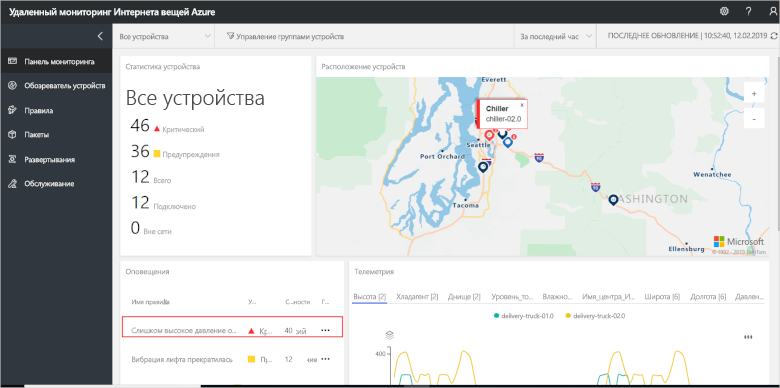](./media/quickstart-remote-monitoring-deploy/dashboardalarm-expanded.png#lightbox)

На панели **Оповещения** нажмите **...** в столбце **Обзор** рядом с правилом **Слишком высокое давление холодильника**. Вы перейдете на страницу **Обслуживание**, где можно просматривать сведения о правиле, вызвавшем оповещение.

На странице обслуживания **Слишком высокое давление в холодильнике** показаны детали правила, вызвавшего оповещение. На странице также указано, когда и на каком устройстве возникло оповещение:

Вы определили проблему, вызвавшую оповещение, и связанное устройство. Последующие шаги оператора — подтвердить оповещение и устранить проблему.

### Устранение проблемы

Чтобы сообщить другому оператору, что вы работаете над оповещением, выберите его и измените параметр **Состояние оповещения** на **Подтверждено**:

[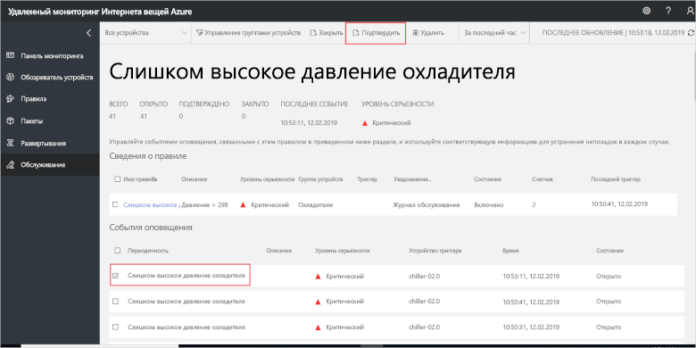](./media/quickstart-remote-monitoring-deploy/maintenanceacknowledge-expanded.png#lightbox)

Значение в столбце состояния изменится на **Подтверждено**.

Для работы с холодильником прокрутите вниз к пункту **Связанные сведения**, выберите холодильник в списке **Оповещения устройств**, а затем выберите **Задания**:

На панели **Задания** выберите **Запустить метод** и **EmergencyValveRelease**. Добавьте имя задания **ChillerPressureRelease** и нажмите кнопку **Применить**. Эти параметры создают задание, которое будет выполнено немедленно.

Чтобы просмотреть состояние задания, вернитесь на страницу **Maintenance** (Обслуживание) и просмотрите список заданий в представлении **Задания**. Через несколько секунд вы увидите, что задание запустилось.

[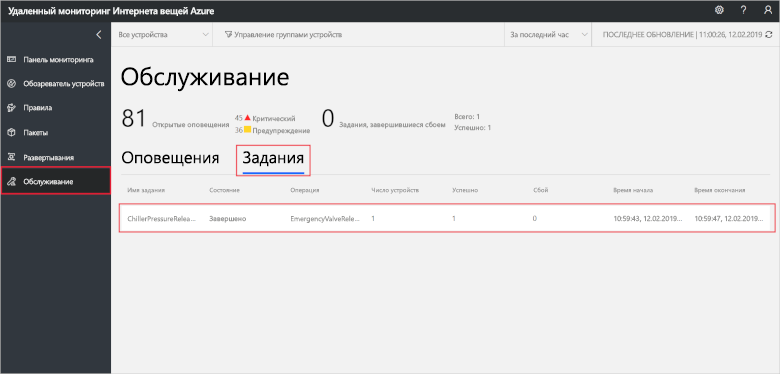](./media/quickstart-remote-monitoring-deploy/maintenancerunningjob-expanded.png#lightbox)

### Проверка восстановления давления

Чтобы просмотреть данные о давлении в холодильнике, перейдите на страницу **Панель мониторинга**, выберите **Давление** на панели телеметрии и убедитесь, что давления для **chiller-02.0** вернулось к нормальному значению:

[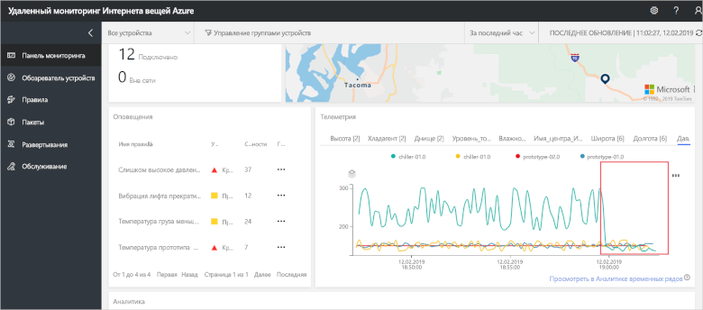](./media/quickstart-remote-monitoring-deploy/pressurenormal-expanded.png#lightbox)

Чтобы закрыть инцидент, перейдите на страницу **Обслуживание**, выберите оповещение и установите состояние **Закрыто**:

[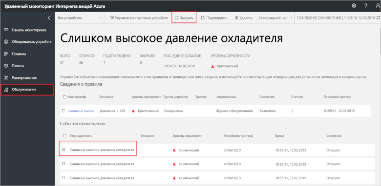](./media/quickstart-remote-monitoring-deploy/maintenanceclose-expanded.png#lightbox)

Значение в столбце состояния изменится на **Закрыто**.

## Очистка ресурсов

Если вы планируете перейти к следующим руководствам, оставьте акселератор решений для удаленного мониторинга развернутым.

Если акселератор решений больше не нужен, удалите его на странице [Подготовленные решения](https://www.azureiotsolutions.com/Accelerators#dashboard). Для этого выберите его, а затем щелкните **Удалить решение**:

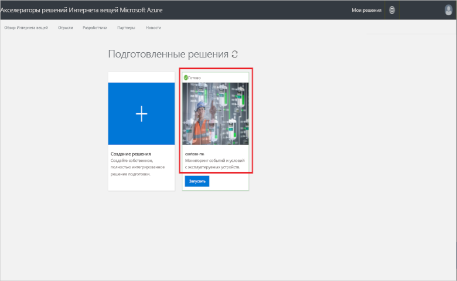

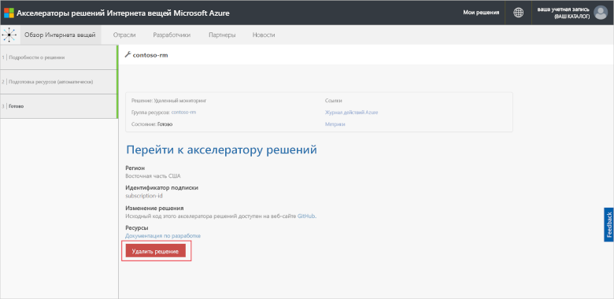

## Дальнейшие действия

В этом кратком руководстве вы развернули акселератор решения для удаленного мониторинга и выполнили задачу мониторинга с помощью имитированных устройств в развертывании компании Contoso по умолчанию.

Дополнительные сведения об акселераторе решения и имитированных устройствах см. в следующей статье.

> [!div class="nextstepaction"]
> [Руководство Мониторинг устройств Интернета вещей](iot-accelerators-remote-monitoring-monitor.md)