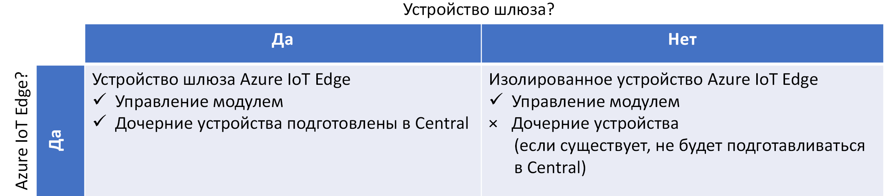
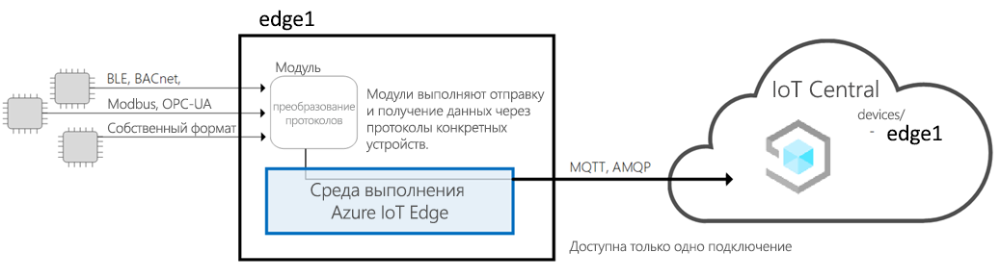
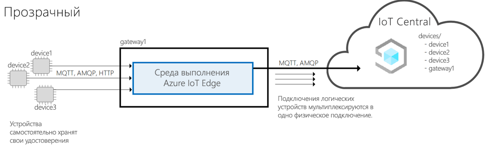
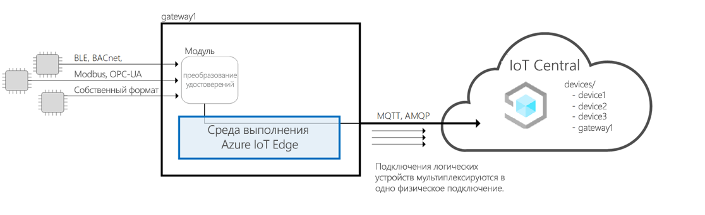
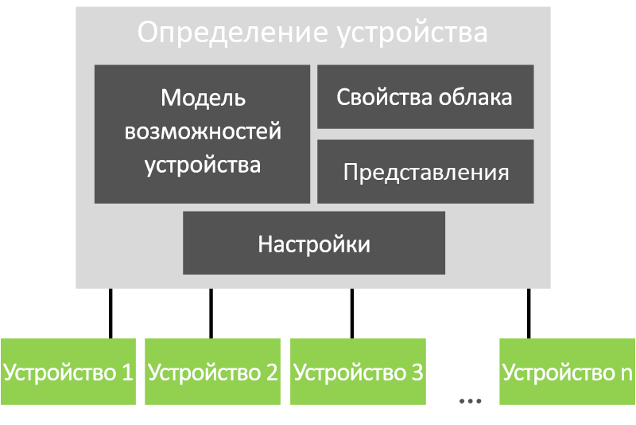

# Архитектура Azure IoT Central

В этой статье приведено краткое описание архитектуры Microsoft Azure IoT Central.

## Устройства

Устройства обмениваются данными с приложением Azure IoT Central. Устройство может:

- отправлять измерения (например, данные телеметрии);
- синхронизировать параметры с приложением.

В Azure IoT Central данные, которыми устройство может обмениваться с приложением, задаются в шаблоне устройства. Дополнительные сведения о шаблонах устройства см. в разделе об [управлении метаданными](#metadata-management).

Дополнительные сведения о подключении устройств к приложению Azure IoT Central см. в [этой](concepts-get-connected.md) статье.

## устройство Azure IoT Edge.

Также как и устройства, созданные с помощью [пакетов SDK для Azure IoT](https://github.com/Azure/azure-iot-sdks), [устройства Azure IoT Edge](../../iot-edge/about-iot-edge.md) можно подключить к приложению IoT Central. IoT Edge позволяет запускать облачный интеллект и пользовательскую логику непосредственно на устройствах IoT, управляемых IoT Central. Среда выполнения IoT Edge позволяет выполнять следующие задачи:

- Установка и обновление рабочих нагрузок на устройстве.
- Поддерживайте стандарты безопасности IoT Edge на устройстве.
- Обеспечение рабочего состояния модулей IoT Edge.
- Передача данных о состоянии работоспособности модуля в облако для удаленного мониторинга.
- Управление связью между подчиненными конечными устройствами и устройством IoT Edge, между модулями на устройстве IoT Edge, а также между устройством IoT Edge и облаком.

IoT Central предоставляет следующие возможности для устройств IoT Edge:

- Шаблоны устройств для описания возможностей устройства IoT Edge, такие как:
  - Развертывание проявляется возможность загрузки, которая поможет вам управлять манифест для флота устройств.
  - Модули, которые работают на устройстве IoT Edge.
  - Телеметрия, который отправляет каждый модуль.
  - Свойства, о которых сообщает каждый модуль.
  - Команды, на которые реагирует каждый модуль.
  - Взаимосвязь между моделью возможностей устройства шлюза IoT Edge и моделью возможностей устройства ниже по течению.
  - Свойства облака, которые не хранятся на устройстве IoT Edge.
  - Настройки, панели мониторинга и формы, которые являются частью вашего приложения IoT Central.

  Для получения дополнительной информации смотрите [устройства Connect Azure IoT Edge в статье приложения Azure IoT Central.](./concepts-iot-edge.md)

- Возможность предоставления устройств IoT Edge в масштабе с помощью службы обеспечения устройств Azure IoT
- Правила и действия.
- Пользовательские панели мониторинга и аналитика.
- Непрерывный экспорт телеметрии с устройств IoT Edge.

### Типы устройств IoT Edge

IoT Central классифицирует типы устройств IoT Edge следующим образом:

- Устройства листа. Устройство IoT Edge может иметь устройства листа вниз по течению, но эти устройства не подготовлены в IoT Central.
- Устройства шлюза с устройствами вниз по течению. Устройство шлюза и подчиненные устройства подготавливаются в IoT Central.

### Шаблоны IoT Edge

IoT Central поддерживает следующие шаблоны устройств IoT Edge:

#### IoT Edge как устройство листа

Устройство IoT Edge представлено в IoT Central, а любые устройства, расположенные ниже по течению, представлены как исходящие от устройства IoT Edge. Устройства, подключенные к устройству IoT Edge, не предусмотрены в IoT Central.

#### Устройство шлюза IoT Edge, подключенное к устройствам вниз по течению с идентификацией

Устройство IoT Edge представлено в IoT Central вместе с устройствами, подключенными к устройству IoT Edge. Поддержка runtime для подготовки устройств вниз по течению через шлюз в настоящее время не поддерживается.

#### Устройство шлюза IoT Edge, подключенное к устройствам вниз по течению, с удостоверением личности, предоставленным шлюзом IoT Edge

Устройство IoT Edge представлено в IoT Central вместе с устройствами, подключенными к устройству IoT Edge. Поддержка runtime шлюза, обеспечивающая идентификацию устройств вниз по течению и подготовка устройств ниже по течению, в настоящее время не поддерживается. Если вы берете свой собственный модуль перевода личных данных, IoT Central может поддержать эту модель.

## Облачный шлюз

Azure IoT Central использует Центр Интернета вещей Azure как облачный шлюз, позволяющий подключаться к устройству. Центр Интернета вещей позволяет:

- выполнять прием данных в нужном масштабе в облаке;
- управлять устройствами;
- устанавливать надежное подключение.

Дополнительные сведения о Центре Интернета вещей Azure см. в [этой документации](https://docs.microsoft.com/azure/iot-hub/).

Дополнительные сведения о подключении устройств в Azure IoT Central см. в [этой статье](concepts-get-connected.md).

## Хранилища данных

Azure IoT Central хранит данные приложения в облаке. Хранимые данные приложения включают в себя:

- шаблоны устройств;
- удостоверения устройств;
- метаданные устройств;
- данные о пользователях и ролях.

Azure IoT Central использует хранилище временных рядов для данных измерений, отправляемых с устройств. Данные временных рядов, полученные с устройств, используются в службе аналитики.

## Analytics

Служба аналитики отвечает за создание пользовательских передаваемых данных, отображаемых в приложении. Оператор может [настраивать аналитику](howto-create-analytics.md), отображаемую в приложении. Служба аналитики создана на основе службы [Аналитика временных рядов Azure](https://azure.microsoft.com/services/time-series-insights/) и обрабатывает данные измерений, отправляемые с устройств.

## Правила и действия

[Правила и действия](tutorial-create-telemetry-rules.md) вместе позволяют автоматизировать задачи в приложении. Конструктор может определить правила на основе телеметрии устройства (например, если температура превышает указанное пороговое значение). Azure IoT Central использует обработчик потоков, чтобы определить выполнение условий правила. Когда условие правила выполнено, оно активирует действие, установленное конструктором. Например, может отправляться сообщение электронной почты, чтобы известить инженера, что температура устройства слишком высокая.

## Управление метаданными

В приложении Azure IoT Central шаблоны устройств определяют поведение и возможности типов устройств. Например, шаблон холодильника указывает данные телеметрии, которые холодильник отправляет в приложение.

В шаблоне устройства приложения IoT Central содержится:

- **Модели возможностей устройств** определяют возможности устройства, такие как телеметрия, которую оно отправляет, свойства, определяющие состояние устройства, и команды, на которые реагирует устройство. Возможности устройства организованы в один или несколько интерфейсов. Для получения дополнительной информации о моделях возможностей устройств можно ознакомиться с документацией [IoT Plug and Play (предварительный просмотр).](../../iot-pnp/overview-iot-plug-and-play.md)
- **Свойства облака** определяют свойства IoT Central для устройства. Эти свойства хранятся только в IoT Central и никогда не отправляются на устройство.
- **Представления** определяют панели мониторинга и формы, которые создает строитель, чтобы позволить оператору контролировать и управлять устройствами.
- **Настройки** позволяют строителю переопределять некоторые определения в модели возможностей устройства, чтобы сделать их более актуальными для приложения IoT Central.

Приложение может иметь одно или несколько имитированных и реальных устройств, созданных на основе каждого шаблона.

## Экспорт данных

В приложении Azure IoT Central вы можете [постоянно экспортировать свои данные](howto-export-data.md) в собственные концентраторы Azure Event Hubs и Azure Service Bus. Вы также можете периодически экспортировать свои данные в свою учетную запись хранения Azure Blob. IoT Central может экспортировать измерения, устройства и шаблоны устройств.

## Обновления пакетных устройств

В центральном приложении Azure IoT можно [создавать и запускать задания](howto-run-a-job.md) для управления подключенными устройствами. Эти задания позволяют выполнять оптовые обновления свойств или параметров устройств или выполнять команды. Например, можно создать задание для увеличения скорости вентилятора для нескольких рефрижераторных торговых автоматов.

## Управление доступом на основе ролей (RBAC)

[Администратор может определить правила доступа](howto-manage-users-roles.md) для центрального приложения Azure IoT, используя одну из предопределенных ролей или создав пользовательскую роль. Роли определяют, к каким областям приложения пользователь имеет доступ и какие действия он может выполнять.

## Безопасность

Возможности безопасности в пределах Azure IoT Central:

- Данные шифруются при передаче и во время хранения.
- Проверка подлинности осуществляется с помощью Azure Active Directory или учетной записи Майкрософт. Поддерживается двухфакторная проверка подлинности.
- Полная изоляция клиентов.
- Безопасность на уровне устройств.

## Оболочка пользовательского интерфейса

Оболочка пользовательского интерфейса — это современное приложение HTML5 на основе браузера, которое быстро реагирует на запросы.
Администратор может настроить пользовательский пользовательский доступ приложения, применяя пользовательские темы и изменяя ссылки справки, чтобы указать на ваши собственные ресурсы справки. Чтобы узнать больше о настройке пользовательского элемента, [см.](howto-customize-ui.md)

Оператор может создавать персонализированные панели мониторинга приложений. Вы можете иметь несколько панелей мониторинга, которые отображают различные данные и переключаются между ними.

## Дальнейшие действия

Теперь, когда вы узнали об архитектуре Azure IoT Central, следующим шагом является изучение [подключения к устройствам](concepts-get-connected.md) в Azure IoT Central.
