# Общие сведения о пользовательском интерфейсе Azure IoT Central

[!INCLUDE [iot-central-original-pnp](../../../includes/iot-central-original-pnp-note.md)]

В этой статье содержатся сведения о пользовательском интерфейсе Microsoft Azure IoT Central. С помощью пользовательского интерфейса можно создавать и использовать решение Azure IoT Central и их подключенные устройства, а также управлять ими.

С помощью пользовательского интерфейса Azure IoT Central _сборщики_  могут определить свое решение Azure IoT Central. Этот интерфейс позволяет выполнять следующие задачи:

- определение типов устройств, подключающихся к решению.
- настройка правил и действий устройств;
- настройка пользовательского интерфейса для _операторов_, использующих решение.

С помощью пользовательского интерфейса Azure IoT Central _оператор_ может управлять решением Azure IoT Central. Этот интерфейс позволяет выполнять следующие задачи:

- мониторинг устройств;
- настройка устройств;
- устранение проблем и неполадок с устройствами;
- подготавливать новые устройства;

## Использование области слева

Используйте область слева для получения доступа к разным областям приложения. Меню навигации можно развернуть или свернуть, выбрав **<** или **>** .

:::row:::
  :::column span="":::
      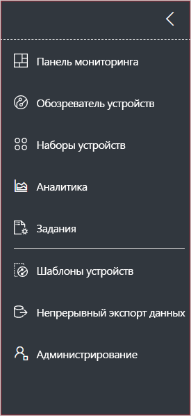
  :::column-end:::
  :::column span="2":::
     **Панель мониторинга** — отображается панель мониторинга приложения. Как сборщик вы можете настроить панель мониторинга для операторов. Пользователи также могут создавать собственные панели мониторинга.
    
     **Device Explorer** отображает список смоделированных и реальных устройств, связанных с каждым шаблоном устройства в приложении. Средство **Device Explorer** позволяет операторам управлять подключенными устройствами.
    
     **Device Sets** (Наборы устройств) позволяет просматривать и создавать наборы устройств. Оператор может создать наборы устройств в качестве логической коллекции устройств, указанных в запросе.
    
     **Аналитика** отображает аналитические сведения на основе данных телеметрии устройств и наборов устройств. Как оператор вы можете создавать настраиваемые представления на основе данных устройства для получения аналитических сведений из приложения.
    
     **Задания** обеспечивает возможность управление устройствами в пакетном режиме при условии, что вы создали и запустили задания для выполнения обновлений в соответствующем масштабе.
    
     **Шаблоны устройств** отображает средства, которые сборщик использует для создания шаблонов устройств и управления ими.
    
     **Continuous Data Export** (Непрерывный экспорт данных) позволяет администратору настроить непрерывный экспорт в другие службы Azure, например в хранилище и очереди.
    
     **Администрирование** — отображаются страницы администрирования приложений, на которых администраторы могут полностью управлять параметрами, пользователями и ролями приложения.
   :::column-end:::
:::row-end:::

## Поиск, справка и поддержка

На каждой странице сверху отображается меню.

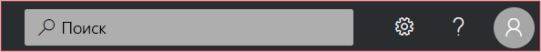

- Чтобы найти устройства и шаблоны устройств, введите значение в **Поиск**.
- Чтобы изменить язык пользовательского интерфейса или тему, щелкните значок **Параметры**.
- Чтобы выйти из приложения, щелкните значок **Учетная запись**.
- Чтобы получить справку и поддержку, выберите раскрывающийся список **Справка** с перечнем ресурсов. В пробной версии приложения ресурсы поддержки включают в себя доступ к [чату в реальном времени](howto-show-hide-chat.md).

Вы можете выбирать между светлой или темной темой пользовательского интерфейса.

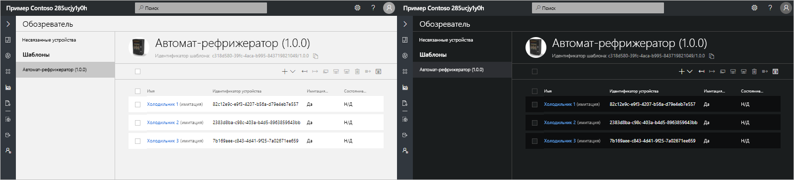

> [!NOTE]
> Возможность выбора между светлой и темной темами будет недоступен, если администратор настроил пользовательскую тему для приложения.

## панель мониторинга

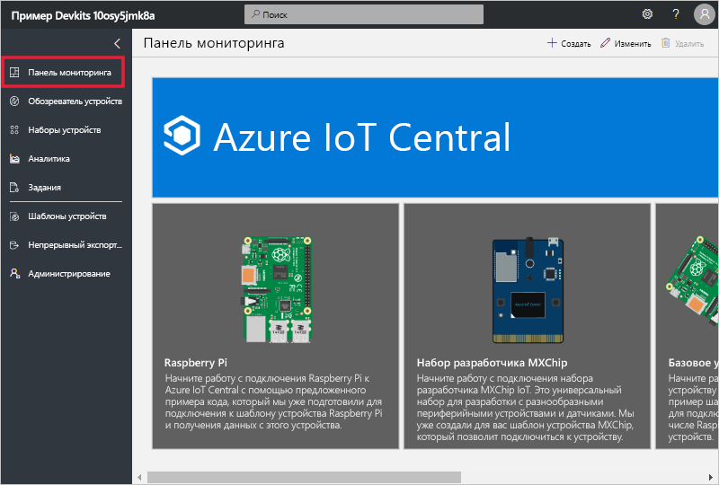

* Панель мониторинга — это первая страница, отображаемая при входе в приложение Azure IoT Central. Как сборщик вы можете настроить панель мониторинга приложения для других пользователей путем добавления плиток. Дополнительные сведения см. в руководстве [Customize the Azure IoT Central operator's view](tutorial-customize-operator.md) (Настройка представления оператора Azure IoT Central).

* Оператор может создать персонализированные панели мониторинга и переключаться между ними и панелью мониторинга по умолчанию. Дополнительные сведения см. в статье о [создании персональных панелей мониторинга Azure IoT Central и управлении ими](howto-create-personal-dashboards.md).

## Обозреватель устройств

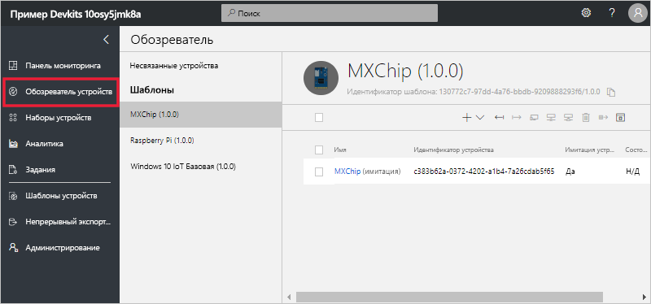

На странице обозревателя отображаются _устройства_ в приложении Azure IoT Central, сгруппированные по _шаблону устройства_.

* Шаблон определяет тип устройства, которое можно подключить к приложению. Дополнительные сведения см. в статье [Define a new device type in your Azure IoT Central application](tutorial-define-device-type.md) (Определение типа нового устройства в приложении Azure IoT Central).
* В устройстве могут использоваться два типа приложений: реальные и смоделированные. Дополнительные сведения см. в статье [Add a real device to your Azure IoT Central application](tutorial-add-device.md) (Добавление нового устройства в приложение Azure IoT Central).

## Наборы устройств

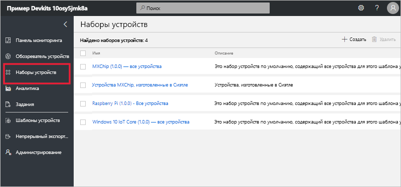

На странице _Device Sets_ (Наборы устройств) отображаются наборы, созданные сборщиком. Набор устройств — это коллекция связанных устройств. Сборщик определяет запрос для идентификации устройств, входящих в набор. Наборы устройств используются при настройке аналитики в приложении. Дополнительные сведения см. в статье [Use device sets in your Azure IoT Central application](howto-use-device-sets.md) (Использование наборов устройств в приложении Azure IoT Central).

## Analytics

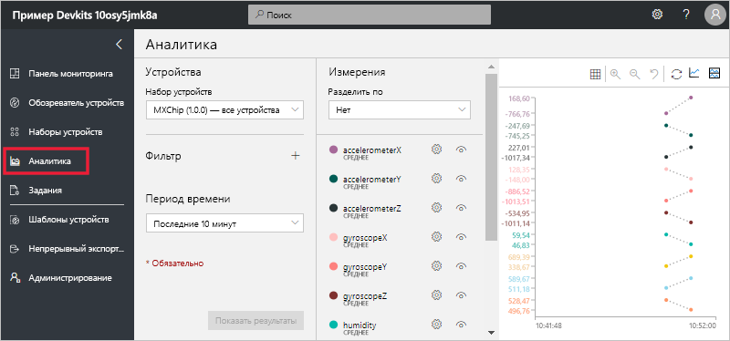

На странице аналитики отображаются диаграммы, с помощью которых можно определить поведение устройств, подключенных к приложению. На ней оператор может отслеживать и анализировать проблемы с подключенными устройствами. Сборщик может определять диаграммы, отображаемые на этой странице. Дополнительные сведения см. в статье [How to use analytics to analyze your device data](howto-use-device-sets.md) (Анализ данных устройства с помощью аналитики).

## Задания

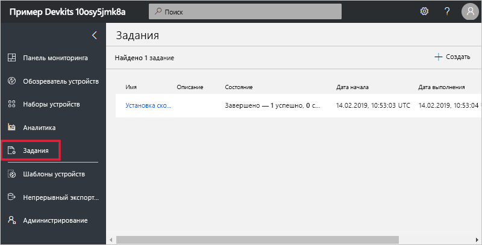

На странице "Задания" можно выполнять массовые операции управления устройствами. Построитель использует эту страницу для обновления свойств, параметров и команд устройства. Чтобы узнать больше, ознакомьтесь со статьей [Создание и запуск заданий в приложении Azure IoT Central](howto-run-a-job.md).

## Шаблоны устройств

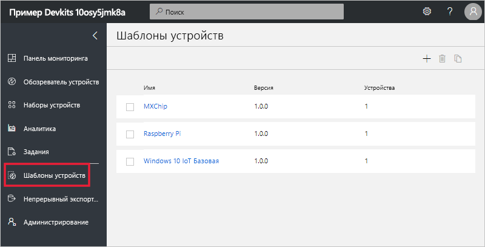

На странице шаблонов устройств построитель создает шаблоны устройств в приложении и управляет ими. Шаблон устройства определяет характеристики устройства, в том числе:

- данные телеметрии, состояние и измерения событий;
- параметры и свойства;
- команды;
- правила на основе событий или значений телеметрии.

Дополнительные сведения см. в статье [Define a new device type in your Azure IoT Central application](tutorial-define-device-type.md) (Определение типа нового устройства в приложении Azure IoT Central).

## Экспорт непрерывных данных

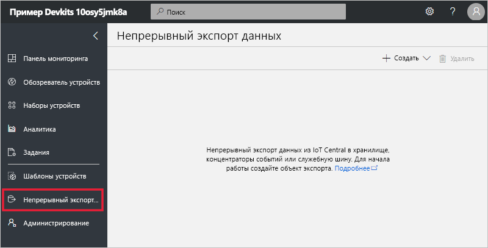

На странице "Экспорт непрерывных данных" администратор определяет, как выполнять потоковую передачу данных, например данных телеметрии, из приложения. Другие сервисы могут хранить экспортированные данные или использовать их для анализа. Дополнительные сведения см. в статье [Экспорт данных в Azure IoT Central](howto-export-data-blob-storage.md).

## Администрирование

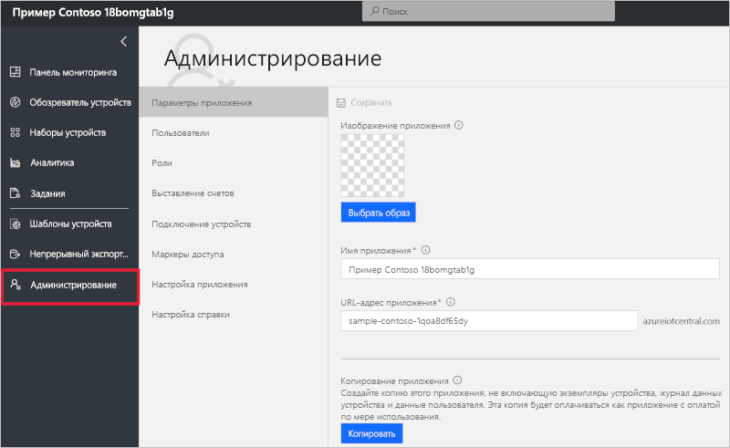

Страница "Администрирование" содержит ссылки на инструменты, используемые администратором, такие как определение пользователей и ролей в приложении, а также настройка пользовательского интерфейса. Дополнительные сведения см. в статье [How to administer your application](howto-administer.md) (Как управлять приложением).

## Дополнительная информация

Теперь, когда вы ознакомились с общими сведениями об Azure IoT Central и макетом пользовательского интерфейса, рекомендуем приступить к изучению краткого руководства [Create an Azure IoT Central application](quick-deploy-iot-central.md) (Создание приложения Azure IoT Central).
