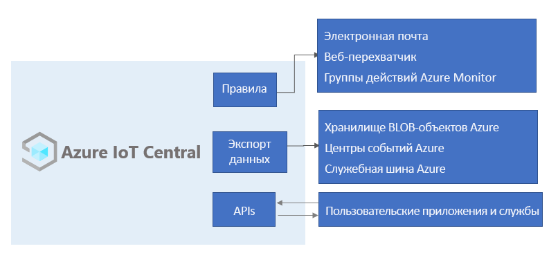

# Сведения об Azure IoT Central

IoT Central — это платформа приложений IoT, которая сокращает расходы и затраты на разработку и обслуживание решений IoT корпоративного уровня, а также на управление ими. Выбирая IoT Central для создания приложений, вы сможете выделить время, деньги и энергию на преобразование бизнеса с помощью данных Интернет вещей, а не просто поддерживать и обновлять сложную и постоянно развивающуюся инфраструктуру Интернета вещей.

Веб-интерфейс позволяет отслеживать состояние устройства, создавать правила и управлять миллионами устройств и их данными на протяжении всего жизненного цикла. Кроме того, он позволяет вам работать с аналитикой устройств, расширяя аналитику Интернета вещей в бизнес-приложения.

В этой статье об IoT Central содержатся следующие сведения:

- стандартные пользователи, связанные с проектом;
- создание приложения;
- подключение устройств к приложению;
- управление приложением.
- возможности Azure IoT Edge в IoT Central.
- подключение устройств, работающих в среде выполнения Azure IoT Edge, к приложению.

## Люди

В документации по IoT Central упоминаются четыре пользователя, которые взаимодействуют с приложением IoT Central.

- _Сборщик решений_ отвечает за настройку приложения для оператора и [определение типов устройств](howto-set-up-template.md), которые подключаются к приложению.
- _Оператор_ [управляет устройствами](howto-manage-devices.md), подключенными к приложению.
- _Администратор_ — выполняет задачи администрирования, такие как управление [ролями пользователей и разрешениями](howto-administer.md) в приложении.
- _Разработчик устройства_ [создает код, который выполняется на устройстве](concepts-telemetry-properties-commands.md) или [модуле IoT Edge](concepts-iot-edge.md), подключенном к приложению.

## Создание приложения IoT Central

Как разработчик решений, с помощью IoT Central вы можете создавать пользовательские решения IoT, размещенные в облаке, для своей организации. Пользовательское решение IoT обычно состоит из:

- облачного приложения, получающего данные телеметрии с устройств и позволяющего управлять этими устройствами;
- нескольких устройств, подключенных к облачному приложению и выполняющих пользовательский код.

Вы можете быстро развернуть новое приложение IoT Central, а затем настроить его в соответствии с конкретными требованиями в своем браузере. Можно начать с универсального _шаблона приложения_ или одного из отраслевых шаблонов приложений, предназначенных для [розничной торговли](../retail/overview-iot-central-retail.md), [энергетики](../energy/overview-iot-central-energy.md), [государственных организаций](../government/overview-iot-central-government.md) или [здравоохранения](../healthcare/overview-iot-central-healthcare.md).

Как разработчик решений, вы используете веб-инструменты, чтобы создавать _шаблоны устройств_, которые подключаются к приложению. Шаблон является схемой, которая определяет поведение и характеристики типа устройства, такие как:

- отправляемые данные телеметрии;
- бизнес-свойства, которые может изменить оператор;
- свойства устройства, заданные устройством, которые доступны только для чтения в приложении;
- свойства, которые устанавливает оператор и которые определяют поведение устройства.

Этот [шаблон устройства](howto-set-up-template.md) включает в себя:

- _Модель возможностей устройства_, описывающую возможности, которые устройство должно реализовать, такие как отправляемая им телеметрия и сообщаемые им свойства.
- Облачные свойства, которые не хранятся на устройстве.
- Настройки, панели мониторинга и формы, которые являются частью вашего приложения IoT Central.

### Создание шаблонов устройств

Как у разработчика решений, у вас есть несколько вариантов создания шаблонов устройств:

- Разработайте шаблон устройства в IoT Central, а затем внедрите его модель возможностей в код вашего устройства.
- Создайте модель возможностей устройства с помощью Visual Studio Code и опубликуйте модель в репозитории. Реализуйте код устройства из модели и подключите устройство к приложению IoT Central. IoT Central находит модель возможностей устройства в репозитории и автоматически создает простой шаблон устройства.
- Создайте модель возможностей устройства с помощью Visual Studio Code. Реализуйте код вашего устройства из модели. Вручную импортируйте модель возможностей устройства в приложение IoT Central, а затем добавьте все облачные свойства, настройки и панели мониторинга, необходимые этому приложению.

Как разработчик решений, с помощью IoT Central вы можете создать код для тестовых устройств, чтобы проверять свои шаблоны устройств.

Если вы разрабатываете устройства, ознакомьтесь с обзорной статьей [о разработке устройств для IoT Central](./overview-iot-central-developer.md), чтобы получить общие сведения о реализации устройств на основе этих шаблонов.

### Настройка пользовательского интерфейса

Как разработчик решений, вы также можете настроить пользовательский интерфейс приложения IoT Central для операторов, которые отвечают за ежедневное использование приложения. Настройки, выполняемые разработчиком решений, включают:

- определение макета свойств и параметров в шаблоне устройства;
- конфигурация настраиваемых панелей мониторинга, которые позволяют операторам выполнять анализ и быстро устранять проблемы;
- настройка пользовательской аналитики для просмотра данных временных рядов с подключенных устройств;

## Управление устройствами

Как оператор вы можете [управлять устройствами](howto-manage-devices.md) в своем решении IoT Central с помощью приложения IoT Central. Операторы выполняют следующие задачи:

- мониторинг устройств, подключенных к приложению;
- устранение неполадок и проблем, связанных с устройствами;
- подготовка новых устройств.

Как разработчик решений вы можете [определить настраиваемые правила и действия](howto-configure-rules.md), которые выполняются во время потоковой передачи данных из подключенных устройств. Оператор может включать или отключать эти правила на уровне устройства для автоматизации задач внутри приложения и управления ими.

Для любого решения Интернета вещей, предназначенного для работы в большом масштабе, важен структурированный подход к управлению устройствами. Недостаточно просто подключить ваши устройства к облаку. Они должны оставаться подключенными и работоспособными. Для управления устройствами в течение жизненного цикла приложения оператор может использовать следующие возможности IoT Central:

### Панели мониторинга

Встроенные [панели мониторинга](./howto-set-up-template.md#generate-default-views) предоставляют настраиваемый пользовательский интерфейс для отслеживания работоспособности и телеметрии устройств. Начните с предварительно созданной панели мониторинга в [шаблоне приложения](howto-use-app-templates.md) или создайте собственные панели, адаптированные к потребностям операторов. Доступ к панелям мониторинга можно предоставить всем пользователям в приложении или оставить их закрытыми.

### Правила и действия

Создайте [пользовательские правила](tutorial-create-telemetry-rules.md) на основе состояния устройства и телеметрии для идентификации устройств, требующих внимания. Настройте действия, чтобы уведомить нужных пользователей и обеспечить своевременное получение мер по исправлению.

### Задания

[Задания](howto-run-a-job.md) позволяют применять отдельные или групповые обновления к устройствам путем настройки свойств или вызова команд.

## Интеграция с другими службами

В качестве платформы приложений IoT Central позволяет преобразовывать данные Интернета вещей в бизнес-аналитику, которая обеспечивает ценные сведения. [Правила](./tutorial-create-telemetry-rules.md), [экспорт данных](./howto-export-data.md), а также [открытый интерфейс REST API](https://docs.microsoft.com/learn/modules/manage-iot-central-apps-with-rest-api/) являются примерами интеграции IoT Central с бизнес-приложениями.

Вы можете создавать бизнес-аналитику, например, определять тенденции эффективности оборудования или прогнозировать будущее энергопотребление в цехе, создавая пользовательские конвейеры аналитики для обработки данных телеметрии с устройств с последующим сохранением результатов. Настройте экспорт данных в приложении IoT Central, чтобы экспортировать данные телеметрии, изменять свойства устройств и шаблонов устройств в другие службы, где можно анализировать, хранить и визуализировать данные с помощью ваших предпочитаемых средств.

### Создание пользовательских решений Интернета вещей и интеграция с помощью REST API

Вы можете создать такие решения Интернета вещей:

- мобильные приложения, которые могут удаленно настраивать устройства и управлять ими;
- пользовательские интеграции, позволяющие имеющимся бизнес-приложениям взаимодействовать с устройствами Интернета вещей и данными;
- приложения управления устройствами для моделирования устройств, подключения, управления и доступа к данным.

## Администрирование приложения

Приложения IoT Central полностью размещаются корпорацией Майкрософт, что снижает административные издержки на управление приложениями. Администраторы управляют доступом к приложению, настраивая [пользовательские роли и разрешения](howto-administer.md).

## Цены

Приложение IoT Central можно создать с использованием 7-дневной бесплатной пробной версии или стандартного тарифного плана.

- Приложения, созданные с использованием плана *Бесплатный*, доступны в течение семи дней и поддерживают до пяти устройств. Их можно преобразовать для использования стандартного тарифного плана в любое время до истечения срока их действия.
- Плата за приложения, которые вы создаете с использованием плана *Стандартный*, начисляется отдельно за каждое устройство. Можно выбрать тарифный план **Стандартный 1** либо **Стандартный 2**, причем первые два устройства будут бесплатными. Дополнительные сведения о [ценообразовании в IoT Central](https://aka.ms/iotcentral-pricing).

## Квоты

Для каждой подписки Azure предусмотрены квоты по умолчанию, которые могут повлиять на область охвата решения Интернета вещей. В настоящее время IoT Central ограничивает количество приложений, которые можно развернуть в подписке, до 10. Если вам необходимо увеличить это ограничение, обратитесь в [службу поддержки Майкрософт](https://azure.microsoft.com/support/options/).

## Известные проблемы

- Непрерывный экспорт данных не поддерживает формат Avro (несовместимость).
- GeoJSON в настоящее время не поддерживается.
- Фрагмент карты в настоящее время не поддерживается.
- Типы схем массивов не поддерживаются.
- Поддерживаются только пакет SDK для устройств C, а также пакеты SDK для службы и устройства Node.js.
- Платформа IoT Central сейчас доступна в США, Европе, Азиатско-Тихоокеанском регионе, Австралии, Соединенном Королевстве и Японии.
- В таких расположениях, как Соединенное Королевство и Япония, нельзя использовать шаблон **Пользовательское приложение (прежние версии)** .
- У моделей возможностей устройства все интерфейсы должны быть указаны в одном файле.

## Дальнейшие действия

Теперь, когда вы ознакомились с IoT Central, предлагаем сделать следующее:

- Ознакомьтесь с доступными [технологиями и службами Azure для создания решений Интернета вещей](../../iot-fundamentals/iot-services-and-technologies.md).
- Если вы являетесь разработчиком устройства и хотите ознакомиться с кодом, [создайте и подключите клиентское приложение к приложению Azure IoT Central](./tutorial-connect-device-nodejs.md).
- Ознакомьтесь с [пользовательским интерфейсом Azure IoT Central](overview-iot-central-tour.md).
- [Создайте приложение Azure IoT Central](quick-deploy-iot-central.md).
- Дополнительные сведения см. в статье [Tutorial: Add an Azure IoT Edge device to your Azure IoT Central application](./tutorial-add-edge-as-leaf-device.md) (Учебник. Добавление устройства Azure IoT Edge в приложение Azure IoT Central).
- Дополнительные сведения см. в статье [Технологии и службы Azure для создания решений Интернета вещей](../../iot-fundamentals/iot-services-and-technologies.md).
