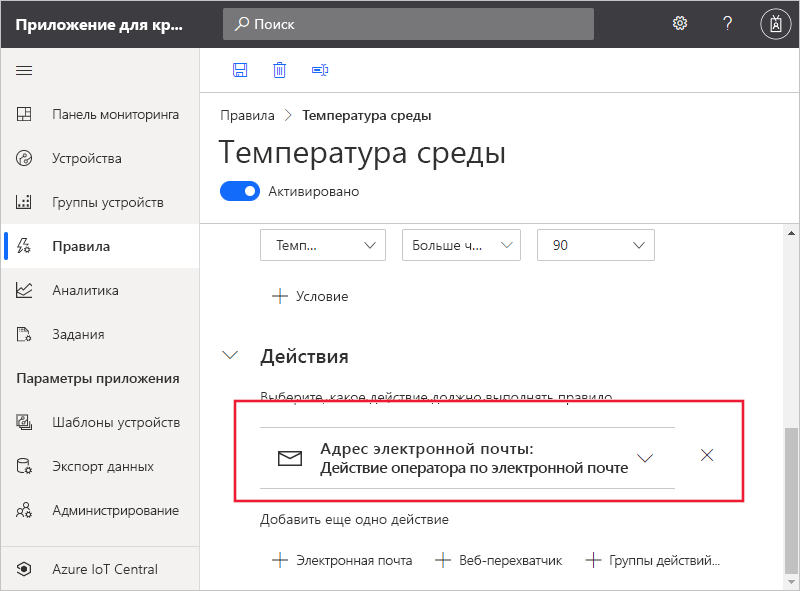

# Краткое руководство. Настройка правил и действий для устройства в Azure IoT Central

*Эта статья предназначена для операторов, разработчиков и администраторов.*

В этом кратком руководстве вы создадите правило, которое отправляет сообщение электронной почты, когда сообщаемая датчиком устройства температура превышает 90&deg; F.

## Предварительные требования

Перед началом работы вам необходимо завершить два предыдущих кратких руководства [Создание приложения Azure IoT Central](./quick-deploy-iot-central.md) и [Quickstart: Add a simulated device to your IoT Central application (preview features)](./quick-create-simulated-device.md) (Краткое руководство. Добавление имитированного устройства в приложение IoT Central), чтобы создать шаблон устройства **MXChip IoT DevKit** и работать с ним.

## Создание правила на основе телеметрии

1. Чтобы добавить новое правило на основе телеметрии в приложение, в панели слева выберите **Правила**.

1. Чтобы создать правило, выберите **+** .

1. Введите в качестве имени правила **Температура среды**.

1. В разделе **Целевые устройства** выберите **MXChip IoT DevKit** в качестве шаблона устройства. Эта опция фильтрует устройства, к которым применяется правило, по типу шаблона устройства. Дополнительные условия фильтрации можно добавить с помощью элемента **+ Фильтр**.

1. В разделе **Условия** определите условие, при котором будет активировано правило. Определите условие на основе телеметрии температуры, используя приведенные ниже сведения.

    | Поле        | Значение            |
    | ------------ | ---------------- |
    | Измерения  | температура;      |
    | Оператор     | больше  |
    | Значение        | 90               |

    Чтобы добавить дополнительные условия, выберите **+ Условие**.

    

1. Чтобы добавить действие электронной почты, выполняемое при активировании правила, выберите **+ Электронная почта**.

1. Определите действие, используя сведения в следующей таблице, а затем выберите **Готово**.

    | Параметр   | Значение                                             |
    | --------- | ------------------------------------------------- |
    | Отображаемое имя | Действие оператора по электронной почте                          |
    | Чтобы        | Ваш адрес электронной почты                                |
    | Примечания     | Температура среды превысила пороговое значение. |

    > [!NOTE]
    > Чтобы получить уведомление по электронной почте, адрес электронной почты должен быть [идентификатором пользователя в приложении](howto-administer.md), а пользователь должен выполнить вход в приложение по крайней мере один раз.

    

1. Щелкните **Сохранить**. Ваше правило будет указано на странице **Правила**.

## Тестирование правила

Вскоре после сохранения правила оно станет активным. При соблюдении условий, заданных в правиле, приложение отправляет сообщение на адрес электронной почты, указанный в действии.

> [!NOTE]
> Когда завершите тестирование, отключите правило, чтобы не получать уведомления в папке входящих сообщений.

## Дальнейшие действия

Из этого руководства вы узнали, как выполнить следующие действия:

* Создание правила на основе телеметрии
* Добавление действия

Дополнительные сведения о мониторинге подключенных к приложению устройств см. в разделе краткого руководства:

> [!div class="nextstepaction"]
> [Использование Azure IoT Central для мониторинга устройств](quick-monitor-devices.md).
