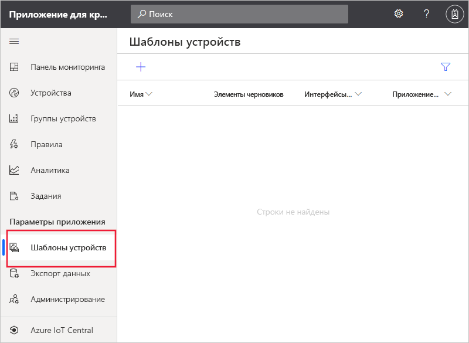
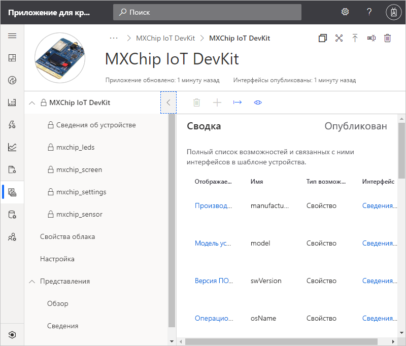
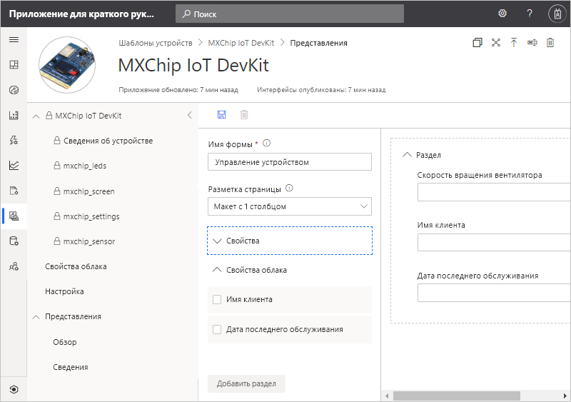
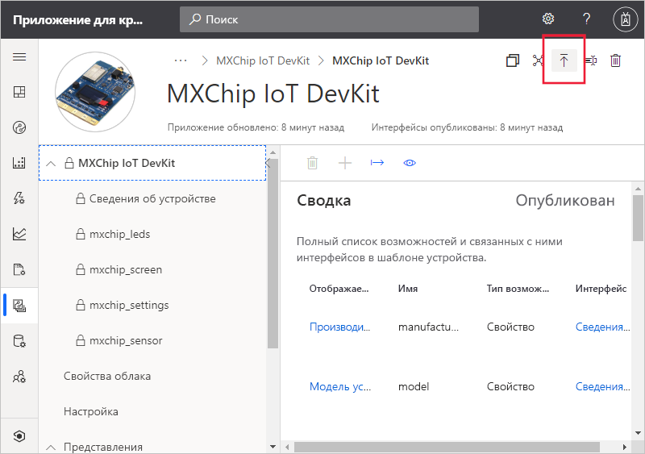
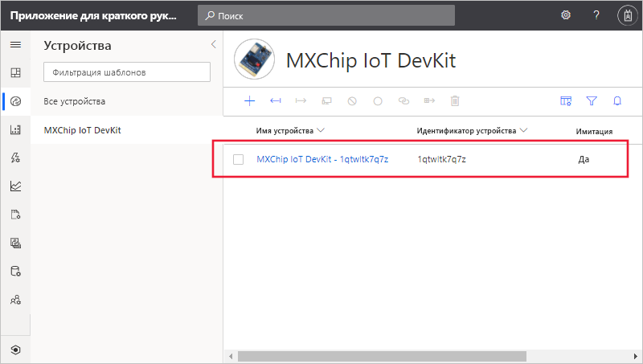
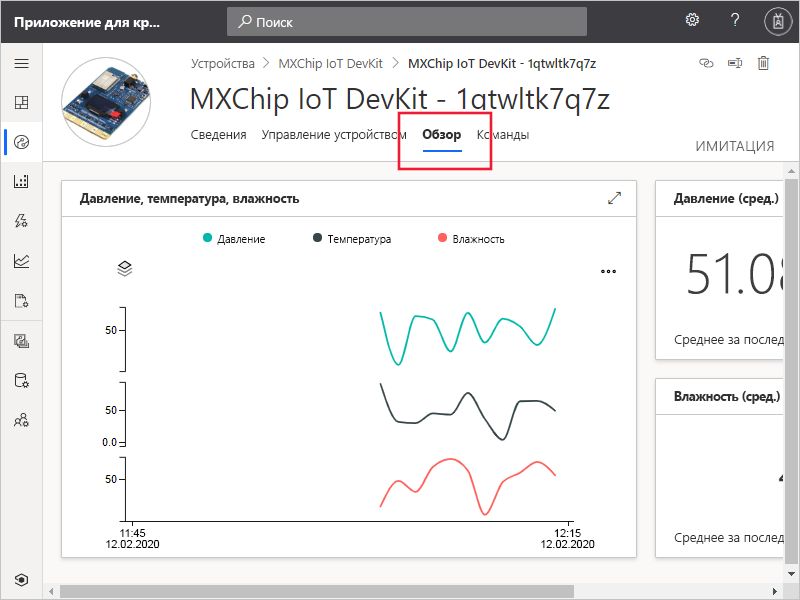
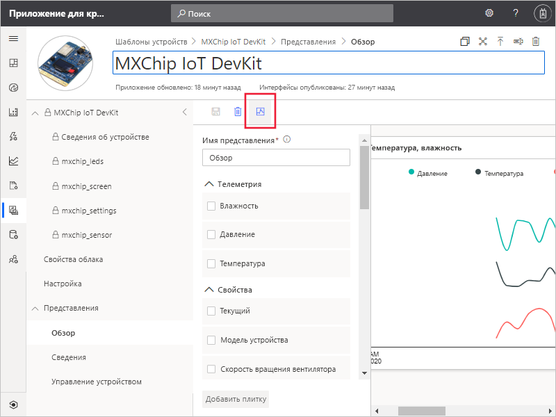

# Краткое руководство. Добавление имитированного устройства в приложение IoT Central

*Эта статья предназначена для операторов, разработчиков и администраторов.*

Шаблон устройства определяет возможности устройства, которое подключается к приложению IoT Central. К возможностям относятся отправляемые устройством данные телеметрии, свойства этого устройства и команды, на которые оно реагирует. Из шаблона устройства построитель или оператор может добавлять в приложение как реальные, так и имитированные устройства. Имитация устройств полезна для тестирования поведения приложения IoT Central перед подключением реальных устройств.

В рамках этого краткого руководства вы добавите шаблон устройства для платы *MXChip IoT DevKit* (DevKit) и создадите имитированное устройство. Для выполнения задач этого краткого руководства не требуется реальное устройство. Вы работаете только с имитацией устройства. Устройство DevKit выполняет следующие функции:

* отправляет данные телеметрии, например температуру;
* информирует о свойствах самого устройства, например об уровне яркости;
* реагирует на команды, например включения и отключения;
* информирует о базовых свойствах устройств, таких как версия встроенного ПО и серийный номер.

## Предварительные требования

Выполните инструкции из краткого руководства [Создание приложения Azure IoT Central](./quick-deploy-iot-central.md), чтобы создать приложение IoT Central с помощью шаблона **Пользовательское приложение > Пользовательское приложение**.

## Создание шаблона

Вы как разработчик можете создавать и редактировать шаблоны устройств в приложении IoT Central. После публикации шаблона устройства вы можете создать имитированное устройство или подключить реальные устройства, реализующие шаблон устройства. Имитированные устройства позволяют проверять поведение приложения перед подключением реального устройства.

Чтобы добавить в приложение новый шаблон устройства, выберите **Шаблоны устройств** в области слева.

Шаблон устройства содержит модель возможностей устройства, которые определяют отправляемые устройством данные телеметрии, свойства устройства и команды, на которые оно реагирует.

### Добавление модели возможностей устройства

В IoT Central есть несколько способов добавить модель возможностей устройства в приложение IoT Central. Вы можете создать модель с нуля, импортировать модель из файла или выбрать устройство из каталога устройств. Также IoT Central поддерживает подход *сначала устройство*. Это означает, что модель автоматически импортируется из репозитория при первом подключении устройства. В рамках этого краткого руководства вы выберете устройство из каталога устройств, чтобы импортировать его модель возможностей.

Ниже приведены инструкции по импорту модели возможностей устройства **MXChip IoT DevKit** с помощью каталога устройств. Эти устройства отправляют в приложение данные телеметрии, например показатели температуры и давления.

1. Чтобы добавить новый шаблон устройства, щелкните **+** на странице **Шаблоны устройств**.

1. На странице **выбора типа шаблона** прокрутите содержимое вверх, пока не найдете плитку **MXChip IoT DevKit**.

1. Выберите плитку **MXChip IoT DevKit** и щелкните **Далее. Настройка**.

1. На странице **Отзыв** выберите **Создать**.

1. Через несколько секунд отобразится новый шаблон устройства:

    

    Модель возможностей MXChip IoT DevKit включает такие интерфейсы, как **mxchip_sensor**, **mxchip_settings** и **Device Information** (Сведения об устройстве). Эти интерфейсы определяют возможности устройства MXChip IoT DevKit. К этим возможностям относятся данные телеметрии, свойства этого устройства и команды, на которые оно реагирует.

### Добавление свойств облака

Шаблон устройства может содержать свойства облака. Свойства облака существуют только в приложении IoT Central и никогда не отправляются на устройство и не принимаются с него.

1. Выберите **Свойства облака**, а затем **+ Добавить облачное свойство**. Воспользуйтесь сведениями из следующей таблицы, чтобы добавить в шаблон устройства два свойства облака.

    | Отображаемое имя      | Семантический тип | схема |
    | ----------------- | ------------- | ------ |
    | Дата последнего обслуживания | None          | Дата   |
    | Имя клиента     | None          | String |

1. Щелкните **Сохранить**, чтобы сохранить изменения.

    

## Представления

Вы как разработчик можете настроить в приложении отображение для оператора сведений о подключенном устройстве. Ваши настройки позволят оператору управлять устройствами, подключенными к приложению. Вы можете создать два типа представлений, которые позволят оператору взаимодействовать с устройствами.

* Формы для просмотра и редактирования свойств устройства и облака.
* панели мониторинга для визуализации устройств, включая отправленные ими данные телеметрии.

### Представления по умолчанию

Представления по умолчанию позволяют быстро приступить к визуализации важной информации об устройстве. Для шаблона устройства можно создать до трех представлений по умолчанию.

* Представление **Команды** позволяет оператору отправлять команды на устройство.
* В представлении **Обзор** отображаются данные телеметрии с устройства в виде схем и метрик.
* В представлении **Сведения** отображаются свойства устройства.

Выберите в шаблоне устройства узел **Представления**. Как видите, при добавлении шаблона в IoT Central автоматически создаются представления **Обзор** и **Сведения**.

Чтобы добавить для оператора новую форму **Управление устройством**, выполните следующее.

1. Выберите узел **Представления**, а затем щелкните плитку **Изменение устройства и облачных данных**, чтобы добавить новое представление.

1. Укажите для него имя **Управление устройством**.

1. Выделите свойства облака **Customer name** (Имя клиента) и **Last service date** (Дата последнего обслуживания), а также свойство **Fan Speed** (Скорость вентилятора). Затем щелкните **Добавить раздел**:

    

1. Щелкните **Сохранить**, чтобы сохранить новую форму.

## Публикация шаблона устройства

Прежде чем создавать имитированное устройство или подключать реальное, необходимо опубликовать шаблон устройства. IoT Central автоматически публикует шаблон при его создании, но теперь вам нужно опубликовать обновленную версию.

Для публикации шаблона устройства сделайте следующее:

1. Откройте шаблон устройства на странице **Шаблоны устройств**.

1. Выберите **Опубликовать**.

    

1. В диалоговом окне **Опубликовать этот шаблон устройства в приложении** щелкните **Опубликовать**. 

Когда публикация шаблона устройства завершится, он появится на странице **Устройства**. В опубликованном шаблоне устройства уже нельзя изменить модель возможностей устройства без создания новой версии. Но вы можете вносить изменения в свойства облака, настройки и представления в шаблоне опубликованного устройства, не создавая новых версий. После внесения изменений щелкните **Опубликовать**, чтобы передать эти изменения оператору.

## Добавление имитированного устройства

Чтобы добавить в приложение имитированное устройство, примените созданный ранее шаблон устройства **MXChip IoT DevKit**.

1. Чтобы добавить новое устройство, оператору нужно выбрать элемент **Устройства** на панели слева. На вкладке **Устройства** отображаются представление **Все устройства** и шаблон устройства **MXChip IoT DevKit**. Щелкните **MXChip IoT DevKit**.

1. Чтобы добавить имитированное устройство DevKit, щелкните **+** . Используйте рекомендуемый **код устройства** или введите **собственный** в нижнем регистре. Ви также можете ввести имя для нового устройства. Убедитесь, что переключатель **имитации** находится в положении **Включено** и щелкните **Создать**.

    

Теперь вы можете взаимодействовать с представлениями, которые разработчик создал для шаблона устройства, используя имитированные данные:

1. Выберите имитированное устройство на странице **Устройства**.

1. Представление **Обзор** демонстрирует график данных телеметрии, поступающих с имитированного устройства.

    

1. В представлении **Сведения** отображаются значения свойств, в том числе добавленных в представление свойств облака.

1. Представление **Команды** позволяет выполнять на устройстве команды, например **blink** (мигание).

1. Представление **Управление устройствами** содержит форму управления устройством, которую вы создали для оператора.

## Использование имитированного устройства для улучшения представлений

После того как вы создадите имитированное устройство, сборщик сможет использовать это устройство для улучшения имеющихся и создания других представлений для шаблона устройства.

1. На панели слева щелкните **Шаблоны устройств** и выберите шаблон **MXChip IoT DevKit**.

1. Выберите любое представление, которое хотите изменить, или создайте представление. Выберите **Configure preview device** (Настроить предварительный просмотр устройства) и щелкните **Select from a running device** (Выбрать из запущенных устройств). Здесь вы можете отключить использование устройств для предварительного просмотра, настроить реальное устройство для тестирования или выбрать уже существующее устройство, которое вы добавили в IoT Central.

1. Выберите имитированное устройство из списка. Затем выберите **Применить**. Теперь вы можете увидеть то же самое имитированное устройство в процессе сборки представлений для шаблона устройства. Это представление полезно для диаграмм и других визуализаций.

    

## Дальнейшие действия

Поработав с эти кратким руководством, вы научились создавать шаблон устройства **MXChip IoT DevKit** и добавлять в приложение имитированное устройство.

Дополнительные сведения о мониторинге подключенных к приложению устройств см. в разделе краткого руководства:

> [!div class="nextstepaction"]
> [Настройка правил и действий](./quick-configure-rules.md)
