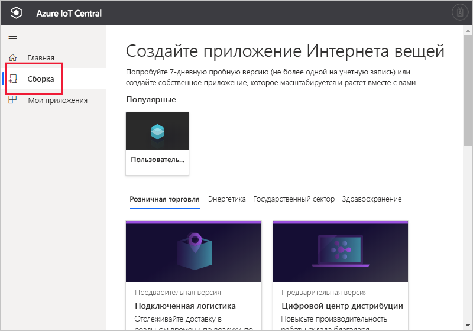

# Создание приложения Azure IoT Central

[!INCLUDE [iot-central-original-pnp](../../../includes/iot-central-original-pnp-note.md)]

С помощью пользовательского интерфейса Azure IoT Central _конструктор_ может определить свое приложение Microsoft Azure IoT Central. В этом кратком руководстве объясняется, как создать приложение Azure IoT Central, которое содержит пример _шаблона устройства_. Создаваемое приложение не использует предварительные версии функций.

## Создание приложения

Перейдите на веб-сайт [сборки Azure IoT Central](https://aka.ms/iotcentral). Затем выполните вход с помощью личной, рабочей или учебной учетной записи Microsoft.

Чтобы приступить к созданию приложения Azure IoT Central без включенных предварительных версий функций, щелкните **Выполнить сборку**. Вы перейдете на страницу **Сборка приложения IoT**.

Затем щелкните **Настраиваемое приложение**.

Чтобы создать приложение Azure IoT Central, сделайте следующее:

1. Azure IoT Central автоматически предлагает имя приложения на основе выбранного шаблона приложения. Вы можете принять это имя или ввести свое понятное имя приложения, например **Contoso IoT**. Azure IoT Central также создает уникальный URL-адрес на основе имени приложения. Вы можете свободно изменить этот префикс на что-то более запоминающееся, если захотите.

1. Выберите шаблон **Приложение прежних версий**, в котором отсутствуют предварительные версии функций.

    | Шаблон приложения | Description |
    | -------------------- | ----------- |
    | Приложение прежних версий   | Создает пустое приложение, в которое необходимо добавить собственные шаблоны устройств и сами устройства. |

1. Выберите план оплаты:
   - **Пробные версии** приложений предоставляются бесплатно в течение 7 дней, после чего их уже нельзя использовать. Их можно преобразовать для **оплаты по мере использования** в любое время до истечения срока действия. Если вы создаете **пробную версию** приложения, необходимо ввести свои контактные данные и выбрать, хотите ли вы получать сведения и советы от корпорации Майкрософт.
   - При использовании приложений **с оплатой по мере использования** плата взимается за каждое устройство, при этом первые 5 устройств предоставляются бесплатно. При создании приложения **с оплатой по мере использования** необходимо выбрать *каталог*, *подписку Azure* и *расположение*.
        - *Каталог* — Azure Active Directory (AD) для создания приложения. Он содержит удостоверения пользователей, учетные данные и другие сведения об организации. Если у вас нет клиента Azure Active Directory, он будет создан автоматически при создании подписки Azure.
        - *Подписка Azure* позволяет создавать экземпляры служб Azure. IoT Central подготавливает ресурсы в вашей подписке. Если у вас еще нет подписки, создайте ее на [странице входа в Azure](https://aka.ms/createazuresubscription). После создания подписки Azure вернитесь на страницу **Создание приложения**. В раскрывающемся списке **Подписка Azure** отобразится новая подписка.
        - *Расположение* — [географический регион](https://azure.microsoft.com/global-infrastructure/geographies/), где вы хотите создать приложение. Как правило, следует выбирать расположение как можно ближе к устройствам, чтобы обеспечить оптимальную производительность. В настоящее время Azure IoT Central доступна в **США**, **Австралии**, **Азиатско-Тихоокеанском регионе** и в **Европе**.  Выбрав расположение, вы не сможете переместить приложение в другое расположение.

        Узнайте больше о ценах на службу Azure IoT Central на [этой странице](https://azure.microsoft.com/pricing/details/iot-central/).

1. Заполните дополнительную информацию, необходимую для выбранного ранее (на шаге 1) плана оплаты.

1. В нижней части страницы выберите **Создать**.

## Дальнейшие действия

В этом кратком руководстве вы создали приложение IoT Central. Ниже приведено предлагаемое дальнейшее действие:

> [!div class="nextstepaction"]
> [Определение типа нового устройства в приложении Azure IoT Central](./tutorial-define-device-type.md)
