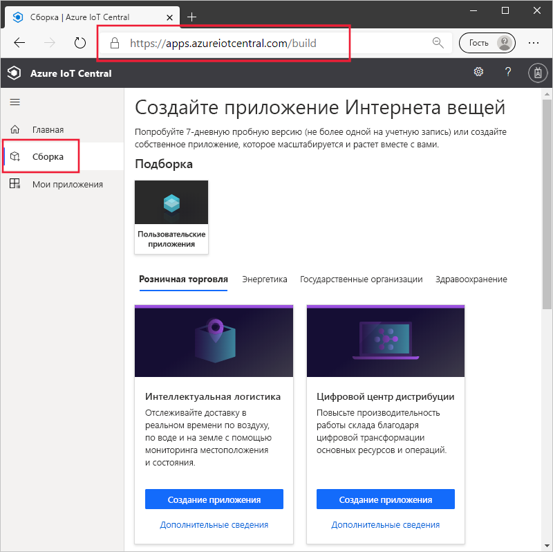
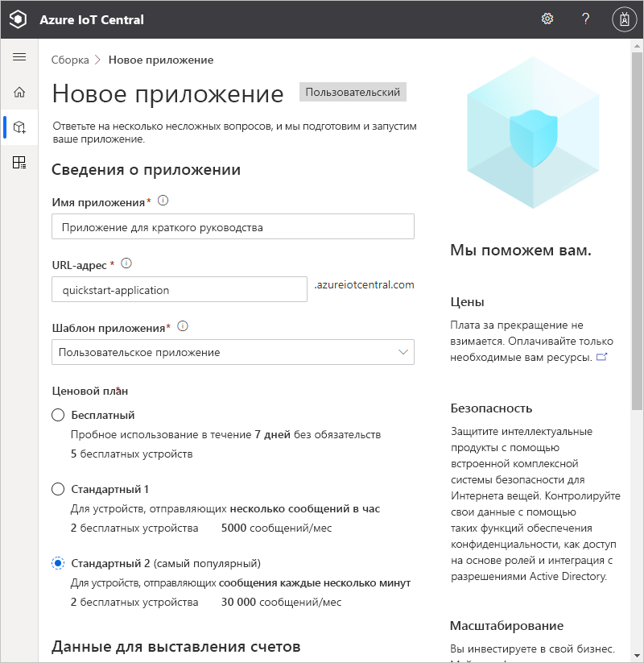
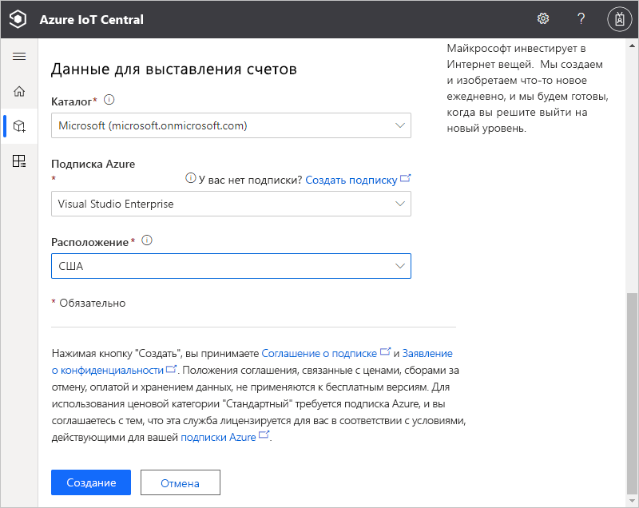
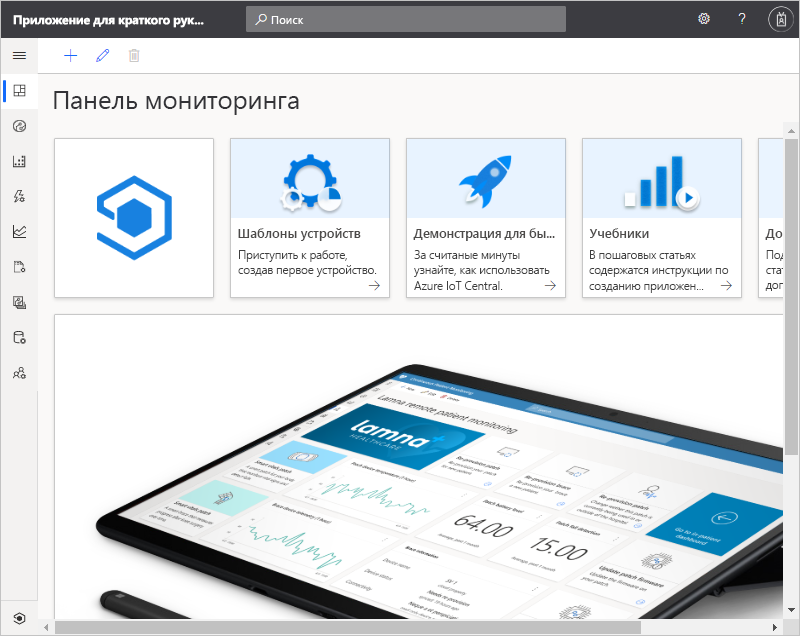

# Краткое руководство. Создание приложения Azure IoT Central

В этом кратком руководстве описано, как создать приложение IoT Central Azure.

## Создание приложения

Перейдите на сайт [сборки Azure IoT Central](https://aka.ms/iotcentral). Затем выполните вход с помощью личной, рабочей или учебной учетной записи Microsoft.

Новое приложение можно создать из списка шаблонов IoT Central, соответствующих отраслям, что позволяет быстро приступить к работе, или с нуля с помощью шаблона **пользовательского приложения**. В этом кратком руководстве используется шаблон **пользовательского приложения**.

Для создания приложения Azure IoT Central из шаблона **пользовательского приложения** сделайте следующее.

1. Перейдите на страницу **Сборка**:

    

1. Выберите **Пользовательские приложения** и убедитесь, что выбран шаблон **пользовательского приложения**.

1. Azure IoT Central автоматически предлагает **имя приложения** на основе выбранного шаблона приложения. Вы можете использовать это имя или ввести свое понятное имя приложения.

1. Azure IoT Central также создает уникальный префикс **URL-адреса приложения** на основе имени приложения. Этот URL-адрес используется для доступа к приложению. Измените этот префикс на что-то более запоминающееся, если захотите.

    

    

    > [!NOTE]
    > Если на предыдущей странице вы выбрали **пользовательское приложение**, отобразится раскрывающийся список **Шаблон приложения**. В нем также могут отображаться другие шаблоны, которые к которым вам предоставила доступ ваша организация. 

    >[!IMPORTANT]
    >Шаблон **Пользовательское приложение (устаревшее)** (версии 2) больше не поддерживается, а все возможности, доступные ранее в шаблоне устаревшего приложения, теперь предоставляются в новом шаблоне **Пользовательское приложение** (версии 3). 
    
1. Выберите, как создать это приложение, используя 7-дневный бесплатный пробный ценовой план или один из стандартных ценовых планов.

    - Приложения, созданные с использованием плана *Бесплатный*, доступны в течение семи дней и поддерживают до пяти устройств. Их можно преобразовать для использования стандартного тарифного плана в любое время до истечения срока их действия.
    - Плата за приложения, которые вы создаете с использованием плана *Стандартный*, начисляется отдельно за каждое устройство. Можно выбрать тарифный план **Стандартный 1** либо **Стандартный 2**, причем первые два устройства будут бесплатными. Дополнительные сведения о бесплатном и стандартном тарифных планах см. на [странице с ценами на Azure IoT Central](https://azure.microsoft.com/pricing/details/iot-central/). При создании приложения с использованием тарифного плана "Стандартный" необходимо выбрать *каталог*, *подписку Azure* и *расположение*:
        - *Каталог* — Azure Active Directory, в котором будет создано приложение. Azure Active Directory содержит удостоверения пользователей, учетные данные и другие сведения об организации. Если у вас нет Azure Active Directory, он будет создан автоматически при создании подписки Azure.
        - *Подписка Azure* позволяет создавать экземпляры служб Azure. IoT Central подготавливает ресурсы в вашей подписке. Если у вас еще нет подписки, создайте ее бесплатно на [странице регистрации в Azure](https://aka.ms/createazuresubscription). После создания подписки Azure перейдите на страницу **Новое приложение**. Теперь в раскрывающемся списке **Подписка Azure** отобразится новая подписка.
        - *Расположение* — [географический регион](https://azure.microsoft.com/global-infrastructure/geographies/), где вы хотите создать приложение. Как правило, следует выбирать расположение как можно ближе к устройствам, чтобы обеспечить оптимальную производительность. Выбрав расположение, вы не сможете переместить приложение в другое расположение.

1. Просмотрите условия и выберите **Создать** в нижней части страницы. Через несколько минут приложение IoT Central готово к использованию:

    

## Дальнейшие действия

В этом кратком руководстве вы создали приложение IoT Central. Чтобы продолжить изучение IoT Central, ознакомьтесь со следующим руководством:

> [!div class="nextstepaction"]
> [Quickstart: Add a simulated device to your IoT Central application (preview features)](./quick-create-simulated-device.md) (Добавление имитированного устройства в приложение IoT Central (предварительные версии функций))

Если вы являетесь разработчиком устройства и хотите углубиться в код, ознакомьтесь со следующим руководством:
> [!div class="nextstepaction"]
> [Создание клиентского приложения и его подключение к приложению Azure IoT Central](./tutorial-connect-device-nodejs.md)