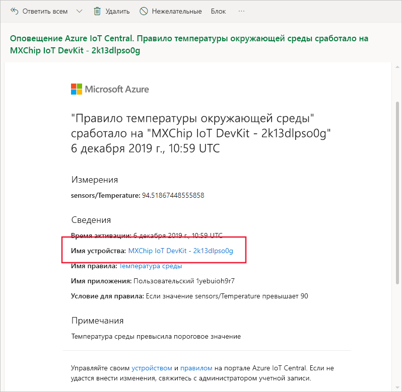
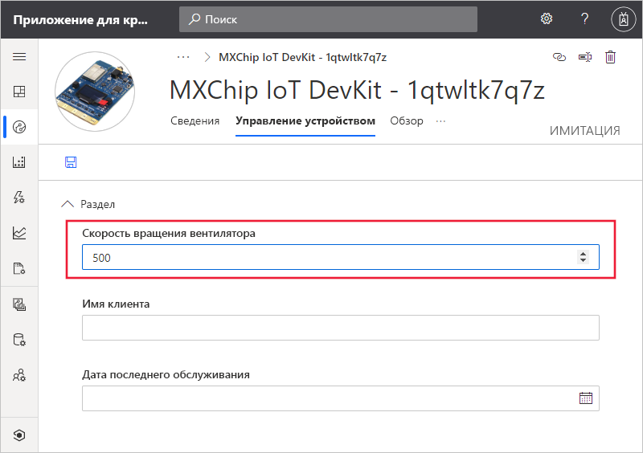

# Краткое руководство. Использование Azure IoT Central для мониторинга устройств

*Эта статья предназначена для операторов, разработчиков и администраторов.*

В этом кратком руководстве показано, как с помощью приложения Microsoft Azure IoT Central оператор может выполнять мониторинг устройств и изменять параметры.

## Предварительные требования

Прежде чем начать, выполните инструкции из руководств по [созданию приложения Azure IoT Central](./quick-deploy-iot-central.md), [добавлению имитированного устройства в приложение IoT Central](./quick-create-pnp-device.md) и [настройке правил и действий для устройства](quick-configure-rules.md).

## Получение уведомления

Azure IoT Central отправляет уведомления об устройствах как сообщения электронной почты. Конструктор добавил правило для отправки уведомления в случае, если температура в датчике подключенного устройства превышает порог. Проверьте сообщения, отправленные в учетную запись, выбранную конструктором для получения уведомлений.

Откройте сообщение, полученное в конце работы с кратким руководством по [настройке правил и действий для устройства](quick-configure-rules.md). В письме выберите ссылку на устройство:

В браузере откроется представление **Обзор** для имитированного устройства, созданного при работе с предыдущими краткими руководствами.

## Изучение проблемы

Оператор может просматривать сведения об устройстве в представлениях **Обзор**, **О программе** и **Команды**. Построитель создал представление **Управление устройством**, чтобы предоставить вам возможность изменять сведения об устройстве и задавать свойства устройства.

На панели мониторинга показан график температуры устройства. Вы решили, что температура устройства слишком велика.

## Устранение проблемы

Чтобы внести изменения в устройство, используйте страницу **Управление устройством**.

Измените **Скорость вентилятора** до 500 оборотов для охлаждения устройства. Нажмите кнопку **Сохранить**, чтобы обновить устройство. Когда устройство подтверждает изменение параметров, состояние свойства изменяется на **синхронизировано**:

## Дальнейшие действия

Из этого руководства вы узнали, как выполнить следующие действия:

* Получение уведомления
* Изучение проблемы
* Устранение проблемы

Теперь, когда вам известно о мониторинге устройства, рекомендуется выполнить такой следующий шаг:

> [!div class="nextstepaction"]
> [Создание и администрирование шаблона устройства](howto-set-up-template.md).
