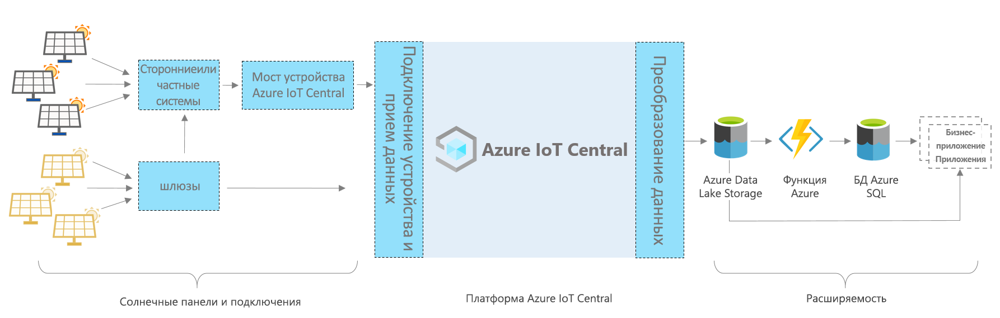

# Azure IoT Central: архитектура приложения для солнечных панелей

В этой статье приводятся общие сведения об архитектуре шаблона приложения для мониторинга солнечных панелей. На схеме ниже показана распространенная архитектура приложения для солнечных панелей в Azure с использованием платформы IoT Central.

> [!div class="mx-imgBorder"]
> 

Архитектура состоит из следующих компонентов. Для некоторых приложений могут требоваться лишь некоторые из перечисленных здесь компонентов.

## Солнечные панели и подключение 

Солнечные панели являются одним из важнейших источников возобновляемой энергии. В зависимости от типа и конфигурации солнечную панель можно подключить с помощью шлюзов или других промежуточных устройств и собственных систем. Возможно, потребуется создать мост IoT Central для подключения устройств, которые нельзя подключить напрямую. Мост IoT Central для устройств — это решение с открытым кодом, и [здесь](https://docs.microsoft.com/azure/iot-central/core/howto-build-iotc-device-bridge) вы можете найти подробные сведения о нем. 

## Платформа IoT Central
Azure IoT Central — платформа, которая упрощает создание решений Интернета вещей, а также помогает снизить нагрузку и расходы, связанные с управлением, эксплуатацией и разработкой таких решений. С помощью IoT Central можно легко подключить, отслеживать и контролировать ресурсы Интернета вещей в соответствующем масштабе. После подключения солнечных панелей к IoT Central шаблон приложения использует встроенные функции, такие как модели устройств, команды и панели мониторинга. Шаблон приложения также использует хранилище IoT Central для сценариев "горячего" пути, в том числе для мониторинга данных расходомеров в реальном времени, аналитики, применения правил и визуализации.

## Параметры расширяемости для разработки с помощью IoT Central
Платформа IoT Central предоставляет два варианта расширяемости: непрерывный экспорт данных (CDE) и интерфейсы API. Клиенты и партнеры могут выбрать один из этих вариантов, чтобы настроить свои решения в соответствии с конкретными потребностями. Например, один из наших партнеров настроил CDE с помощью Azure Data Lake Storage (ADLS). Они используют ADLS для долгосрочного хранения данных и других сценариев хранилища "холодного" пути, в том числе для пакетной обработки, аудита и создания отчетов. 

## Дальнейшие действия

* Теперь, когда вы изучили архитектуру, вы можете [бесплатно создать приложение для солнечных панелей](https://apps.azureiotcentral.com/build/new/solar-panel-monitoring).
* Чтобы узнать больше об IoT Central, прочитайте [общие сведения об IoT Central](https://docs.microsoft.com/azure/iot-central/).