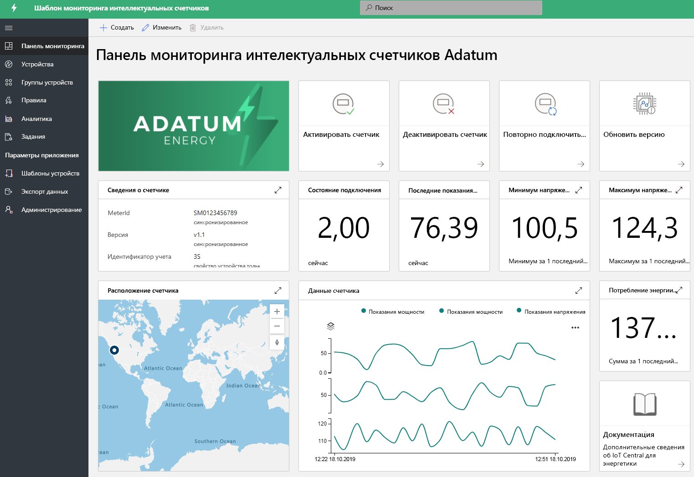

# Создание решений для энергетики с помощью IoT Central 

[!INCLUDE [iot-central-pnp-original](../../../includes/iot-central-pnp-original-note.md)]

Интеллектуальные расходомеры и солнечные панели играют важную роль в преобразовании энергетической отрасли. Интеллектуальные расходомеры обеспечивают больший контроль и больше полезных сведений в реальном времени об энергопотреблении, а распространение солнечных панелей стимулирует прорыв в области генерирования возобновляемой энергии. Приложения для мониторинга интеллектуальных расходомеров и солнечных панелей — всего лишь примеры шаблонов для демонстрации различных возможностей. Партнеры могут использовать эти шаблоны, чтобы создавать решения для сферы энергетики на основе IoT Central в соответствии со своими потребностями. Для развертывания и использования этих приложений не требуется никакого нового кода и дополнительных затрат. Узнайте больше о шаблонах приложений для сферы энергетики и их возможностях.

## Что такое приложение для мониторинга интеллектуальных расходомеров?
 Интеллектуальные расходомеры не только обеспечивают автоматическое выставление счетов, но и дополнительные возможности измерения, такие как чтение показаний в реальном времени и двунаправленная связь. Шаблон приложения для интеллектуальных расходомеров позволяет коммунальным предприятиям и партнерам отслеживать состояние и данные интеллектуальных расходомеров, а также определять оповещения и уведомления. Он содержит примеры команд, например, для отключения расходомера и обновления программного обеспечения. Можно настроить передачу данных расходомеров в другие бизнес-приложения, а также использовать их для разработки пользовательских решений. 

Основные функциональные возможности приложения: 

* пример модели устройства расходомера; 
* сведения о расходомере и его состоянии в реальном времени; 
* показания расходомеров, такие как электроэнергия, мощность и напряжения;
* примеры команд расходомера; 
* встроенные средства визуализации и панели мониторинга;
* расширяемость для разработки пользовательских решений.

Вы можете поработать с [приложением для мониторинга интеллектуальных расходомеров бесплатно](https://apps.azureiotcentral.com/build/new/smart-meter-monitoring) без подписки Azure и каких-либо обязательств.

После развертывания приложения вы увидите имитированные данные расходомеров на панели мониторинга, как показано на рисунке ниже. Этот шаблон представляет собой пример приложения, который можно легко расширить и настроить для конкретных вариантов использования.

> [!div class="mx-imgBorder"]
> 

## Что такое приложение для мониторинга солнечных панелей?
Приложение для мониторинга солнечных панелей позволяет коммунальным службам и партнерам отслеживать солнечные панели, например генерирование электроэнергии и состояние подключения, практически в реальном времени. Оно может отправлять уведомления на основе определенных граничных критериев. Это приложение содержит примеры команд, например, для обновления встроенного ПО, и другие свойства. Можно настроить передачу данных солнечных панелей в другие бизнес-приложения, а также использовать их для разработки пользовательских решений. 

Основные функциональные возможности приложения: 

* пример модели устройства солнечной панели; 
* сведения о солнечной панели и ее состоянии в реальном времени;
* генерирование электроэнергии солнечной панелью и другие показания;
* примеры команд и элементов управления;
* встроенные средства визуализации и панели мониторинга;
* расширяемость для разработки пользовательских решений.

Вы можете поработать с [приложением для мониторинга солнечных панелей бесплатно](https://apps.azureiotcentral.com/build/new/solar-panel-monitoring) без подписки Azure и каких-либо обязательств.

Через 1–2 минуты после развертывания приложения вы увидите имитированные данные солнечных панелей, как показано на панели мониторинга ниже. Этот шаблон представляет собой пример приложения, который можно легко расширить и настроить для конкретных вариантов использования. 

> [!div class="mx-imgBorder"]
> 

## Дополнительная информация
Чтобы приступить к разработке решения для сферы энергетики:
* Бесплатно создайте шаблоны приложений: [приложение для интеллектуальных расходомеров](https://apps.azureiotcentral.com/build/new/smart-meter-monitoring) и [приложение для солнечных панелей](https://apps.azureiotcentral.com/build/new/solar-panel-monitoring).
* Узнайте больше о [принципах работы приложения для интеллектуальных расходомеров](https://docs.microsoft.com/azure/iot-central/energy/concept-iot-central-smart-meter-app).
* Узнайте больше о [принципах работы приложения для солнечных панелей](https://docs.microsoft.com/azure/iot-central/energy/concept-iot-central-solar-panel-app).
* Узнайте о [платформе IoT Central](https://docs.microsoft.com/azure/iot-central/).
