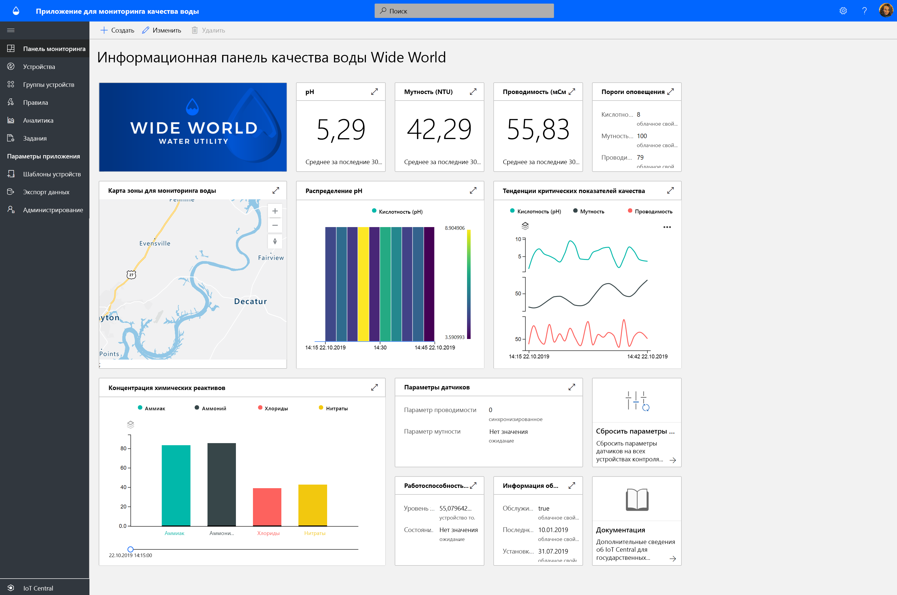
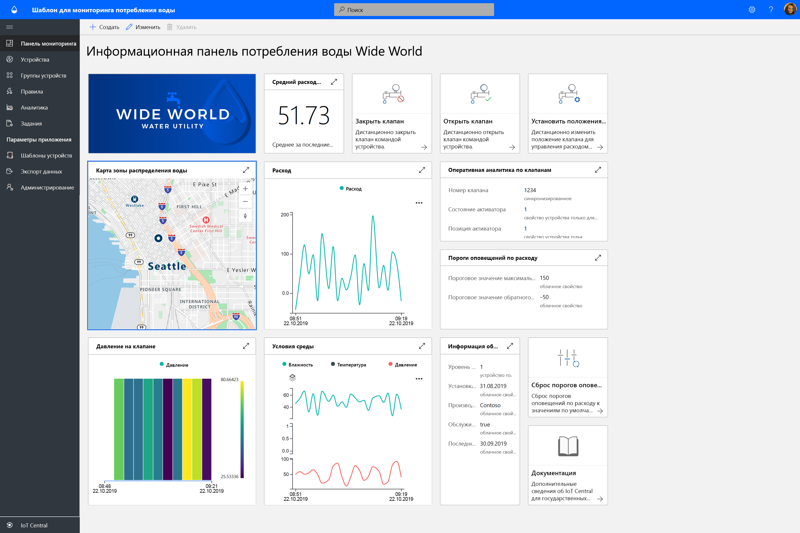
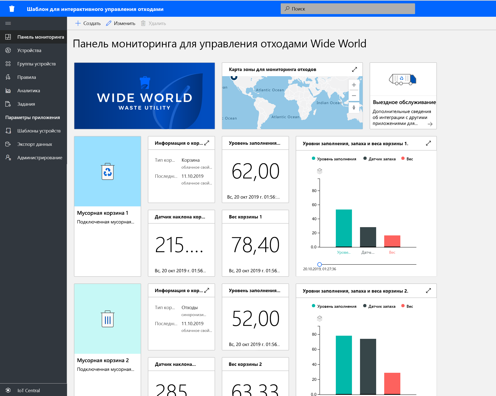

# Создание решений для государственных организаций с помощью Azure IoT Central

[!INCLUDE [iot-central-pnp-original](../../../includes/iot-central-pnp-original-note.md)]

Начните создавать решения для интеллектуальных городов, используя шаблоны приложений Azure IoT Central. Начните сейчас с решений для **мониторинга качества воды**, **мониторинга потребления воды** и **интерактивного управления отходами**.

## Что такое шаблон приложения для мониторинга качества воды?   

Традиционный процесс мониторинга качества воды основан на ручных методах выборки и анализе в полевых лабораториях, который требует много времени и средств. С помощью удаленного мониторинга качества воды в режиме реального времени проблемы с качеством воды могут быть решены до того, как это повлияет на население. Более того, благодаря расширенной аналитике водопроводное хозяйство и природоохранные органы могут заблаговременно предупреждать о потенциальных проблемах с качеством воды и заранее планировать ее очистку.  

Приложение для мониторинга качества воды — это шаблон приложения IoT Central, который поможет вам начать разработку решения Интернета вещей, позволяющего водопроводному хозяйству осуществлять цифровой мониторинг качества воды в интеллектуальных городах. 

Шаблон приложения состоит из:
* примеров панелей мониторинга для операторов;
* примеров шаблонов устройства для мониторинга качества воды;
* имитированных устройств для мониторинга качества воды;
* предварительно настроенных правил и заданий;
* фирменной символики с использованием белых меток. 

Приступите к работе, ознакомившись с [учебником по созданию приложения для мониторинга качества воды в IoT Central](./tutorial-water-quality-monitoring.md).

## Что такое шаблон приложения для мониторинга потребления воды? 

Традиционный процесс отслеживания потребления воды основан на том, что операторы организаций водоснабжения вручную считывают показатели потребления воды на участках размещения счетчиков. Все больше городов заменяют традиционные счетчики на современные интеллектуальные счетчики. Они позволяют осуществлять удаленный мониторинг потребления, а также удаленно управлять клапанами для контроля потока воды. Мониторинг потребления воды в сочетании с цифровым обратным сообщением для граждан может повысить осведомленность и снизить потребление воды. 

Приложение для мониторинга потребления воды — это шаблон приложения IoT Central, который поможет вам начать разработку решения Интернета вещей, позволяющего водопроводному хозяйству и городам осуществлять удаленный мониторинг и контроль потока воды для уменьшения степени потребления. 

  

Шаблон приложения для мониторинга потребления воды состоит из таких предварительно настроенных компонентов:
* примеров панелей мониторинга для операторов;
* примеров шаблонов устройства для мониторинга качества воды;
* имитированных устройств для мониторинга качества воды;
* предварительно настроенных правил и заданий;
* фирменной символики с использованием белых меток. 

 Приступите к работе, ознакомившись с [учебником по созданию приложения для мониторинга потребления воды в IoT Central](./tutorial-water-consumption-monitoring.md).

## Что такое шаблон приложения для интерактивного управления отходами? 

Приложение для интерактивного управления отходами — это шаблон приложения IoT Central, который поможет вам приступить к разработке решения Интернета вещей, позволяющего интеллектуальным городам осуществлять удаленный мониторинг для повышения эффективности сбора отходов. 

 

Шаблон приложения для интерактивного управления отходами состоит из таких предварительно настроенных компонентов:
* примеров панелей мониторинга для операторов;
* примеров шаблонов устройств для интерактивных мусорных баков;
* имитированных устройств для интерактивных мусорных баков;
* предварительно настроенных правил и заданий;
* фирменной символики с использованием белых меток. 

Приступите к работе, ознакомившись с [учебником по созданию приложения для интерактивного управления отходами в IoT Central](./tutorial-connected-waste-management.md).

## Дополнительная информация

* Воспользуйтесь одним из шаблонов приложения для государственных организаций в IoT Central, чтобы бесплатно [создать приложение](https://apps.azureiotcentral.com/build/government).
* [Эталонная архитектура решения для мониторинга качества воды](./concepts-waterqualitymonitoring-architecture.md)
* [Эталонная архитектура решения для мониторинга потребления воды](./concepts-waterconsumptionmonitoring-architecture.md)
* [Эталонная архитектура решения для интеллектуального мониторинга отходов](./concepts-connectedwastemanagement-architecture.md)  
* [Общие сведения об IoT Central](https://docs.microsoft.com/azure/iot-central/core/overview-iot-central)
 