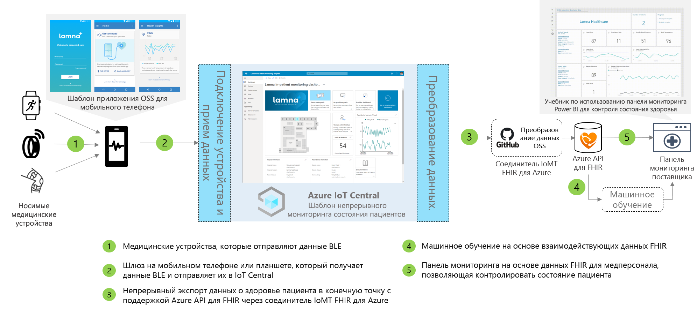

# Архитектура приложения для непрерывного мониторинга состояния пациентов

Решения для непрерывного мониторинга состояния пациентов можно создавать, используя предоставленный шаблон приложения и описанную ниже архитектуру в качестве инструкций.

>[!div class="mx-imgBorder"] 
>

1. Медицинские устройства, взаимодействующие через Bluetooth с низким энергопотреблением (BLE)
1. Шлюз мобильного телефона, который получает данные BLE и отправляет их в IoT Central
1. Непрерывный экспорт данных о здоровье пациента в Azure API для FHIR &reg;
1. Машинное обучение на основе взаимодействующих данных
1. Панель мониторинга медперсонала, созданная на основе данных FHIR

## Сведения
В этом разделе содержатся подробные сведения о каждой части схемы архитектуры.

### Медицинские устройства BLE
Многие медицинские переносные устройства, используемые в сфере Интернета вещей для здравоохранения, — это устройства Bluetooth с низким энергопотреблением. Они не могут непосредственно обманываться данными с облаком и должны проходить через шлюз. Эта архитектура предполагает использование приложения мобильного телефона в качестве шлюза.

### Шлюз через мобильный телефон
Основная функция приложения мобильного телефона — прием данных BLE с медицинских устройств и их передача в Azure IoT Central. Кроме того, с помощью настройки устройства и потока подготовки, приложение может служить ориентиром для пациентов и помочь им увидеть данные о личном здоровье. Чтобы достичь того же потока связи, другие решения, если они находятся внутри палаты, могут использовать шлюз через планшет или статический шлюз.

### Экспорт в Azure API для FHIR&reg;
Хотя IoT Central Azure является совместимым с HIPAA и сертифицированным HITRUST&reg;, вам также может потребоваться отправить данные о состоянии здоровья пациента в API Azure для FHIR. [Azure API для FHIR](../../healthcare-apis/overview.md) — это полностью управляемый, основанный на стандартах, соответствующий нормативным требованиям API-интерфейс для медицинских данных, с помощью которого можно создавать новые системы взаимодействия с показателями здоровья. Он обеспечивает быстрый обмен данными через API FHIR и работает на основе предложения PaaS (платформа как услуга) в облаке. Используя функцию "Непрерывный экспорт данных" в IoT Central, вы можете отправить данные в API Azure для FHIR.

### Машинное обучение
После объединения данных и их перевода в формат FHIR вы можете создать модели машинного обучения, которые обогатят ваши аналитические сведения и позволят вашей медкоманде принимать более рациональные решения. Существуют различные виды служб, которые можно использовать для создания, обучения и развертывания моделей машинного обучения. Дополнительные сведения об использовании предложений машинного обучения Azure можно найти в [документации по машинному обучению](../../machine-learning/index.yml).

### Панель мониторинга поставщика
Размещенные в Azure API для FHIR данные можно использовать для создания панели сведений о пациенте или непосредственной интеграции в EMR, чтобы помочь медкомандам визуализировать состояние пациента. Медкоманды могут использовать эту информационную панель для ухода за пациентами, нуждающимися в помощи, и выявления ранних признаков ухудшения состояния. Чтобы узнать, как создать панель мониторинга поставщика Power BI в режиме реального времени, следуйте нашему [руководству](howto-health-data-triage.md).

## Дальнейшие действия
* [Tutorial: Deploy and walkthrough a continuous patient monitoring app template](tutorial-continuous-patient-monitoring.md) (Руководство. Развертывание и обзор шаблона приложения для непрерывного мониторинга состояния пациентов)