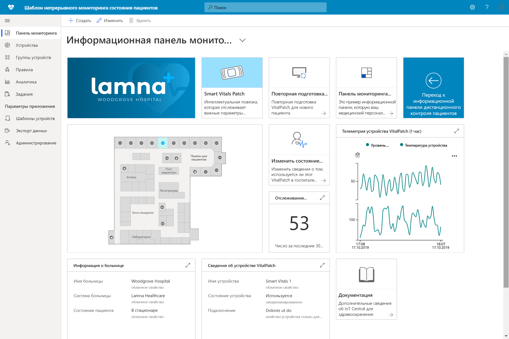

# Создание решений для здравоохранения с помощью Azure IoT Central 

[!INCLUDE [iot-central-pnp-original](../../../includes/iot-central-pnp-original-note.md)]

Сведения о создании решений для здравоохранения с помощью шаблонов приложений в Azure IoT Central.

## Что такое шаблон приложения для непрерывного мониторинга состояния пациентов?

В сфере здравоохранения Интернета вещей функция "Непрерывное наблюдение за пациентами" — одно из ключевых средств для снижения риска повторной госпитализации, более эффективного лечения хронических заболеваний и улучшения результатов лечения пациента. Непрерывное наблюдение за пациентами можно разделить на две основные категории:

1. **Наблюдение за госпитализированными пациентами**: С помощью портативных медицинских и других устройств в больнице, медкоманды могут отслеживать жизненно важные показатели и состояние здоровья пациента, не направляя медперсонал на осмотр пациента несколько раз в день. Медкоманды могут определить момент, когда пациент нуждается в критически важной помощи через уведомления и эффективно распределять свое время по приоритетности.
1. **Удаленный мониторинг пациентов**: Использование портативных медицинских устройств и результатов обследования пациентов (PRO) для мониторинга пациентов за пределами больницы позволяет значительно снизить риск повторной госпитализации. Данные пациентов с хроническими заболеваниями и пациентов, проходящих реабилитацию, можно собрать для проверки соблюдения планов ухода за пациентами, и что предупреждения об ухудшении состоянии здоровья пациента будут предоставлены медкоманде до того, как они станут критическими.

Этот шаблон приложения можно использовать для создания решений для обеих категорий Непрерывного наблюдения за пациентами. К преимуществам относятся:

* беспрепятственное подключение разных портативных медицинских устройств к экземпляру IoT Central;
* мониторинг устройств и управление ими для обеспечения их работоспособности;
* создание настраиваемых правил для данных устройства, чтобы активировать соответствующие предупреждения;
* экспорт данных о состоянии здоровья пациента в API Azure для FHIR, соответствующее хранилище данных;
* экспорт агрегированных аналитических сведений в существующие или новые бизнес-приложения, предоставляющие медкомандам новые возможности.

>[!div class="mx-imgBorder"] 
>

## Дополнительная информация

Чтобы начать создание решения для непрерывного мониторинга состояния пациентов, см:

* [Tutorial: Deploy and walkthrough a continuous patient monitoring app template](tutorial-continuous-patient-monitoring.md) (Руководство. Развертывание и обзор шаблона приложения для непрерывного мониторинга состояния пациентов)
* [Continuous patient monitoring architecture](concept-continuous-patient-monitoring-architecture.md) (Архитектура непрерывного мониторинга состояния пациентов)