# Общие сведения о пользовательском интерфейсе Azure IoT Central (предварительные версии функций)

[!INCLUDE [iot-central-pnp-original](../../../includes/iot-central-pnp-original-note.md)]

В этой статье содержатся сведения о пользовательском интерфейсе Microsoft Azure IoT Central. С помощью пользовательского интерфейса можно создавать и использовать решение Azure IoT Central и их подключенные устройства, а также управлять ими.

С помощью пользовательского интерфейса Azure IoT Central _разработчики_ могут определить свое решение Azure IoT Central. Этот интерфейс позволяет выполнять следующие задачи:

* определение типов устройств, подключающихся к решению.
* настройка правил и действий устройств; 
* настройка пользовательского интерфейса для _операторов_, использующих решение.

С помощью пользовательского интерфейса Azure IoT Central _оператор_ может управлять решением Azure IoT Central. Этот интерфейс позволяет выполнять следующие задачи:

* мониторинг устройств;
* настройка устройств;
* устранение проблем и неполадок с устройствами;
* подготавливать новые устройства;

## Домашняя страница IoT Central

На [домашней странице IoT Central](https://aka.ms/iotcentral-get-started) вы можете просмотреть последние новости и узнать о новых функциях, доступных в IoT Central. Кроме того, здесь можно создавать приложения, а также просматривать и запускать имеющиеся приложения.

> [!div class="mx-imgBorder"]
> 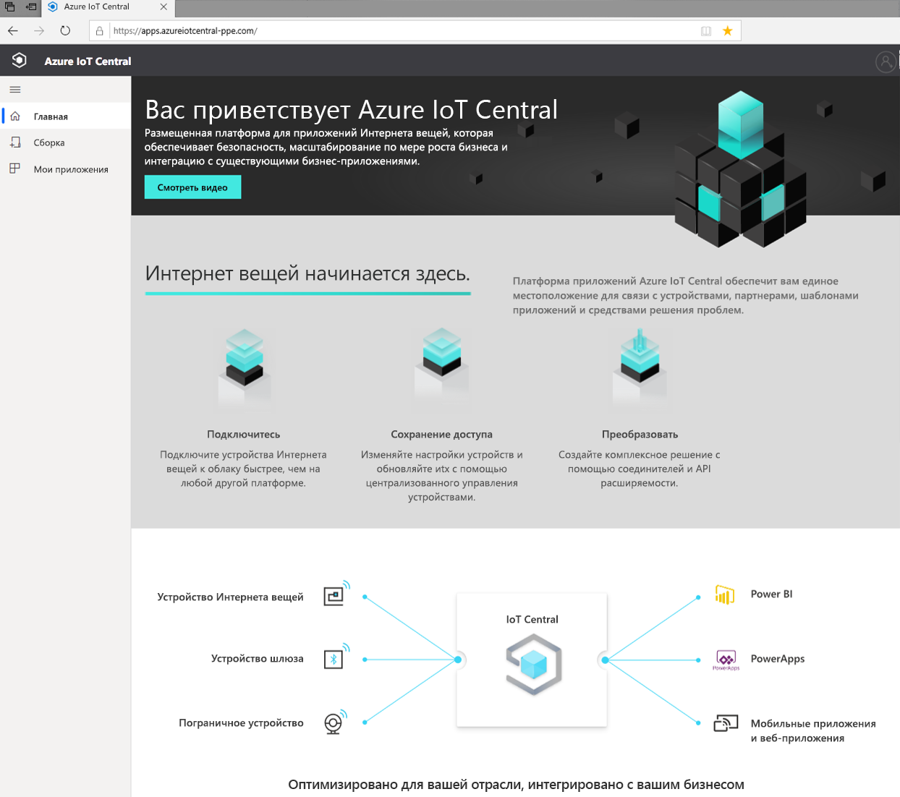

### Создание приложения

В разделе "Сборка" приведен список шаблонов IoT Central, соответствующих отраслям, которые позволяют быстро приступить к работе. Вы также можете начать с нуля с помощью шаблона пользовательского приложения.  
> [!div class="mx-imgBorder"]
> 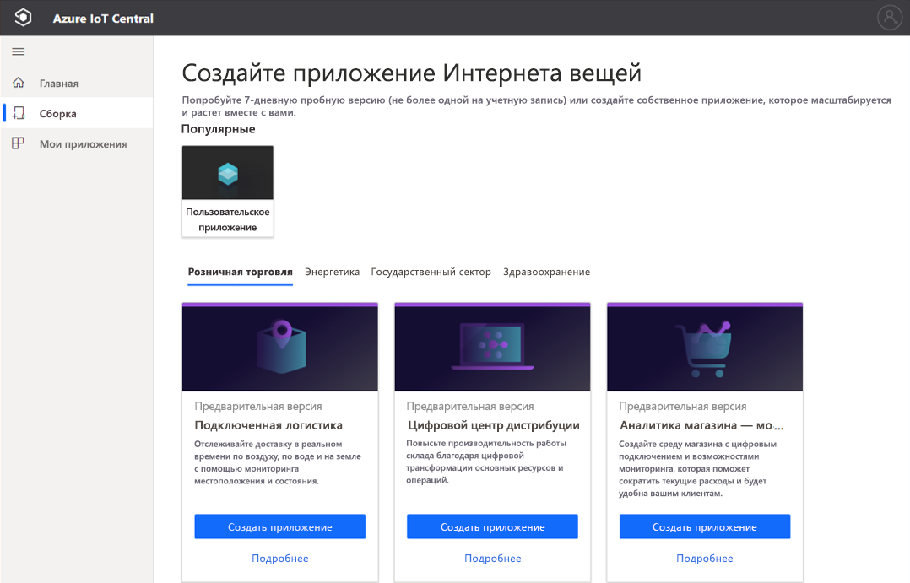

Дополнительные сведения см. в кратком руководстве [Создание приложения Azure IoT Central (предварительная версия функции)](quick-deploy-iot-central.md).

### Запуск приложения

Чтобы запустить приложение IoT Central, перейдите по URL-адресу, который вы или разработчик решений выбрали при создании приложения. Список всех приложений, к которым вы имеете доступ, также можно просмотреть в [диспетчере приложений IoT Central](https://aka.ms/iotcentral-apps).

> [!div class="mx-imgBorder"]
> 

## Навигация по приложению

В области слева можно получить доступ к разным областям приложения Интернета вещей. Вы можете развернуть или свернуть панель навигации, щелкнув значок с тремя линиями в верхней части панели навигации:

> [!NOTE]
> Элементы, отображаемые на панели навигации, зависят от роли пользователя. Дополнительные сведения об управлении учетными записями пользователей и ролями см. [здесь](howto-manage-users-roles.md). 

:::row:::
  :::column span="":::
      > [!div class="mx-imgBorder"]
      > 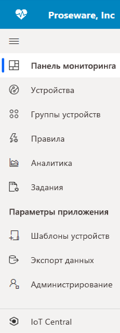
  :::column-end:::
  :::column span="2":::
     **Панель мониторинга** — отображается панель мониторинга приложения. Как *разработчик решений* вы можете настроить глобальную панель мониторинга для операторов. В зависимости от их роли операторы также могут создавать персональные панели мониторинга.
     
     На странице **Устройства** вы можете управлять подключенными устройствами (реальными и имитированными).

     На странице **Группы устройств** вы можете просматривать и создавать логические коллекции устройств, указанных в запросе. Вы можете сохранить этот запрос и использовать группы устройств в приложении для выполнения массовых операций.

     На странице **Правила** вы можете создавать и изменять правила мониторинга устройств. Правила оцениваются на основе данных телеметрии устройства и вызывают настраиваемые действия.

     На странице **Аналитика** вы можете создавать настраиваемые представления на основе данных устройства для получения аналитических сведений из приложения.

     На странице **Задания** вы можете управлять устройствами в нужном масштабе с помощью массовых операций.

     На странице **Шаблоны устройств** вы можете создавать характеристики устройств, которые можно подключить к приложению, и управлять ими.

     На странице **Экспорт данных** вы можете настроить непрерывный экспорт во внешние службы, такие как хранилище и очереди.

     На странице **Администрирование** вы можете управлять параметрами, настройками, выставлением счетов, пользователями и ролями приложения.

     С помощью кнопки **IoT Central** *администраторы* могут вернуться к диспетчеру приложений IoT Central.
     
   :::column-end:::
:::row-end:::

### Поиск, справка, тема и поддержка

На каждой странице сверху отображается меню.

> [!div class="mx-imgBorder"]
> 

* Чтобы найти устройства и шаблоны устройств, введите значение в **Поиск**.
* Чтобы изменить язык пользовательского интерфейса или тему, щелкните значок **Параметры**. Дополнительные сведения об управлении параметрами приложения см. [здесь](../core/howto-manage-preferences.md?toc=/azure/iot-central/preview/toc.json&bc=/azure/iot-central/preview/breadcrumb/toc.json).
* Чтобы выйти из приложения, щелкните значок **Учетная запись**.
* Чтобы получить справку и поддержку, выберите раскрывающийся список **Справка** с перечнем ресурсов. В пробной версии приложения ресурсы поддержки включают в себя доступ к [чату в реальном времени](../core/howto-show-hide-chat.md?toc=/azure/iot-central/preview/toc.json&bc=/azure/iot-central/preview/breadcrumb/toc.json).

Вы можете выбирать между светлой или темной темой пользовательского интерфейса.

> [!NOTE]
> Возможность выбора между светлой и темной темами будет недоступен, если администратор настроил пользовательскую тему для приложения.

> [!div class="mx-imgBorder"]
> 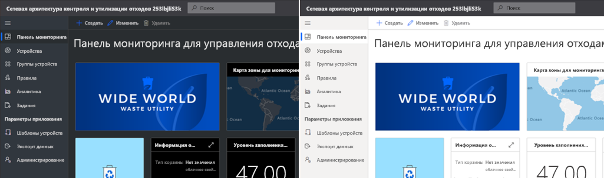

### панель мониторинга
> [!div class="mx-imgBorder"]
> 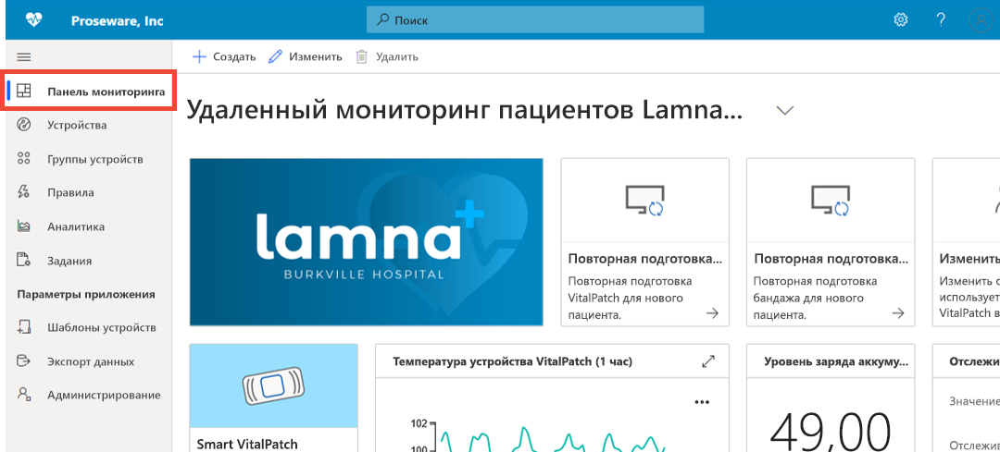

* Панель мониторинга — это первая страница, отображаемая при входе в приложение Azure IoT Central. Как *разработчик решений* вы можете создавать и настраивать несколько глобальных панелей мониторинга приложений для других пользователей. Дополнительные сведения о добавлении плиток на панель мониторинга см. [здесь](../core/howto-add-tiles-to-your-dashboard.md?toc=/azure/iot-central/preview/toc.json&bc=/azure/iot-central/preview/breadcrumb/toc.json).

* *Оператор* с нужной ролью может создавать персональные панели мониторинга для отслеживания необходимых ресурсов. Дополнительные сведения см. в статье о [создании персональных панелей мониторинга Azure IoT Central и управлении ими](../core/howto-create-personal-dashboards.md?toc=/azure/iot-central/preview/toc.json&bc=/azure/iot-central/preview/breadcrumb/toc.json).

### Устройства

> [!div class="mx-imgBorder"]
> 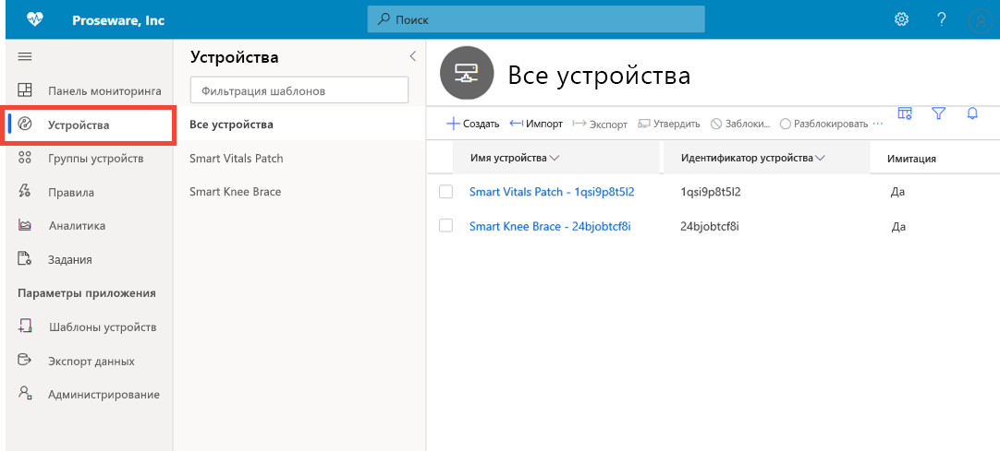

На странице обозревателя отображаются _устройства_ в приложении Azure IoT Central, сгруппированные по _шаблону устройства_. 

* Шаблон определяет тип устройства, которое можно подключить к приложению.
* В устройстве могут использоваться два типа приложений: реальные и смоделированные.

Дополнительные сведения см. в кратком руководстве по [мониторингу устройств](./quick-monitor-devices.md). 

### Группы устройств

> [!div class="mx-imgBorder"]
> 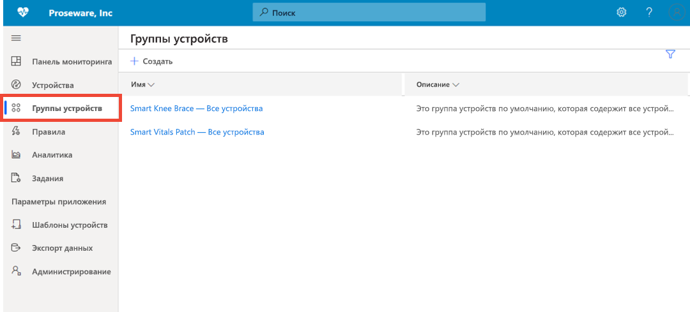

Группа устройств — это коллекция связанных устройств. *Разработчик решений* определяет запрос для идентификации устройств, входящих в группу. С помощью групп устройств можно выполнять массовые операции в приложении. Дополнительные сведения см. в статье [Use device groups in your Azure IoT Central application (preview features)](tutorial-use-device-groups.md) (Использование групп устройств в приложении Azure IoT Central (предварительные версии функций)).

### Правила
> [!div class="mx-imgBorder"]
> 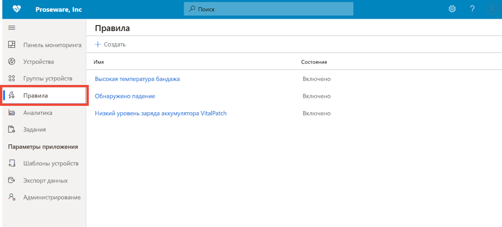

На станице "Правила" можно определить правила на основе телеметрии, состояния или событий устройства. При срабатывании правила может активироваться одно или несколько действий, например отправка сообщения электронной почты, отправка оповещений веб-перехватчика внешней системе и т. д. Дополнительные сведения см. в руководстве по [настройке правил](tutorial-create-telemetry-rules.md). 

### Analytics

> [!div class="mx-imgBorder"]
> 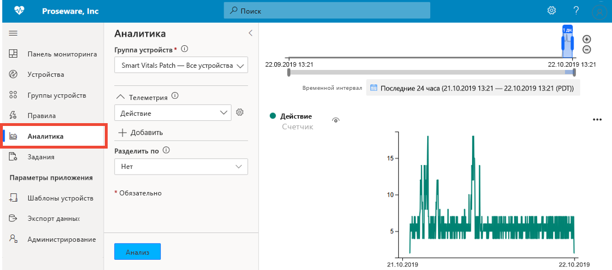

На странице "Аналитика" вы можете создавать настраиваемые представления на основе данных устройства для получения аналитических сведений из приложения. Дополнительные сведения см. в статье [How to use analytics to analyze device data](howto-create-analytics.md) (Анализ данных устройства с помощью аналитики).

### Задания

> [!div class="mx-imgBorder"]
> 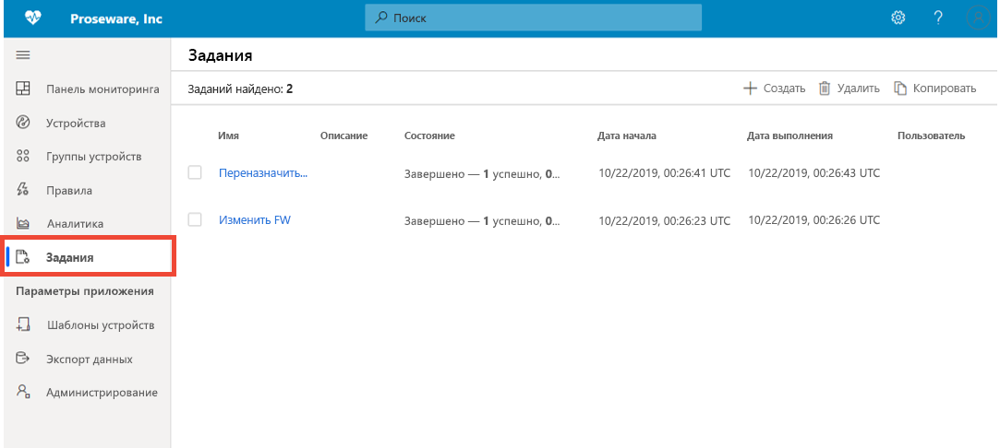

На странице "Задания" можно выполнять массовые операции управления устройствами. Вы можете обновлять свойства и параметры, а также выполнить команды для групп устройств. Чтобы узнать больше, ознакомьтесь со статьей [Создание и запуск заданий в приложении Azure IoT Central](../core/howto-run-a-job.md?toc=/azure/iot-central/preview/toc.json&bc=/azure/iot-central/preview/breadcrumb/toc.json).

### Шаблоны устройств

> [!div class="mx-imgBorder"]
> 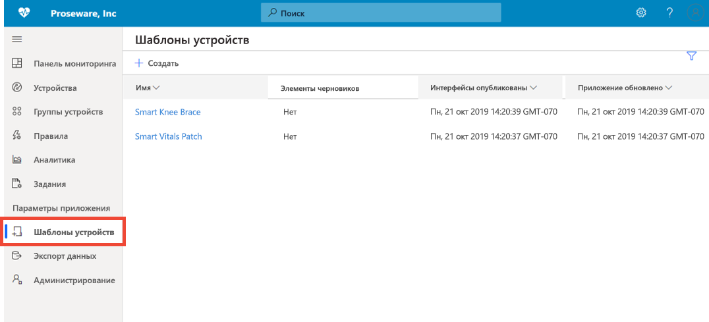

На странице шаблонов устройств построитель создает шаблоны устройств в приложении и управляет ими. Шаблоны устройств определяют характеристики устройства, в том числе:

* данные телеметрии, состояние и измерения событий;
* properties
* Команды
* Представления

*Разработчик решений* также может создавать формы и панели мониторинга, которые операторы могут использовать для управления устройствами.

Дополнительные сведения см. в статье [Define a new device type in your Azure IoT Central application](howto-set-up-template.md) (Определение типа нового устройства в приложении Azure IoT Central). 

### Экспорт данных
> [!div class="mx-imgBorder"]
> 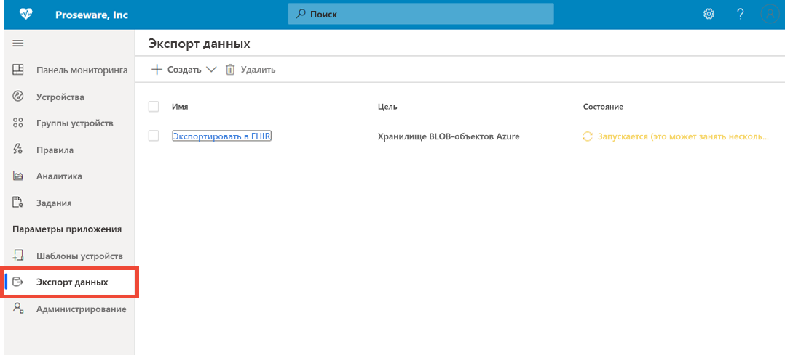

На странице "Экспорт данных" вы можете настраивать потоки данных, например данных телеметрии, из приложения во внешние системы. Дополнительные сведения см. в статье [Экспорт данных в Azure IoT Central](./howto-export-data.md).

### Администрирование
> [!div class="mx-imgBorder"]
> 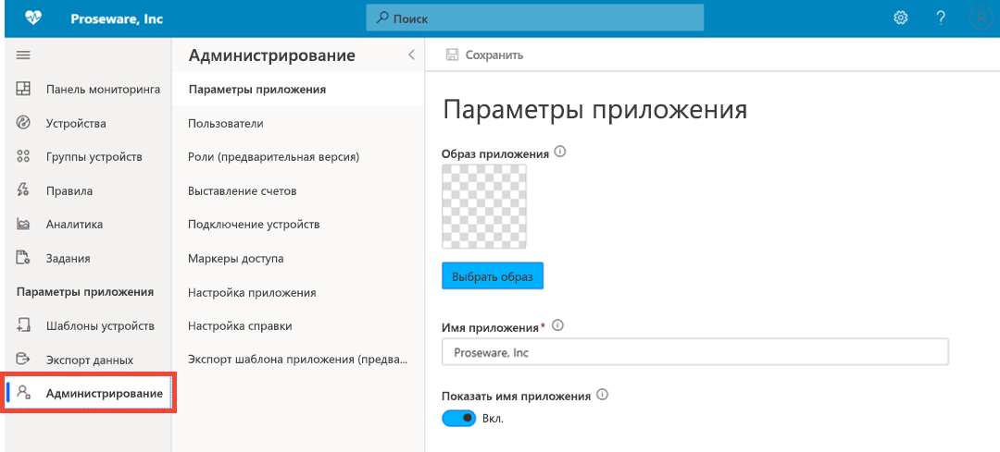

На странице "Администрирование" вы можете настраивать приложение IoT Central. Здесь можно изменить имя приложения, URL-адрес, тему, управлять пользователями и ролями, создавать маркеры API и экспортировать приложение. Дополнительные сведения см. в статье [How to administer your application](howto-administer.md) (Как управлять приложением).

## Дополнительная информация

Теперь, когда вы ознакомились с общими сведениями об Azure IoT Central и макетом пользовательского интерфейса, рекомендуем приступить к изучению краткого руководства [Create an Azure IoT Central application](quick-deploy-iot-central.md) (Создание приложения Azure IoT Central).
