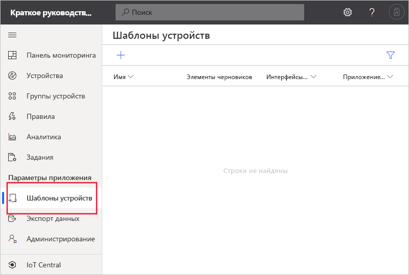
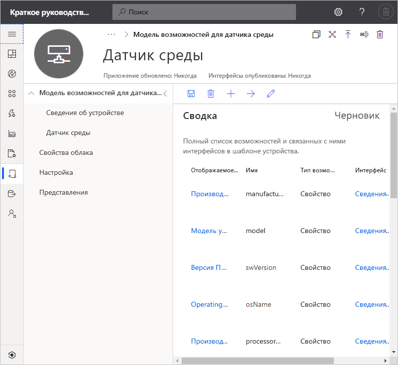
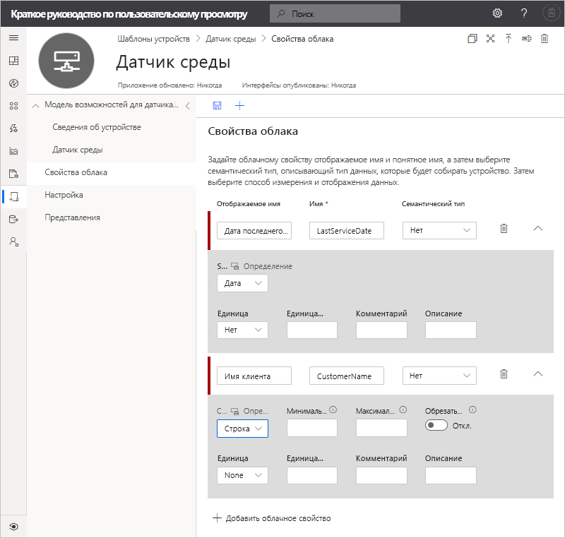
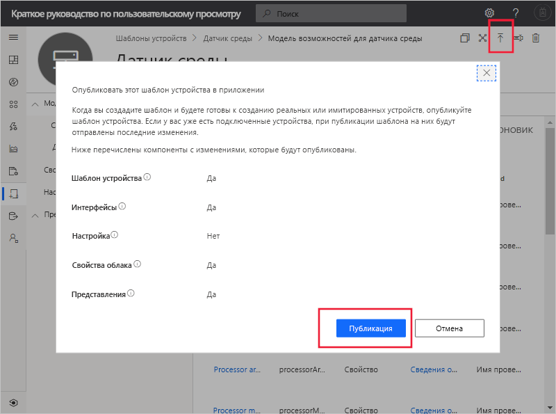
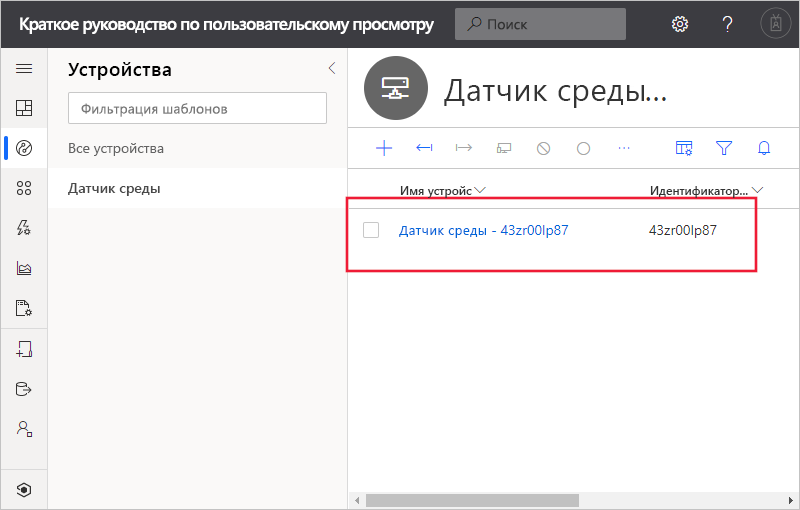
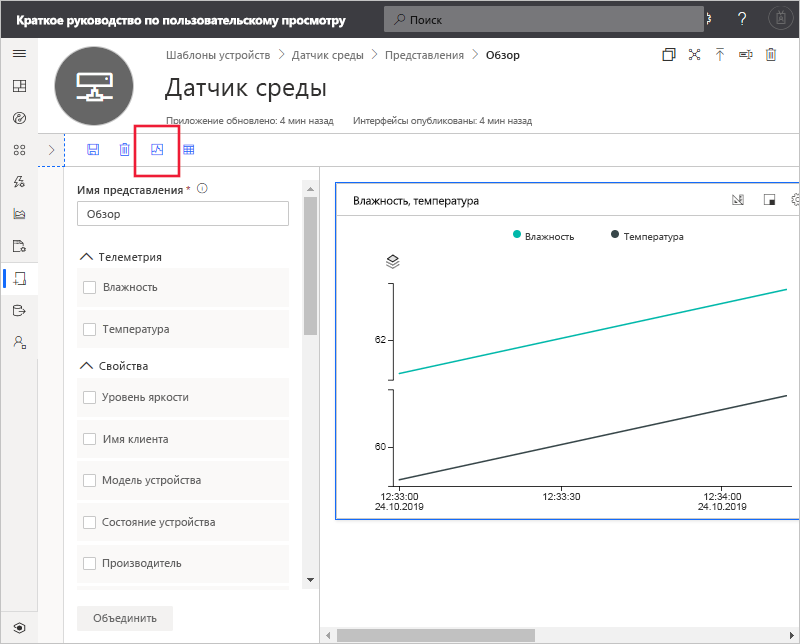

# Краткое руководство. Добавление имитированного устройства в приложение IoT Central (предварительные версии функций)

*Эта статья предназначена для операторов, разработчиков и администраторов.*

[!INCLUDE [iot-central-pnp-original](../../../includes/iot-central-pnp-original-note.md)]

Шаблон устройства определяет возможности устройства, которое подключается к приложению IoT Central. К возможностям относятся отправляемые устройством данные телеметрии, свойства этого устройства и команды, на которые оно реагирует. Из шаблона устройства построитель или оператор может добавлять в приложение как реальные, так и имитированные устройства. Имитация устройств полезна для тестирования поведения приложения IoT Central перед подключением реальных устройств.

В этом кратком руководстве вы создадите шаблон устройства **датчика среды** и добавите имитированное устройство. Устройство датчика среды выполняет следующие функции:

* отправляет данные телеметрии, например температуру;
* информирует о свойствах самого устройства, например об уровне яркости;
* реагирует на команды, например включения и отключения;
* информирует о базовых свойствах устройств, таких как версия встроенного ПО и серийный номер.

## Предварительные требования

Выполните инструкции из краткого руководства [Create an Azure IoT Central application (preview features)](./quick-deploy-iot-central.md) (Создание приложения Azure IoT Central (предварительные версии функций)), чтобы создать приложение IoT Central с использованием шаблона **Пользовательское приложение > предварительная версия приложения**.

Также вам потребуется локальная копия файла **EnvironmentalSensorInline.capabilitymodel.json**, который содержит модель возможностей устройства [IoT Plug and Play](../../iot-pnp/overview-iot-plug-and-play.md). Скачать эту версию можно [здесь](https://raw.githubusercontent.com/Azure/IoTPlugandPlay/master/samples/EnvironmentalSensorInline.capabilitymodel.json). Щелкните страницу правой кнопкой мыши и выберите **Сохранить как**.

Когда скачивание файла завершится, откройте его в текстовом редакторе и замените два вхождения строки `<YOUR_COMPANY_NAME_HERE>` своим именем. Используйте только символы a–z, A–Z, 0–9 и знак подчеркивания.

## Создание шаблона

Вы (как разработчик) можете создавать и редактировать шаблоны устройств в своем приложении. После публикации шаблона устройства вы можете создать имитацию устройства или подключить реальные устройства, реализующие этот шаблон устройства. Имитированные устройства позволяют проверять поведение приложения перед подключением реального устройства.

Чтобы добавить в приложение новый шаблон устройства, перейдите к странице **Шаблоны устройств**. Для этого выберите вкладку **Шаблоны устройств** в панели навигации слева.

### Добавление модели возможностей устройства

В IoT Central есть несколько способов создать модель возможностей устройства. Вы можете создать пользовательскую модель с нуля, импортировать ее из файла, выбрать из каталога устройств или с помощью функции подключения устройств подключить устройство IoT Plug and Play, модель возможностей для которого опубликована в общедоступном репозитории. В рамках этого руководства вы импортируете модель возможностей устройства из файла.

Ниже описано, как импортировать модель возможностей для **датчика среды**. Эти устройства отправляют в приложение данные телеметрии, например показатели температуры и давления.

1. Чтобы добавить новый шаблон устройства, щелкните **+** на странице **Шаблоны устройств**.

1. Выберите **Устройство IoT** в списке настраиваемых шаблонов устройств и нажмите кнопку **Далее: Настройте**, а затем выберите **Далее: Просмотрите**, а затем выберите **Создать**.

1. Введите для шаблона устройства имя **Environmental Sensor** (Датчик среды).

1. Выберите **Импорт модели возможностей**, чтобы создать новую модель возможностей устройства на основе JSON-файла. Перейдите на локальном компьютере к папке, в которой ранее сохранили файл **EnvironmentalSensorInline.capabilitymodel.json**. Выберите файл **EnvironmentalSensorInline.capabilitymodel.json** и нажмите **Открыть**. Модель возможностей датчика среды включает интерфейсы **Environmental Sensor** (Датчик среды) и **Device Information** (Сведения об устройстве):

    

    Эти интерфейсы определяют возможности **датчика среды**. К этим возможностям относятся данные телеметрии, свойства этого устройства и команды, на которые оно реагирует.

### Добавление свойств облака

Шаблон устройства может содержать свойства облака. Свойства облака существуют только в приложении IoT Central и никогда не отправляются на устройство и не принимаются с него.

1. Выберите **Свойства облака**, а затем **+ Добавить облачное свойство**. Воспользуйтесь сведениями в следующей таблице, чтобы добавить свойство облака в шаблон устройства.

    | Отображаемое имя      | Семантический тип | Схема |
    | ----------------- | ------------- | ------ |
    | Дата последнего обслуживания | Нет          | Дата   |
    | Имя клиента     | Нет          | Строка, |

1. Щелкните **Сохранить**, чтобы сохранить изменения.

    

## Создание представлений

Вы (как разработчик) можете настроить в приложении отображение для оператора сведений о подключенном датчике среды. Ваши настройки позволят оператору управлять устройствами датчиков среды, подключенными к приложению. Вы можете создать два типа представлений, которые позволят оператору взаимодействовать с устройствами.

* Формы для просмотра и редактирования свойств устройства и облака.
* Панели мониторинга для визуализации устройств.

### Создание представлений по умолчанию

Представления по умолчанию позволяют быстро визуализировать важную информацию об устройстве. Для шаблона устройства можно создать до трех представлений по умолчанию.

* Представление **Команды** позволяет оператору отправлять команды на устройство.
* В представлении **Обзор** отображаются данные телеметрии с устройства в виде схем и метрик.
* В представлении **Сведения** отображаются свойства устройства.

Выберите **Представления**, а затем **Создать представление по умолчанию**.

### Настройка представления для визуализации устройств

Панель мониторинга устройства позволяет оператору визуализировать устройство с помощью диаграмм и метрик. Как конструктор вы можете определить, какие сведения будут отображаться на панели мониторинга устройства. Вы можете определить для устройства несколько панелей мониторинга. Чтобы создать панель мониторинга для визуализации телеметрии датчика среды, выберите **Представления**, а затем **Визуализация устройства**:

1. Все свойства устройства, свойства облака, данные телеметрии и статические параметры перечислены в разделе **Свойства**. Вы можете перетащить любой из этих элементов в представление. Перетащите свойство **Уровень яркости** в представление. Плитку можно настроить с помощью значка шестеренки.

1. Чтобы добавить диаграмму для данных телеметрии, выберите параметры **Humidity** (Влажность) и **Temperature** (Температура), а затем щелкните **Объединить**. Чтобы просмотреть эту диаграмму в другом формате, например в виде круговой диаграммы или линейчатой диаграммы, нажмите кнопку **Изменить визуализацию** в верхней части плитки.

1. Выберите **Сохранить**, чтобы сохранить представление.

Вы можете добавить дополнительные плитки для других свойств или значений телеметрии. Можно также добавить статический текст, ссылки и (или) изображения. Чтобы переместить плитку на панели мониторинга или изменить ее размер, наведите указатель мыши на плитку, а затем перетащите ее на новое место или перетащите границу.

### Добавление формы устройств

Форма устройства позволяет оператору изменять доступные для записи свойства устройства и свойства облака. Вы (как разработчик) можете определить несколько форм и выбрать, какие свойства устройства и облака будут отображаться в каждой из них. В форме также можно отображать свойства устройства, доступные только для чтения.

Чтобы создать форму для просмотра и редактирования свойств датчика среды, сделайте следующее:

1. Перейдите к разделу **Представления** в шаблоне **Датчик среды**. Выберите плитку **Изменение устройства и облачных данных**, чтобы добавить новое представление.

1. Введите имя формы **Environmental Sensor properties** (Свойства датчика среды).

1. Перетащите свойства облака **Customer name** (Имя клиента) и **Last service date** (Дата последнего обслуживания) в существующий раздел формы.

1. Выберите свойства **Brightness Level** (Уровень яркости) и **Device State** (Состояние устройства). Затем щелкните **Добавить раздел**. Измените заголовок раздела, присвоив ему значение **Sensor properties** (Свойства датчика). Нажмите кнопку **Применить**.

1. Выберите свойства устройства **Модель устройства**, **Версия программного обеспечения**, **Производитель** и **Производитель процессора**. Затем щелкните **Добавить раздел**. Измените заголовок раздела, присвоив ему значение **Device properties** (Свойства устройства). Нажмите кнопку **Применить**.

1. Выберите **Сохранить**, чтобы сохранить представление.

## Публикация шаблона устройства

Прежде чем создать имитированный датчик среды или подключить реальный датчик, необходимо опубликовать шаблон устройства.

Для публикации шаблона устройства сделайте следующее:

1. Откройте шаблон устройства на странице **Шаблоны устройств**.

1. Нажмите кнопку **Опубликовать**.

1. В диалоговом окне **Publish a Device Template** (Публикация шаблона устройства) щелкните **Опубликовать**:

    

После публикации шаблона устройства он отображается на странице **Устройства** и в представлении для оператора. В опубликованном шаблоне устройства уже нельзя изменить модель возможностей устройства без создания новой версии. Но вы можете вносить изменения в свойства облака, настройки и представления в шаблоне опубликованного устройства, не создавая новых версий. После внесения изменений щелкните **Опубликовать**, чтобы передать эти изменения оператору.

## Добавление имитированного устройства

Чтобы добавить имитированное устройство в приложение, используйте шаблон устройства **датчика среды**, который вы создали.

1. Чтобы добавить новое устройство, оператору нужно выбрать элемент **Устройства** на панели слева. На вкладке **Устройства** отображаются пункт **Все устройства** и шаблон устройства **датчика состояния окружающей среды**. Выберите **Датчик среды**.

1. Чтобы добавить имитированное устройство датчика состояния окружающей среды, выберите **+ Создать**. Используйте рекомендуемый **код устройства** или введите **собственный** в нижнем регистре. Ви также можете ввести имя для нового устройства. Для переключателя **имитации** установите значение **Вкл.** , а затем выберите **Создать**.

    

Теперь вы можете взаимодействовать с представлениями, созданными сборщиком для шаблона устройства с использованием смоделированных данных.

## Использование имитированного устройства для улучшения представлений

После того как вы создадите имитированное устройство, сборщик сможет использовать это устройство для улучшения имеющихся и создания других представлений для шаблона устройства.

1. В левой панели навигации щелкните **Шаблоны устройств** и выберите шаблон **Датчик среды**.

1. Выберите любое представление, которое хотите изменить, или создайте представление. Щелкните **Настроить предварительный просмотр устройства**, а затем **Выбрать из запущенных устройств**. Здесь вы можете выбрать между отсутствием предварительной версии устройства, использованием реального устройства, которое вы можете настроить для тестирования, или существующего устройства, которое вы добавили в IoT Central.

1. Выберите имитированное устройство из списка. Затем выберите **Применить**. Теперь вы можете увидеть то же самое имитированное устройство в процессе сборки представлений для шаблона устройства. Это представление полезно для диаграмм и других визуализаций.

    

## Дополнительная информация

В этом кратком руководстве вы научились создавать шаблон устройства **датчик среды** и добавлять имитированное устройство к вашему устройству.

Дополнительные сведения о мониторинге подключенных к приложению устройств см. в разделе краткого руководства:

> [!div class="nextstepaction"]
> [Настройка правил и действий](./quick-configure-rules.md)
