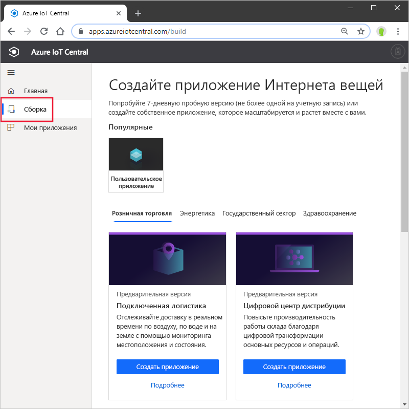
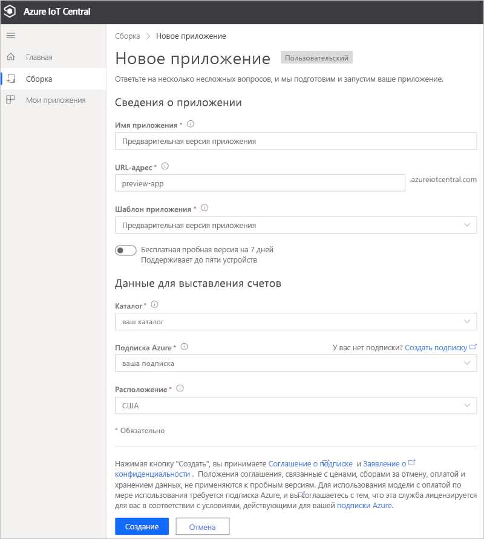

# Создание приложения Azure IoT Central (предварительная версия функции)

[!INCLUDE [iot-central-pnp-original](../../../includes/iot-central-pnp-original-note.md)]

В этом кратком руководстве описано, как создать приложение Azure IoT Central, которое содержит такие предварительные версии функций, как IoT Plug and Play.

> [!WARNING]
> Возможности IoT Plug and Play в Azure IoT Central сейчас предоставляются в общедоступной версии. Не следует использовать приложение IoT Central с поддержкой IoT Plug and Play для рабочих нагрузок. Для рабочих сред используйте приложение Azure IoT Central, созданное на основе текущего общедоступного шаблона приложения.

## Создание приложения

Перейдите на сайт [сборки Azure IoT Central](https://aka.ms/iotcentral). Затем выполните вход с помощью личной, рабочей или учебной учетной записи Microsoft.

Новое приложение можно создать из списка шаблонов IoT Central, соответствующих отраслям, чтобы быстро приступить к работе, или начать с нуля с помощью шаблона **пользовательского приложения**.

Чтобы создать приложение Azure IoT Central, сделайте следующее:

1. Чтобы создать новое приложение Azure IoT Central на основе *шаблона по отрасли*, выберите шаблон приложения из списка доступных шаблонов в одной из отраслей. Вы можете также создать его с нуля, выбрав *пользовательское приложение*.
1. Azure IoT Central автоматически предлагает **имя приложения** на основе выбранного шаблона приложения. Вы можете использовать это имя или ввести свое понятное имя приложения.
1. Azure IoT Central также создает уникальный префикс **URL-адреса приложения** на основе имени приложения. Этот URL-адрес используется для доступа к приложению. Вы можете свободно изменить этот префикс на что-то более запоминающееся, если захотите.

    

    > [!NOTE]
    > При использовании шаблона пользовательского приложения, вы увидите раскрывающийся список **Шаблон приложения**. Здесь можно переключаться между предварительной версией и общедоступными шаблонами. Вы также можете увидеть другие шаблоны, которые стали доступны для вашей организации.

1. Выберите, хотите ли вы создать это приложение с помощью 7-дневной бесплатной пробной версии или воспользоваться подпиской с оплатой по мере использования.
    - **Бесплатные пробные версии** приложений доступны в течение семи дней и поддерживают до пяти устройств. Их можно преобразовать для оплаты по мере использования в любое время до истечения срока действия. Если вы создаете пробную версию приложения, необходимо ввести свои контактные данные и выбрать, хотите ли вы получать сведения и советы от корпорации Майкрософт.
    - При использовании приложений **с оплатой по мере использования** плата взимается за каждое устройство, при этом первые два устройства предоставляются бесплатно. Дополнительные сведения о [ценообразовании в IoT Central](https://aka.ms/iotcentral-pricing). При создании приложения с оплатой по мере использования необходимо выбрать *каталог*, *подписку Azure* и *расположение*:
        - *Каталог* — Azure Active Directory (AAD), в котором будет создано приложение. Azure AD содержит удостоверения пользователей, учетные данные и другие сведения об организации. Если у вас нет клиента Azure Active Directory, он будет создан автоматически при создании подписки Azure.
        - *Подписка Azure* позволяет создавать экземпляры служб Azure. IoT Central подготавливает ресурсы в вашей подписке. Если у вас еще нет подписки, создайте ее на [странице входа в Azure](https://aka.ms/createazuresubscription). После создания подписки Azure вернитесь на страницу **Создание приложения**. Новая подписка отобразится в раскрывающемся списке **Подписка Azure**.
        - *Расположение* — [географический регион](https://azure.microsoft.com/global-infrastructure/geographies/), где вы хотите создать приложение. Как правило, следует выбирать расположение как можно ближе к устройствам, чтобы обеспечить оптимальную производительность. В настоящее время общедоступная предварительная версия Azure IoT Central доступна в **США** и в **Европе**. Выбрав расположение, вы не сможете переместить приложение в другое расположение.

        > [!NOTE]
        > В общедоступной предварительной версии для **предварительной версии приложения** доступны только расположения **Европа** и **США**.

1. Просмотрите условия и выберите **Создать** в нижней части страницы.

## Дополнительная информация

В этом кратком руководстве вы создали приложение IoT Central. Ниже приведено предлагаемое дальнейшее действие:

> [!div class="nextstepaction"]
> [Quickstart: Add a simulated device to your IoT Central application (preview features)](./quick-create-pnp-device.md) (Добавление имитированного устройства в приложение IoT Central (предварительные версии функций))
