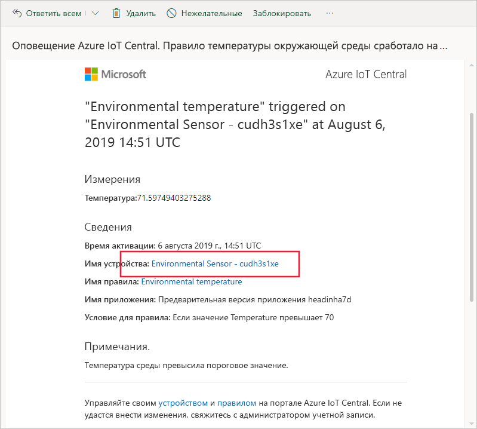
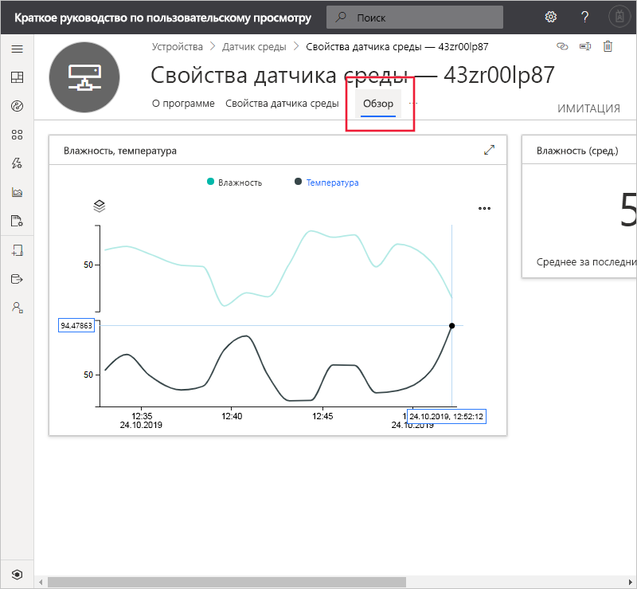
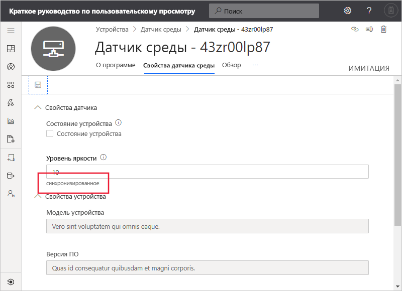

# Краткое руководство. использованию Azure IoT Central для мониторинга устройств (предварительные версии функций)

*Эта статья предназначена для операторов, разработчиков и администраторов.*

[!INCLUDE [iot-central-pnp-original](../../../includes/iot-central-pnp-original-note.md)]

В этом кратком руководстве показано, как с помощью приложения Microsoft Azure IoT Central оператор может выполнять мониторинг устройств и изменять параметры.

## Предварительные требования

Прежде чем начать, выполните инструкции из руководств по [созданию приложения Azure IoT Central](./quick-deploy-iot-central.md), [добавлению имитированного устройства в приложение IoT Central](./quick-create-pnp-device.md) и [настройке правил и действий для устройства](quick-configure-rules.md).

## Получение уведомления

Azure IoT Central отправляет уведомления об устройствах как сообщения электронной почты. Конструктор добавил правило для отправки уведомления в случае, когда температура в подключенном датчике среды превышает пороговое значение. Проверьте сообщения, отправленные в учетную запись, выбранную конструктором для получения уведомлений.

Откройте сообщение, полученное в конце работы с кратким руководством по [настройке правил и действий для устройства](quick-configure-rules.md). В письме выберите ссылку на устройство:

В браузере откроется представление **Панель мониторинга** для имитированного устройства "Датчик окружающей среды", созданного при работе с предыдущими краткими руководствами:

## Изучение проблемы

Оператор может просматривать сведения об устройстве на страницах **Обзор**, **Свойства датчика среды** и **Команды**. Сборщик настроил страницы **Панель мониторинга** и **Environmental Sensor properties** (Свойства датчика среды) для вывода важной информации о подключенном датчике среды.

Выберите представление **Обзор**, чтобы просмотреть сведения об устройстве.

На панели мониторинга показан график температуры устройства. Вы решили, что температура устройства слишком велика.

## Устранение проблемы

Чтобы внести изменения в устройство, используйте страницу **Свойства датчика среды**.

Выберите **Environmental Sensor properties** (Свойства датчика среды). Укажите для **уровня яркости** значение 10. Нажмите кнопку **Сохранить**, чтобы обновить устройство. Когда устройство подтверждает изменение параметров, состояние свойства изменяется на **синхронизировано**:

## Дополнительная информация

Из этого руководства вы узнали, как выполнить следующие действия:

* Получение уведомления
* изучать проблему;
* Устранение проблемы

Теперь, когда вам известно о мониторинге устройства, рекомендуется выполнить такой следующий шаг:

> [!div class="nextstepaction"]
> [Создание и администрирование шаблона устройства](howto-set-up-template.md).
