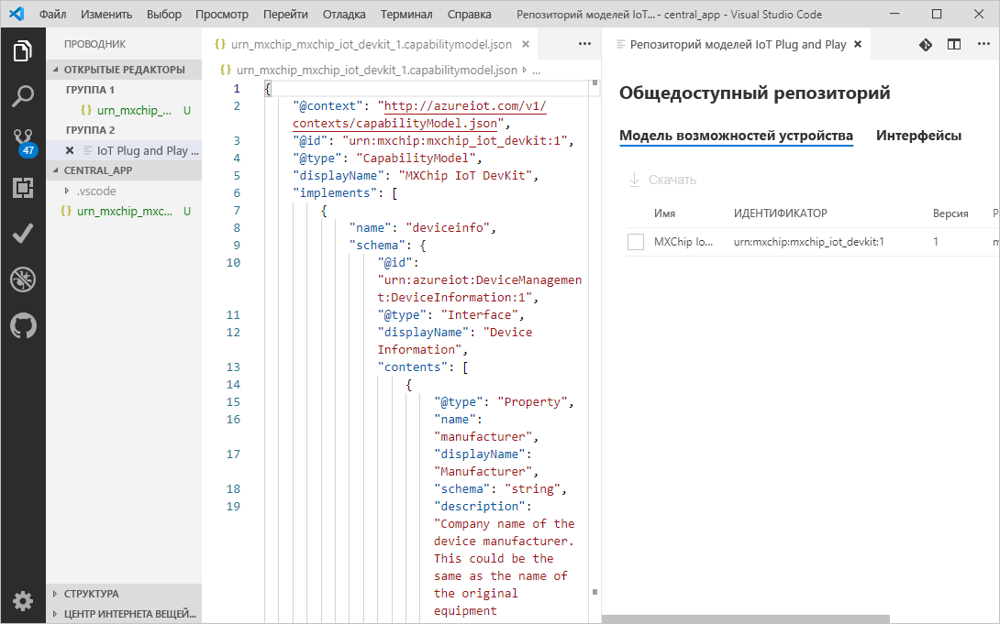
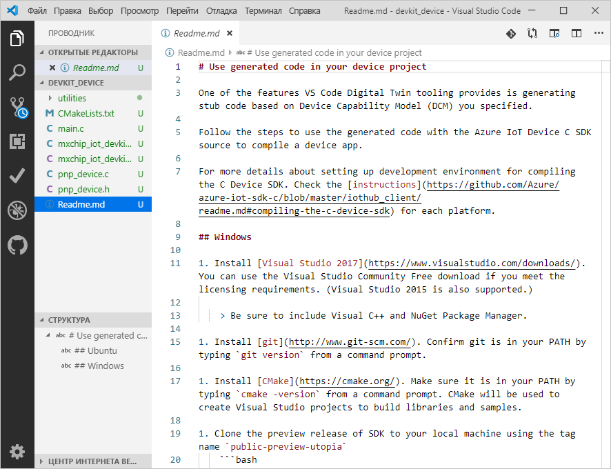
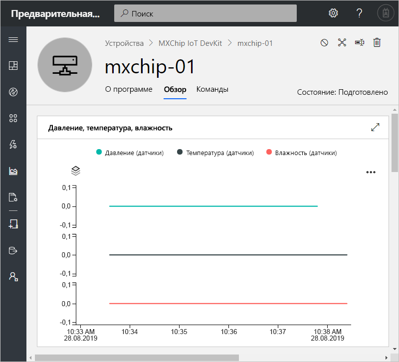
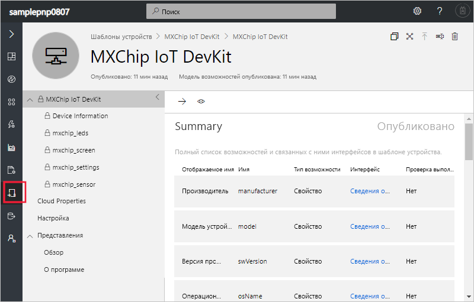

# <a name="quickstart-use-a-device-capability-model-to-create-an-iot-plug-and-play-device-and-connect-it-to-your-iot-central-application"></a>Краткое руководство. Использование модели возможностей устройства для создания устройства IoT Plug and Play и его подключения к приложению IoT Central

[!INCLUDE [iot-central-pnp-original](../../includes/iot-central-pnp-original-note.md)]

_Модель возможностей устройства_ (DCM) описывает возможности устройства [IoT Plug and Play](https://aka.ms/iot-pnp-docs). IoT Central может использовать DCM для создания шаблона и визуализаций для устройства при его первом подключении. В этом кратком руководстве объясняется, как выполнять следующие задачи:

* Создать устройство IoT Plug and Play с использованием DCM в Visual Studio Code.
* Запустить код устройства в Windows и убедиться, что оно подключено к приложению IoT Central.
* Просмотреть смоделированную телеметрию, которую отправляет устройство.

## <a name="prerequisites"></a>Предварительные требования

Выполните инструкции из краткого руководства [Create an Azure IoT Central application (preview features)](./quick-deploy-iot-central-pnp.md?toc=/azure/iot-central-pnp/toc.json&bc=/azure/iot-central-pnp/breadcrumb/toc.json) (Создание приложения Azure IoT Central (предварительные версии функций)), чтобы создать приложение IoT Central с использованием шаблона **предварительной версии приложения**.

Для выполнения инструкций, указанных в этом кратком руководстве, вам необходимо установить на локальный компьютер следующее программное обеспечение:

* [Visual Studio (Community, Professional или Enterprise)](https://visualstudio.microsoft.com/downloads/). При установке Visual Studio обязательно добавьте компонент **Диспетчер пакетов NuGet** и рабочую нагрузку **Разработка классических приложений на C++** .
* [Git](https://git-scm.com/download/).
* [CMake](https://cmake.org/download/) — при установке **CMake** выберите параметр **Add CMake to the system PATH** (Добавить CMake в системный путь).
* [Visual Studio Code](https://code.visualstudio.com/).
* [Node.js](https://nodejs.org/)
* Служебная программа `dps-keygen`:

    ```cmd/sh
    npm i -g dps-keygen
    ```

### <a name="install-azure-iot-device-workbench"></a>Установка Azure IoT Device Workbench

Чтобы установить расширение Azure IoT Device Workbench в VS Code, выполните следующие действия:

1. В VS Code выберите вкладку **Расширения**.
1. Выполните поиск по запросу **Azure IoT Device Workbench**.
1. Щелкните **Установить**.

## <a name="prepare-the-development-environment"></a>Подготовка среды разработки

### <a name="get-azure-iot-device-sdk-for-c"></a>Получение пакета SDK для устройств Azure IoT для C

Подготовьте среду разработки, которую можно использовать для создания пакета SDK для устройств Azure IoT для C.

1. Откройте окно командной строки. Выполните следующую команду для клонирования репозитория GitHub [пакета SDK для устройства C Интернета вещей Azure](https://github.com/Azure/azure-iot-sdk-c):

    ```cmd/sh
    git clone https://github.com/Azure/azure-iot-sdk-c --recursive -b public-preview
    ```

    Выполнение этой операции может занять несколько минут.

1. Создайте папку `central_app` ​​в корне локального клона репозитория. Эта папка используется для файлов модели устройства и заглушки кода устройства.

    ```cmd/sh
    cd azure-iot-sdk-c
    mkdir central_app
    ```

## <a name="generate-device-key"></a>Создание ключа устройства

Чтобы подключить устройство к приложению IoT Central, вам необходим ключ устройства. Чтобы создать ключ устройства, выполните следующие действия.

1. Войдите в приложение IoT Central, которое вы создали при работе с предыдущим кратким руководством.

1. Перейдите на страницу **​​Администрирование** и выберите **Подключение устройства**.

1. Запишите значения полей **Идентификатор области** и **Первичный ключ**. Они потребуются вам далее в этом кратком руководстве.

    

1. Откройте командную строку и выполните приведенную ниже команду, чтобы создать ключ устройства.

    ```cmd/sh
    dps-keygen  -di:mxchip-01 -mk:{Primary Key from previous step}
    ```

    Запишите созданный _ключ устройства_. Он понадобится на более позднем этапе в этом кратком руководстве.

## <a name="download-your-model"></a>Скачивание модели

В этом кратком руководстве вы используете общедоступную модель DCM для устройства MxChip IoT DevKit. Вам не нужно фактическое устройство DevKit для запуска кода. В этом кратком руководстве вы скомпилируете код для запуска в Windows.

1. Откройте папку `azure-iot-sdk-c\central_app` ​​с помощью VS Code.

1. Используйте сочетание клавиш **CTRL+SHIFT+P**, чтобы открыть палитру команд, введите **IOT Plug and Play** и выберите **Open Model Repository** (Открыть репозиторий моделей). Выберите **Общедоступный репозиторий**. VS Code выведет список моделей DCM в общедоступном репозитории моделей.

1. Выберите модель DCM **MXChip IoT DevKit** с идентификатором `urn:mxchip:mxchip_iot_devkit:1`. Выберите **Скачать**. Теперь у вас есть копия DCM в папке `central_app`.



> [!NOTE]
> Для работы с IoT Central интерфейсы модели возможностей устройства должны быть указаны в одном файле.

## <a name="generate-the-c-code-stub"></a>Создание заглушки кода C

Теперь у вас есть модель DCM **MXChip IoT DevKit** и связанные с ней интерфейсы, и вы можете сгенерировать код устройства, который реализует модель. Чтобы создать заглушку кода C в VS Code:

1. В открытой папке с файлами DCM нажмите сочетание клавиш **CTRL+SHIFT+P**, чтобы открыть палитру команд, введите **IoT Plug and Play** и выберите **Generate Device Code Stub** (Создать заглушку кода устройства).

    > [!NOTE]
    > При первом использовании служебной программы IoT Plug and Play Code Generator загрузка занимает несколько секунд.

1. Выберите файл DCM **MXChip IoT DevKit**, который вы только что скачали.

1. Введите имя проекта **devkit_device**.

1. Выберите **ANSI C** в качестве языка.

1. Выберите **Проект CMake** в качестве типа проекта. Не выбирайте **MXChip IoT DevKit Project** (Проект MXChip IoT DevKit). Этот вариант подходит для тех случаев, когда у вас есть настоящее устройство DevKit.

1. В качестве метода подключения выберите **Via DPS (Device Provisioning Service) symmetric key** (С помощью симметричного ключа DPS (Служба подготовки устройств)).

1. В VS Code откроется новое окно, содержащее созданные файлы заглушки кода устройства в папке `devkit_device`.



Чтобы добавить информацию о подключении в созданный код устройства:

1. Перейдите в окно VS Code, где содержится созданный код C. Откройте файл `main.c` .

1. Замените `[DPS Id Scope]` **идентификатором области**, который вы записали ранее.

1. Замените `[DPS symmetric key]` ключом устройства, созданным на предыдущем шаге.

1. Замените `[device registration Id]` на `mxchip-01`.

1. Сохраните изменения.

## <a name="build-the-code"></a>Сборка кода

Вы используете пакет SDK устройства для сборки созданной заглушки кода устройства. Созданное вами приложение имитирует устройство **MXChip IoT DevKit** и подключается к вашему приложению IoT Central. Оно отправляет данные телеметрии и свойства, а также получает команды.

1. В VS Code откройте файл `CMakeLists.txt` в папке `azure-iot-sdk-c`. Убедитесь, что вы открыли файл `CMakeLists.txt` в папке `azure-iot-sdk-c`, а не в папке `devkit_device`.

1. Добавьте приведенную ниже строку в нижней части файла `CMakeLists.txt`, чтобы включить папку заглушки кода устройства при компиляции:

    ```txt
    add_subdirectory(central_app/devkit_device)
    ```

1. Создайте папку `cmake` ​​в папке `azure-iot-sdk-c` и перейдите к созданной папке в командной строке:

    ```cmd\sh
    mkdir cmake
    cd cmake
    ```

1. Выполните приведенные ниже команды, чтобы собрать пакет SDK для устройства и сгенерированную заглушку кода:

    ```cmd\sh
    cmake .. -Duse_prov_client=ON -Dhsm_type_symm_key:BOOL=ON
    cmake --build . -- /m /p:Configuration=Release
    ```

1. После успешного завершения сборки в той же командной строке запустите ваше приложение:

    ```cmd\sh
    .\central_app\devkit_device\Release\devkit_device.exe
    ```

1. Приложение устройства начнет отправку данных в приложение IoT Central.

## <a name="view-the-device"></a>Просмотр устройства

После того как код вашего устройства подключится к IoT Central, вы сможете просмотреть свойства и телеметрию, отправляемые устройством:

1. В своем приложении IoT Central перейдите на страницу **​​Устройства** и выберите устройство **mxchip-01**. Это устройство было автоматически добавлено при подключении кода устройства:

    

    Через пару минут на этой странице отобразятся графики телеметрии, отправляемой устройством.

1. Выберите страницу **Сведения**, чтобы просмотреть значения свойств, отправляемых устройством.

1. Выберите страницу **​​Команды** для вызова команд на устройстве. Вы можете увидеть ответ устройства в командной строке, в которой выполняется код устройства.

1. Перейдите на страницу **​​Шаблоны устройств**, чтобы просмотреть шаблон, созданный IoT Central на основе модели DCM, хранящейся в общедоступном репозитории:

    

## <a name="next-steps"></a>Дополнительная информация

В этом кратком руководстве вы узнали, как подключить устройство IoT Plug and Play, созданное на основе модели DCM, хранящейся в общедоступном репозитории.

Чтобы узнать больше о DCM и о том, как создавать свои собственные модели, перейдите к следующему руководству:

> [!div class="nextstepaction"]
> [Set up and manage a device template (preview features)](./howto-set-up-template-pnp.md?toc=/azure/iot-central-pnp/toc.json&bc=/azure/iot-central-pnp/breadcrumb/toc.json) (Настройка шаблона устройства и управление им (предварительные версии функций))
