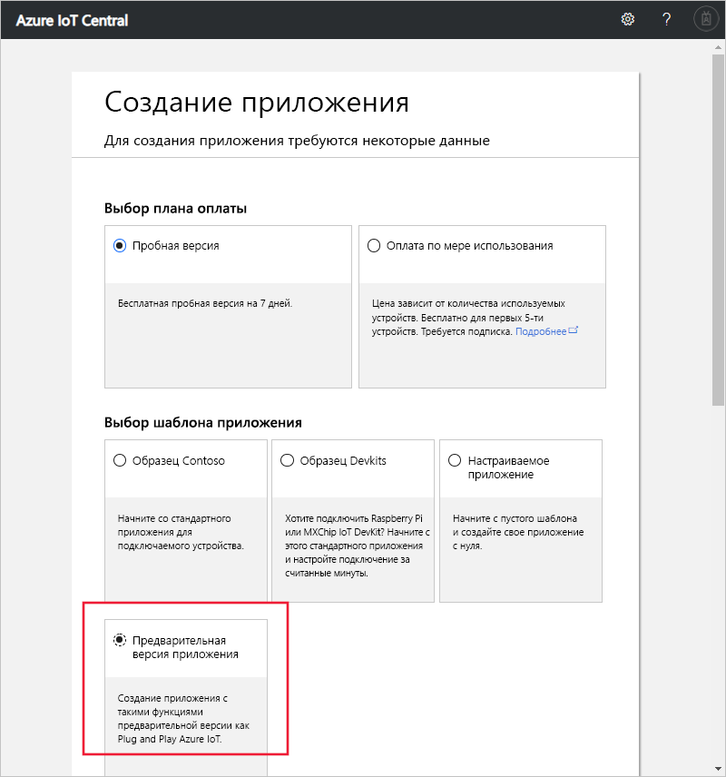

# Создание приложения Azure IoT Central (предварительная версия функции)

[!INCLUDE [iot-central-pnp-original](../../includes/iot-central-pnp-original-note.md)]

В этом кратком руководстве описано, как создать приложение Azure IoT Central, которое использует такие предварительные версии функций, как IoT Plug and Play.

> [!WARNING]
> Возможности IoT Plug and Play в Azure IoT Central сейчас предоставляются в общедоступной версии. Не следует использовать приложение IoT Central с поддержкой IoT Plug and Play для рабочих нагрузок. Для рабочих сред используйте приложение Azure IoT Central, созданное на основе текущего общедоступного шаблона приложения.

## Создание приложения

Перейдите на веб-сайт [диспетчера приложений в Azure IoT Central](https://aka.ms/iotcentral). Затем выполните вход с помощью личной, рабочей или учебной учетной записи Майкрософт.

Чтобы начать создание приложения Azure IoT Central, выберите **Новое приложение**. Вы перейдете на страницу **Создание приложения**.

Чтобы создать приложение Azure IoT Central, которое использует такие предварительные версии функций, как IoT Plug and Play, сделайте следующее:

1. Выберите план оплаты:
   - **Пробные версии** приложений предоставляются бесплатно в течение 7 дней, после чего их нельзя больше использовать. Их можно преобразовать для оплаты по мере использования в любое время до истечения срока действия. Если вы создаете **пробную версию** приложения, необходимо ввести свои контактные данные и выбрать, хотите ли вы получать сведения и советы от корпорации Майкрософт.
   - При использовании приложений **с оплатой по мере использования** плата взимается за каждое устройство, при этом первые 5 устройств предоставляются бесплатно. При создании приложения **с оплатой по мере использования** необходимо выбрать *каталог*, *подписку Azure* и *регион*.
      - *Каталог* — Azure Active Directory (AD) для создания приложения. Он содержит удостоверения пользователей, учетные данные и другие сведения об организации. Если у вас нет клиента Azure Active Directory, он будет создан автоматически при создании подписки Azure.
      - *Подписка Azure* позволяет создавать экземпляры служб Azure. IoT Central подготовит ресурсы в вашей подписке. Если у вас еще нет подписки, создайте ее на [странице входа в Azure](https://aka.ms/createazuresubscription). После создания подписки Azure перейдите на страницу **Создание приложения**. В раскрывающемся списке **Подписка Azure** отобразится новая подписка.
      - *Регион* — физическое расположение, в котором вы хотите создать приложение. Как правило, следует выбирать регион, расположенный как можно ближе к устройствам, чтобы обеспечить оптимальную производительность. Регионы, в которых доступно приложение Azure IoT Central,можно просмотреть на странице [Доступность продуктов по регионам](https://azure.microsoft.com/regions/services/). Выбрав регион, вы не сможете переместить приложение в другой регион.

      Узнайте больше о ценах на службу Azure IoT Central на [этой странице](https://azure.microsoft.com/pricing/details/iot-central/).

1. Выберите понятное имя для приложения, например **Contoso IoT**. Azure IoT Central создаст уникальный префикс URL-адреса. Вы можете изменить этот префикс на что-то более запоминающееся.

1. Выберите шаблон **Предварительная версия приложения**. Шаблон приложения может содержать стандартные элементы (например, шаблоны устройств и панели мониторинга), которые позволяют вам приступить к работе.

1. В нижней части страницы выберите **Создать**.

## Дополнительная информация

В этом кратком руководстве описано, как создать приложение IoT Central, которое использует предварительные версии функций. Следующий шаг может быть таким:

> [!div class="nextstepaction"]
> [Определение типа нового устройства в приложении Azure IoT Central](./tutorial-define-device-type-pnp.md?toc=/azure/iot-central-pnp/toc.json&bc=/azure/iot-central-pnp/breadcrumb/toc.json)
