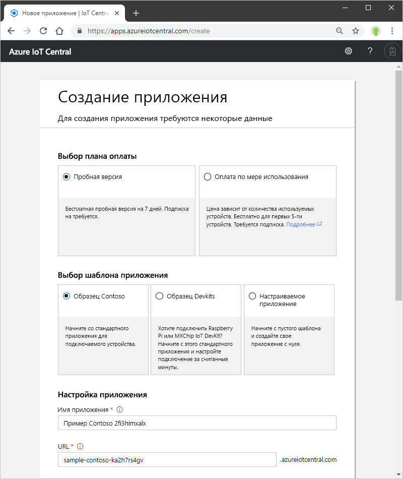

# Создание приложения Azure IoT Central

С помощью пользовательского интерфейса Azure IoT Central _конструктор_ может определить свое приложение Microsoft Azure IoT Central. В этом кратком руководстве объясняется, как создать приложение Azure IoT Central, которое содержит пример _шаблона устройства_ и _имитированные устройства_.

Перейдите на страницу [диспетчера приложений](https://aka.ms/iotcentral) в Azure IoT Central. Вам нужно будет войти в систему с помощью личной, рабочей или учебной учетной записи Microsoft.

Чтобы начать создание приложения Azure IoT Central, выберите **Новое приложение**. Вы перейдете на страницу **Создать приложение**.

Чтобы создать приложение Azure IoT Central, сделайте следующее:

1. Выберите план оплаты:
    - **Пробные версии** приложений предоставляются бесплатно в течение 7 дней, после чего срок их действия истекает. Их можно преобразовать для оплаты по мере использования в любое время до истечения срока действия.
    - За приложения **с оплатой по мере использования** плата взимается за каждое устройство, а первые 5 устройств предоставляются бесплатно.

    Узнайте больше о ценах на службу Azure IoT Central на [этой странице](https://azure.microsoft.com/pricing/details/iot-central/).

1. Выберите понятное имя для приложения, например **Contoso IoT**. Azure IoT Central создаст уникальный префикс URL-адреса. Вы можете изменить этот префикс на что-то более запоминающееся.

1. Выберите шаблон приложений. Шаблон приложения может содержать стандартные элементы (например, шаблоны устройств и панели мониторинга), которые позволяют вам приступить к работе.
    | Шаблон приложения | ОПИСАНИЕ |
    | -------------------- | ----------- |
    | Sample Contoso (Образец Contoso)       | Создает приложение, содержащее шаблон устройства, созданный для охлаждаемого торгового автомата. Используйте этот шаблон, чтобы приступить к работе в Azure IoT Central. |
    | Custom application (Образец Devkits)       | Создает приложение с готовыми шаблонами устройств, чтобы вы могли подключить устройство MXChip или Raspberry Pi. Используйте этот шаблон, если вы являетесь разработчиком устройства, работающим с одним из этих устройств. |
    | Custom application (Пользовательское приложение)   | Создает пустое приложение, в которое необходимо добавить собственные шаблоны устройств и сами устройства. |

1. При создании приложения **с оплатой по мере использования** необходимо выбрать *каталог*, *подписку Azure* и *регион*. 
    - *Каталог* — Azure Active Directory для создания приложения. Он содержит удостоверения пользователей, учетные данные и другие сведения об организации. Если у вас нет клиента Azure Active Directory, он будет создан автоматически при создании подписки Azure.

    - *Подписка Azure* позволяет создавать экземпляры служб Azure. IoT Central подготовит ресурсы в вашей подписке. Если у вас еще нет подписки, создайте ее на [странице входа в Azure](https://aka.ms/createazuresubscription). После создания подписки Azure перейдите на страницу **Создание приложения**. В раскрывающемся списке **Подписка Azure** отобразится новая подписка.

    - *Регион* — физическое расположение, в котором вы хотите создать приложение. Как правило, для получения оптимальной производительности следует выбирать регион, ближайший к устройствам. Регионы, в которых доступна служба Azure IoT Central, можно просмотреть на странице [Доступность продуктов по регионам](https://azure.microsoft.com/regions/services/).

    > [!Note]
    > Выбрав регион, вы не можете переместить приложение в другой регион.

1. Нажмите кнопку **Создать**.

## Дополнительная информация

В этом кратком руководстве вы создали приложение IoT Central. Ниже приведено предлагаемое дальнейшее действие:

> [!div class="nextstepaction"]
> [Узнайте о возможностях IoT Central](#overview-iot-central-tour)
