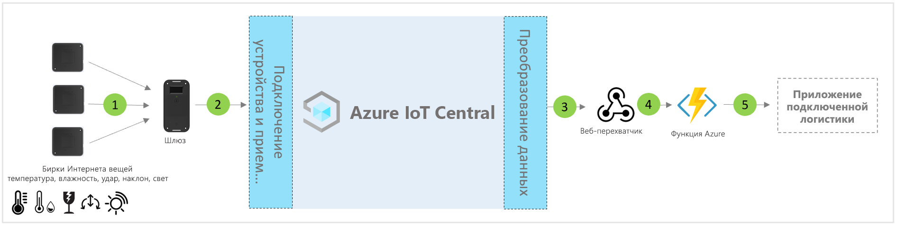

# Архитектура шаблона приложения интеллектуальной логистики для IoT Central

[!INCLUDE [iot-central-pnp-original](../../../includes/iot-central-pnp-original-note.md)]

Партнеры и клиенты могут использовать шаблон приложения и приведенные ниже указания при разработке **комплексных решений для интеллектуальной логистики**.

> [!div class="mx-imgBorder"]
> 

1. Набор радиожетонов Интернета вещей для отправки данных телеметрии на устройство шлюза.
2. Устройства шлюза отправляют данные телеметрии и агрегированные аналитические сведения в IoT Central.
3. Данные направляются в нужную службу Azure для обработки.
4. Службы Azure, такие как ASA или Функции Azure, можно использовать для переформатирования потоков данных и их отправки в соответствующие учетные записи хранения. 
5. Бизнес-приложения пользователей могут обеспечивать выполнение различных бизнес-процессов.

## Сведения
В следующем разделе описываются все части концептуальной архитектуры, связанные с приемом данных телеметрии от радиожетонов Интернета вещей и шлюзов.

## Радиожетоны Интернета вещей
Радиожетоны Интернета вещей передают такие данные датчиков физических показателей, внешних условий и окружающей среды, как температура, влажность, вибрация, наклон и освещенность. Радиожетоны Интернета вещей обычно подключаются к устройству шлюза посредством Zigbee (802.15.4). Радиожетоны — это недорогие датчики. Поэтому их можно отключить в конце типичного пути логистики, чтобы избежать проблем с обратной логистикой.

## Шлюз
Шлюзы также могут действовать как радиожетоны Интернета вещей с возможностями считывания показателей внешних условий. Шлюз обеспечивает восходящее подключение к облаку Azure IoT (MQTT) через каналы сотовой связи и Wi-Fi.  Для нисходящей связи с радиожетонами Интернета вещей используются режимы беспроводной сети Bluetooth, NFC и 802.15.4 (WSN). Шлюзы обеспечивают безопасное сквозное подключение к облаку, парное связывание радиожетонов Интернета вещей, агрегирование данных датчиков, хранение данных и возможность настройки порогов оповещений.

## Управление устройствами с помощью IoT Central 
Azure IoT Central — это платформа для разработки решений, которая упрощает подключение, настройку устройств Интернета вещей и управление ими. Эта платформа значительно снижает нагрузку и сокращает расходы на управление устройствами Интернета вещей, их эксплуатацию и связанную с ними разработку. Клиенты и партнеры могут создавать комплексные корпоративные решения для получения цифровой обратной связи по логистике.

## Бизнес-аналитика и действия на основе исходящих данных 
Платформа IoT Central предоставляет широкие возможности расширяемости благодаря непрерывному экспорту данных (CDE) и интерфейсам API. Бизнес-аналитика, основанная на обработке данных телеметрии или необработанных данных телеметрии, обычно экспортируется в предпочитаемое бизнес-приложение. Для этого можно использовать веб-перехватчик, служебную шину, концентратор событий или хранилище BLOB-объектов, чтобы создавать, обучать и развертывать модели машинного обучения и дополнительно обогащать аналитические сведения.

## Дополнительная информация
* Узнайте, как развернуть [шаблон решения для подключенной логистики](./tutorial-iot-central-connected-logistics-pnp.md).
* Узнайте больше о [шаблонах IoT Central для розничной торговли](./overview-iot-central-retail-pnp.md).
* См. сведения об [IoT Central](../preview/overview-iot-central.md).
