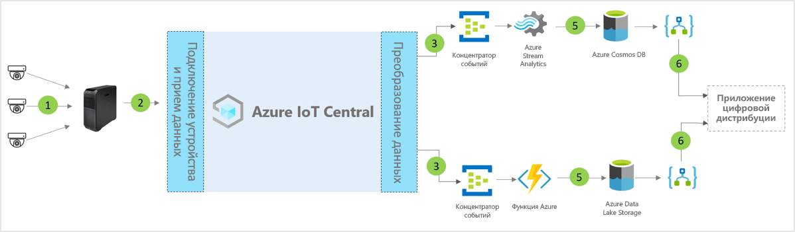

# Архитектура шаблона приложения цифрового центра дистрибуции для IoT Central

[!INCLUDE [iot-central-pnp-original](../../../includes/iot-central-pnp-original-note.md)]

Партнеры и клиенты могут использовать шаблон приложения и приведенные ниже указания при разработке комплексных решений для **цифрового центра дистрибуции**.

> [!div class="mx-imgBorder"]
> 

1. Набор датчиков Интернета вещей отправляет данные телеметрии на устройство шлюза.
2. Устройства шлюза отправляют данные телеметрии и агрегированные аналитические сведения в IoT Central.
3. Данные направляются в нужную службу Azure для обработки.
4. Службы Azure, такие как ASA или Функции Azure, можно использовать для переформатирования потоков данных и их отправки в соответствующие учетные записи хранения. 
5. Обработанные данные хранятся в "горячем" хранилище для операций практически в реальном времени или в "холодном" хранилище для дополнительного улучшения аналитических сведений с помощью машинного обучения или пакетного анализа. 
6. Logic Apps можно использовать для выполнения различных бизнес-процессов в бизнес-приложениях пользователей.

## Сведения
В следующем разделе описываются все части концептуальной архитектуры.

## Видеокамеры 
Видеокамеры являются основными датчиками в этой цифровой сетевой экосистеме корпоративного уровня. Усовершенствования в машинном обучении и искусственном интеллекте позволяют превратить видео в структурированные данные и обработать их на пограничном устройстве перед отправкой в облако. Мы можем использовать IP-камеры для записи изображений, а затем сжимать их на камере и передавать сжатые данные на пограничные вычислительные устройства для обработки в конвейере анализа видео, или использовать видеокамеры GigE для записи изображений на датчике и их последующей отправки непосредственно в Azure IoT Edge, где они будут сжиматься перед обработкой в конвейере анализа видео. 

## Шлюз Azure IoT Edge
Azure IoT Edge локально управляет камерами-датчиками и пограничными рабочими нагрузками, а поток данных камер обрабатывается с помощью конвейера анализа. Конвейер обработки видеоаналитики в Azure IoT Edge дает множество преимуществ, включая уменьшенное время отклика и использование небольшой пропускной способности, что обеспечивает низкую задержку для быстрой обработки данных. Только наиболее важные метаданные, аналитические сведения или действия отправляются в облако для выполнения дальнейших действий или исследования. 

## Управление устройствами с помощью IoT Central 
Azure IoT Central — это платформа для разработки решений, которая упрощает подключение, настройку устройств Интернета вещей и шлюза Azure IoT Edge и управление ими. Эта платформа значительно снижает нагрузку и сокращает расходы на управление устройствами Интернета вещей, их эксплуатацию и связанную с ними разработку. Клиенты и партнеры могут создавать комплексные корпоративные решения для получения цифровой обратной связи по центрам дистрибуции.

## Бизнес-аналитика и действия на основе исходящих данных 
Платформа IoT Central предоставляет широкие возможности расширяемости благодаря непрерывному экспорту данных (CDE) и интерфейсам API. Бизнес-аналитика, основанная на обработке данных телеметрии или необработанных данных телеметрии, обычно экспортируется в предпочитаемое бизнес-приложение. Для этого можно использовать веб-перехватчик, служебную шину, концентратор событий или хранилище BLOB-объектов, чтобы создавать, обучать и развертывать модели машинного обучения и дополнительно обогащать аналитические сведения.

## Дополнительная информация
* Узнайте, как развернуть [шаблон приложения для цифрового центра распространения](./tutorial-iot-central-digital-distribution-center-pnp.md).
* Узнайте больше о [шаблонах IoT Central для розничной торговли](./overview-iot-central-retail-pnp.md).
* См. сведения об [IoT Central](../preview/overview-iot-central.md).
