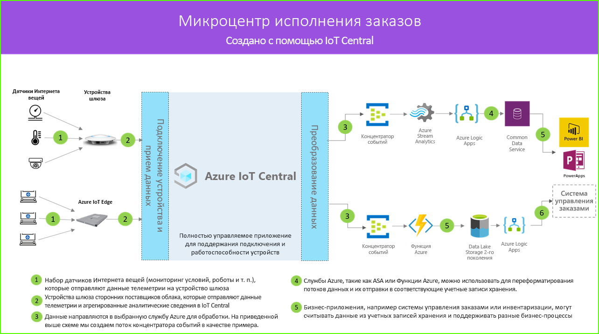

# Архитектура для микроцентра исполнения заказов

Решения микроцентра исполнения заказов обеспечивают цифровое подключение, возможности мониторинга и комплексное управление, что поможет вам сократить затраты, исключив простои и повысив общую эффективность и безопасность. Эти решения можно создать, используя один из шаблонов приложений в IoT Central и описанную ниже архитектуру в качестве примера.

1. Набор датчиков Интернета вещей, отправляющих данные телеметрии на устройство шлюза
2. Устройства шлюза, отправляющие данные телеметрии и агрегированные аналитические сведения в IoT Central
3. Данные непрерывно экспортируются в нужную службу Azure для обработки
4. Данные могут быть структурированы в нужном формате и отправлены в службу хранилища
5. Бизнес-приложения могут запрашивать данные и формировать аналитические сведения для выполнения операций розничной торговли
 
Давайте рассмотрим ключевые компоненты, которые обычно играют роль в решении для микроцентра исполнения заказов.

## Автоматические операторы

Решение микроцентра исполнения заказов, скорее всего, будет иметь большой набор автоматических операторов, создающих различные виды сигналов телеметрии. Эти сигналы могут быть приняты устройством шлюза, объединены, а затем отправлены в IoT Central, как показано в левой части схемы архитектуры.  

## Датчики мониторинга условий

Решение Интернета вещей начинается с набора датчиков, записывающих значимые сигналы в центре исполнения заказов. Они обозначены как различные виды датчиков в крайней слева части схемы архитектуры, представленной выше.

## Устройства шлюза

Многие датчики Интернета вещей могут передавать необработанные сигналы непосредственно в облако или в устройство шлюза, расположенное рядом с ними. Устройство шлюза выполняет агрегирование данных на границе перед отправкой сводных аналитических сведений в приложение IoT Central. Устройства шлюза также отвечают за ретрансляцию команд и операций управления на устройства датчиков, когда это возможно. 

## Приложение IoT Central

Приложение IoT Central Azure принимает данные от разных видов датчиков Интернета вещей, роботов и устройств шлюза в центре исполнения заказов и создает набор информативных аналитических сведений.

Azure IoT Central также предоставляет оператору магазина специализированный интерфейс, позволяющий удаленно отслеживать устройства инфраструктуры и управлять ими.

## Преобразование данных
Приложение Azure IoT Central в решении можно настроить для экспорта необработанных или агрегированных полезных сведений в набор служб PaaS Azure, которые могут выполнить обработку данных и обогатить эти полезные сведения перед передачей в бизнес-приложение. 

## Бизнес-приложение
Данные Интернета вещей можно использовать для работы разных видов бизнес-приложений, развернутых в среде розничной торговли. Менеджер или сотрудник центра исполнения заказов может использовать эти приложения для визуализации бизнес-аналитики и выполнения осмысленных действий в реальном времени. Чтобы узнать, как создать панель мониторинга Power BI в режиме реального времени для группы розничной торговли, следуйте указаниям в этом [руководстве](./tutorial-in-store-analytics-create-app.md).

## Дальнейшие действия
* Начало работы с шаблоном приложения [Микроцентр исполнения заказов](https://aka.ms/checkouttemplate). 
* Ознакомьтесь с [руководством](https://aka.ms/mfc-tutorial), из которого вы узнаете, как создать решение, использующее шаблон приложения для микроцентра исполнения заказов.
