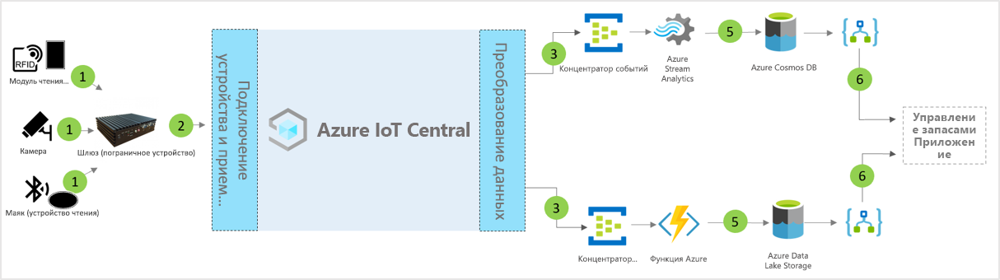

# Архитектура шаблона приложения для интеллектуального управления запасами для IoT Central

Партнеры и клиенты могут использовать шаблон приложения и приведенные ниже указания при разработке комплексных решений для **интеллектуального управления запасами**.

> [!div class="mx-imgBorder"]
> 

1. Набор датчиков Интернета вещей отправляет данные телеметрии на устройство шлюза.
2. Устройства шлюза отправляют данные телеметрии и агрегированные аналитические сведения в IoT Central.
3. Данные направляются в нужную службу Azure для обработки.
4. Службы Azure, такие как ASA или Функции Azure, можно использовать для переформатирования потоков данных и их отправки в соответствующие учетные записи хранения. 
5. Обработанные данные хранятся в "горячем" хранилище для операций практически в реальном времени или в "холодном" хранилище для дополнительного улучшения аналитических сведений с помощью машинного обучения или пакетного анализа. 
6. Logic Apps можно использовать для выполнения различных бизнес-процессов в бизнес-приложениях пользователей.

## Сведения
В следующем разделе описываются все части концептуальной архитектуры, связанные с приемом данных телеметрии с помощью радиожетонов RFID и BLE.

## Радиожетоны RFID
Радиожетоны RFID передают данные об элементе на радиочастоте. Обычно радиожетоны RFID не снабжены аккумулятором, если не указано иное. Радиожетоны получают энергию из радиоволн, созданных сканером, и передают сигнал на сканер RFID.

## Радиожетоны BLE
Питающий маяк передает пакеты данных через равные промежутки времени. Данные маяка обнаруживаются сканерами BLE или установленными службами на смартфонах, а затем передаются в облако.

## Сканеры RFID и BLE
Сканер RFID преобразовывает радиоволны в более удобную форму данных. Сведения, собранные с радиожетонов, сохраняются на локальном пограничном сервере или отправляются в облако с помощью JSON-RPC 2.0 через MQTT.
Сканер BLE, известный также как точка доступа, аналогичен сканеру RFID. Они используются для обнаружения ближайших сигналов Bluetooth и передачи соответствующего сообщения на локальное устройство Azure IoT Edge или в облако с помощью JSON-RPC 2.0 через MQTT.
Многие сканеры способны считывать сигналы RFID и сигналы маяка, а также предоставляют дополнительные возможности датчика температуры, влажности, акселерометра и гирометра.

## Шлюз Azure IoT Edge
Сервер Azure IoT Edge предоставляет ресурсы для предварительной обработки этих данных локально перед их отправкой в облако. Кроме того, с помощью стандартных контейнеров мы можем развернуть облачные рабочие нагрузки искусственного интеллекта, службы Azure и сторонние службы, а также бизнес-логику.

## Управление устройствами с помощью IoT Central 
Azure IoT Central — это платформа для разработки решений, которая упрощает подключение, настройку устройств Интернета вещей и управление ими. Эта платформа значительно снижает нагрузку и сокращает расходы на управление устройствами Интернета вещей, их эксплуатацию и связанную с ними разработку. Клиенты и партнеры могут создавать комплексные корпоративные решения для получения цифровой обратной связи по управлению запасами.

## Бизнес-аналитика и действия на основе исходящих данных 
Платформа IoT Central предоставляет широкие возможности расширяемости благодаря непрерывному экспорту данных (CDE) и интерфейсам API. Бизнес-аналитика, основанная на обработке данных телеметрии или необработанных данных телеметрии, обычно экспортируется в предпочитаемое бизнес-приложение. Для этого можно использовать веб-перехватчик, служебную шину, концентратор событий или хранилище BLOB-объектов, чтобы создавать, обучать и развертывать модели машинного обучения и дополнительно обогащать аналитические сведения.

## Дополнительная информация
* Узнайте, как развернуть [шаблон интеллектуального управления запасами](./tutorial-iot-central-smart-inventory-management-pnp.md).
* Узнайте больше о [шаблонах IoT Central для розничной торговли](./overview-iot-central-retail-pnp.md).
* См. сведения об [IoT Central](../preview/overview-iot-central.md).
