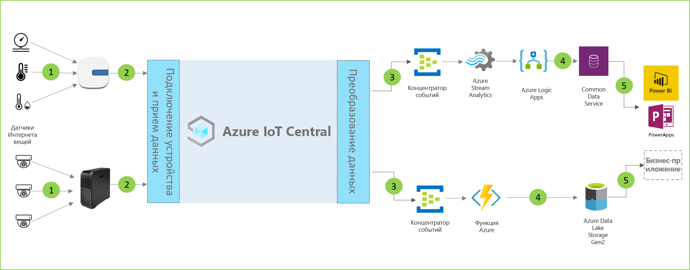

# Архитектура решения для аналитики магазина

[!INCLUDE [iot-central-pnp-original](../../../includes/iot-central-pnp-original-note.md)]

Решения для аналитики магазина позволяют отслеживать различные условия в среде розничного магазина. Эти решения можно создать, используя один из шаблонов приложений в IoT Central и описанную ниже архитектуру в качестве примера.

- Набор датчиков Интернета вещей отправляет данные телеметрии на устройство шлюза.
- Устройства шлюза отправляют данные телеметрии и агрегированные аналитические сведения в IoT Central.
- Данные непрерывно экспортируются в нужную службу Azure для обработки.
- Данные могут быть структурированы в нужном формате и отправлены в службу хранилища.
- Бизнес-приложения могут запрашивать данные и формировать аналитические сведения для выполнения операций розничной торговли.
 
Давайте рассмотрим ключевые компоненты, которые обычно составляют решение для аналитики магазина.

## Датчики мониторинга условий

Решение Интернета вещей начинается с набора датчиков, записывающих значимые сигналы в окружении розничного магазина. Они обозначены как ряд датчиков в дальней левой части схемы архитектуры выше.

## Устройства шлюза

Многие датчики Интернета вещей могут передавать необработанные сигналы непосредственно в облако или в устройство шлюза, расположенное рядом с ними. Устройство шлюза выполняет агрегирование данных на границе перед отправкой сводных аналитических сведений в приложение IoT Central. Устройства шлюза также отвечают за ретрансляцию команд и операций управления на устройства датчиков, когда это возможно. 

## Приложение IoT Central

Приложение IoT Central Azure принимает данные из различных датчиков Интернета вещей и устройств шлюза в окружении розничного магазина и создает набор информативных аналитических сведений.

Azure IoT Central также предоставляет оператору магазина специализированный интерфейс, позволяющий удаленно отслеживать устройства инфраструктуры и управлять ими.

## Преобразование данных
Приложение Azure IoT Central в решении можно настроить для экспорта необработанных или агрегированных полезных сведений в набор служб PaaS Azure, которые могут выполнить обработку данных и обогатить эти полезные сведения перед передачей в бизнес-приложение. 

## Бизнес-приложение
Данные Интернета вещей могут быть использованы для работы множества бизнес-приложений, развернутых в среде розничной торговли. Менеджер или сотрудник розничного магазина может использовать эти приложения для визуализации бизнес-аналитики и выполнения осмысленных действий в реальном времени. Чтобы узнать, как создать панель мониторинга Power BI реального времени для группы розничной торговли, следуйте указаниям в этом [руководстве](./tutorial-in-store-analytics-create-app-pnp.md).

## Дополнительная информация
* Приступите к работе с шаблонами приложений для [оформления заказов для аналитики магазина](https://aka.ms/checkouttemplate) и [мониторинга условий для аналитики магазина](https://aka.ms/conditiontemplate). 
* Ознакомьтесь с [полным руководством](https://aka.ms/storeanalytics-tutorial) по созданию решения на основе одного из шаблонов приложения для аналитики магазина.
