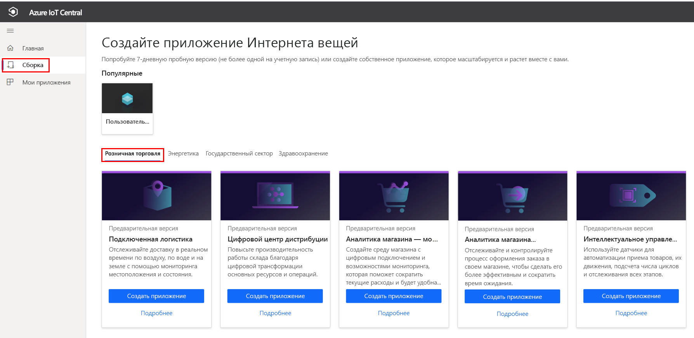
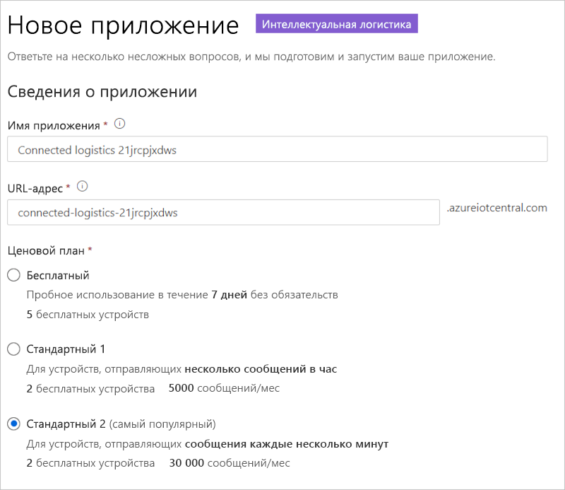
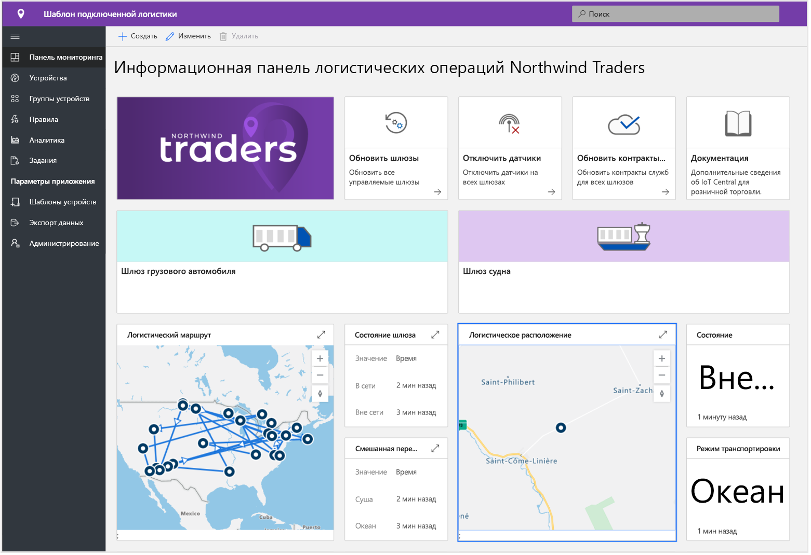
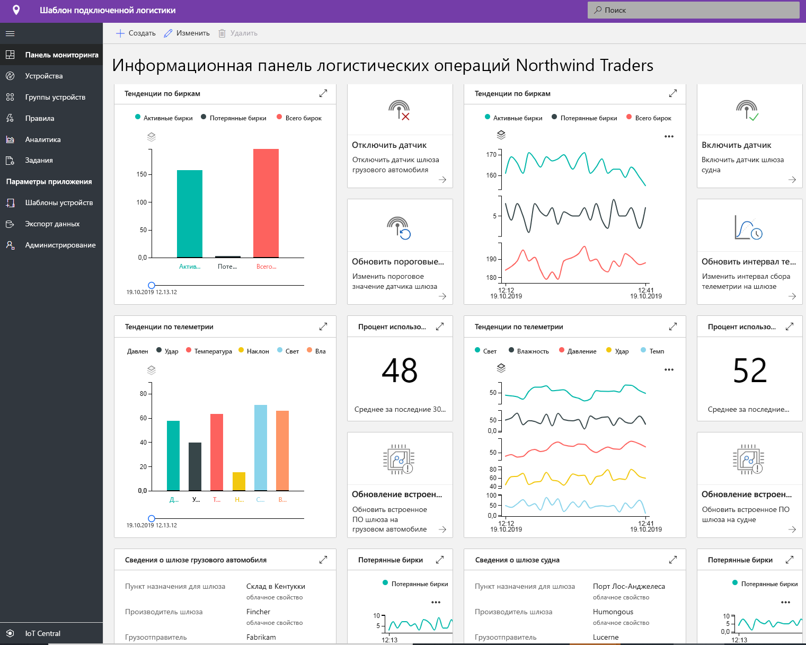
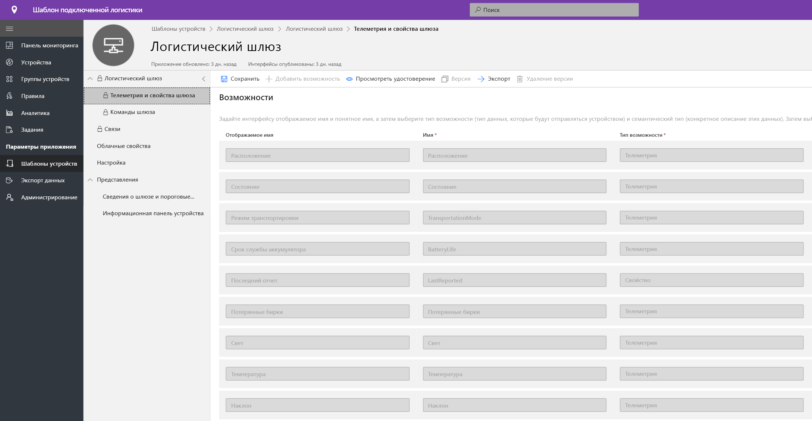
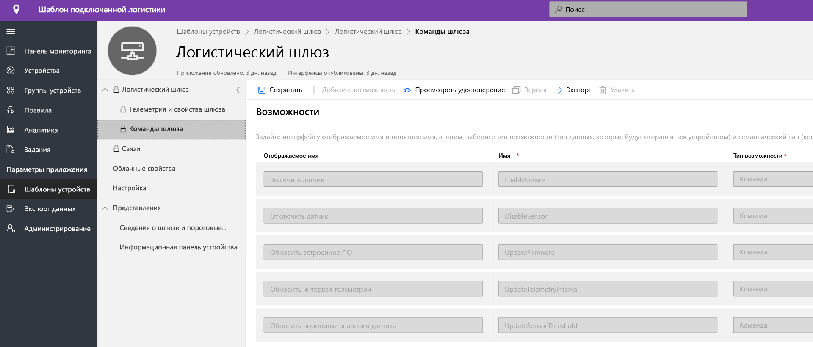
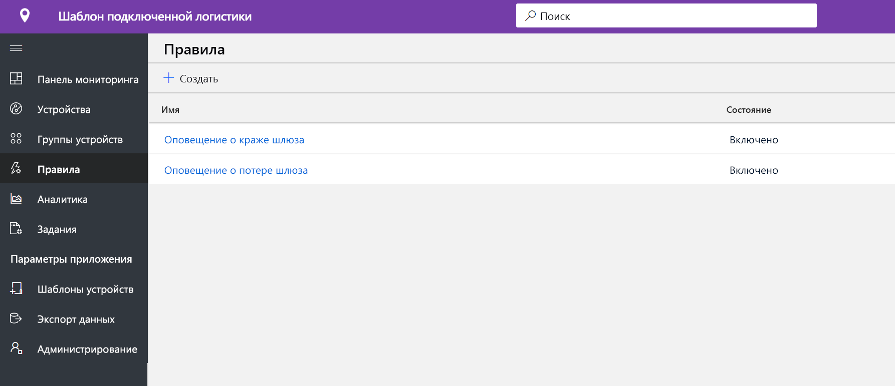
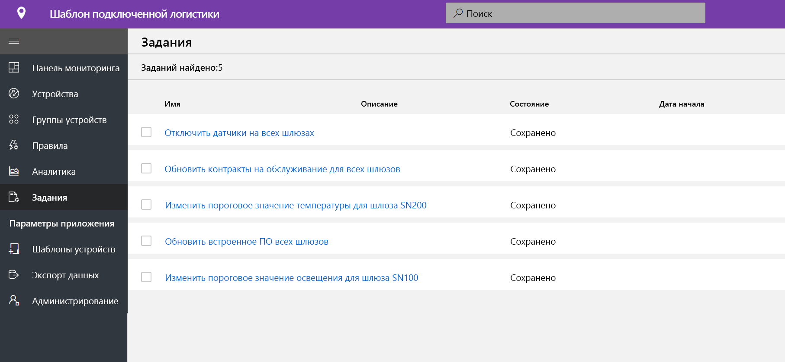
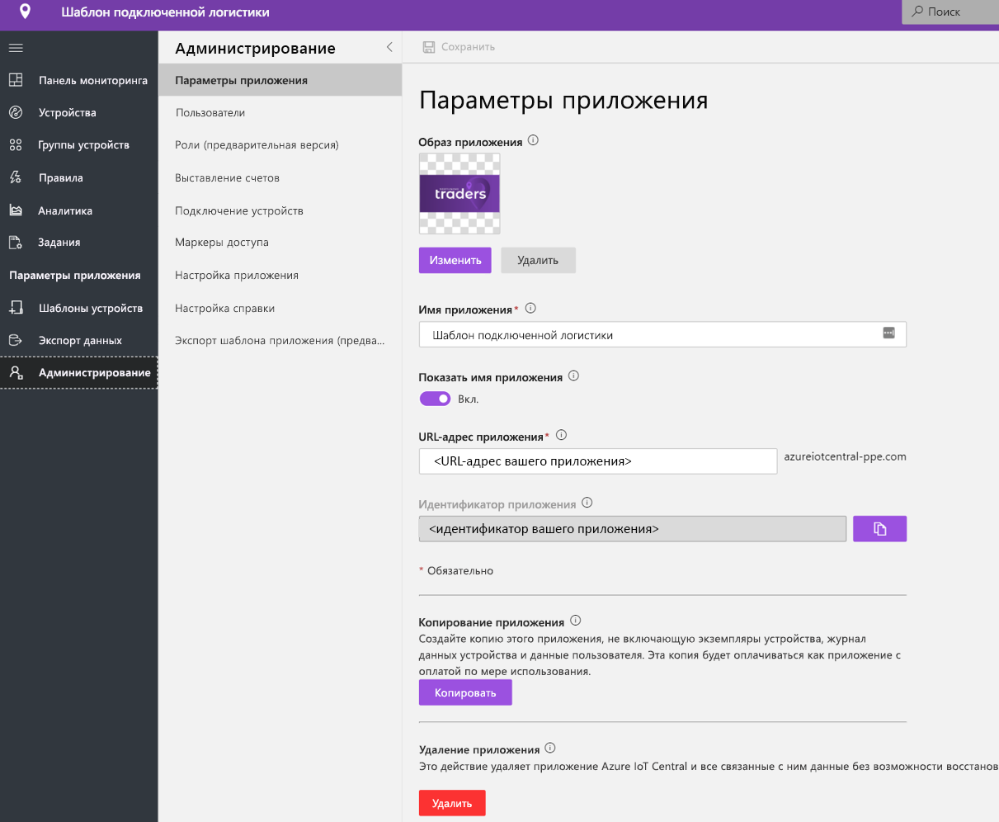

# Руководство по развертыванию и использованию шаблона приложения интеллектуальной логистики

[!INCLUDE [iot-central-pnp-original](../../../includes/iot-central-pnp-original-note.md)]

В этом руководстве показано, как приступить к работе, развернув шаблон приложения **интеллектуальной логистики** для IoT Central. Вы узнаете, как развернуть шаблон, который готов к использованию, и что можно будет сделать дальше.

Из этого руководства вы узнаете, как: 
* создать приложение интеллектуальной логистики; 
* ознакомиться с этим приложением. 

## Предварительные требования
* Для развертывания этого приложения не требуется выполнять какие-либо предварительные требования.
* Рекомендуется иметь подписку Azure, но вы можете поработать с приложением даже без нее.

## Создание шаблона приложения интеллектуальной логистики
Вы можете создать приложение, выполнив следующие действия.
1. Перейдите на веб-сайт диспетчера приложений в Azure IoT Central. Выберите **Build** (Сборка) в области навигации слева, а затем перейдите на вкладку **Retail** (Розничная торговля).

> [!div class="mx-imgBorder"]
> 

2. В разделе **Connected Logistics Application** (Приложение интеллектуальной логистики) выберите **Create app** (Создать приложение).

3. Для **создания приложения** откроется форма нового приложения, которая будет заполнена запрошенными данными, как показано ниже.
   * **Application name** (Имя приложения): можно использовать предложенное имя по умолчанию или ввести понятное имя приложения.
   * **URL** (URL-адрес): можно использовать предложенный URL-адрес по умолчанию или ввести понятный уникальный URL-адрес. Кроме того, рекомендуется использовать параметр по умолчанию, если у вас уже есть подписка Azure. В противном случае вы можете начать использовать 7-дневную бесплатную пробную версию и перейти на оплату по мере использования в любое время до истечения срока действия бесплатной пробной версии.
   * **Billing Info** (Данные для выставления счетов): сведения о каталоге, подписке Azure и регионе необходимы для подготовки ресурсов.
   * **Create** (Создать): Выберите "Create" (Создать) в нижней части страницы, чтобы развернуть приложение.

> [!div class="mx-imgBorder"]
> 

## Знакомство с приложением 

## панель мониторинга

После успешного развертывания шаблона приложения панель мониторинга по умолчанию является порталом оператора интеллектуальной логистики. Northwind Trader — это вымышленный поставщик услуг логистики, управляющий флотом транспортных судов в океане и парком транспортных автомобилей на суше. На этой панели мониторинга вы увидите два шлюза, предоставляющих данные телеметрии о доставке вместе со связанными командами, заданиями и действиями, которые можно выполнить. Эта панель мониторинга предварительно настроена для демонстрации важных операций устройства логистики.
Панель мониторинга логически поделена для отображения операций управления устройством, связанных с двумя шлюзами. 
   * Логистический маршрут для доставки по суше и сведения о местоположении морских грузов — важный элемент для всех многомодальных транспортных компаний.
   * Просмотр состояния шлюзов и соответствующей информации. 

> [!div class="mx-imgBorder"]
> 

   * Вы можете легко отслеживать общее число шлюзов, активных и неизвестных радиожетонов.
   * Вы можете выполнять такие операции управления устройствами, как обновление встроенного ПО, отключение датчика, включение датчика, изменение порога датчика, изменение интервалов передачи телеметрии и обновление контрактов службы устройства.
   * Просмотр потребления заряда аккумулятора устройства

> [!div class="mx-imgBorder"]
> 

## Шаблон устройства

Перейдите на вкладку "Device templates" (Шаблоны устройств), и вы увидите модель возможностей шлюза. Модель возможностей основана на двух разных интерфейсах, **Gateway Telemetry & Property** (Телеметрия и свойства шлюза) и **Gateway Commands** (Команды шлюза).

**Gateway Telemetry & Property** (Телеметрия и свойства шлюза). Этот интерфейс представляет все данные телеметрии, связанные с датчиками, расположением и сведениями об устройстве, а также возможностями свойств двойника устройства, такими как пороги и интервалы обновления датчиков.

> [!div class="mx-imgBorder"]
> 

**Gateway Commands** (Команды шлюза). Этот интерфейс организовывает все возможности команд шлюза.

> [!div class="mx-imgBorder"]
> 

## Правила
Перейдите на вкладку "Rules" (Правила), чтобы просмотреть два правила в этом шаблоне приложения. Эти правила настроены для отправки уведомлений по электронной почте операторам для дальнейшего исследования.
 
**Gateway theft alert** (Оповещение о краже шлюза): это правило активируется при обнаружении датчиками непредвиденного освещения во время пути. Операторы должны быть немедленно уведомлены, чтобы исследовать потенциальную кражу.
 
**Unresponsive Gateway** (Шлюз не отвечает): это правило активируется, если шлюз долго не передает данные в облако. Шлюз может не отвечать из-за низкого заряда аккумулятора, потери подключения или неработоспособности устройства.

> [!div class="mx-imgBorder"]
> 

## Задания
Перейдите на вкладку "Jobs" (Задания), чтобы увидеть пять заданий, входящих в состав этого шаблона приложения.

> [!div class="mx-imgBorder"]
> 

Функцию заданий можно использовать для выполнения операций уровня всего решения. Здесь задания используют команды устройства и возможности двойника для выполнения таких задач, как отключение определенных датчиков в шлюзе или изменение порога датчика в зависимости от режима и маршрута доставки. 
   * Отключение вибродатчиков при доставке по морю для экономии заряда аккумулятора — это стандартная операция, как и снижение порога температуры при транспортировке в холодильной цепи. 
 
   * Задания позволяют выполнять операции уровня системы, такие как обновление встроенного ПО на шлюзах или обновление контракта службы для контроля операций обслуживания.

## Очистка ресурсов
Если вы не собираетесь в дальнейшем использовать это приложение, удалите шаблон приложения, выбрав **Administration** (Администрирование)  >  **Application settings** (Параметры приложения) и щелкнув **Delete** (Удалить).

> [!div class="mx-imgBorder"]
> 

## Дополнительная информация
* Узнайте больше о [принципах интеллектуальной логистики](./architecture-connected-logistics-pnp.md).
* Узнайте больше о других [шаблонах IoT Central для розничной торговли](./overview-iot-central-retail-pnp.md).
* Узнайте больше об [IoT Central](../preview/overview-iot-central.md).
